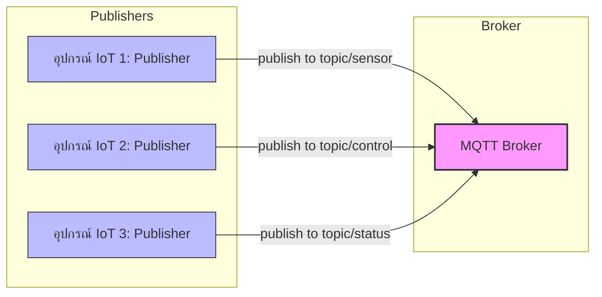
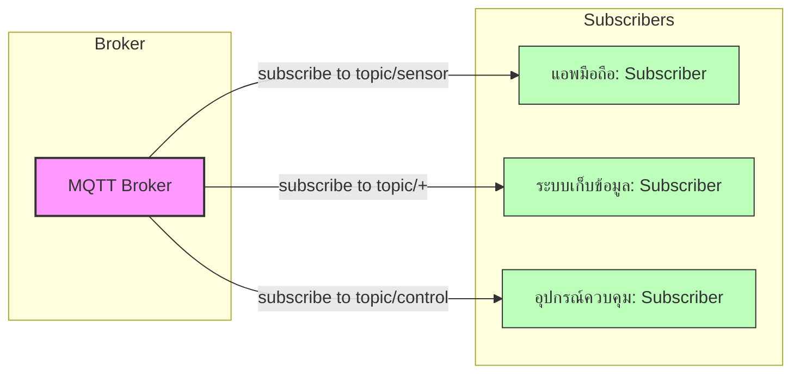
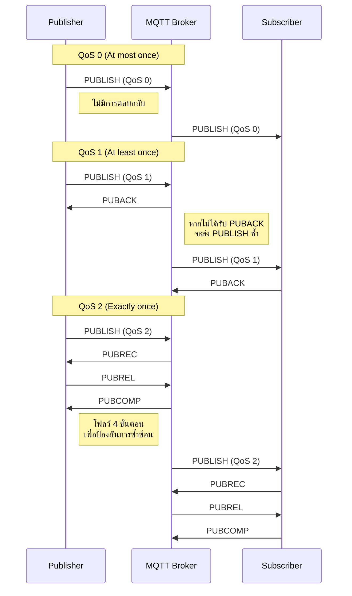
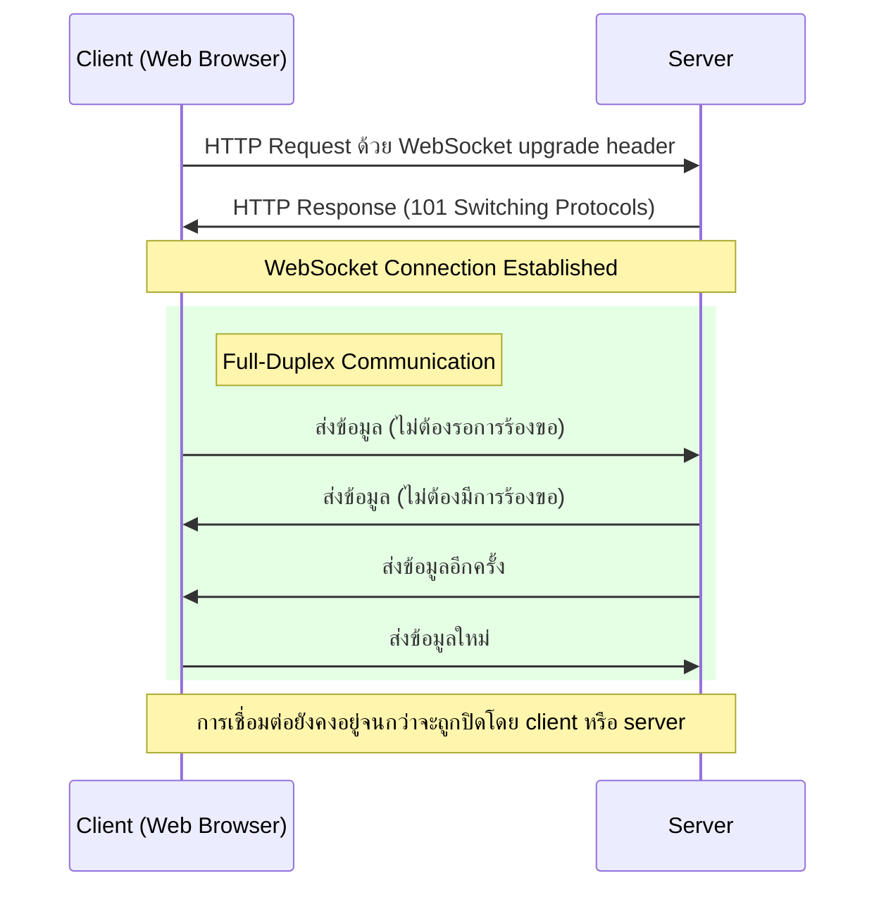
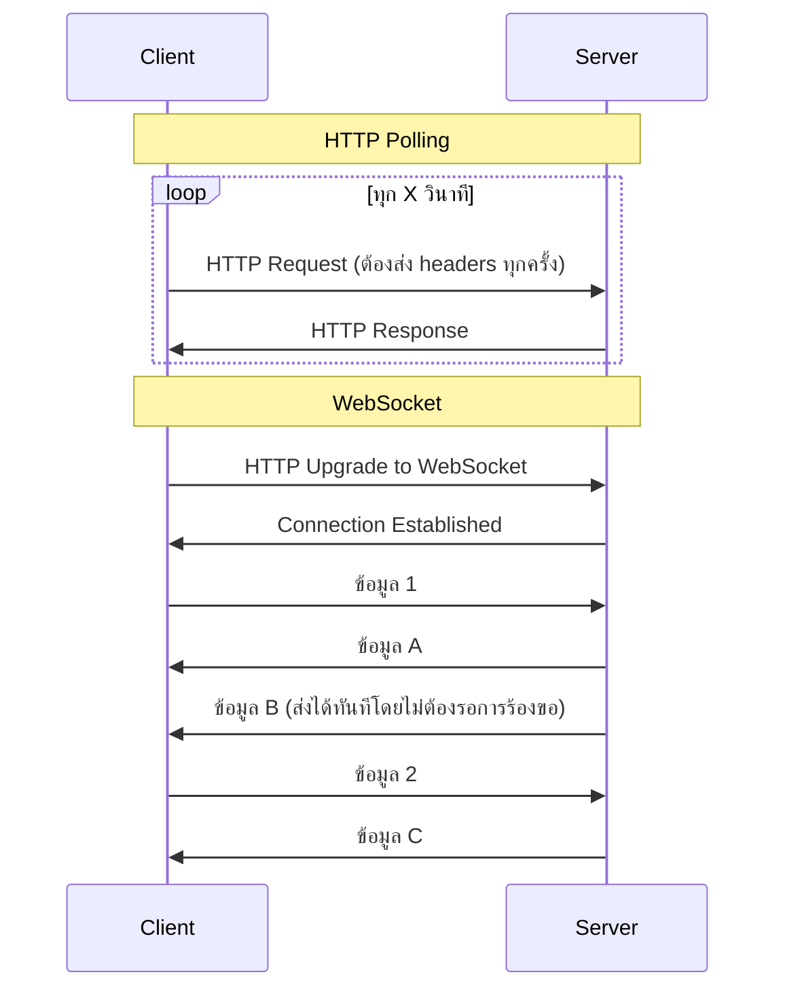

# บทที่ 1: โปรโตคอลพื้นฐาน

บทนี้แนะนำโปรโตคอลพื้นฐานที่ใช้ในระบบ IoT โดยเน้นที่ MQTT

| รายละเอียด | คำอธิบาย |
|----------|---------|
| **ชื่อเนื้อหา** | โปรโตคอลพื้นฐาน |
| **วัตถุประสงค์** | เรียนรู้สถาปัตยกรรมของ MQTT   |
| **ระดับความยาก** | ง่าย  [⭑⭑] |
| **เวลา** | 45 นาที - 1 ชั่วโมง |


## วัตถุประสงค์การเรียนรู้

- เข้าใจว่า MQTT คืออะไรและบทบาทในระบบ IoT
- เรียนรู้สถาปัตยกรรมของ MQTT (รูปแบบ Publish/Subscribe, Topics, QoS)
- สำรวจการใช้งาน MQTT จริงในระบบ IoT และอุตสาหกรรม
- ติดตั้ง MQTT Broker ทั้งแบบในเครื่องและบนคลาวด์
- กำหนดค่า Topics, Port และ WebSocket บน MQTT Broker
- ใช้ MQTT Explorer สำหรับ Publish/Subscribe
- ใช้งาน WebSocket เพื่อเชื่อมต่อกับ MQTT
- ทำเวิร์คช็อปการติดตั้งและเชื่อมต่อกับ MQTT Broker

## MQTT คืออะไร? ประวัติและความเป็นมา

MQTT (Message Queuing Telemetry Transport) เป็นโปรโตคอลการสื่อสารแบบเบาที่ออกแบบมาสำหรับอุปกรณ์ที่มีข้อจำกัดและเครือข่ายที่มีแบนด์วิดธ์ต่ำ ความหน่วงสูง หรือไม่เสถียร

### ประวัติความเป็นมา

MQTT ถูกพัฒนาขึ้นในปี 1999 โดย Andy Stanford-Clark จาก IBM และ Arlen Nipper จาก Arcom (ปัจจุบันคือ Eurotech) โดยมีวัตถุประสงค์เริ่มต้นเพื่อเชื่อมต่อท่อส่งน้ำมันผ่านดาวเทียม ชื่อ MQTT มาจาก "MQ Telemetry Transport" โดยที่ MQ อ้างอิงถึง IBM MQ (ผลิตภัณฑ์ระบบส่งข้อความของ IBM)

ในปี 2013 MQTT เวอร์ชัน 3.1.1 ได้ถูกมาตรฐานโดย OASIS (Organization for the Advancement of Structured Information Standards) และต่อมาในปี 2019 MQTT เวอร์ชัน 5 ได้รับการเผยแพร่ โดยเพิ่มคุณสมบัติใหม่หลายอย่าง เช่น ข้อความเหตุผลของข้อผิดพลาด, คุณสมบัติของข้อความ, และการหมดอายุของข้อความ

ปัจจุบัน MQTT ได้กลายเป็นหนึ่งในโปรโตคอลพื้นฐานที่สำคัญที่สุดสำหรับการเชื่อมต่อ IoT เนื่องจากความเรียบง่ายและประสิทธิภาพ

### หลักการทำงานของ MQTT

MQTT ทำงานบนหลักการ **Publish/Subscribe** (เผยแพร่/สมัครสมาชิก) ซึ่งแตกต่างจากโมเดลแบบ client-server ทั่วไป โดยมีองค์ประกอบหลัก 3 ส่วน:

1. **Publisher** - ผู้เผยแพร่ข้อมูลหรือส่งข้อความ
2. **Subscriber** - ผู้รับข้อมูลหรือข้อความ
3. **Broker** - ตัวกลางที่จัดการการส่งข้อความระหว่าง publisher และ subscriber

การสื่อสารทั้งหมดจะผ่าน "topics" ซึ่งเป็นเส้นทางหรือช่องทางสำหรับข้อความ ทำให้ publisher ไม่จำเป็นต้องรู้จัก subscriber และในทางกลับกัน

### แผนภาพแสดงรูปแบบการเชื่อมต่อแบบ Publish/Subscribe

#### ทิศทางการส่งข้อมูลจาก Publisher ไปยัง Broker



#### ทิศทางการส่งข้อมูลจาก Broker ไปยัง Subscribers



#### หลักการทำงานของ MQTT Publish/Subscribe:

1. **การแยกระหว่าง Publisher และ Subscriber**:
   - Publishers และ Subscribers ไม่รู้จักหรือติดต่อกันโดยตรง
   - ทั้งสองฝ่ายติดต่อผ่าน Broker เท่านั้น
   - การแยกนี้ทำให้ระบบมีความยืดหยุ่น สามารถเปลี่ยนแปลงฝั่งหนึ่งโดยไม่กระทบอีกฝั่ง

2. **การใช้ Topics เป็นตัวกลาง**:
   - ข้อความทั้งหมดส่งไปยัง topic ซึ่งเป็นเหมือนช่องทางการสื่อสาร
   - Topics มีโครงสร้างเป็นลำดับชั้น เช่น `home/livingroom/temperature`
   - Subscriber สามารถสมัครรับข้อมูลจากหลาย topics หรือใช้ wildcards ได้

3. **การทำงานแบบ Event-driven**:
   - ระบบทำงานตามเหตุการณ์ (events) เมื่อมีข้อมูลเข้ามา
   - Subscribers รอรับข้อมูลเมื่อมีการ publish ไปยัง topic ที่สนใจ
   - ลดการใช้ทรัพยากรเมื่อเทียบกับการ polling ข้อมูลต่อเนื่อง

4. **การลดการเชื่อมต่อโดยตรง (Decoupling)**:
   - **Space decoupling**: Publishers และ Subscribers ไม่จำเป็นต้องรู้จักกัน
   - **Time decoupling**: ไม่จำเป็นต้องทำงานพร้อมกัน (สามารถใช้ retained messages)
   - **Synchronization decoupling**: การทำงานไม่ถูกขัดจังหวะโดยการรอการตอบสนอง

### ภาพแสดงการทำงานของ QoS (Quality of Service)



### ข้อดีของ MQTT สำหรับ IoT

1. **ทรัพยากรต่ำ**: ใช้แบนด์วิดธ์น้อย เหมาะสำหรับอุปกรณ์ที่มีข้อจำกัดด้านพลังงานและประมวลผล
2. **ความน่าเชื่อถือ**: มีระดับ Quality of Service (QoS) ให้เลือกตามความต้องการ
3. **การทำงานแบบ Asynchronous**: ไม่จำเป็นต้องเชื่อมต่อตลอดเวลา
4. **การปรับขนาด**: รองรับการเชื่อมต่อจำนวนมากพร้อมกัน
5. **ความปลอดภัย**: รองรับการเข้ารหัส TLS และการรับรองความถูกต้อง

## หัวข้อที่ครอบคลุม

### 1. แนะนำ MQTT และบทบาทใน IoT

MQTT ถูกออกแบบมาเพื่อแก้ปัญหาเฉพาะในระบบ IoT:
- การเชื่อมต่ออุปกรณ์จำนวนมากกับระบบศูนย์กลาง
- การส่งข้อมูลในเครือข่ายที่ไม่เสถียรหรือมีข้อจำกัด
- การรองรับอุปกรณ์ที่มีหน่วยความจำและพลังงานจำกัด

ในระบบ IoT ปัจจุบัน MQTT มักใช้ในการเก็บข้อมูลเซ็นเซอร์, การควบคุมอุปกรณ์ระยะไกล, การแจ้งเตือนและการอัปเดตสถานะแบบเรียลไทม์

### 2. สถาปัตยกรรม MQTT (Publish/Subscribe, Topic, QoS)

#### ระบบ Topic
Topics ใน MQTT มีโครงสร้างเป็นลำดับชั้น คล้ายกับเส้นทางไฟล์ เช่น:
- `home/livingroom/temperature`
- `home/kitchen/humidity`

สามารถใช้ wildcard ได้:
- `+` แทนระดับเดียว: `home/+/temperature` จะรับข้อมูลจาก `home/livingroom/temperature` และ `home/kitchen/temperature`
- `#` แทนหลายระดับ: `home/#` จะรับข้อมูลทั้งหมดที่เริ่มต้นด้วย `home/`

#### Quality of Service (QoS)
MQTT มี QoS 3 ระดับ:
- **QoS 0** (At most once): ส่งข้อความเพียงครั้งเดียว ไม่มีการยืนยัน
- **QoS 1** (At least once): รับประกันว่าข้อความจะถึงผู้รับอย่างน้อยหนึ่งครั้ง อาจซ้ำได้
- **QoS 2** (Exactly once): รับประกันว่าข้อความจะถึงผู้รับเพียงครั้งเดียว ไม่ซ้ำ

##### สถานการณ์จริงและอุปมาอุปมัยของ QoS

**QoS 0 - "Fire and Forget" (ยิงแล้วลืม)**
- **อุปมา**: เหมือนการโยนจดหมายใส่ตู้ไปรษณีย์โดยไม่ได้ลงทะเบียน เราไม่มีวิธีรู้ว่าถึงผู้รับหรือไม่
- **สถานการณ์จริง**: เหมาะสำหรับ
  - เซ็นเซอร์วัดอุณหภูมิที่ส่งข้อมูลทุก 1-2 วินาที การสูญหายของข้อมูล 1-2 ค่าไม่กระทบต่อระบบ
  - การอัปเดตสถานะที่ไม่สำคัญ เช่น ระดับแสงในห้องที่มีการเปลี่ยนแปลงบ่อย
  - การบันทึกข้อมูลปริมาณมากที่ยอมรับการสูญเสียบางส่วนได้
- **ข้อดี**: ใช้แบนด์วิดธ์และทรัพยากรน้อยที่สุด เร็วที่สุด

**QoS 1 - "At Least Once" (อย่างน้อยหนึ่งครั้ง)**
- **อุปมา**: เหมือนการส่งจดหมายลงทะเบียนที่ต้องมีการเซ็นรับ ถ้าไม่ได้รับการยืนยัน เราจะส่งซ้ำ ทำให้บางครั้งผู้รับอาจได้รับจดหมายซ้ำ
- **สถานการณ์จริง**: เหมาะสำหรับ
  - การส่งคำสั่งควบคุมอุปกรณ์ที่ต้องการความมั่นใจว่าคำสั่งจะถึง แต่ไม่เป็นไรหากอุปกรณ์ได้รับคำสั่งซ้ำ เช่น "เปิดไฟ" (การเปิดซ้ำไม่มีผลเสีย)
  - การแจ้งเตือนที่สำคัญ แต่การแจ้งซ้ำไม่ก่อให้เกิดปัญหา
  - การบันทึกข้อมูลที่ต้องการความครบถ้วนและยอมรับความซ้ำซ้อนได้
- **ข้อดี**: รับประกันการส่งโดยใช้ทรัพยากรปานกลาง

**QoS 2 - "Exactly Once" (ส่งครั้งเดียวแน่นอน)**
- **อุปมา**: เหมือนการทำธุรกรรมทางการเงินที่ต้องการความแม่นยำสูงสุด มีกลไกตรวจสอบซ้ำเพื่อให้มั่นใจว่าเงินจะถูกโอนครั้งเดียวเท่านั้น ไม่ขาดไม่เกิน
- **สถานการณ์จริง**: เหมาะสำหรับ
  - การส่งคำสั่งที่การทำงานซ้ำอาจก่อให้เกิดความเสียหาย เช่น "โอนเงิน" หรือ "ฉีดยา"
  - การส่งคำสั่งเปิด-ปิดอุปกรณ์ที่หากทำซ้ำจะทำให้สถานะผิดพลาด เช่น คำสั่ง "สลับสถานะ" (toggle)
  - ระบบการนับหรือการวัดที่ต้องการความถูกต้องแม่นยำ 100%
- **ข้อดี**: รับประกันการส่งครั้งเดียวและไม่ซ้ำ แต่ใช้ทรัพยากรและเวลามากที่สุด

ในการเลือกใช้ QoS ควรพิจารณาจาก:
1. ความสำคัญของข้อมูล
2. ผลกระทบหากข้อมูลสูญหายหรือซ้ำซ้อน
3. ข้อจำกัดด้านทรัพยากรของอุปกรณ์และเครือข่าย

### 3. ตัวอย่างการใช้งาน MQTT ในระบบ IoT และอุตสาหกรรม

1. **บ้านอัจฉริยะ (Smart Home)**:
   - เชื่อมต่ออุปกรณ์ต่างๆ เช่น หลอดไฟ, เซ็นเซอร์, เครื่องปรับอากาศ
   - การควบคุมอุปกรณ์ผ่านแอพมือถือหรือเสียง

2. **อุตสาหกรรม 4.0**:
   - การเฝ้าระวังเครื่องจักรและอุปกรณ์
   - การแจ้งเตือนความผิดปกติและการบำรุงรักษาเชิงป้องกัน

3. **การเกษตรอัจฉริยะ**:
   - เซ็นเซอร์ตรวจวัดความชื้นในดิน, อุณหภูมิ, ความชื้นอากาศ
   - ระบบรดน้ำอัตโนมัติที่ทำงานตามข้อมูลจากเซ็นเซอร์

4. **ระบบขนส่งอัจฉริยะ**:
   - การติดตามยานพาหนะและการจัดการกองรถ
   - การวิเคราะห์รูปแบบการจราจร

5. **การดูแลสุขภาพ**:
   - การติดตามสัญญาณชีพทางไกล
   - การแจ้งเตือนกรณีฉุกเฉิน

### 4. การติดตั้ง MQTT Broker (ทั้งแบบในเครื่องและบนคลาวด์)

#### การติดตั้ง Mosquitto Broker (เครื่องส่วนตัว)

**บน Linux (Ubuntu/Debian)**:
```bash
sudo apt update
sudo apt install mosquitto mosquitto-clients
sudo systemctl enable mosquitto
sudo systemctl start mosquitto
```

**บน macOS**:
```bash
brew install mosquitto
```

**บน Windows**:
สามารถดาวน์โหลดได้จาก https://mosquitto.org/download/

#### การติดตั้ง EMQX (เครื่องส่วนตัวหรือคลาวด์)

**การติดตั้งด้วย Docker**:
```bash
docker run -d --name emqx -p 1883:1883 -p 8083:8083 -p 8084:8084 -p 8883:8883 -p 18083:18083 emqx/emqx
```

**บริการคลาวด์**:
- EMQX Cloud: https://www.emqx.com/en/cloud
- HiveMQ Cloud: https://www.hivemq.com/cloud/
- CloudMQTT: https://www.cloudmqtt.com/

### 5. การกำหนดค่า Topics, Port และ WebSocket บน MQTT Broker

#### การกำหนดค่า Mosquitto
ไฟล์การตั้งค่า: `/etc/mosquitto/mosquitto.conf`

```
# พอร์ตพื้นฐาน MQTT
listener 1883
protocol mqtt

# พอร์ต WebSocket
listener 9001
protocol websockets

# การตั้งค่าความปลอดภัย (ตัวอย่างพื้นฐาน)
allow_anonymous true
password_file /etc/mosquitto/passwd
```

#### การกำหนดค่า EMQX
- เข้าถึงหน้าจัดการที่ `http://[server_ip]:18083` (ค่าเริ่มต้น username: admin, password: public)
- สามารถกำหนดค่า authentication, topics ACLs และ listeners ผ่าน UI

### 6. การใช้ MQTT Explorer สำหรับทดสอบ Publish/Subscribe

MQTT Explorer เป็นเครื่องมือที่ง่ายต่อการใช้งานสำหรับการทดสอบระบบ MQTT:

1. ดาวน์โหลดและติดตั้งจาก http://mqtt-explorer.com/
2. เชื่อมต่อกับ broker โดยระบุ:
   - Host: `localhost` หรือ IP ของ broker
   - Port: `1883` (default MQTT) หรือ `9001` (WebSocket)
   - ระบุ username/password ถ้ามีการตั้งค่าไว้
3. ฟีเจอร์หลัก:
   - สำรวจ topics ในรูปแบบโครงสร้างต้นไม้
   - เผยแพร่ข้อความไปยัง topic ที่ต้องการ
   - สมัครสมาชิก topics และดูข้อความเข้าแบบเรียลไทม์
   - บันทึกและวิเคราะห์ข้อมูล

### 7. การใช้งาน WebSocket เพื่อเชื่อมต่อกับ MQTT

#### WebSocket คืออะไร? ประวัติและความสำคัญ

WebSocket เป็นโปรโตคอลการสื่อสารที่สร้างช่องทางการติดต่อแบบ full-duplex (สื่อสารสองทางพร้อมกัน) บนการเชื่อมต่อ TCP เดียว ซึ่งช่วยให้เว็บแอปพลิเคชันสามารถสื่อสารแบบเรียลไทม์กับเซิร์ฟเวอร์ได้

##### ประวัติความเป็นมา

WebSocket ถูกพัฒนาโดย Ian Hickson และ Michael Carter ในปี 2008 เพื่อแก้ปัญหาข้อจำกัดของ HTTP ในการสื่อสารแบบเรียลไทม์ ต่อมาในปี 2011 IETF ได้มาตรฐาน WebSocket เป็น RFC 6455 และได้รับการสนับสนุนในเว็บเบราว์เซอร์หลักต่างๆ

##### แผนภาพแสดงการเชื่อมต่อแบบ Full Duplex ของ WebSocket



##### เปรียบเทียบ HTTP Polling กับ WebSocket



##### บทบาทสำคัญและการแก้ปัญหา

1. **แก้ปัญหาการสื่อสารแบบเรียลไทม์**: ก่อนมี WebSocket การสื่อสารแบบเรียลไทม์บนเว็บมักใช้เทคนิค HTTP Polling หรือ Long Polling ซึ่งไม่มีประสิทธิภาพและสร้างภาระให้เซิร์ฟเวอร์

2. **ลดโอเวอร์เฮดของข้อมูล**: การเชื่อมต่อ WebSocket เปิดเพียงครั้งเดียวและใช้งานได้ต่อเนื่อง ไม่ต้องส่ง HTTP headers ทุกครั้งเหมือนการร้องขอแบบ HTTP ปกติ ทำให้ลดการใช้แบนด์วิดธ์

3. **การสื่อสารแบบสองทาง**: เซิร์ฟเวอร์สามารถส่งข้อมูลไปยังไคลเอนต์ได้โดยไม่ต้องรอการร้องขอจากไคลเอนต์ ทำให้สามารถพัฒนาแอปพลิเคชันที่ต้องการข้อมูลแบบเรียลไทม์ เช่น แชท, แดชบอร์ดการวิเคราะห์, หรือเกมออนไลน์

4. **เข้ากันได้กับโครงสร้างพื้นฐานเว็บ**: สามารถใช้ร่วมกับโปรโตคอล HTTPS, ผ่านพร็อกซีและไฟร์วอลล์ส่วนใหญ่

5. **สนับสนุนโดยเบราว์เซอร์หลัก**: ทุกเบราว์เซอร์สมัยใหม่มี API WebSocket มาตรฐานทำให้ง่ายต่อการพัฒนา

##### ความสำคัญต่อ IoT

ในบริบทของ IoT, WebSocket มีความสำคัญอย่างมาก:
- ช่วยให้แอปพลิเคชันเว็บสามารถรับข้อมูลจากอุปกรณ์ IoT แบบเรียลไทม์
- ช่วยลดความซับซ้อนในการพัฒนา dashboard สำหรับควบคุมและตรวจสอบอุปกรณ์ IoT
- สามารถรวมกับโปรโตคอล MQTT ผ่าน MQTT over WebSocket เพื่อให้แอปพลิเคชันเว็บสามารถเชื่อมต่อกับระบบ MQTT ได้โดยตรง

WebSocket ช่วยให้แอปพลิเคชันเว็บสามารถเชื่อมต่อกับ MQTT broker ได้โดยตรง:

**ตัวอย่างการใช้งานด้วย MQTT.js ในเว็บ**:
```html
<!DOCTYPE html>
<html>
<head>
    <title>MQTT WebSocket Example</title>
    <script src="https://unpkg.com/mqtt/dist/mqtt.min.js"></script>
</head>
<body>
    <h1>MQTT WebSocket Test</h1>
    <div id="messages"></div>
    <script>
        // เชื่อมต่อกับ MQTT Broker ผ่าน WebSocket
        const client = mqtt.connect('ws://localhost:9001');
        
        client.on('connect', function() {
            console.log('Connected to MQTT broker');
            client.subscribe('test/topic');
            client.publish('test/topic', 'Hello from WebSocket client');
        });
        
        client.on('message', function(topic, message) {
            document.getElementById('messages').innerHTML += 
                `<p>Topic: ${topic}, Message: ${message.toString()}</p>`;
        });
    </script>
</body>
</html>
```

### 8. เวิร์คช็อป: การติดตั้ง MQTT Broker และการเชื่อมต่อเบื้องต้น

#### ขั้นตอนการติดตั้ง MQTT Broker:
1. เลือก broker ที่เหมาะสม (Mosquitto, EMQX, HiveMQ)
2. ติดตั้งตามขั้นตอนที่ระบุไว้ในหัวข้อ 4
3. ตรวจสอบสถานะการทำงานของ broker

#### การทดสอบการเชื่อมต่อพื้นฐานด้วยเครื่องมือ command line:
**Subscribe**:
```bash
mosquitto_sub -h localhost -t test/topic
```

**Publish**:
```bash
mosquitto_pub -h localhost -t test/topic -m "Hello MQTT"
```

#### การทดลองผ่าน MQTT Explorer:
1. เชื่อมต่อกับ broker ที่ติดตั้งไว้
2. สร้าง topic ใหม่ และทดลอง publish/subscribe
3. ทดสอบการใช้ wildcard ในการ subscribe
4. ทดลองใช้ QoS ระดับต่างๆ

## ทรัพยากร

- ซอฟต์แวร์ MQTT Broker:
  - [Mosquitto](https://mosquitto.org/)
  - [EMQX](https://www.emqx.io/)
  - [HiveMQ](https://www.hivemq.com/)
- เครื่องมือสำหรับทดสอบ:
  - [MQTT Explorer](http://mqtt-explorer.com/)
  - [MQTTX](https://mqttx.app/)
- ไลบรารีสำหรับนักพัฒนา:
  - [Eclipse Paho](https://www.eclipse.org/paho/) (หลายภาษา)
  - [MQTT.js](https://github.com/mqttjs/MQTT.js) (JavaScript)
  - [Paho MQTT Python](https://pypi.org/project/paho-mqtt/) (Python)
- ตัวอย่างไคลเอนต์ WebSocket
- เอกสารอ้างอิงและสเปค MQTT: [MQTT.org](https://mqtt.org/)
- คอร์สออนไลน์และบทความเกี่ยวกับ MQTT

---

## RACKSYNC CO., LTD.

[RACKSYNC](https://github.com/racksync) เป็นบริษัทที่มีความเชี่ยวชาญในการพัฒนาโซลูชั่นด้าน IoT และระบบอัตโนมัติ เรามุ่งมั่นในการสร้างเทคโนโลยีที่เชื่อมต่อโลกเข้าด้วยกันผ่านระบบ IoT ที่มีประสิทธิภาพและเสถียร

### บริการของเรา
- การออกแบบและพัฒนาระบบ IoT แบบครบวงจร
- โซลูชั่นเชื่อมต่อสำหรับอุตสาหกรรม 4.0
- ระบบอัตโนมัติสำหรับบ้านและอาคารอัจฉริยะ
- การฝึกอบรมและเวิร์คช็อปด้าน IoT

ติดตามโปรเจกต์และอัปเดตได้ที่ [GitHub](https://github.com/racksync)

© 2007-2025 RACKSYNC CO., LTD. All rights reserved.
