# บทนำ: ภาพรวมของเทคโนโลยี IoT

| รายละเอียด         | คำอธิบาย                                                      |
|---------------------|------------------------------------------------------------------|
| **ชื่อเนื้อหา**     | บทนำ: ภาพรวมของเทคโนโลยี IoT                                   |
| **วัตถุประสงค์**    | เข้าใจความหมาย องค์ประกอบ และการประยุกต์ใช้งานเทคโนโลยี IoT      |
| **ระดับความยาก**    | เริ่มต้น [⭑]                                                   |
| **เวลา**           | 30 นาที                                                    |
| **สิ่งที่ต้องเตรียม** | ไม่มี                                                           |
| **ความรู้พื้นฐาน**  | ไม่จำเป็น                                                        |

เทคโนโลยี Internet of Things (IoT) กำลังเปลี่ยนแปลงโลกของเรา โดยเชื่อมต่ออุปกรณ์ต่างๆ เข้าด้วยกันผ่านอินเทอร์เน็ต เปิดโอกาสใหม่ๆ สำหรับการพัฒนานวัตกรรมและการปรับปรุงคุณภาพชีวิต

## วัตถุประสงค์การเรียนรู้

- เข้าใจความหมายและความสำคัญของ Internet of Things (IoT)
- รู้จักองค์ประกอบหลักของระบบ IoT
- เข้าใจสถาปัตยกรรมพื้นฐานของ IoT
- รู้จักการประยุกต์ใช้งาน IoT ในอุตสาหกรรมต่างๆ
- เข้าใจแนวโน้มและความท้าทายในอนาคตของ IoT

## Internet of Things (IoT) คืออะไร?

Internet of Things หรือ IoT คือระบบของอุปกรณ์ทางกายภาพที่เชื่อมต่อกันและแลกเปลี่ยนข้อมูลผ่านอินเทอร์เน็ต โดยไม่จำเป็นต้องมีการปฏิสัมพันธ์จากมนุษย์หรือคอมพิวเตอร์โดยตรง อุปกรณ์เหล่านี้มีเซ็นเซอร์, ซอฟต์แวร์ และเทคโนโลยีการเชื่อมต่อที่ช่วยให้สามารถรวบรวม แลกเปลี่ยน และวิเคราะห์ข้อมูลได้

### วิวัฒนาการของ IoT

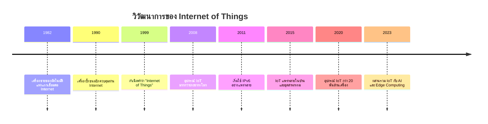

## องค์ประกอบหลักของระบบ IoT

ระบบ IoT ประกอบด้วยองค์ประกอบสำคัญ 4 ส่วนที่ทำงานร่วมกัน:

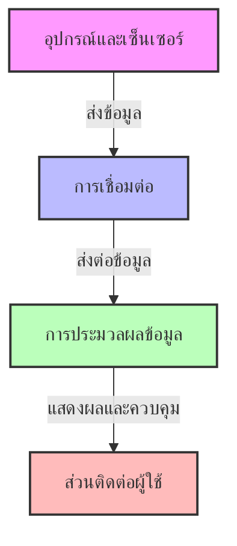

### 1. อุปกรณ์และเซ็นเซอร์

- **เซ็นเซอร์**: อุปกรณ์ที่ใช้ตรวจวัดค่าต่างๆ เช่น อุณหภูมิ, ความชื้น, แสง, การเคลื่อนไหว
- **แอคชูเอเตอร์**: อุปกรณ์ที่ใช้ควบคุมหรือเปลี่ยนแปลงสภาพแวดล้อม เช่น มอเตอร์, รีเลย์, หลอดไฟ
- **ไมโครคอนโทรลเลอร์**: เช่น Arduino, ESP8266, ESP32, Raspberry Pi, ที่ควบคุมอุปกรณ์และเซ็นเซอร์

### 2. การเชื่อมต่อ

- **เทคโนโลยีการสื่อสารไร้สาย**: WiFi, Bluetooth, Zigbee, Z-Wave, LoRaWAN, NB-IoT, Sigfox
- **โปรโตคอล**: MQTT, CoAP, HTTP, WebSocket
- **เกตเวย์**: อุปกรณ์ที่เชื่อมต่อระหว่างเซ็นเซอร์กับอินเทอร์เน็ต

### 3. การประมวลผลข้อมูล

- **Cloud Computing**: การประมวลผลข้อมูลบนคลาวด์ เช่น AWS IoT, Azure IoT, Google Cloud IoT
- **Edge Computing**: การประมวลผลข้อมูลใกล้กับแหล่งข้อมูล ลดการส่งข้อมูลไปยังคลาวด์
- **Fog Computing**: การกระจายการประมวลผลระหว่าง Edge และ Cloud
- **การวิเคราะห์ข้อมูล**: การใช้ Big Data และ AI เพื่อวิเคราะห์ข้อมูลและสร้างข้อมูลเชิงลึก

### 4. ส่วนติดต่อผู้ใช้

- **แอปพลิเคชันมือถือ**: สำหรับควบคุมและตรวจสอบอุปกรณ์ IoT
- **แดชบอร์ด**: การแสดงข้อมูลและสถานะของระบบแบบ real-time
- **ระบบแจ้งเตือน**: การส่งการแจ้งเตือนเมื่อเกิดเหตุการณ์สำคัญ
- **การสั่งงานด้วยเสียง**: เช่น Amazon Alexa, Google Assistant

## สถาปัตยกรรมพื้นฐานของ IoT

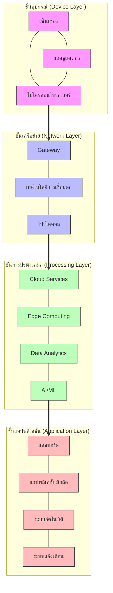

## การประยุกต์ใช้งาน IoT ในอุตสาหกรรมต่างๆ

IoT มีการประยุกต์ใช้งานในหลากหลายอุตสาหกรรมและการใช้งานในชีวิตประจำวัน:

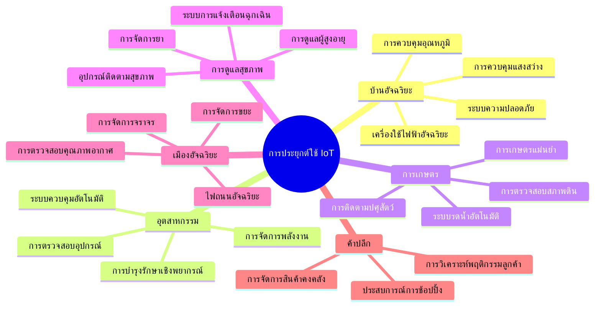

## ส่วนแบ่งตลาดของอุปกรณ์ IoT ตามประเภทการใช้งาน (2023)

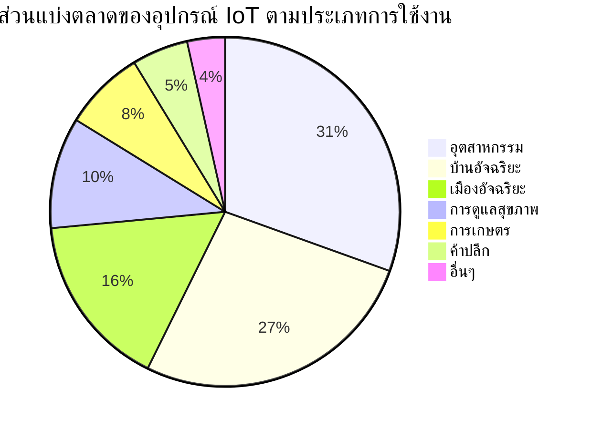

## การเติบโตของอุปกรณ์ IoT ทั่วโลก (หน่วย: พันล้านเครื่อง)

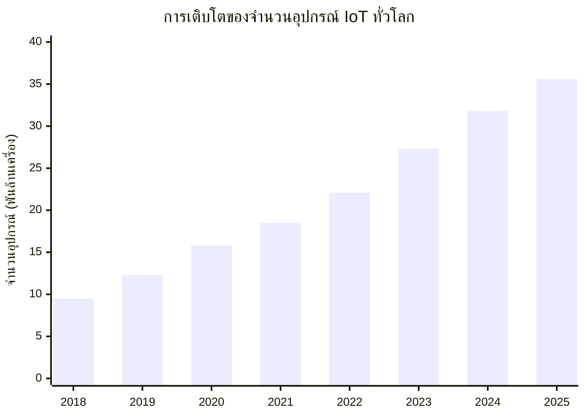

## ความท้าทายในการพัฒนา IoT

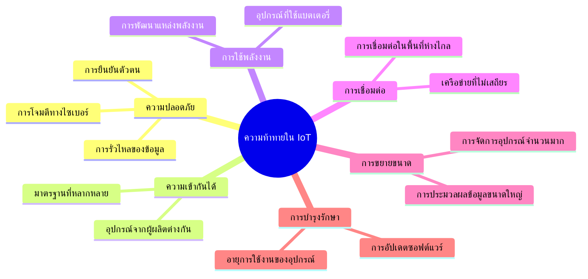

## แนวโน้มสำคัญของ IoT ในอนาคต

1. **การผสานรวมกับเทคโนโลยีอื่นๆ**:
   - IoT + AI = AIoT (Artificial Intelligence of Things)
   - IoT + Blockchain = ระบบ IoT ที่มีความปลอดภัยและกระจายศูนย์
   - IoT + 5G = การเชื่อมต่อความเร็วสูงและรองรับอุปกรณ์จำนวนมาก

2. **Edge Computing**: การประมวลผลข้อมูลที่อุปกรณ์หรือใกล้กับแหล่งข้อมูล ช่วยลดความหน่วงและการใช้แบนด์วิดธ์

3. **Digital Twin**: การจำลองเสมือนของอุปกรณ์หรือระบบทางกายภาพ ช่วยในการวิเคราะห์ ทดสอบ และทำนาย

4. **การพัฒนามาตรฐาน**: มาตรฐานที่เป็นที่ยอมรับร่วมกันมากขึ้น เพื่อความเข้ากันได้ระหว่างอุปกรณ์และระบบ

5. **ความปลอดภัยที่ดีขึ้น**: โซลูชันความปลอดภัยที่ออกแบบมาโดยเฉพาะสำหรับระบบ IoT

## ความเชื่อมโยงของเทคโนโลยี IoT กับศาสตร์อื่นๆ

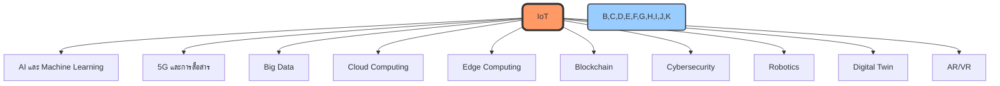

## เส้นทางการเรียนรู้ในหลักสูตรนี้

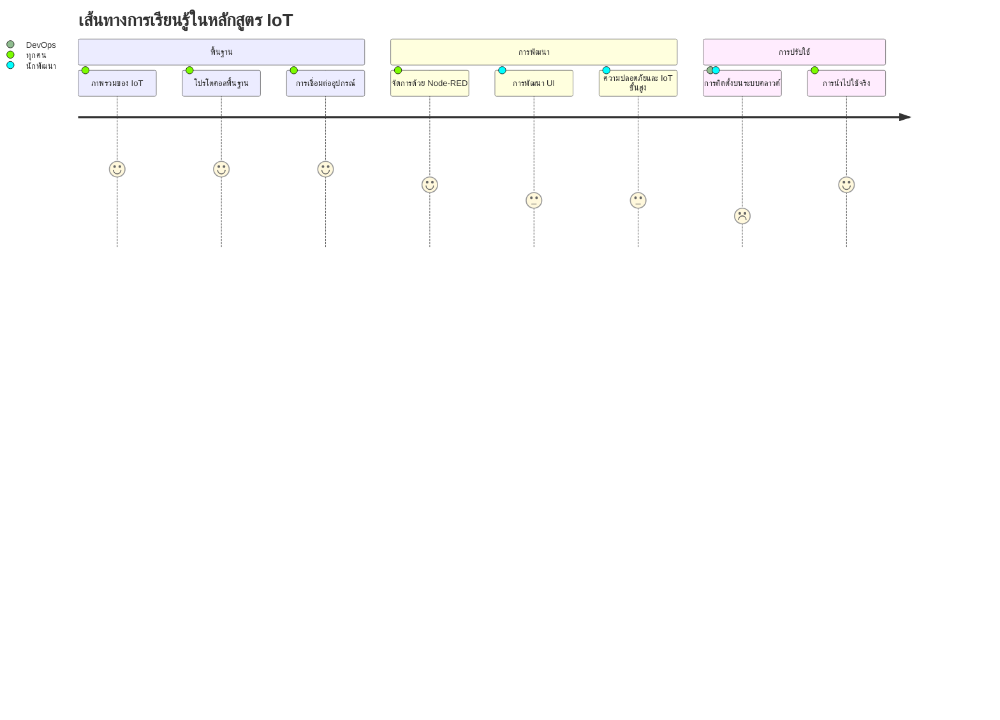

## เตรียมความพร้อมสำหรับการเรียน

เพื่อให้ได้ประโยชน์สูงสุดจากหลักสูตรนี้ คุณควรเตรียม:

1. **อุปกรณ์ฮาร์ดแวร์**:
   - ESP8266 หรือ ESP32
   - เซ็นเซอร์พื้นฐาน (อุณหภูมิ, ความชื้น, แสง)
   - สายเชื่อมต่อ USB
   - บอร์ดทดลอง (Breadboard) และสายไฟ

2. **ซอฟต์แวร์**:
   - Arduino IDE หรือ PlatformIO
   - Docker และ Docker Compose
   - เว็บเบราว์เซอร์ทันสมัย
   - MQTT Client (เช่น MQTTX)

3. **ความรู้พื้นฐาน** (ไม่จำเป็นแต่เป็นประโยชน์):
   - พื้นฐานการเขียนโปรแกรม
   - ความรู้พื้นฐานเกี่ยวกับอิเล็กทรอนิกส์
   - ความเข้าใจเบื้องต้นเกี่ยวกับการสื่อสารเครือข่าย

## ภาพรวมของหลักสูตร

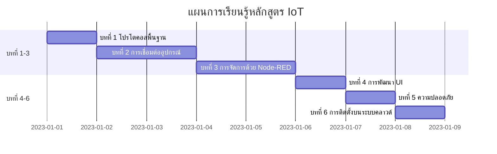

## สถิติและการคาดการณ์ตลาด IoT (2024-2025)

### มูลค่าตลาดทั่วโลก
- ปี 2023: 1.39 ล้านล้านดอลลาร์สหรัฐ
- ปี 2024 (คาดการณ์): 1.84 ล้านล้านดอลลาร์สหรัฐ
- ปี 2025 (คาดการณ์): 2.47 ล้านล้านดอลลาร์สหรัฐ
(ที่มา: IoT Analytics, 2024)

### การเติบโตตามภูมิภาค (2024)
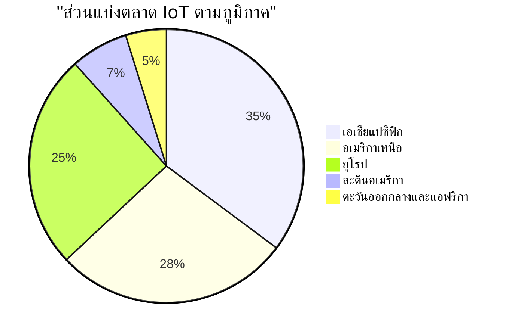

### อัตราการเติบโตรายอุตสาหกรรม (CAGR 2024-2028)
- การผลิต: 22.8%
- สาธารณูปโภค: 20.5%
- การขนส่ง: 19.7%
- สุขภาพ: 18.9%
- เกษตรกรรม: 17.3%
(ที่มา: McKinsey & Company, 2024)

## กรณีศึกษาการใช้งานจริง

### 1. การเกษตรอัจฉริยะ
**บริษัท XYZ Farming, ประเทศไทย**
- ติดตั้งเซ็นเซอร์ 1,500 จุดในพื้นที่ 2,000 ไร่
- ลดการใช้น้ำ 35%
- เพิ่มผลผลิต 28%
- ROI ภายใน 14 เดือน

### 2. โรงงานอัจฉริยะ
**บริษัท ABC Manufacturing, ญี่ปุ่น**
- ติดตั้งเซ็นเซอร์ 5,000 จุด
- ลดต้นทุนการซ่อมบำรุง 45%
- ลดการหยุดชะงักของการผลิต 60%
- เพิ่มประสิทธิภาพการผลิต 32%

## เปรียบเทียบโปรโตคอล IoT ยอดนิยม

| โปรโตคอล | ขนาดข้อความ | การใช้พลังงาน | ความน่าเชื่อถือ | การรักษาความปลอดภัย |
|----------|------------|--------------|----------------|-------------------|
| MQTT | 2-4 bytes header | ต่ำ | QoS 0,1,2 | TLS, Username/Password |
| CoAP | 4 bytes header | ต่ำมาก | Confirmable/Non-confirmable | DTLS |
| HTTP | ~200 bytes header | สูง | TCP reliability | TLS, Authentication |
| WebSocket | 2-14 bytes header | ปานกลาง | TCP reliability | TLS, Authentication |

## การรักษาความปลอดภัย IoT ในปี 2024

### ภัยคุกคามที่พบบ่อย
1. **การโจมตี Botnet**
   - 2023: 3.5 ล้านอุปกรณ์ถูกโจมตี
   - 2024: คาดการณ์เพิ่มขึ้น 25%

2. **การโจมตี Man-in-the-Middle**
   - 2023: 28% ของการโจมตี IoT
   - มูลค่าความเสียหายเฉลี่ย $850,000 ต่อเหตุการณ์

3. **การโจมตี DDoS ผ่าน IoT**
   - 2023: ขนาดการโจมตีสูงสุด 4.3 Tbps
   - จำนวนอุปกรณ์ที่ถูกใช้เฉลี่ย: 50,000 เครื่อง

### มาตรการรักษาความปลอดภัยที่แนะนำ
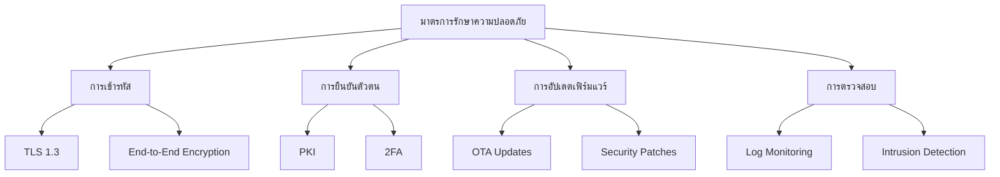

## เทคโนโลยีเครือข่ายสำหรับ IoT

### การเปรียบเทียบเทคโนโลยีการเชื่อมต่อ

| เทคโนโลยี | ระยะทาง | พลังงาน | แบนด์วิดธ์ | ค่าใช้จ่าย |
|----------|---------|---------|------------|-----------|
| WiFi | 50m | สูง | สูง | ต่ำ |
| Bluetooth LE | 100m | ต่ำ | ปานกลาง | ต่ำ |
| Zigbee | 100m | ต่ำมาก | ต่ำ | ปานกลาง |
| LoRaWAN | 10km | ต่ำมาก | ต่ำมาก | ต่ำ |
| NB-IoT | 10km | ต่ำ | ต่ำ | ปานกลาง |
| 5G | 1km | สูง | สูงมาก | สูง |

### การใช้พลังงานเฉลี่ย (mA)
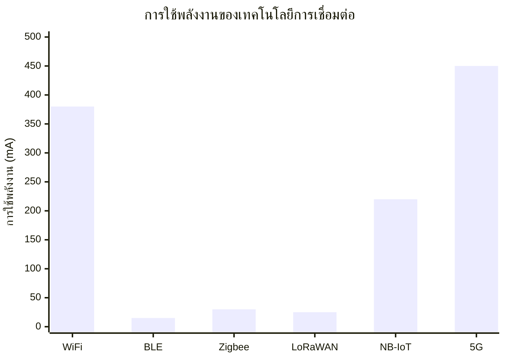

## แนวโน้มเทคโนโลยี IoT 2024-2025

### 1. AI-Powered IoT (AIoT)
- การใช้ ML บนอุปกรณ์ Edge เพิ่มขึ้น 145%
- ประสิทธิภาพการทำนายเพิ่มขึ้น 35%
- ลดการใช้แบนด์วิดธ์ 60%

### 2. 5G IoT
- ครอบคลุม 65% ของประชากรโลกภายในปี 2025
- รองรับอุปกรณ์ 1 ล้านเครื่องต่อตารางกิโลเมตร
- ความหน่วงต่ำกว่า 1 มิลลิวินาที

### 3. Digital Twin
- ตลาดเติบโต 35% ต่อปี
- ลดต้นทุนการบำรุงรักษา 25%
- เพิ่มประสิทธิภาพการผลิต 20%

## สถิติการใช้งาน IoT ในประเทศไทย

### การเติบโตของตลาด
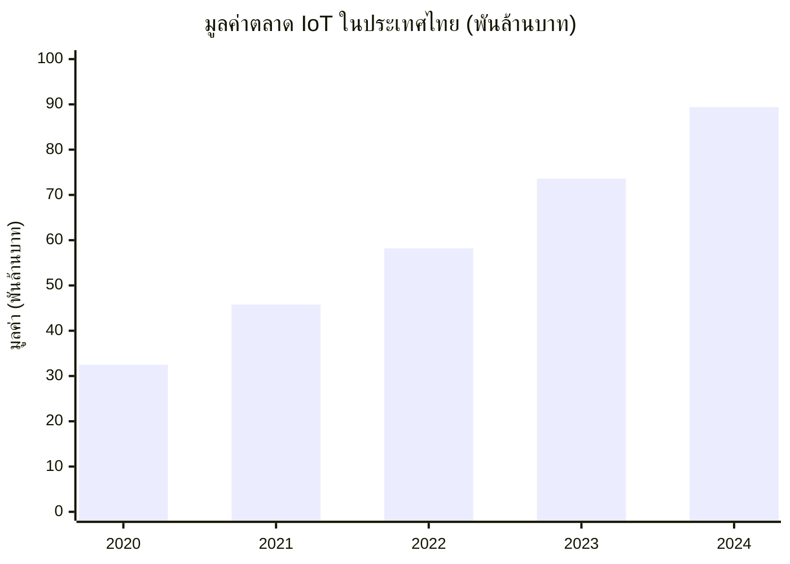

### อุตสาหกรรมที่มีการใช้งานสูงสุด
1. การผลิต (32%)
2. การเกษตร (28%)
3. อสังหาริมทรัพย์ (18%)
4. การขนส่ง (12%)
5. พลังงาน (10%)

## แหล่งอ้างอิงและแหล่งข้อมูลที่น่าสนใจ

### หนังสือแนะนำ
1. **"Building the Web of Things"** - Dominique Guinard, Vlad Trifa
2. **"Internet of Things: A Hands-on Approach"** - Bahga, Madisetti
3. **"เริ่มต้น IoT สำหรับผู้เริ่มต้น"** - ดร. ณัฐพล บัวอุไร
4. **"Designing IoT Solutions with the Raspberry Pi and Arduino"** - Manoel Ramon
5. **"IoT และ Smart Farming เพื่อการเกษตรไทย"** - สวทช.

### ช่อง YouTube
- [Andreas Spiess](https://www.youtube.com/channel/UCu7_D0o48KbfhpEohoP7YSQ) - การทดลองและวิเคราะห์อุปกรณ์ IoT
- [GreatScott!](https://www.youtube.com/user/greatscottlab) - DIY และโปรเจกต์อิเล็กทรอนิกส์
- [DroneBot Workshop](https://www.youtube.com/channel/UCzml9bXoEM0itbcE96CB03w) - Arduino, ESP32, Raspberry Pi
- [KBTech Official](https://www.youtube.com/c/KBTechOfficial) - สอนทำโปรเจกต์ IoT ภาษาไทย
- [Microcontroller Tutorials](https://www.youtube.com/c/MicrocontrollersTutorials) - การใช้งานไมโครคอนโทรลเลอร์

### เครื่องมือสำหรับการพัฒนา
- [Arduino IDE](https://www.arduino.cc/en/software) - สภาพแวดล้อมการพัฒนาสำหรับ Arduino
- [PlatformIO](https://platformio.org) - เครื่องมือพัฒนา IoT แบบมืออาชีพ
- [Node-RED](https://nodered.org) - เครื่องมือโปรแกรมมิ่งแบบ Flow-based
- [ESPHome](https://esphome.io) - ระบบควบคุมอุปกรณ์ ESP
- [Home Assistant](https://www.home-assistant.io) - แพลตฟอร์มระบบบ้านอัจฉริยะแบบโอเพนซอร์ส
- [Grafana](https://grafana.com) - แพลตฟอร์มสำหรับการแสดงผลข้อมูล
- [InfluxDB](https://www.influxdata.com) - ฐานข้อมูลชนิด Time Series
- [Mosquitto](https://mosquitto.org) - MQTT Broker โอเพนซอร์ส
- [EMQ X](https://www.emqx.io) - MQTT Broker สำหรับองค์กร
- [Thingsboard](https://thingsboard.io) - แพลตฟอร์มจัดการอุปกรณ์ IoT
- [MQTT Explorer](http://mqtt-explorer.com) - เครื่องมือสำหรับตรวจสอบข้อมูล MQTT
- [MQTTX](https://mqttx.app) - แอพพลิเคชันสำหรับตรวจสอบข้อมูล MQTT
- [Postman](https://www.postman.com) - เครื่องมือสำหรับทดสอบ API

### ชุมชน IoT
- [Thailand IoT Consortium](https://www.facebook.com/ThailandIoTConsortium) - สมาคม IoT ประเทศไทย
- [ESP8266 Thailand](https://www.facebook.com/groups/esp8266thailand) - กลุ่ม Facebook เกี่ยวกับ ESP8266
- [Arduino Thailand](https://www.facebook.com/groups/arduino.thai) - กลุ่ม Facebook เกี่ยวกับ Arduino
- [Raspberry Pi Thailand](https://www.facebook.com/groups/rpi.th) - กลุ่ม Facebook เกี่ยวกับ Raspberry Pi
- [Chiang Mai Maker Club](https://www.facebook.com/groups/ChiangMaiMakerClub) - ชุมชนนักพัฒนา IoT ในไทย
- [Home Automation Thailand](https://www.facebook.com/groups/hathailand) - กลุ่ม Facebook เกี่ยวกับบ้านอัจฉริยะ

## RACKSYNC CO., LTD.

[RACKSYNC](https://github.com/racksync) เป็นบริษัทที่มีความเชี่ยวชาญในการพัฒนาโซลูชั่นด้าน IoT และระบบอัตโนมัติ เรามุ่งมั่นในการสร้างเทคโนโลยีที่เชื่อมต่อโลกเข้าด้วยกันผ่านระบบ IoT ที่มีประสิทธิภาพและเสถียร

### บริการของเรา
- การออกแบบและพัฒนาระบบ IoT แบบครบวงจร
- โซลูชั่นเชื่อมต่อสำหรับอุตสาหกรรม 4.0
- ระบบอัตโนมัติสำหรับบ้านและอาคารอัจฉริยะ
- การฝึกอบรมและเวิร์คช็อปด้าน IoT

ติดตามโปรเจกต์และอัปเดตได้ที่ [GitHub](https://github.com/racksync)

© 2007-2025 RACKSYNC CO., LTD. All rights reserved.
