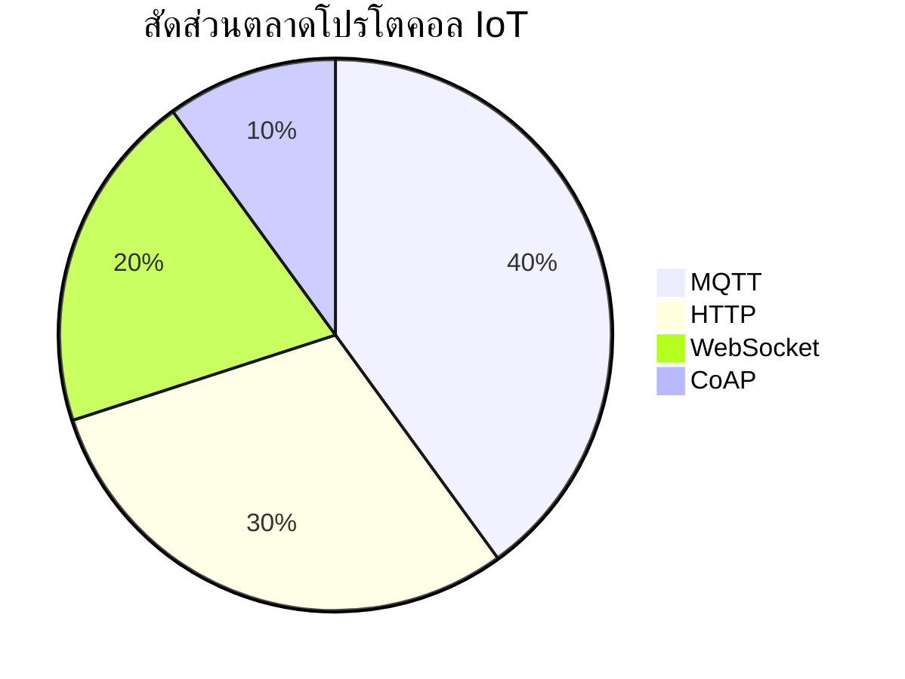

# บทที่ 1: IoT Foundation - โปรโตคอลพื้นฐาน

## ภาพรวมหมวดหมู่การสื่อสารใน IoT

ในปัจจุบัน การสื่อสารในระบบ IoT มีความซับซ้อนและหลากหลายมากขึ้น แต่สามารถจำแนกออกเป็น 2 หมวดหลัก ดังนี้:

### การสื่อสารไร้สาย (Wireless)

| เทคโนโลยี | ความถี่/ย่าน | ความเร็ว | ระยะทำการ | อายุแบตเตอรี่ | ข้อดี | ข้อเสีย | การใช้งานหลัก |
|-----------|-------------|----------|------------|---------------|-------|----------|---------------|
| WiFi | 2.4/5 GHz | 54Mbps-600Mbps | 30-100m | ต่ำ (วัน-สัปดาห์) | - รองรับแบนด์วิธสูง - มาตรฐานใช้งานทั่วไป - การตั้งค่าง่าย | - ใช้พลังงานสูง - ความหนาแน่นส่งผลต่อประสิทธิภาพ | - กล้องวงจรปิด - ระบบมัลติมีเดีย - Smart Home Hub |
| BLE | 2.4 GHz | 1-3Mbps | 10-100m | สูง (เดือน-ปี) | - ประหยัดพลังงาน - เชื่อมต่อง่าย - ราคาถูก | - แบนด์วิธจำกัด - จำนวนอุปกรณ์จำกัด | - อุปกรณ์สวมใส่ - เซ็นเซอร์ใกล้ตัว - Beacon |
| Zigbee | 2.4 GHz | 250Kbps | 10-100m | สูงมาก (ปี) | - Mesh Network - รองรับอุปกรณ์มาก - ประหยัดพลังงาน | - ความเร็วต่ำ - ต้องมี Gateway | - ระบบแสงสว่าง - เซ็นเซอร์อุตสาหกรรม - Home Automation |
| LoRa | Sub-GHz | 0.3-50Kbps | 2-15km | สูงมาก (หลายปี) | - ระยะไกลมาก - ทนต่อการรบกวน - ประหยัดพลังงาน | - ความเร็วต่ำมาก - ต้องมีโครงสร้างพื้นฐาน | - Smart City - เกษตรอัจฉริยะ - Asset Tracking |
| NB-IoT | Licensed Band | 20-200Kbps | 1-10km | สูง (ปี) | - ใช้เครือข่ายมือถือ - Coverage ดี - QoS รับประกัน | - ค่าบริการสูง - Latency สูง | - มิเตอร์อัจฉริยะ - Smart Parking - Asset Tracking |

### การสื่อสารผ่านสาย (Wired)

| เทคโนโลยี | ความเร็ว | ระยะทาง | การเชื่อมต่อ | ข้อดี | ข้อเสีย | การใช้งานหลัก |
|-----------|----------|-----------|-------------|-------|----------|---------------|
| Ethernet | 10Mbps-10Gbps | 100m/segment | Point-to-Point/Switch | - เสถียรสูง - แบนด์วิธสูง - Latency ต่ำ | - ติดตั้งยุ่งยาก - ค่าใช้จ่ายสูง | - ระบบอุตสาหกรรม - กล้อง IP - Gateway |
| RS-485 | 100Kbps-10Mbps | 1,200m | Multi-drop Bus | - ทนต่อการรบกวน - เชื่อมต่อหลายจุด - ราคาถูก | - ความเร็วจำกัด - ต้องมีโปรโตคอลเพิ่ม | - PLC - เครื่องจักร - Modbus RTU |
| CAN Bus | 1Mbps@40m 50Kbps@1km | 40m-1km | Multi-master Bus | - มาตรฐานอุตสาหกรรม - Error Detection - Real-time | - ความเร็วจำกัด - จำนวนโหนดจำกัด | - ยานยนต์ - หุ่นยนต์ - เครื่องจักรกล |

## Diagram สัดส่วนตลาดของโปรโตคอล IoT

## ตารางเปรียบเทียบระหว่างโปรโตคอล IoT

| Protocol | Transport Layer | Security | QoS Levels | Message Size | Bandwidth | Use Cases | Implementation Complexity |
|----------|----------------|-----------|------------|--------------|-----------|------------|-------------------------|
| MQTT | TCP/IP | TLS/SSL | 0,1,2 | ไม่จำกัด (ปกติ <100KB) | ต่ำ | - IoT Sensors - Real-time Monitoring - Push Notifications | ปานกลาง |
| WebSocket | TCP/IP | TLS/SSL | ไม่มี | ไม่จำกัด | ปานกลาง-สูง | - Real-time Web Apps - Live Dashboard - Chat Systems | ต่ำ-ปานกลาง |
| HTTP | TCP/IP | TLS/SSL | ไม่มี | ไม่จำกัด | สูง | - RESTful APIs - File Transfer - Web Services | ต่ำ |
| CoAP | UDP | DTLS | Confirmable/ Non-confirmable | 1152 bytes | ต่ำมาก | - Constrained Devices - Sensor Networks - M2M Communication | ปานกลาง-สูง |

## รายละเอียดโปรโตคอลและเหตุผลเลือกให้เจาะลึก

### MQTT (Message Queuing Telemetry Transport)
- **เวอร์ชันล่าสุด:** MQTT 5.0
- **สถาปัตยกรรม:** Publish/Subscribe with Broker
- **การรับประกันการส่งข้อมูล:** QoS 0, 1, 2
- **ความสามารถพิเศษ:**
  - Retained Messages
  - Last Will and Testament
  - Clean/Persistent Sessions
  - Topic Wildcards
  - Message Queuing
- **ข้อดีเชิงเทคนิค:**
  - Header เพียง 2-5 bytes
  - รองรับ millions of devices/broker
  - Latency ต่ำ (20-100ms)
  - Binary protocol

### WebSocket
- **เวอร์ชันล่าสุด:** RFC 6455
- **สถาปัตยกรรม:** Full-Duplex Client-Server
- **การรับประกันการส่งข้อมูล:** TCP reliable delivery
- **ความสามารถพิเศษ:**
  - Built-in browser support
  - Sub-protocol support
  - Extension mechanism
  - Automatic reconnection
- **ข้อดีเชิงเทคนิค:**
  - Header overhead ต่ำ (2-14 bytes)
  - รองรับ Text/Binary frames
  - Cross-origin support
  - Proxy/Load balancer friendly

### HTTP
- โปรโตคอลมาตรฐานสำหรับการสื่อสารผ่านเว็บ
- รองรับอย่างแพร่หลายและใช้งานง่ายเมื่อรวมเข้ากับโครงสร้างพื้นฐานปัจจุบัน
- ใช้รูปแบบ request/response ซึ่งอาจมี overhead ค่อนข้างสูง
- ไม่เหมาะกับงานที่ต้องการการอัปเดตแบบเรียลไทม์มากนัก

### CoAP
- โปรโตคอลที่ออกแบบมาเพื่ออุปกรณ์ IoT ที่มีทรัพยากรจำกัด
- ใช้รูปแบบการสื่อสารคล้าย RESTful แต่ประหยัดแบนด์วิธกว่า HTTP
- มี overhead ต่ำ เพราะสามารถทำงานบน UDP
- เหมาะกับการสื่อสารแบบ M2M ในระบบ IoT ขนาดเล็ก

### เหตุผลในการเลือกศึกษา MQTT และ WebSocket:

1. **ความครอบคลุมการใช้งาน:**
   - MQTT: เป็นมาตรฐานในการสื่อสารระหว่างอุปกรณ์ IoT
   - WebSocket: เป็นมาตรฐานในการสื่อสารแบบ real-time บนเว็บ

2. **การผสมผสานที่ลงตัว:**
   - MQTT เหมาะกับ Device-to-Server
   - WebSocket เหมาะกับ Server-to-Client UI
   - ทั้งคู่ทำงานร่วมกันได้ดีในระบบ IoT

3. **แนวโน้มอุตสาหกรรม:**
   - การเติบโตของ MQTT: 40% market share ในระบบ IoT
   - การเติบโตของ WebSocket: 20% ในการพัฒนา real-time web applications

4. **ความเหมาะสมกับการพัฒนา:**
   - พัฒนาได้บนหลากหลายแพลตฟอร์ม
   - มี libraries รองรับจำนวนมาก
   - Community support แข็งแกร่ง

---

## RACKSYNC CO., LTD.

[RACKSYNC](https://github.com/racksync) เป็นบริษัทที่มีความเชี่ยวชาญในการพัฒนาโซลูชั่นด้าน IoT และระบบอัตโนมัติ เรามุ่งมั่นในการสร้างเทคโนโลยีที่เชื่อมต่อโลกเข้าด้วยกันผ่านระบบ IoT ที่มีประสิทธิภาพและเสถียร

### บริการของเรา
- การออกแบบและพัฒนาระบบ IoT แบบครบวงจร
- โซลูชั่นเชื่อมต่อสำหรับอุตสาหกรรม 4.0
- ระบบอัตโนมัติสำหรับบ้านและอาคารอัจฉริยะ
- การฝึกอบรมและเวิร์คช็อปด้าน IoT

ติดตามโปรเจกต์และอัปเดตได้ที่ [GitHub](https://github.com/racksync)

© 2007-2025 RACKSYNC CO., LTD. All rights reserved.
