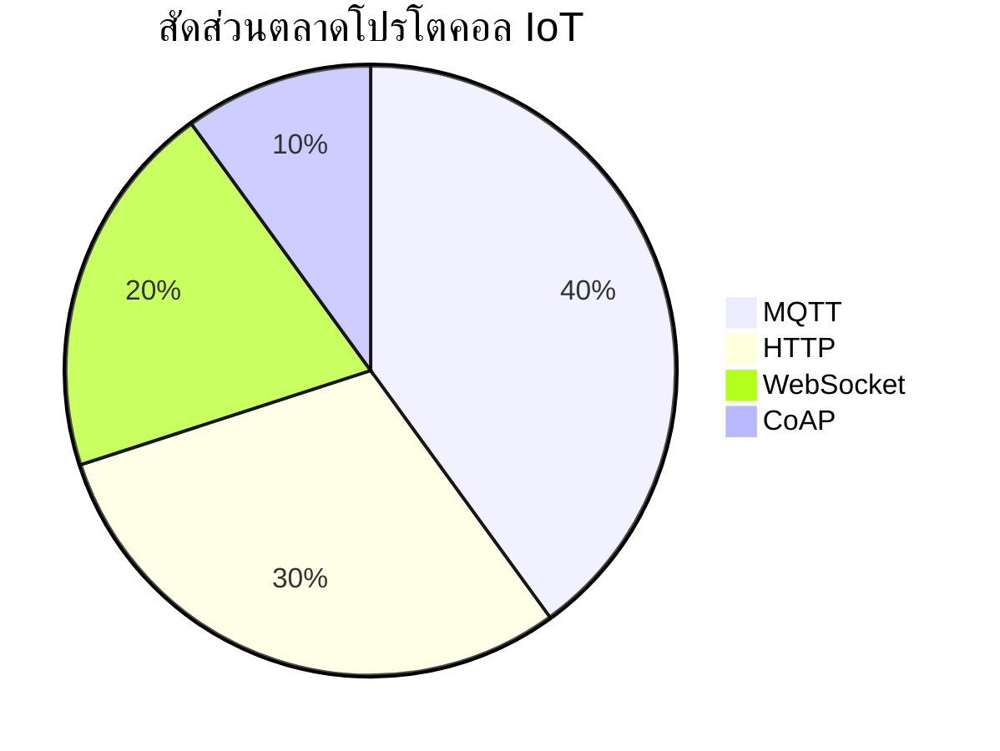

# บทที่ 1: IoT Foundation - โปรโตคอลพื้นฐาน

## ภาพรวมหมวดหมู่การสื่อสารใน IoT

ในปัจจุบัน IoT มีการสื่อสารหลักอยู่ 2 หมวด โดยสามารถจำแนกย่อยได้ดังนี้:

- **การสื่อสารไร้สาย (Wireless):**  
  การสื่อสารแบบไร้สายให้ความยืดหยุ่นในการติดตั้งและเคลื่อนย้าย โดยใช้เทคโนโลยีต่างๆ เช่น WiFi, Bluetooth, Zigbee, LoRa, NB-IoT มีข้อดีในแง่ของความสะดวกและค่าติดตั้งที่ต่ำ แต่บางครั้งอาจเผชิญกับปัญหาการรบกวนและระยะที่จำกัด

  | เทคโนโลยี | ข้อดี | ข้อเสีย |
  |------------|-------|----------|
  | WiFi       | ความเร็วสูง, ใช้งานแพร่หลาย | ระยะทางจำกัด, ใช้พลังงานสูง |
  | Bluetooth  | ใช้พลังงานต่ำ, เหมาะสำหรับการเชื่อมต่อระยะใกล้ | ระยะทางจำกัด, ความเร็วต่ำกว่า WiFi |
  | Zigbee     | ใช้พลังงานต่ำ, รองรับการเชื่อมต่อหลายอุปกรณ์ | ความเร็วต่ำ, ระยะทางจำกัด |
  | LoRa       | ระยะทางไกล, ใช้พลังงานต่ำ | ความเร็วต่ำ, ไม่เหมาะสำหรับการส่งข้อมูลขนาดใหญ่ |
  | NB-IoT     | ใช้พลังงานต่ำ, รองรับการเชื่อมต่อจำนวนมาก | ความเร็วต่ำ, ต้องการโครงสร้างพื้นฐานเฉพาะ |

- **การสื่อสารผ่านสาย (Wired):**  
  การสื่อสารผ่านสายมีความเสถียรและปลอดภัยมากกว่า โดยใช้เทคโนโลยีเช่น Ethernet, RS-485, CAN Bus ซึ่งตอบโจทย์ในเรื่องความน่าเชื่อถือและการส่งข้อมูลที่มีความต่อเนื่อง แม้จะต้องเผชิญกับความยุ่งยากในการติดตั้งและค่าใช้จ่ายที่สูงกว่า

  | เทคโนโลยี | ข้อดี | ข้อเสีย |
  |------------|-------|----------|
  | Ethernet   | ความเร็วสูง, เสถียร | ติดตั้งยาก, ค่าใช้จ่ายสูง |
  | RS-485     | เสถียร, รองรับการเชื่อมต่อหลายอุปกรณ์ | ความเร็วต่ำกว่า Ethernet, ระยะทางจำกัด |
  | CAN Bus    | เสถียร, ใช้ในอุตสาหกรรมยานยนต์ | ความเร็วต่ำ, ระยะทางจำกัด |

## Diagram สัดส่วนตลาดของโปรโตคอล IoT

## ตารางเปรียบเทียบระหว่างโปรโตคอล IoT

| Protocol   | Communication Model   | Advantages                                | Limitations                           |
|------------|-----------------------|-------------------------------------------|---------------------------------------|
| MQTT       | Publish/Subscribe     | เบา, ใช้แบนด์วิธต่ำ, ทนต่อการเชื่อมต่อไม่เสถียร | ไม่มีการสื่อสารแบบ bidirectional อย่างแท้จริง |
| WebSocket  | Full-Duplex           | การสื่อสารแบบเรียลไทม์, เชื่อมต่ออย่างต่อเนื่อง  | ใช้แบนด์วิธมากกว่า, อาจซับซ้อนในบางสภาพแวดล้อม        |
| HTTP       | Request/Response      | รองรับอย่างแพร่หลาย, ใช้งานง่าย | มี overhead สูง, ไม่เหมาะกับการอัปเดตแบบเรียลไทม์ |
| CoAP       | Request/Response      | ประหยัดแบนด์วิธ, เหมาะสำหรับอุปกรณ์ที่มีทรัพยากรจำกัด | ความเร็วต่ำ, ไม่เหมาะกับการส่งข้อมูลขนาดใหญ่ |

## รายละเอียดโปรโตคอลและเหตุผลเลือกให้เจาะลึก: MQTT กับ WebSocket

**MQTT:**  
- โปรโตคอลที่เน้นการสื่อสารแบบ publish/subscribe  
- มีความเบาและใช้แบนด์วิธต่ำ  
- เหมาะสำหรับใช้งานในระบบ IoT ที่ต้องการความเสถียรและประสิทธิภาพสูงในสภาพแวดล้อมที่มีการเชื่อมต่อที่ไม่แน่นอน

**WebSocket:**  
- ให้การเชื่อมต่อแบบ full-duplex สำหรับการสื่อสารแบบเรียลไทม์  
- ลดความหน่วงในการสื่อสารเมื่อเทียบกับการเชื่อมต่อแบบ HTTP  
- ใช้งานได้อย่างมีประสิทธิภาพในแอปพลิเคชันที่ต้องการการอัปเดตข้อมูลทันที

**HTTP:**
- โปรโตคอลมาตรฐานสำหรับการสื่อสารผ่านเว็บ
- รองรับอย่างแพร่หลายและใช้งานง่ายเมื่อรวมเข้ากับโครงสร้างพื้นฐานปัจจุบัน
- ใช้รูปแบบ request/response ซึ่งอาจมี overhead ค่อนข้างสูง
- ไม่เหมาะกับงานที่ต้องการการอัปเดตแบบเรียลไทม์มากนัก

**CoAP:**
- โปรโตคอลที่ออกแบบมาเพื่ออุปกรณ์ IoT ที่มีทรัพยากรจำกัด
- ใช้รูปแบบการสื่อสารคล้าย RESTful แต่ประหยัดแบนด์วิธกว่า HTTP
- มี overhead ต่ำ เพราะสามารถทำงานบน UDP
- เหมาะกับการสื่อสารแบบ M2M ในระบบ IoT ขนาดเล็ก

**เหตุผลในการเลือก MQTT และ WebSocket:**  
- ทั้งสองโปรโตคอลมีความสามารถในการส่งข้อมูลแบบเรียลไทม์  
- สามารถปรับใช้ในสภาพแวดล้อมที่แตกต่างกันของระบบ IoT  
- การศึกษาเชิงลึกในสองโปรโตคอลนี้ช่วยให้เข้าใจถึงแนวทางการออกแบบระบบที่ตอบสนองต่อความต้องการของแอปพลิเคชัน IoT ในยุคปัจจุบัน

---

## RACKSYNC CO., LTD.

[RACKSYNC](https://github.com/racksync) เป็นบริษัทที่มีความเชี่ยวชาญในการพัฒนาโซลูชั่นด้าน IoT และระบบอัตโนมัติ เรามุ่งมั่นในการสร้างเทคโนโลยีที่เชื่อมต่อโลกเข้าด้วยกันผ่านระบบ IoT ที่มีประสิทธิภาพและเสถียร

### บริการของเรา
- การออกแบบและพัฒนาระบบ IoT แบบครบวงจร
- โซลูชั่นเชื่อมต่อสำหรับอุตสาหกรรม 4.0
- ระบบอัตโนมัติสำหรับบ้านและอาคารอัจฉริยะ
- การฝึกอบรมและเวิร์คช็อปด้าน IoT

ติดตามโปรเจกต์และอัปเดตได้ที่ [GitHub](https://github.com/racksync)

© 2007-2025 RACKSYNC CO., LTD. All rights reserved.
