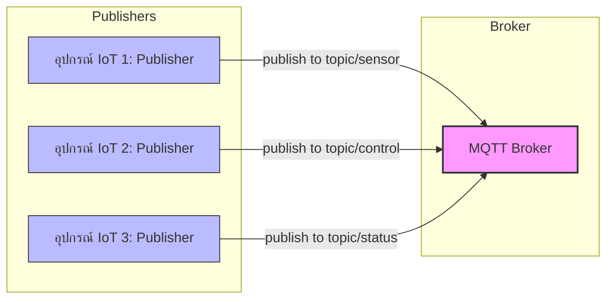
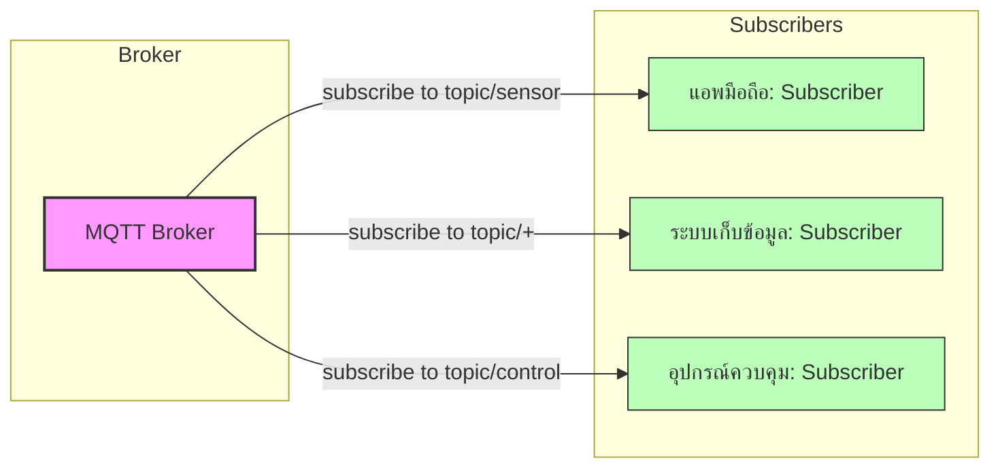
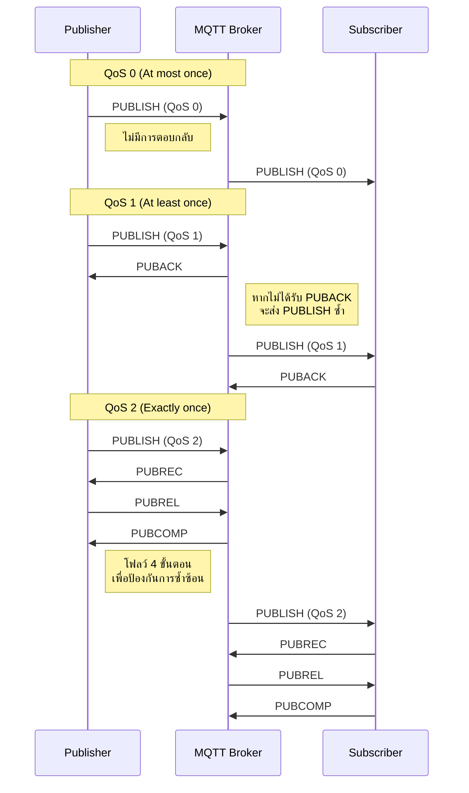
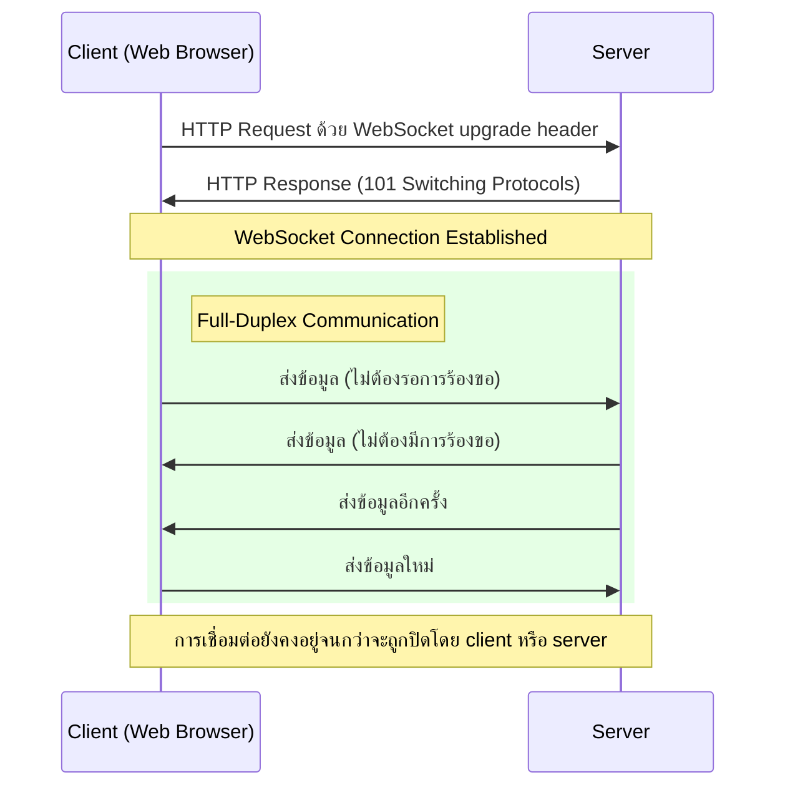
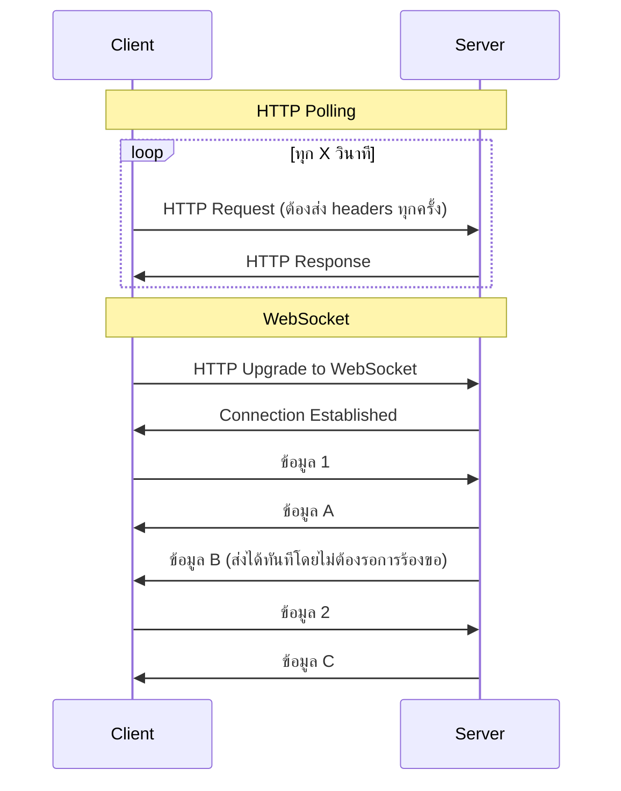

# บทที่ 1: โปรโตคอลพื้นฐานสำหรับ IoT - รู้จักและเข้าใจ MQTT

บทนี้แนะนำโปรโตคอลพื้นฐานที่ใช้ในระบบ IoT โดยเน้นที่ MQTT

| รายละเอียด | คำอธิบาย |
|----------|---------|
| **ชื่อเนื้อหา** | โปรโตคอลพื้นฐาน |
| **วัตถุประสงค์** | เรียนรู้สถาปัตยกรรมของ MQTT   |
| **ระดับความยาก** | ง่าย  [⭑⭑] |
| **เวลา** | 45 นาที - 1 ชั่วโมง |


## วัตถุประสงค์การเรียนรู้

- เข้าใจว่า MQTT คืออะไรและบทบาทในระบบ IoT
- เรียนรู้สถาปัตยกรรมของ MQTT (รูปแบบ Publish/Subscribe, Topics, QoS)
- กำหนดค่า Topics, Port และ WebSocket บน MQTT Broker
- ใช้ MQTTX สำหรับ Publish/Subscribe
- ใช้งาน WebSocket เพื่อเชื่อมต่อกับ MQTT
- ทำเวิร์คช็อปการติดตั้งและเชื่อมต่อกับ MQTT Broker

## MQTT คืออะไร? ประวัติและความเป็นมา

MQTT (Message Queuing Telemetry Transport) เป็นโปรโตคอลการสื่อสารแบบเบาที่ออกแบบมาสำหรับอุปกรณ์ที่มีข้อจำกัดและเครือข่ายที่มีแบนด์วิดธ์ต่ำ ความหน่วงสูง หรือไม่เสถียร

### ประวัติความเป็นมา

MQTT ถูกพัฒนาขึ้นในปี 1999 โดย Andy Stanford-Clark จาก IBM และ Arlen Nipper จาก Arcom (ปัจจุบันคือ Eurotech) โดยมีวัตถุประสงค์เริ่มต้นเพื่อเชื่อมต่อท่อส่งน้ำมันผ่านดาวเทียม ชื่อ MQTT มาจาก "MQ Telemetry Transport" โดยที่ MQ อ้างอิงถึง IBM MQ (ผลิตภัณฑ์ระบบส่งข้อความของ IBM)

ในปี 2013 MQTT เวอร์ชัน 3.1.1 ได้ถูกมาตรฐานโดย OASIS (Organization for the Advancement of Structured Information Standards) และต่อมาในปี 2019 MQTT เวอร์ชัน 5 ได้รับการเผยแพร่ โดยเพิ่มคุณสมบัติใหม่หลายอย่าง เช่น ข้อความเหตุผลของข้อผิดพลาด, คุณสมบัติของข้อความ, และการหมดอายุของข้อความ

ปัจจุบัน MQTT ได้กลายเป็นหนึ่งในโปรโตคอลพื้นฐานที่สำคัญที่สุดสำหรับการเชื่อมต่อ IoT เนื่องจากความเรียบง่ายและประสิทธิภาพ

### หลักการทำงานของ MQTT

MQTT ทำงานบนหลักการ **Publish/Subscribe** (เผยแพร่/รับข้อมูล) ซึ่งแตกต่างจากโมเดลแบบ client-server ทั่วไป โดยมีองค์ประกอบหลัก 3 ส่วน:

1. **Publisher** - ผู้เผยแพร่ข้อมูลหรือส่งข้อความ
2. **Subscriber** - ผู้รับข้อมูลหรือข้อความ
3. **Broker** - ตัวกลางที่จัดการการส่งข้อความระหว่าง publisher และ subscriber

การสื่อสารทั้งหมดจะผ่าน "topics" ซึ่งเป็นเส้นทางหรือช่องทางสำหรับข้อความ ทำให้ publisher ไม่จำเป็นต้องรู้จัก subscriber และในทางกลับกัน

### แผนภาพแสดงรูปแบบการเชื่อมต่อแบบ Publish/Subscribe

#### ทิศทางการส่งข้อมูลจาก Publisher ไปยัง Broker



#### ทิศทางการส่งข้อมูลจาก Broker ไปยัง Subscribers



#### หลักการทำงานของ MQTT Publish/Subscribe:

1. **การแยกระหว่าง Publisher และ Subscriber**:
   - Publishers และ Subscribers ไม่รู้จักหรือติดต่อกันโดยตรง
   - ทั้งสองฝ่ายติดต่อผ่าน Broker เท่านั้น
   - การแยกนี้ทำให้ระบบมีความยืดหยุ่น สามารถเปลี่ยนแปลงฝั่งหนึ่งโดยไม่กระทบอีกฝั่ง

2. **การใช้ Topics เป็นตัวกลาง**:
   - ข้อความทั้งหมดส่งไปยัง topic ซึ่งเป็นเหมือนช่องทางการสื่อสาร
   - Topics มีโครงสร้างเป็นลำดับชั้น เช่น `home/livingroom/temperature`
   - Subscriber สามารถสมัครรับข้อมูลจากหลาย topics หรือใช้ wildcards ได้

3. **การทำงานแบบ Event-driven**:
   - ระบบทำงานตามเหตุการณ์ (events) เมื่อมีข้อมูลเข้ามา
   - Subscribers รอรับข้อมูลเมื่อมีการ publish ไปยัง topic ที่สนใจ
   - ลดการใช้ทรัพยากรเมื่อเทียบกับการ polling ข้อมูลต่อเนื่อง

4. **การลดการเชื่อมต่อโดยตรง (Decoupling)**:
   - **Space decoupling**: Publishers และ Subscribers ไม่จำเป็นต้องรู้จักกัน
   - **Time decoupling**: ไม่จำเป็นต้องทำงานพร้อมกัน (สามารถใช้ retained messages)
   - **Synchronization decoupling**: การทำงานไม่ถูกขัดจังหวะโดยการรอการตอบสนอง


### ข้อดีของ MQTT สำหรับ IoT

1. **ทรัพยากรต่ำ**: ใช้แบนด์วิดธ์น้อย เหมาะสำหรับอุปกรณ์ที่มีข้อจำกัดด้านพลังงานและประมวลผล
2. **ความน่าเชื่อถือ**: มีระดับ Quality of Service (QoS) ให้เลือกตามความต้องการ
3. **การทำงานแบบ Asynchronous**: ไม่จำเป็นต้องเชื่อมต่อตลอดเวลา
4. **การปรับขนาด**: รองรับการเชื่อมต่อจำนวนมากพร้อมกัน
5. **ความปลอดภัย**: รองรับการเข้ารหัส TLS และการรับรองความถูกต้อง

## หัวข้อที่ครอบคลุม

### 1. แนะนำ MQTT และบทบาทใน IoT

MQTT ถูกออกแบบมาเพื่อแก้ปัญหาเฉพาะในระบบ IoT:
- การเชื่อมต่ออุปกรณ์จำนวนมากกับระบบศูนย์กลาง
- การส่งข้อมูลในเครือข่ายที่ไม่เสถียรหรือมีข้อจำกัด
- การรองรับอุปกรณ์ที่มีหน่วยความจำและพลังงานจำกัด

ในระบบ IoT ปัจจุบัน MQTT มักใช้ในการเก็บข้อมูลเซ็นเซอร์, การควบคุมอุปกรณ์ระยะไกล, การแจ้งเตือนและการอัปเดตสถานะแบบเรียลไทม์

### 2. สถาปัตยกรรม MQTT (Publish/Subscribe, Topic, QoS)

#### ระบบ Topic
Topics ใน MQTT มีโครงสร้างเป็นลำดับชั้น คล้ายกับเส้นทางไฟล์ เช่น:
- `home/livingroom/temperature`
- `home/kitchen/humidity`

สามารถใช้ wildcard ได้:
- `+` แทนระดับเดียว: `home/+/temperature` จะรับข้อมูลจาก `home/livingroom/temperature` และ `home/kitchen/temperature`
- `#` แทนหลายระดับ: `home/#` จะรับข้อมูลทั้งหมดที่เริ่มต้นด้วย `home/`

#### Quality of Service (QoS)
QoS (Quality of Service) คือระดับคุณภาพของการให้บริการในการส่งข้อความ MQTT ที่กำหนดความน่าเชื่อถือในการส่งข้อมูลระหว่าง publisher กับ broker และระหว่าง broker กับ subscriber ช่วยให้อุปกรณ์สามารถเลือกระดับการรับประกันในการส่งข้อความตามความเหมาะสมกับสภาพแวดล้อม แบนด์วิดธ์ และความสำคัญของข้อมูล การเลือกใช้ QoS ที่เหมาะสมจะช่วยให้ระบบ IoT มีประสิทธิภาพและความน่าเชื่อถือตามที่ต้องการ

MQTT มี QoS 3 ระดับ:
- **QoS 0** (At most once): ส่งข้อความเพียงครั้งเดียว ไม่มีการยืนยัน
- **QoS 1** (At least once): รับประกันว่าข้อความจะถึงผู้รับอย่างน้อยหนึ่งครั้ง อาจซ้ำได้
- **QoS 2** (Exactly once): รับประกันว่าข้อความจะถึงผู้รับเพียงครั้งเดียว ไม่ซ้ำ

#### ภาพแสดงการทำงานของ QoS (Quality of Service)



##### สถานการณ์จริงและอุปมาอุปมัยของ QoS

**QoS 0 - "Fire and Forget" (ยิงแล้วลืม)**
- **อุปมา**: เหมือนการโยนจดหมายใส่ตู้ไปรษณีย์โดยไม่ได้ลงทะเบียน เราไม่มีวิธีรู้ว่าถึงผู้รับหรือไม่
- **สถานการณ์จริง**: เหมาะสำหรับ
  - เซ็นเซอร์วัดอุณหภูมิที่ส่งข้อมูลทุก 1-2 วินาที การสูญหายของข้อมูล 1-2 ค่าไม่กระทบต่อระบบ
  - การอัปเดตสถานะที่ไม่สำคัญ เช่น ระดับแสงในห้องที่มีการเปลี่ยนแปลงบ่อย
  - การบันทึกข้อมูลปริมาณมากที่ยอมรับการสูญเสียบางส่วนได้
- **ข้อดี**: ใช้แบนด์วิดธ์และทรัพยากรน้อยที่สุด เร็วที่สุด

**QoS 1 - "At Least Once" (อย่างน้อยหนึ่งครั้ง)**
- **อุปมา**: เหมือนการส่งจดหมายลงทะเบียนที่ต้องมีการเซ็นรับ ถ้าไม่ได้รับการยืนยัน เราจะส่งซ้ำ ทำให้บางครั้งผู้รับอาจได้รับจดหมายซ้ำ
- **สถานการณ์จริง**: เหมาะสำหรับ
  - การส่งคำสั่งควบคุมอุปกรณ์ที่ต้องการความมั่นใจว่าคำสั่งจะถึง แต่ไม่เป็นไรหากอุปกรณ์ได้รับคำสั่งซ้ำ เช่น "เปิดไฟ" (การเปิดซ้ำไม่มีผลเสีย)
  - การแจ้งเตือนที่สำคัญ แต่การแจ้งซ้ำไม่ก่อให้เกิดปัญหา
  - การบันทึกข้อมูลที่ต้องการความครบถ้วนและยอมรับความซ้ำซ้อนได้
- **ข้อดี**: รับประกันการส่งโดยใช้ทรัพยากรปานกลาง

**QoS 2 - "Exactly Once" (ส่งครั้งเดียวแน่นอน)**
- **อุปมา**: เหมือนการทำธุรกรรมทางการเงินที่ต้องการความแม่นยำสูงสุด มีกลไกตรวจสอบซ้ำเพื่อให้มั่นใจว่าเงินจะถูกโอนครั้งเดียวเท่านั้น ไม่ขาดไม่เกิน
- **สถานการณ์จริง**: เหมาะสำหรับ
  - การส่งคำสั่งที่การทำงานซ้ำอาจก่อให้เกิดความเสียหาย เช่น "โอนเงิน" หรือ "ฉีดยา"
  - การส่งคำสั่งเปิด-ปิดอุปกรณ์ที่หากทำซ้ำจะทำให้สถานะผิดพลาด เช่น คำสั่ง "สลับสถานะ" (toggle)
  - ระบบการนับหรือการวัดที่ต้องการความถูกต้องแม่นยำ 100%
- **ข้อดี**: รับประกันการส่งครั้งเดียวและไม่ซ้ำ แต่ใช้ทรัพยากรและเวลามากที่สุด

ในการเลือกใช้ QoS ควรพิจารณาจาก:
1. ความสำคัญของข้อมูล
2. ผลกระทบหากข้อมูลสูญหายหรือซ้ำซ้อน
3. ข้อจำกัดด้านทรัพยากรของอุปกรณ์และเครือข่าย


### 3. การติดตั้ง MQTT Broker (ทั้งแบบในเครื่องและบนคลาวด์)

#### การติดตั้ง Mosquitto Broker (On-Premise)

**บน Linux (Ubuntu/Debian)**:
```bash
sudo apt update
sudo apt install mosquitto mosquitto-clients
sudo systemctl enable mosquitto
sudo systemctl start mosquitto
```

**บน macOS**:
```bash
brew install mosquitto
```

**บน Windows**:
สามารถดาวน์โหลดได้จาก https://mosquitto.org/download/

#### การใช้งาน EMQX

EMQX เป็น MQTT Broker ที่มีประสิทธิภาพสูงและมีคุณสมบัติที่ครบถ้วนสำหรับการใช้งานระดับองค์กร สามารถใช้ได้ทั้งแบบ Open Source (ฟรี) และแบบ Enterprise/Cloud

##### การติดตั้ง EMQX ด้วย Docker

```bash
docker run -d --name emqx -p 1883:1883 -p 8083:8083 -p 8084:8084 -p 8883:8883 -p 18083:18083 emqx/emqx:latest
```

##### ทางเลือกในการใช้งาน EMQX

1. **EMQX Open Source**:
   - เวอร์ชันฟรีสำหรับการใช้งานทั่วไป
   - รองรับการเชื่อมต่อพร้อมกันได้มากถึง 100,000 อุปกรณ์
   - มีฟีเจอร์พื้นฐานครบถ้วน เช่น MQTT 3.1.1/5.0, WebSocket, TLS/SSL

2. **EMQX Enterprise**:
   - เวอร์ชันสำหรับองค์กรที่ต้องการคุณสมบัติเพิ่มเติม
   - รองรับการเชื่อมต่อได้มากกว่า 1 ล้านอุปกรณ์
   - มีฟีเจอร์เพิ่มเติม เช่น Data Persistence, Rule Engine, Multi-protocol Gateway

3. **EMQX Cloud**:
   - บริการแบบ Fully-managed MQTT บนคลาวด์
   - สามารถใช้งานได้บน AWS, Azure, GCP
   - มีแผนการใช้งานทั้งแบบฟรี (เพื่อทดลอง) และแบบจ่ายตามการใช้งาน

##### การใช้งาน Docker Compose สำหรับ EMQX และบริการที่เกี่ยวข้อง

ในโฟลเดอร์ `01-foundation-protocols` มีไฟล์ `docker-compose.yml` ที่ช่วยให้คุณสามารถรัน EMQX และบริการอื่นๆ ที่จำเป็นได้อย่างง่ายดาย:

```bash
docker-compose up -d
```

### 4. การกำหนดค่า Topics, Port และ WebSocket บน MQTT Broker

#### การกำหนดค่า Mosquitto (แบบพื้นฐาน)
ไฟล์การตั้งค่า: `/etc/mosquitto/mosquitto.conf`

```
# พอร์ตพื้นฐาน MQTT
listener 1883
protocol mqtt

# พอร์ต WebSocket
listener 9001
protocol websockets

# การตั้งค่าความปลอดภัย (ตัวอย่างพื้นฐาน)
allow_anonymous true
password_file /etc/mosquitto/passwd
```

#### การกำหนดค่า EMQX
EMQX มีอินเทอร์เฟซการจัดการแบบกราฟิกที่ใช้งานง่าย ซึ่งช่วยให้การกำหนดค่าต่างๆ ทำได้สะดวกกว่า:

1. **การเข้าถึง Dashboard**:
   - เปิดเบราว์เซอร์และไปที่ `http://localhost:18083` (ค่าเริ่มต้น)
   - เข้าสู่ระบบด้วย username: `admin` และ password: `public`

2. **การกำหนดค่า Listeners**:
   - ไปที่ "Management" > "Listeners"
   - EMQX มี listener พื้นฐานตั้งแต่เริ่มต้น:
     - MQTT (TCP) - พอร์ต 1883
     - MQTT over SSL/TLS - พอร์ต 8883
     - MQTT over WebSocket - พอร์ต 8083
     - MQTT over WebSocket/SSL - พอร์ต 8084

3. **การกำหนดค่า Authentication**:
   - ไปที่ "Access Control" > "Authentication"
   - สามารถตั้งค่าหลายรูปแบบ เช่น Username/Password, JWT, LDAP, หรือ MySQL

4. **การกำหนดค่า Topics ACL (Access Control List)**:
   - ไปที่ "Access Control" > "Authorization"
   - สามารถกำหนดได้ว่าใครมีสิทธิ์ในการ publish/subscribe topic ใดบ้าง

5. **การตั้งค่า WebSocket สำหรับการใช้งานกับเว็บแอปพลิเคชัน**:
   - WebSocket listener ถูกเปิดใช้งานโดยค่าเริ่มต้นที่พอร์ต 8083 (ws) และ 8084 (wss)
   - สามารถปรับแต่งค่าได้ที่ "Management" > "Listeners" > เลือก WebSocket listener


### 5. การใช้ MQTTX สำหรับทดสอบ Publish/Subscribe

MQTTX เป็นเครื่องมือที่ง่ายต่อการใช้งานสำหรับการทดสอบระบบ MQTT:

1. ดาวน์โหลดและติดตั้งจาก https://mqttx.app/
2. เชื่อมต่อกับ broker โดยระบุ:
   - Host: `localhost` หรือ IP ของ broker
   - Port: `1883` (default MQTT) หรือ `9001` (WebSocket)
   - ระบุ username/password ถ้ามีการตั้งค่าไว้
3. ฟีเจอร์หลัก:
   - สร้างการเชื่อมต่อได้หลากหลาย
   - เผยแพร่ข้อความไปยัง topic ที่ต้องการในหลากหลายรูปแบบ (JSON, Base64, Hex)
   - สมัครสมาชิก topics และดูข้อความเข้าแบบเรียลไทม์
   - สนับสนุน MQTT 5.0 และ 3.1.1

### 6. การใช้งาน WebSocket เพื่อเชื่อมต่อกับ MQTT

#### WebSocket คืออะไร? ประวัติและความสำคัญ

WebSocket เป็นโปรโตคอลการสื่อสารที่สร้างช่องทางการติดต่อแบบ full-duplex (สื่อสารสองทางพร้อมกัน) บนการเชื่อมต่อ TCP เดียว ซึ่งช่วยให้เว็บแอปพลิเคชันสามารถสื่อสารแบบเรียลไทม์กับเซิร์ฟเวอร์ได้

##### ประวัติความเป็นมา

WebSocket ถูกพัฒนาโดย Ian Hickson และ Michael Carter ในปี 2008 เพื่อแก้ปัญหาข้อจำกัดของ HTTP ในการสื่อสารแบบเรียลไทม์ ต่อมาในปี 2011 IETF ได้มาตรฐาน WebSocket เป็น RFC 6455 และได้รับการสนับสนุนในเว็บเบราว์เซอร์หลักต่างๆ

##### แผนภาพแสดงการเชื่อมต่อแบบ Full Duplex ของ WebSocket



##### เปรียบเทียบ HTTP Polling กับ WebSocket



##### บทบาทสำคัญและการแก้ปัญหา

1. **แก้ปัญหาการสื่อสารแบบเรียลไทม์**: ก่อนมี WebSocket การสื่อสารแบบเรียลไทม์บนเว็บมักใช้เทคนิค HTTP Polling หรือ Long Polling ซึ่งไม่มีประสิทธิภาพและสร้างภาระให้เซิร์ฟเวอร์

2. **ลดโอเวอร์เฮดของข้อมูล**: การเชื่อมต่อ WebSocket เปิดเพียงครั้งเดียวและใช้งานได้ต่อเนื่อง ไม่ต้องส่ง HTTP headers ทุกครั้งเหมือนการร้องขอแบบ HTTP ปกติ ทำให้ลดการใช้แบนด์วิดธ์

3. **การสื่อสารแบบสองทาง**: เซิร์ฟเวอร์สามารถส่งข้อมูลไปยังไคลเอนต์ได้โดยไม่ต้องรอการร้องขอจากไคลเอนต์ ทำให้สามารถพัฒนาแอปพลิเคชันที่ต้องการข้อมูลแบบเรียลไทม์ เช่น แชท, แดชบอร์ดการวิเคราะห์, หรือเกมออนไลน์

4. **เข้ากันได้กับโครงสร้างพื้นฐานเว็บ**: สามารถใช้ร่วมกับโปรโตคอล HTTPS, ผ่านพร็อกซีและไฟร์วอลล์ส่วนใหญ่

5. **สนับสนุนโดยเบราว์เซอร์หลัก**: ทุกเบราว์เซอร์สมัยใหม่มี API WebSocket มาตรฐานทำให้ง่ายต่อการพัฒนา

##### ความสำคัญต่อ IoT

ในบริบทของ IoT, WebSocket มีความสำคัญอย่างมาก:
- ช่วยให้แอปพลิเคชันเว็บสามารถรับข้อมูลจากอุปกรณ์ IoT แบบเรียลไทม์
- ช่วยลดความซับซ้อนในการพัฒนา dashboard สำหรับควบคุมและตรวจสอบอุปกรณ์ IoT
- สามารถรวมกับโปรโตคอล MQTT ผ่าน MQTT over WebSocket เพื่อให้แอปพลิเคชันเว็บสามารถเชื่อมต่อกับระบบ MQTT ได้โดยตรง

### 8. เวิร์คช็อป: การติดตั้ง MQTT Broker และการเชื่อมต่อเบื้องต้น

#### ขั้นตอนการติดตั้ง MQTT Broker:
1. เลือก broker ที่เหมาะสม (Mosquitto, EMQX, HiveMQ)
2. ติดตั้งตามขั้นตอนที่ระบุไว้ในหัวข้อ 4
3. ตรวจสอบสถานะการทำงานของ broker

#### การทดสอบการเชื่อมต่อพื้นฐานด้วยเครื่องมือ command line:
**Subscribe**:
```bash
mosquitto_sub -h localhost -t test/topic
```

**Publish**:
```bash
mosquitto_pub -h localhost -t test/topic -m "Hello MQTT"
```

#### การทดลองผ่าน MQTTX:
1. เชื่อมต่อกับ broker ที่ติดตั้งไว้
2. สร้าง topic ใหม่ และทดลอง publish/subscribe
3. ทดสอบการใช้ wildcard ในการ subscribe
4. ทดลองใช้ QoS ระดับต่างๆ

## เครื่องมือและเอกสารอ้างอิง

- ซอฟต์แวร์ MQTT Broker:
  - [Mosquitto](https://mosquitto.org/)
  - [EMQX](https://www.emqx.io/) (เน้นใช้ในเวิร์คชอปนี้)
  - [HiveMQ](https://www.hivemq.com/)
- เครื่องมือสำหรับทดสอบ:
  - [MQTTX](https://mqttx.app/)
  - [MQTT Explorer](http://mqtt-explorer.com/)
- ไลบรารีสำหรับนักพัฒนา:
  - [Eclipse Paho](https://www.eclipse.org/paho/) (หลายภาษา)
  - [MQTT.js](https://github.com/mqttjs/MQTT.js) (JavaScript)
  - [Paho MQTT Python](https://pypi.org/project/paho-mqtt/) (Python)
- เอกสารอ้างอิงและสเปค MQTT: [MQTT.org](https://mqtt.org/)

## บริการคลาวด์ที่ได้รับความนิยม
- EMQX Cloud: https://www.emqx.com/en/cloud
  - มีแผนการใช้งานฟรีสำหรับการทดลอง
  - มีฟีเจอร์ครบถ้วนสำหรับการใช้งานจริง
  - รองรับทั้ง AWS, GCP และ Azure
- HiveMQ Cloud: https://www.hivemq.com/cloud
- AWS IoT Core: https://aws.amazon.com/iot-core
- Google Cloud IoT Core: https://cloud.google.com/iot-core
- Microsoft Azure IoT Hub: https://azure.microsoft.com/en-us/services/iot-hub
- IBM Watson IoT Platform: https://www.ibm.com/cloud/watson-iot-platform


---

## เริ่มต้นใช้งาน MQTT: สร้างห้องทดลองของคุณเอง

การเริ่มต้นใช้งาน MQTT ไม่ยาก ในบทนี้เราจะใช้ **EMQX** ซึ่งเป็น MQTT Broker ประสิทธิภาพสูงและเป็นที่นิยมในโลก IoT

### การติดตั้งและเตรียมความพร้อม

เราจะใช้ Docker Compose เพื่อติดตั้งทุกอย่างที่จำเป็นในครั้งเดียว:

1. **ตรวจสอบว่าคุณมี Docker และ Docker Compose**
   ```bash
   docker --version
   docker-compose --version
   ```

2. **ใช้ไฟล์ docker-compose.yml ที่มีอยู่ในโฟลเดอร์นี้**
   
   ไฟล์ docker-compose.yml จะประกอบด้วยบริการหลัก 2 ส่วน:
   - **EMQX** - MQTT Broker ทำหน้าที่เป็นตัวกลางในการรับส่งข้อความระหว่างอุปกรณ์ต่างๆ
   - **MQTT Client** - เครื่องมือสำหรับทดสอบการเชื่อมต่อและส่งข้อความผ่าน MQTT

   ไฟล์นี้จะกำหนดพอร์ตที่จำเป็นสำหรับการเชื่อมต่อ MQTT แบบมาตรฐาน (1883), WebSocket (8083), 
   และหน้า Dashboard ของ EMQX (18083)

3. **เริ่มต้นระบบด้วยคำสั่ง:**
   ```bash
   docker-compose up -d
   ```

4. **เข้าสู่ระบบ EMQX Dashboard**
   - เปิดเบราว์เซอร์ไปที่: http://localhost:18083
   - ล็อกอินด้วย Username: admin, Password: public

> **ข้อดีของ EMQX:** รองรับการเชื่อมต่อมากกว่า 100,000 อุปกรณ์พร้อมกัน มีความสามารถในการขยายตัว และมีเครื่องมือติดตามประสิทธิภาพแบบเรียลไทม์

### ทดสอบการเชื่อมต่อ MQTT กับ MQTTX

MQTTX เป็นเครื่องมือทดสอบที่ช่วยให้คุณเห็นภาพรวมของระบบ MQTT ทั้งหมด:

1. **เปิด MQTTX** ที่ดาวน์โหลดจาก https://mqttx.app และติดตั้งในเครื่องของคุณ

2. **เชื่อมต่อกับ MQTT Broker:**
   - Host: localhost
   - Port: 1883 (สำหรับการเชื่อมต่อแบบ MQTT ปกติ)
   - ไม่ต้องใส่ Username/Password (หากไม่ได้ตั้งค่าการรักษาความปลอดภัย)

3. **ทดลองสร้าง Topic และส่งข้อความ:**
   - คลิกที่ปุ่ม "New Connection" เพื่อสร้างการเชื่อมต่อใหม่
   - ตั้งชื่อการเชื่อมต่อและกด "Connect"
   - ใส่ Topic เช่น `test/message`
   - เขียนข้อความ JSON เช่น `{"temperature": 25.5, "humidity": 60}`
   - กดปุ่ม "Send" เพื่อ Publish ข้อความ

4. **ดูผลลัพธ์:**
   - คลิก "New Subscription" เพื่อ subscribe ไปยัง topic ที่ต้องการ เช่น `test/#`
   - ข้อความที่ส่งไปยัง topic จะปรากฏในรายการด้านขวา

## โครงสร้างไฟล์และการใช้งานตัวอย่าง

ไฟล์และตัวอย่างสำหรับการเรียนรู้ MQTT:

```
/
├── README.md             # เอกสารที่คุณกำลังอ่านอยู่
├── docker-compose.yml    # สำหรับรัน MQTT Broker และเครื่องมือที่เกี่ยวข้อง
└── examples/
    ├── mqtt-web-client/  # ตัวอย่างเว็บแอปที่ใช้ WebSocket กับ MQTT
    │   ├── index.html    # หน้าเว็บตัวอย่าง
    │   └── app.js        # โค้ด JavaScript สำหรับเชื่อมต่อ MQTT
    └── python-mqtt-client/ # ตัวอย่างโค้ด Python สำหรับ MQTT
        ├── subscriber.py  # โค้ดสำหรับ Subscribe ข้อมูล
        └── publisher.py   # โค้ดสำหรับ Publish ข้อมูล
```

### การใช้งานตัวอย่าง Python MQTT Client

ในโฟลเดอร์ `examples/python-mqtt-client` มีตัวอย่างโค้ด Python สำหรับการเชื่อมต่อกับ MQTT Broker:

1. **การติดตั้งไลบรารี:**
   ```bash
   pip install paho-mqtt
   ```

2. **การรันโค้ดตัวอย่าง:**
   - เปิด Terminal และนำทางไปยังโฟลเดอร์ตัวอย่าง
   - เริ่มต้นตัวรับข้อมูล (subscriber)
   - รันตัวส่งข้อมูล (publisher)

3. **สังเกตผลลัพธ์:**
   - Terminal ที่รัน subscriber จะแสดงข้อมูลที่ได้รับจาก publisher
   - คุณสามารถดูข้อมูลเดียวกันนี้ใน MQTT Explorer ได้ด้วย

### การใช้งานตัวอย่างเว็บ MQTT Client

1. **การเปิดใช้งาน:**
   - เปิดไฟล์ `index.html` ในเบราว์เซอร์ของคุณ
   - หรือใช้ Web Server ง่ายๆ

2. **ทดลองการทำงาน:**
   - เว็บแอปจะเชื่อมต่อกับ MQTT Broker ผ่าน WebSocket
   - คุณจะเห็นข้อความที่ถูกส่งมายัง topics ที่ subscribe ไว้
   - คุณสามารถส่งข้อความไปยัง topics ต่างๆ ได้จากหน้าเว็บ

## วิธีการทดสอบและแก้ไขปัญหาเบื้องต้น

### 1. ตรวจสอบสถานะของ EMQX

```bash
docker ps | grep emqx
```

คำสั่งนี้จะแสดงให้เห็นว่า container EMQX กำลังทำงานอยู่หรือไม่

### 2. ดูบันทึกการทำงาน (logs) ของ EMQX

```bash
docker logs emqx
```

### 3. ปัญหาที่พบบ่อยและวิธีแก้ไข

- **ไม่สามารถเชื่อมต่อกับ MQTT Broker ได้**:
  - ตรวจสอบว่า container กำลังทำงาน
  - ตรวจสอบว่าไม่มีการบล็อกพอร์ตโดย firewall
  - ลองใช้ `localhost` แทนชื่อเครื่องหรือ IP address

- **WebSocket ไม่ทำงาน**:
  - ตรวจสอบว่าใช้พอร์ตถูกต้อง (8083 สำหรับ EMQX)
  - ตรวจสอบว่า URL มีรูปแบบถูกต้อง: `ws://localhost:8083/mqtt`
  - ตรวจสอบ Console ในเบราว์เซอร์เพื่อดูข้อความข้อผิดพลาด

## สรุป

ในบทนี้ เราได้เรียนรู้เกี่ยวกับ MQTT ซึ่งเป็นโปรโตคอลหลักในระบบ IoT ที่ช่วยให้อุปกรณ์สามารถสื่อสารกันได้อย่างมีประสิทธิภาพ แม้ในสภาพแวดล้อมที่มีข้อจำกัด เราได้ศึกษาหลักการทำงานแบบ Publish/Subscribe, ระบบ Topic และ Quality of Service ที่เป็นพื้นฐานสำคัญของ MQTT

เราได้ทดลองการติดตั้งและกำหนดค่า MQTT Broker โดยใช้ EMQX ซึ่งเป็นตัวเลือกที่มีประสิทธิภาพสูงและใช้งานง่าย นอกจากนี้ ยังได้เรียนรู้การใช้ WebSocket เพื่อเชื่อมต่อ MQTT กับเว็บแอปพลิเคชัน ทำให้สามารถสร้างระบบควบคุมและแสดงผลข้อมูลแบบเรียลไทม์ได้

ทักษะและความรู้ที่ได้จากบทนี้จะเป็นพื้นฐานสำคัญในการพัฒนาโปรเจค IoT ต่างๆ ในอนาคต ไม่ว่าจะเป็นระบบบ้านอัจฉริยะ การเกษตรอัจฉริยะ หรือโซลูชันสำหรับภาคอุตสาหกรรม

## เครื่องมือและเอกสารอ้างอิง

- ซอฟต์แวร์ MQTT Broker:
  - [Mosquitto](https://mosquitto.org/)
  - [EMQX](https://www.emqx.io/) (เน้นใช้ในเวิร์คชอปนี้)
  - [HiveMQ](https://www.hivemq.com/)
- เครื่องมือสำหรับทดสอบ:
  - [MQTTX](https://mqttx.app/)
  - [MQTT Explorer](http://mqtt-explorer.com/)
- ไลบรารีสำหรับนักพัฒนา:
  - [Eclipse Paho](https://www.eclipse.org/paho/) (หลายภาษา)
  - [MQTT.js](https://github.com/mqttjs/MQTT.js) (JavaScript)
  - [Paho MQTT Python](https://pypi.org/project/paho-mqtt/) (Python)
- เอกสารอ้างอิงและสเปค MQTT: [MQTT.org](https://mqtt.org/)

## บริการคลาวด์ที่ได้รับความนิยม
- EMQX Cloud: https://www.emqx.com/en/cloud
  - มีแผนการใช้งานฟรีสำหรับการทดลอง
  - มีฟีเจอร์ครบถ้วนสำหรับการใช้งานจริง
  - รองรับทั้ง AWS, GCP และ Azure
- HiveMQ Cloud: https://www.hivemq.com/cloud
- AWS IoT Core: https://aws.amazon.com/iot-core
- Google Cloud IoT Core: https://cloud.google.com/iot-core
- Microsoft Azure IoT Hub: https://azure.microsoft.com/en-us/services/iot-hub
- IBM Watson IoT Platform: https://www.ibm.com/cloud/watson-iot-platform

---

## RACKSYNC CO., LTD.

[RACKSYNC](https://github.com/racksync) เป็นบริษัทที่มีความเชี่ยวชาญในการพัฒนาโซลูชั่นด้าน IoT และระบบอัตโนมัติ เรามุ่งมั่นในการสร้างเทคโนโลยีที่เชื่อมต่อโลกเข้าด้วยกันผ่านระบบ IoT ที่มีประสิทธิภาพและเสถียร

### บริการของเรา
- การออกแบบและพัฒนาระบบ IoT แบบครบวงจร
- โซลูชั่นเชื่อมต่อสำหรับอุตสาหกรรม 4.0
- ระบบอัตโนมัติสำหรับบ้านและอาคารอัจฉริยะ
- การฝึกอบรมและเวิร์คช็อปด้าน IoT

ติดตามโปรเจกต์และอัปเดตได้ที่ [GitHub](https://github.com/racksync)

© 2007-2025 RACKSYNC CO., LTD. All rights reserved.
