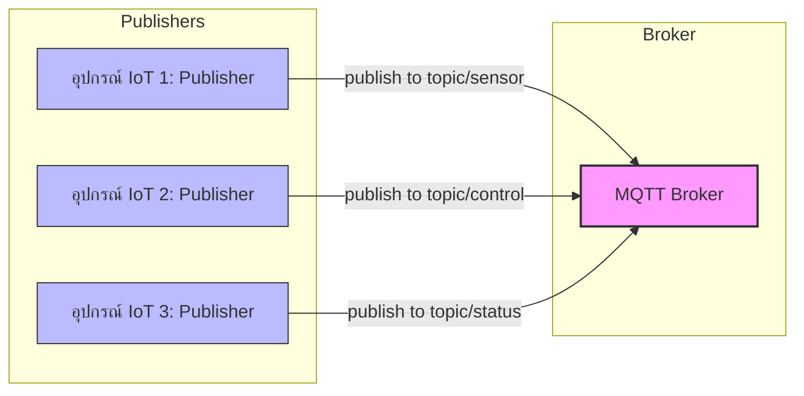
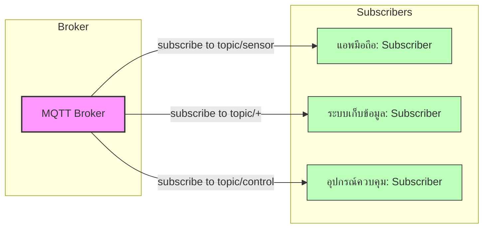
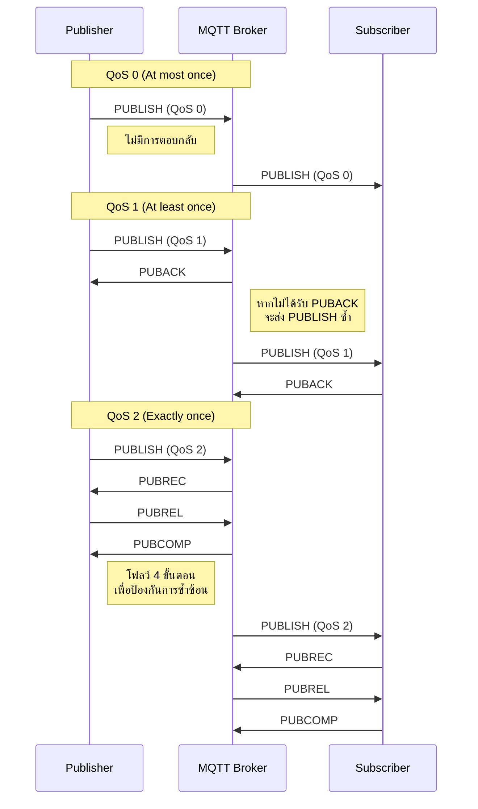

# บทที่ 2: โปรโตคอลพื้นฐานสำหรับ IoT - รู้จักและเข้าใจ MQTT

| รายละเอียด         | คำอธิบาย                                                     |
|---------------------|----------------------------------------------------------------|
| **ชื่อเนื้อหา**     | โปรโตคอลพื้นฐานสำหรับ IoT - รู้จักและเข้าใจ MQTT               |
| **วัตถุประสงค์**    | เรียนรู้และเข้าใจโปรโตคอล MQTT สำหรับระบบ IoT                  |
| **ระดับความยาก**    | ปานกลาง [⭑⭑⭑]                                                |
| **เวลา**           | 45 นาที                                            |
| **สิ่งที่ต้องเตรียม** | MQTT Broker (Mosquitto/EMQX), MQTTX, เครื่องคอมพิวเตอร์         |
| **ความรู้พื้นฐาน**  | เครือข่ายคอมพิวเตอร์เบื้องต้น, IoT พื้นฐาน                      |


## วัตถุประสงค์การเรียนรู้

- เข้าใจว่า MQTT คืออะไรและบทบาทในระบบ IoT
- เรียนรู้สถาปัตยกรรมของ MQTT (รูปแบบ Publish/Subscribe, Topics, QoS)
- กำหนดค่า Topics และ Port บน MQTT Broker
- ใช้ MQTTX สำหรับ Publish/Subscribe
- ทำเวิร์คช็อปการติดตั้งและเชื่อมต่อกับ MQTT Broker

## MQTT คืออะไร? ประวัติและความเป็นมา

MQTT (Message Queuing Telemetry Transport) เป็นโปรโตคอลการสื่อสารแบบเบาที่ออกแบบมาสำหรับอุปกรณ์ที่มีข้อจำกัดและเครือข่ายที่มีแบนด์วิดธ์ต่ำ ความหน่วงสูง หรือไม่เสถียร

### ประวัติความเป็นมา

MQTT ถูกพัฒนาขึ้นในปี 1999 โดย Andy Stanford-Clark จาก IBM และ Arlen Nipper จาก Arcom (ปัจจุบันคือ Eurotech) โดยมีวัตถุประสงค์เริ่มต้นเพื่อเชื่อมต่อท่อส่งน้ำมันผ่านดาวเทียม ชื่อ MQTT มาจาก "MQ Telemetry Transport" โดยที่ MQ อ้างอิงถึง IBM MQ (ผลิตภัณฑ์ระบบส่งข้อความของ IBM)

ในปี 2013 MQTT เวอร์ชัน 3.1.1 ได้ถูกมาตรฐานโดย OASIS (Organization for the Advancement of Structured Information Standards) และต่อมาในปี 2019 MQTT เวอร์ชัน 5 ได้รับการเผยแพร่ โดยเพิ่มคุณสมบัติใหม่หลายอย่าง เช่น ข้อความเหตุผลของข้อผิดพลาด, คุณสมบัติของข้อความ, และการหมดอายุของข้อความ

ปัจจุบัน MQTT ได้กลายเป็นหนึ่งในโปรโตคอลพื้นฐานที่สำคัญที่สุดสำหรับการเชื่อมต่อ IoT เนื่องจากความเรียบง่ายและประสิทธิภาพ

### หลักการทำงานของ MQTT

MQTT ทำงานบนหลักการ **Publish/Subscribe** (เผยแพร่/รับข้อมูล) ซึ่งแตกต่างจากโมเดลแบบ client-server ทั่วไป โดยมีองค์ประกอบหลัก 3 ส่วน:

1. **Publisher** - ผู้เผยแพร่ข้อมูลหรือส่งข้อความ
2. **Subscriber** - ผู้รับข้อมูลหรือข้อความ
3. **Broker** - ตัวกลางที่จัดการการส่งข้อความระหว่าง publisher และ subscriber

การสื่อสารทั้งหมดจะผ่าน "topics" ซึ่งเป็นเส้นทางหรือช่องทางสำหรับข้อความ ทำให้ publisher ไม่จำเป็นต้องรู้จัก subscriber และในทางกลับกัน

### แผนภาพแสดงรูปแบบการเชื่อมต่อแบบ Publish/Subscribe

#### ทิศทางการส่งข้อมูลจาก Publisher ไปยัง Broker



#### ทิศทางการส่งข้อมูลจาก Broker ไปยัง Subscribers



#### หลักการทำงานของ MQTT Publish/Subscribe:

1. **การแยกระหว่าง Publisher และ Subscriber**:
   - Publishers และ Subscribers ไม่รู้จักหรือติดต่อกันโดยตรง
   - ทั้งสองฝ่ายติดต่อผ่าน Broker เท่านั้น
   - การแยกนี้ทำให้ระบบมีความยืดหยุ่น สามารถเปลี่ยนแปลงฝั่งหนึ่งโดยไม่กระทบอีกฝั่ง

2. **การใช้ Topics เป็นตัวกลาง**:
   - ข้อความทั้งหมดส่งไปยัง topic ซึ่งเป็นเหมือนช่องทางการสื่อสาร
   - Topics มีโครงสร้างเป็นลำดับชั้น เช่น `home/livingroom/temperature`
   - Subscriber สามารถสมัครรับข้อมูลจากหลาย topics หรือใช้ wildcards ได้

3. **การทำงานแบบ Event-driven**:
   - ระบบทำงานตามเหตุการณ์ (events) เมื่อมีข้อมูลเข้ามา
   - Subscribers รอรับข้อมูลเมื่อมีการ publish ไปยัง topic ที่สนใจ
   - ลดการใช้ทรัพยากรเมื่อเทียบกับการ polling ข้อมูลต่อเนื่อง

4. **การลดการเชื่อมต่อโดยตรง (Decoupling)**:
   - **Space decoupling**: Publishers และ Subscribers ไม่จำเป็นต้องรู้จักกัน
   - **Time decoupling**: ไม่จำเป็นต้องทำงานพร้อมกัน (สามารถใช้ retained messages)
   - **Synchronization decoupling**: การทำงานไม่ถูกขัดจังหวะโดยการรอการตอบสนอง

### ข้อดีของ MQTT สำหรับ IoT

1. **ทรัพยากรต่ำ**: ใช้แบนด์วิดธ์น้อย เหมาะสำหรับอุปกรณ์ที่มีข้อจำกัดด้านพลังงานและประมวลผล
2. **ความน่าเชื่อถือ**: มีระดับ Quality of Service (QoS) ให้เลือกตามความต้องการ
3. **การทำงานแบบ Asynchronous**: ไม่จำเป็นต้องเชื่อมต่อตลอดเวลา
4. **การปรับขนาด**: รองรับการเชื่อมต่อจำนวนมากพร้อมกัน
5. **ความปลอดภัย**: รองรับการเข้ารหัส TLS และการรับรองความถูกต้อง

## หัวข้อที่ครอบคลุม

### 1. แนะนำ MQTT และบทบาทใน IoT

MQTT ถูกออกแบบมาเพื่อแก้ปัญหาเฉพาะในระบบ IoT:
- การเชื่อมต่ออุปกรณ์จำนวนมากกับระบบศูนย์กลาง
- การส่งข้อมูลในเครือข่ายที่ไม่เสถียรหรือมีข้อจำกัด
- การรองรับอุปกรณ์ที่มีหน่วยความจำและพลังงานจำกัด

ในระบบ IoT ปัจจุบัน MQTT มักใช้ในการเก็บข้อมูลเซ็นเซอร์, การควบคุมอุปกรณ์ระยะไกล, การแจ้งเตือนและการอัปเดตสถานะแบบเรียลไทม์

### 2. สถาปัตยกรรม MQTT (Publish/Subscribe, Topic, QoS)

#### ระบบ Topic
Topics ใน MQTT มีโครงสร้างเป็นลำดับชั้น คล้ายกับเส้นทางไฟล์ เช่น:
- `home/livingroom/temperature`
- `home/kitchen/humidity`

สามารถใช้ wildcard ได้:
- `+` แทนระดับเดียว: `home/+/temperature` จะรับข้อมูลจาก `home/livingroom/temperature` และ `home/kitchen/temperature`
- `#` แทนหลายระดับ: `home/#` จะรับข้อมูลทั้งหมดที่เริ่มต้นด้วย `home/`

#### Quality of Service (QoS)
QoS (Quality of Service) คือระดับคุณภาพของการให้บริการในการส่งข้อความ MQTT ที่กำหนดความน่าเชื่อถือในการส่งข้อมูลระหว่าง publisher กับ broker และระหว่าง broker กับ subscriber ช่วยให้อุปกรณ์สามารถเลือกระดับการรับประกันในการส่งข้อความตามความเหมาะสมกับสภาพแวดล้อม แบนด์วิดธ์ และความสำคัญของข้อมูล การเลือกใช้ QoS ที่เหมาะสมจะช่วยให้ระบบ IoT มีประสิทธิภาพและความน่าเชื่อถือตามที่ต้องการ

MQTT มี QoS 3 ระดับ:
- **QoS 0** (At most once): ส่งข้อความเพียงครั้งเดียว ไม่มีการยืนยัน
- **QoS 1** (At least once): รับประกันว่าข้อความจะถึงผู้รับอย่างน้อยหนึ่งครั้ง อาจซ้ำได้
- **QoS 2** (Exactly once): รับประกันว่าข้อความจะถึงผู้รับเพียงครั้งเดียว ไม่ซ้ำ

#### ภาพแสดงการทำงานของ QoS (Quality of Service)



##### สถานการณ์จริงและอุปมาอุปมัยของ QoS

**QoS 0 - "Fire and Forget" (ยิงแล้วลืม)**
- **อุปมา**: เหมือนการโยนจดหมายใส่ตู้ไปรษณีย์โดยไม่ได้ลงทะเบียน เราไม่มีวิธีรู้ว่าถึงผู้รับหรือไม่
- **สถานการณ์จริง**: เหมาะสำหรับ
  - เซ็นเซอร์วัดอุณหภูมิที่ส่งข้อมูลทุก 1-2 วินาที การสูญหายของข้อมูล 1-2 ค่าไม่กระทบต่อระบบ
  - การอัปเดตสถานะที่ไม่สำคัญ เช่น ระดับแสงในห้องที่มีการเปลี่ยนแปลงบ่อย
  - การบันทึกข้อมูลปริมาณมากที่ยอมรับการสูญเสียบางส่วนได้
- **ข้อดี**: ใช้แบนด์วิดธ์และทรัพยากรน้อยที่สุด เร็วที่สุด

**QoS 1 - "At Least Once" (อย่างน้อยหนึ่งครั้ง)**
- **อุปมา**: เหมือนการส่งจดหมายลงทะเบียนที่ต้องมีการเซ็นรับ ถ้าไม่ได้รับการยืนยัน เราจะส่งซ้ำ ทำให้บางครั้งผู้รับอาจได้รับจดหมายซ้ำ
- **สถานการณ์จริง**: เหมาะสำหรับ
  - การส่งคำสั่งควบคุมอุปกรณ์ที่ต้องการความมั่นใจว่าคำสั่งจะถึง แต่ไม่เป็นไรหากอุปกรณ์ได้รับคำสั่งซ้ำ เช่น "เปิดไฟ" (การเปิดซ้ำไม่มีผลเสีย)
  - การแจ้งเตือนที่สำคัญ แต่การแจ้งซ้ำไม่ก่อให้เกิดปัญหา
  - การบันทึกข้อมูลที่ต้องการความครบถ้วนและยอมรับความซ้ำซ้อนได้
- **ข้อดี**: รับประกันการส่งโดยใช้ทรัพยากรปานกลาง

**QoS 2 - "Exactly Once" (ส่งครั้งเดียวแน่นอน)**
- **อุปมา**: เหมือนการทำธุรกรรมทางการเงินที่ต้องการความแม่นยำสูงสุด มีกลไกตรวจสอบซ้ำเพื่อให้มั่นใจว่าเงินจะถูกโอนครั้งเดียวเท่านั้น ไม่ขาดไม่เกิน
- **สถานการณ์จริง**: เหมาะสำหรับ
  - การส่งคำสั่งที่การทำงานซ้ำอาจก่อให้เกิดความเสียหาย เช่น "โอนเงิน" หรือ "ฉีดยา"
  - การส่งคำสั่งเปิด-ปิดอุปกรณ์ที่หากทำซ้ำจะทำให้สถานะผิดพลาด เช่น คำสั่ง "สลับสถานะ" (toggle)
  - ระบบการนับหรือการวัดที่ต้องการความถูกต้องแม่นยำ 100%
- **ข้อดี**: รับประกันการส่งครั้งเดียวและไม่ซ้ำ แต่ใช้ทรัพยากรและเวลามากที่สุด

ในการเลือกใช้ QoS ควรพิจารณาจาก:
1. ความสำคัญของข้อมูล
2. ผลกระทบหากข้อมูลสูญหายหรือซ้ำซ้อน
3. ข้อจำกัดด้านทรัพยากรของอุปกรณ์และเครือข่าย

### 3. การติดตั้ง MQTT Broker (ทั้งแบบในเครื่องและบนคลาวด์)

#### การติดตั้ง Mosquitto Broker (On-Premise)

**บน Linux (Ubuntu/Debian)**:
```bash
sudo apt update
sudo apt install mosquitto mosquitto-clients
sudo systemctl enable mosquitto
sudo systemctl start mosquitto
```

**บน macOS**:
```bash
brew install mosquitto
```

**บน Windows**:
สามารถดาวน์โหลดได้จาก https://mosquitto.org/download/

#### การใช้งาน EMQX

EMQX เป็น MQTT Broker ที่มีประสิทธิภาพสูงและมีคุณสมบัติที่ครบถ้วนสำหรับการใช้งานระดับองค์กร สามารถใช้ได้ทั้งแบบ Open Source (ฟรี) และแบบ Enterprise/Cloud

##### การติดตั้ง EMQX ด้วย Docker

```bash
docker run -d --name emqx -p 1883:1883 -p 8083:8083 -p 8084:8084 -p 8883:8883 -p 18083:18083 emqx/emqx:latest
```

##### ทางเลือกในการใช้งาน EMQX

1. **EMQX Open Source**:
   - เวอร์ชันฟรีสำหรับการใช้งานทั่วไป
   - รองรับการเชื่อมต่อพร้อมกันได้มากถึง 100,000 อุปกรณ์
   - มีฟีเจอร์พื้นฐานครบถ้วน เช่น MQTT 3.1.1/5.0, WebSocket, TLS/SSL

2. **EMQX Enterprise**:
   - เวอร์ชันสำหรับองค์กรที่ต้องการคุณสมบัติเพิ่มเติม
   - รองรับการเชื่อมต่อได้มากกว่า 1 ล้านอุปกรณ์
   - มีฟีเจอร์เพิ่มเติม เช่น Data Persistence, Rule Engine, Multi-protocol Gateway

3. **EMQX Cloud**:
   - บริการแบบ Fully-managed MQTT บนคลาวด์
   - สามารถใช้งานได้บน AWS, Azure, GCP
   - มีแผนการใช้งานทั้งแบบฟรี (เพื่อทดลอง) และแบบจ่ายตามการใช้งาน

##### การใช้งาน Docker Compose สำหรับ EMQX

```bash
docker-compose up -d
```

### 4. การกำหนดค่า Topics, Port และ WebSocket บน MQTT Broker

#### การกำหนดค่า Mosquitto (แบบพื้นฐาน)
ไฟล์การตั้งค่า: `/etc/mosquitto/mosquitto.conf`

```
# พอร์ตพื้นฐาน MQTT
listener 1883
protocol mqtt

# การตั้งค่าความปลอดภัย (ตัวอย่างพื้นฐาน)
allow_anonymous true
password_file /etc/mosquitto/passwd
```

#### การกำหนดค่า EMQX
EMQX มีอินเทอร์เฟซการจัดการแบบกราฟิกที่ใช้งานง่าย ซึ่งช่วยให้การกำหนดค่าต่างๆ ทำได้สะดวกกว่า:

1. **การเข้าถึง Dashboard**:
   - เปิดเบราว์เซอร์และไปที่ `http://localhost:18083` (ค่าเริ่มต้น)
   - เข้าสู่ระบบด้วย username: `admin` และ password: `public`

2. **การกำหนดค่า Listeners**:
   - ไปที่ "Management" > "Listeners"
   - EMQX มี listener พื้นฐานตั้งแต่เริ่มต้น:
     - MQTT (TCP) - พอร์ต 1883
     - MQTT over SSL/TLS - พอร์ต 8883

3. **การกำหนดค่า Authentication**:
   - ไปที่ "Access Control" > "Authentication"
   - สามารถตั้งค่าหลายรูปแบบ เช่น Username/Password, JWT, LDAP, หรือ MySQL

4. **การกำหนดค่า Topics ACL (Access Control List)**:
   - ไปที่ "Access Control" > "Authorization"
   - สามารถกำหนดได้ว่าใครมีสิทธิ์ในการ publish/subscribe topic ใดบ้าง

### 5. การใช้ MQTTX สำหรับทดสอบ Publish/Subscribe

MQTTX เป็นเครื่องมือที่ง่ายต่อการใช้งานสำหรับการทดสอบระบบ MQTT:

1. ดาวน์โหลดและติดตั้งจาก https://mqttx.app/
2. เชื่อมต่อกับ broker โดยระบุ:
   - Host: `localhost` หรือ IP ของ broker
   - Port: `1883` (default MQTT)
   - ระบุ username/password ถ้ามีการตั้งค่าไว้
3. ฟีเจอร์หลัก:
   - สร้างการเชื่อมต่อได้หลากหลาย
   - เผยแพร่ข้อความไปยัง topic ที่ต้องการในหลากหลายรูปแบบ (JSON, Base64, Hex)
   - สมัครสมาชิก topics และดูข้อความเข้าแบบเรียลไทม์
   - สนับสนุน MQTT 5.0 และ 3.1.1

### 8. เวิร์คช็อป: การติดตั้ง MQTT Broker และการเชื่อมต่อเบื้องต้น

#### ขั้นตอนการติดตั้ง MQTT Broker:
1. เลือก broker ที่เหมาะสม (Mosquitto, EMQX, HiveMQ)
2. ติดตั้งตามขั้นตอนที่ระบุไว้ในหัวข้อ 4
3. ตรวจสอบสถานะการทำงานของ broker

#### การทดสอบการเชื่อมต่อพื้นฐานด้วยเครื่องมือ command line:
**Subscribe**:
```bash
mosquitto_sub -h localhost -t test/topic
```

**Publish**:
```bash
mosquitto_pub -h localhost -t test/topic -m "Hello MQTT"
```

#### การทดลองผ่าน MQTTX:
1. เชื่อมต่อกับ broker ที่ติดตั้งไว้
2. สร้าง topic ใหม่ และทดลอง publish/subscribe
3. ทดสอบการใช้ wildcard ในการ subscribe
4. ทดลองใช้ QoS ระดับต่างๆ

## เครื่องมือและเอกสารอ้างอิง

- ซอฟต์แวร์ MQTT Broker:
  - [Mosquitto](https://mosquitto.org/)
  - [EMQX](https://www.emqx.io/) (เน้นใช้ในเวิร์คชอปนี้)
  - [HiveMQ](https://www.hivemq.com/)
- เครื่องมือสำหรับทดสอบ:
  - [MQTTX](https://mqttx.app/)
  - [MQTT Explorer](http://mqtt-explorer.com/)
- ไลบรารีสำหรับนักพัฒนา:
  - [Eclipse Paho](https://www.eclipse.org/paho/) (หลายภาษา)
  - [MQTT.js](https://github.com/mqttjs/MQTT.js) (JavaScript)
  - [Paho MQTT Python](https://pypi.org/project/paho-mqtt/) (Python)
- เอกสารอ้างอิงและสเปค MQTT: [MQTT.org](https://mqtt.org/)

## บริการคลาวด์ที่ได้รับความนิยม
- EMQX Cloud: https://www.emqx.com/en/cloud
  - มีแผนการใช้งานฟรีสำหรับการทดลอง
  - มีฟีเจอร์ครบถ้วนสำหรับการใช้งานจริง
  - รองรับทั้ง AWS, GCP และ Azure
- HiveMQ Cloud: https://www.hivemq.com/cloud
- AWS IoT Core: https://aws.amazon.com/iot-core
- Google Cloud IoT Core: https://cloud.google.com/iot-core
- Microsoft Azure IoT Hub: https://azure.microsoft.com/en-us/services/iot-hub
- IBM Watson IoT Platform: https://www.ibm.com/cloud/watson-iot-platform

## แหล่งอ้างอิงและแหล่งข้อมูลเกี่ยวกับ MQTT

### เอกสารทางการและมาตรฐาน
1. [MQTT 5.0 Specification](https://docs.oasis-open.org/mqtt/mqtt/v5.0/mqtt-v5.0.html) - ข้อกำหนดมาตรฐาน MQTT เวอร์ชัน 5.0 จาก OASIS
2. [MQTT 3.1.1 Specification](http://docs.oasis-open.org/mqtt/mqtt/v3.1.1/os/mqtt-v3.1.1-os.html) - ข้อกำหนดมาตรฐาน MQTT เวอร์ชัน 3.1.1
3. [MQTT.org](https://mqtt.org/) - เว็บไซต์อย่างเป็นทางการสำหรับโปรโตคอล MQTT
4. [ISO/IEC 20922:2016](https://www.iso.org/standard/69466.html) - มาตรฐาน ISO สำหรับ MQTT เวอร์ชัน 3.1.1

### หนังสือและบทความวิชาการเกี่ยวกับ MQTT
1. **"MQTT Essentials"** - Steve Cope
2. **"Building Smart Homes with Raspberry Pi and MQTT"** - Dennis Schulte
3. **"Programming the Internet of Things Using MQTT"** - Andy Stanford-Clark
4. **"Hands-On MQTT Programming with Python"** - Keith Gavin
5. **"MQTT for Sensor Networks (MQTT-SN)"** - Andy Stanford-Clark, Hong Linh Truong


### เครื่องมือและไคลเอนต์ MQTT
- [MQTT.fx](https://mqttfx.jensd.de/) - เครื่องมือทดสอบ MQTT แบบกราฟิก
- [MQTT Explorer](http://mqtt-explorer.com/) - เครื่องมือสำรวจ MQTT topics แบบเรียลไทม์
- [MQTT CLI](https://github.com/hivemq/mqtt-cli) - เครื่องมือคำสั่งสำหรับทดสอบ MQTT
- [MQTT Lens](https://chrome.google.com/webstore/detail/mqttlens/hemojaaeigabkbcookmlgmdigohjobjm) - ส่วนเสริมของ Chrome สำหรับทดสอบ MQTT
- [MQTT.js Tools](https://github.com/mqttjs/MQTT.js#tools) - เครื่องมือทดสอบ MQTT บนแพลตฟอร์ม Node.js
- [MQTTX](https://mqttx.app/) - เครื่องมือทดสอบ MQTT แบบกราฟิก
- [MyMQTT Android App](https://play.google.com/store/apps/details?id=at.tripwire.mqtt.client&hl=en) - แอพพลิเคชัน Android สำหรับทดสอบ MQTT
- [iOS MQTT App](https://apps.apple.com/us/app/mqtt-client/id6443841176) - แอพพลิเคชัน iOS สำหรับทดสอบ MQTT


### ไลบรารี MQTT ยอดนิยมตามภาษาโปรแกรมมิ่ง
- **JavaScript**: [MQTT.js](https://github.com/mqttjs/MQTT.js) - ไลบรารี MQTT สำหรับ Node.js และเบราว์เซอร์
- **Python**: [Paho MQTT](https://pypi.org/project/paho-mqtt/) - ไลบรารี MQTT สำหรับ Python
- **Java**: [Eclipse Paho Java](https://github.com/eclipse/paho.mqtt.java) - ไลบรารี MQTT สำหรับ Java
- **C/C++**: [Eclipse Paho C/C++](https://github.com/eclipse/paho.mqtt.c) - ไลบรารี MQTT สำหรับ C และ C++
- **Go**: [Eclipse Paho Go](https://github.com/eclipse/paho.mqtt.golang) - ไลบรารี MQTT สำหรับภาษา Go
- **Arduino**: [PubSubClient](https://github.com/knolleary/pubsubclient) - ไลบรารี MQTT สำหรับ Arduino

### MQTT Brokers เปิดเผยรหัส
- [Eclipse Mosquitto](https://mosquitto.org/) - MQTT Broker เบา ใช้ทรัพยากรน้อย
- [EMQX](https://www.emqx.io/) - MQTT Broker ประสิทธิภาพสูงรองรับหลายโปรโตคอล
- [VerneMQ](https://vernemq.com/) - MQTT Broker ที่เน้นความเสถียรและขยายขนาดได้
- [HiveMQ Community Edition](https://github.com/hivemq/hivemq-community-edition) - รุ่นชุมชนของ HiveMQ
- [Aedes](https://github.com/moscajs/aedes) - MQTT Broker บนแพลตฟอร์ม Node.js


### วีดีโอและการสอนแบบภาพเคลื่อนไหว
- [MQTT Explained in 15 Minutes](https://www.youtube.com/watch?v=EIxdz-2rhLs) - คำอธิบายพื้นฐาน MQTT แบบสั้นๆ
- [MQTT in Action](https://www.youtube.com/watch?v=WmKAWOVnwjE) - การสาธิตการใช้งาน MQTT
- [MQTT 5.0 New Features](https://www.youtube.com/watch?v=RPf_rr1ZDvE&ab_channel=HiveM) - อธิบายฟีเจอร์ใหม่ใน MQTT 5.0

---
## RACKSYNC CO., LTD.

[RACKSYNC](https://github.com/racksync) เป็นบริษัทที่มีความเชี่ยวชาญในการพัฒนาโซลูชั่นด้าน IoT และระบบอัตโนมัติ เรามุ่งมั่นในการสร้างเทคโนโลยีที่เชื่อมต่อโลกเข้าด้วยกันผ่านระบบ IoT ที่มีประสิทธิภาพและเสถียร

### บริการของเรา
- การออกแบบและพัฒนาระบบ IoT แบบครบวงจร
- โซลูชั่นเชื่อมต่อสำหรับอุตสาหกรรม 4.0
- ระบบอัตโนมัติสำหรับบ้านและอาคารอัจฉริยะ
- การฝึกอบรมและเวิร์คช็อปด้าน IoT

ติดตามโปรเจกต์และอัปเดตได้ที่ [GitHub](https://github.com/racksync)

© 2007-2025 RACKSYNC CO., LTD. All rights reserved.
