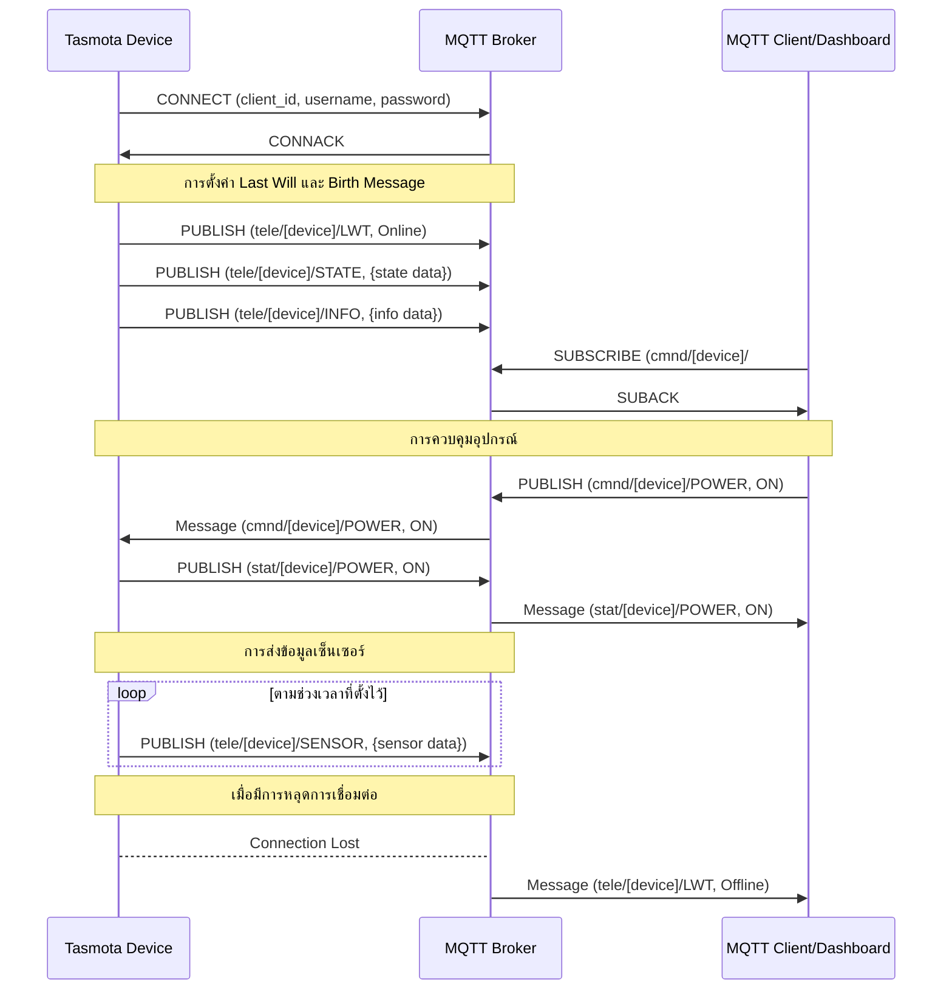
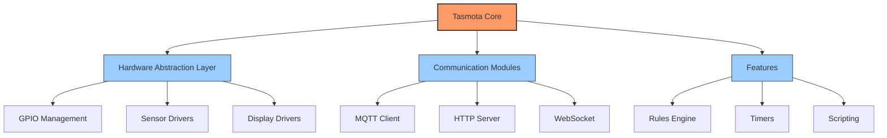

# บทที่ 2: การเชื่อมต่ออุปกรณ์

บทนี้ครอบคลุมวิธีการเชื่อมต่ออุปกรณ์ IoT กับ MQTT broker และการจัดการการส่งข้อมูล

## วัตถุประสงค์การเรียนรู้

- กำหนดค่าอุปกรณ์ IoT เพื่อเชื่อมต่อกับ MQTT Broker
- ใช้งานการส่งข้อมูลเซ็นเซอร์ผ่าน MQTT
- ทดสอบการเชื่อมต่อ WebSocket กับ MQTT Broker
- ส่งและรับข้อมูลผ่านไคลเอนต์ WebSocket
- จัดการลำดับชั้นของ Topic สำหรับอุปกรณ์ IoT หลายตัว
- กำหนดค่า Retained Message และ Will Message
- ตรวจสอบการเชื่อมต่อและดีบักการสื่อสาร
- แก้ไขปัญหาการเชื่อมต่อที่พบบ่อย
- ทำเวิร์คช็อปกับเซ็นเซอร์ IoT จริง
- เข้าใจและใช้งาน Tasmota firmware สำหรับอุปกรณ์ IoT

## หัวข้อที่ครอบคลุม

1. การกำหนดค่าอุปกรณ์เพื่อเชื่อมต่อกับ MQTT Broker
2. การส่งข้อมูลเซ็นเซอร์ (อุณหภูมิ, ความชื้น) ผ่าน MQTT
3. การทดสอบการเชื่อมต่อ WebSocket กับ MQTT Broker
4. การส่งและรับข้อมูลผ่านไคลเอนต์ WebSocket (เบราว์เซอร์/แอปพลิเคชันมือถือ)
5. การจัดการลำดับชั้นของ Topic สำหรับอุปกรณ์ IoT หลายตัว
6. การตั้งค่า Retained Message และ Will Message
7. การตรวจสอบการเชื่อมต่อและบันทึกการดีบัก
8. การแก้ไขปัญหาข้อผิดพลาดในการเชื่อมต่อ WebSocket และความขัดแย้งของ QoS
9. เวิร์คช็อป: การเชื่อมต่อเซ็นเซอร์ IoT จริงกับ MQTT/WebSocket
10. Tasmota: เฟิร์มแวร์สำเร็จรูปสำหรับอุปกรณ์ IoT

## Tasmota: เฟิร์มแวร์อเนกประสงค์สำหรับอุปกรณ์ IoT

### ที่มาและความเป็นมา

Tasmota (เดิมชื่อ Sonoff-Tasmota) เป็นเฟิร์มแวร์โอเพนซอร์สที่พัฒนาโดย Theo Arends และชุมชนนักพัฒนา ซึ่งเริ่มต้นในปี 2016 เพื่อเป็นทางเลือกในการใช้กับอุปกรณ์ Sonoff จากบริษัท ITEAD โดยมีจุดประสงค์เพื่อทดแทนเฟิร์มแวร์ดั้งเดิมที่มีข้อจำกัดและความกังวลด้านความปลอดภัย

ปัจจุบัน Tasmota ได้รับการพัฒนาให้สามารถใช้งานได้กับอุปกรณ์ IoT ที่ใช้ชิป ESP8266/ESP8285 หลากหลายรุ่นและผู้ผลิต ไม่ใช่เพียงแค่อุปกรณ์ Sonoff เท่านั้น ทำให้กลายเป็นหนึ่งในเฟิร์มแวร์ยอดนิยมสำหรับอุปกรณ์ IoT ในชุมชนสมาร์ทโฮมและโอเพนซอร์ส

### จุดเด่นของ Tasmota

```mermaid
graph TD
    A[Tasmota Features] --> B[การเชื่อมต่อเครือข่าย]
    A --> C[โปรโตคอลที่รองรับ]
    A --> D[ฮาร์ดแวร์ที่รองรับ]
    A --> E[ความปลอดภัย]
    A --> F[การปรับแต่ง]
    A --> G[การอัปเดต]
    
    B --> B1[WiFi Manager]
    B --> B2[Captive Portal]
    B --> B3[Fallback AP]
    
    C --> C1[MQTT]
    C --> C2[HTTP RESTful API]
    C --> C3[Web UI]
    C --> C4[KNX]
    
    D --> D1[รีเลย์/สวิตช์]
    D --> D2[เซ็นเซอร์หลากหลาย]
    D --> D3[แสงสว่าง LED/RGB]
    D --> D4[จอแสดงผล]
    
    E --> E1[การเข้ารหัส SSL/TLS]
    E --> E2[การยืนยันตัวตน]
    E --> E3[การอัปเดต OTA]
    
    F --> F1[Rules Engine]
    F --> F2[Templates]
    F --> F3[Berry Scripting]
    
    G --> G1[Web UI OTA]
    G --> G2[Serial OTA]
    G --> G3[Over-The-Air OTA]
    
    classDef highlight fill:#f9f,stroke:#333,stroke-width:2px
    class A highlight
```



1. **รองรับอุปกรณ์หลากหลาย**: สามารถใช้ได้กับอุปกรณ์ ESP8266/ESP8285 มากกว่า 300 รุ่น
2. **Web Interface ในตัว**: มีหน้าเว็บสำหรับควบคุมและตั้งค่าโดยไม่ต้องใช้แอปหรือซอฟต์แวร์เพิ่มเติม
3. **รองรับ MQTT**: เชื่อมต่อกับระบบ MQTT ได้อย่างง่ายดาย ทำให้เข้ากับระบบบ้านอัจฉริยะต่างๆ
4. **Over-The-Air Updates**: อัปเดตเฟิร์มแวร์แบบไร้สายได้
5. **Rules Engine**: ตั้งค่าเงื่อนไขการทำงานของอุปกรณ์ได้โดยไม่ต้องเขียนโค้ด
6. **ความปลอดภัยสูงขึ้น**: มีการออกแบบด้านความปลอดภัยที่ดีกว่าเฟิร์มแวร์ดั้งเดิม
7. **ชุมชนที่แข็งแกร่ง**: มีการพัฒนาอย่างต่อเนื่องและมีชุมชนคอยช่วยเหลือ
8. **Template System**: ช่วยให้รองรับอุปกรณ์ใหม่ๆ ได้ง่าย
9. **ทำงานแบบ Offline ได้**: ทำงานได้แม้เมื่อไม่มีอินเทอร์เน็ต
10. **ประหยัดพลังงาน**: มีฟีเจอร์ประหยัดพลังงานสำหรับอุปกรณ์ที่ทำงานบนแบตเตอรี่

### การทำงานของ Tasmota กับ MQTT

Tasmota ใช้ MQTT เป็นโปรโตคอลหลักในการสื่อสาร โดยมีรูปแบบการทำงานดังนี้:



#### โครงสร้าง MQTT Topic ของ Tasmota

Tasmota ใช้โครงสร้าง Topic ที่แบ่งเป็น 3 กลุ่มหลัก:

1. **cmnd**: สำหรับส่งคำสั่งไปยังอุปกรณ์ Tasmota
   - `cmnd/%prefix%/%topic%/POWER` - ควบคุมสถานะเปิด/ปิด
   - `cmnd/%prefix%/%topic%/STATUS` - ขอข้อมูลสถานะ

2. **stat**: สำหรับข้อมูลสถานะที่เปลี่ยนแปลงเมื่อได้รับคำสั่ง
   - `stat/%prefix%/%topic%/POWER` - รายงานสถานะเปิด/ปิด
   - `stat/%prefix%/%topic%/RESULT` - ผลลัพธ์ของคำสั่ง

3. **tele**: สำหรับข้อมูลที่ส่งตามช่วงเวลา
   - `tele/%prefix%/%topic%/STATE` - สถานะทั่วไปของอุปกรณ์
   - `tele/%prefix%/%topic%/SENSOR` - ข้อมูลจากเซ็นเซอร์
   - `tele/%prefix%/%topic%/INFO` - ข้อมูลระบบ
   - `tele/%prefix%/%topic%/LWT` - Last Will and Testament

โดย `%prefix%` คือค่าที่กำหนดในการตั้งค่า และ `%topic%` คือชื่อของอุปกรณ์

### เปรียบเทียบ Tasmota กับการเขียนโค้ดเอง

| คุณลักษณะ | Tasmota | การเขียนโค้ด ESP/Arduino เอง |
|----------|---------|--------------------------|
| **การติดตั้ง** | แฟลชไฟล์เฟิร์มแวร์เพียงครั้งเดียว | ต้องเขียนและอัปโหลดโค้ดใหม่ทุกครั้งที่มีการเปลี่ยนแปลง |
| **การตั้งค่า** | ผ่าน Web UI, MQTT, หรือ API | ต้องเขียนโค้ดใหม่และอัปโหลด |
| **ความยืดหยุ่น** | ปรับแต่งได้ระดับหนึ่งผ่าน Rules และ Templates | ปรับแต่งได้ไม่จำกัดตามต้องการ |
| **ความเสถียร** | ได้รับการทดสอบอย่างกว้างขวาง | ขึ้นอยู่กับคุณภาพโค้ดที่เขียน |
| **การอัปเดตเฟิร์มแวร์** | OTA ผ่าน Web UI | ต้องพัฒนาระบบ OTA เอง |
| **ฟีเจอร์พื้นฐาน** | มีพร้อมใช้งานทันที (MQTT, API, web server) | ต้องเขียนทุกฟีเจอร์ที่ต้องการ |
| **เหมาะสำหรับ** | ใช้งานทั่วไป, โปรเจคที่ต้องการความรวดเร็ว | โครงการที่ต้องการฟีเจอร์เฉพาะทางหรือมีความต้องการพิเศษ |
| **การแก้ไขปัญหา** | มีชุมชนให้ความช่วยเหลือ | ต้องแก้ไขปัญหาด้วยตนเอง |
| **การประหยัดพลังงาน** | มีฟีเจอร์พื้นฐาน | สามารถปรับแต่งละเอียดได้มากกว่า |
| **ขนาดโค้ด** | ใหญ่ แต่มีทุกฟีเจอร์ | เล็กกว่า เพราะรวมเฉพาะสิ่งที่จำเป็น |

### การติดตั้ง Tasmota

การติดตั้ง Tasmota มีหลายวิธี ซึ่งทั้งหมดมีเอกสารอธิบายอย่างละเอียดบนเว็บไซต์ทางการ:

- [Tasmota Installation Guide](https://tasmota.github.io/docs/Getting-Started/) - คู่มือทางการสำหรับการติดตั้ง Tasmota
- [Tasmota Web Installer](https://tasmota.github.io/install/) - เครื่องมือติดตั้งผ่านเว็บที่ง่ายที่สุด
- [Tasmotizer](https://github.com/tasmota/tasmotizer) - แอปพลิเคชันกราฟิกสำหรับติดตั้ง Tasmota

สำหรับรายละเอียดเพิ่มเติมเกี่ยวกับตัวเลือกการติดตั้งและวิธีแก้ไขปัญหา กรุณาดูที่ [เอกสารทางการ](https://tasmota.github.io/docs/)

### สถาปัตยกรรมของ Tasmota และความสำคัญในการศึกษา

Tasmota มีสถาปัตยกรรมที่น่าสนใจและเป็นกรณีศึกษาที่ดีสำหรับการพัฒนาเฟิร์มแวร์ IoT ด้วยเหตุผลหลายประการ:

#### โครงสร้างแบบโมดูลาร์ (Modular Architecture)



1. **การแยกส่วนอย่างชัดเจน**: Tasmota แบ่งโค้ดออกเป็นส่วนๆ ตามหน้าที่ ทำให้ง่ายต่อการบำรุงรักษาและพัฒนา
2. **Hardware Abstraction Layer**: มีการแยกชั้นฮาร์ดแวร์ออกจากโลจิกหลัก ทำให้รองรับฮาร์ดแวร์ได้หลากหลาย
3. **Plugin System**: ใช้ระบบปลั๊กอินสำหรับเซ็นเซอร์และฟีเจอร์ต่างๆ ทำให้เพิ่มความสามารถได้โดยไม่ต้องเปลี่ยนแปลงโค้ดหลัก

#### การจัดการทรัพยากรที่มีประสิทธิภาพ

Tasmota เป็นตัวอย่างที่ดีของการพัฒนาซอฟต์แวร์บนอุปกรณ์ที่มีทรัพยากรจำกัด:

1. **การจัดการหน่วยความจำ**: ใช้เทคนิคต่างๆ เพื่อลดการใช้ RAM เช่น PROGMEM สำหรับข้อความคงที่
2. **Event-Driven Architecture**: ใช้สถาปัตยกรรมแบบ event-driven เพื่อประสิทธิภาพและการตอบสนองที่ดี
3. **การประหยัดพลังงาน**: มีกลไกจัดการพลังงานสำหรับอุปกรณ์ที่ทำงานด้วยแบตเตอรี่

#### บทเรียนจากการศึกษา Tasmota

การศึกษา Tasmota มีประโยชน์อย่างมากสำหรับนักพัฒนา IoT เนื่องจาก:

1. **แนวทางปฏิบัติที่ดี**: เรียนรู้วิธีการจัดการปัญหาทั่วไปในการพัฒนา IoT
2. **การจัดการกับข้อจำกัด**: เห็นวิธีการทำงานภายใต้ข้อจำกัดของฮาร์ดแวร์และเครือข่าย
3. **Community-Driven Development**: เป็นตัวอย่างที่ดีของการพัฒนาโดยชุมชน การจัดการคำขอฟีเจอร์ และการแก้ไขบั๊ก
4. **การสร้างระบบที่ยืดหยุ่น**: การออกแบบที่รองรับอุปกรณ์หลากหลายโดยไม่ต้องเขียนโค้ดใหม่ทั้งหมด
5. **การปรับสมดุลระหว่างความยืดหยุ่นและความง่าย**: การสร้างระบบที่ผู้ใช้ทั่วไปสามารถปรับแต่งได้ แต่ยังคงใช้งานง่าย

### การตั้งค่า Tasmota เพื่อเชื่อมต่อกับ MQTT

1. **เชื่อมต่อ WiFi**: เมื่อติดตั้งแล้ว Tasmota จะสร้าง AP ชื่อ `tasmota_XXXXXX`
   - เชื่อมต่อกับ AP นั้น และเข้าสู่ IP 192.168.4.1
   - ตั้งค่า WiFi ของคุณ

2. **ตั้งค่า MQTT**:
   - เข้าสู่ Web UI ของ Tasmota (IP ที่ได้จาก router)
   - ไปที่ "Configuration" > "MQTT"
   - กรอกข้อมูล:
     - Host: IP หรือ hostname ของ MQTT broker
     - Port: 1883 (หรือพอร์ตที่ตั้งค่าไว้)
     - User: username สำหรับ MQTT (ถ้ามี)
     - Password: password สำหรับ MQTT (ถ้ามี)
     - Topic: ชื่อที่ต้องการใช้สำหรับอุปกรณ์

3. **ตั้งค่า Template**: หากใช้กับอุปกรณ์ที่ไม่ใช่ Sonoff มาตรฐาน
   - ไปที่ "Configuration" > "Template"
   - เลือก template ที่ตรงกับอุปกรณ์ของคุณ หรือสร้างใหม่

### ตัวอย่างการควบคุม Tasmota ผ่าน MQTT

#### การเปิด/ปิดรีเลย์:

```
# ส่งคำสั่งเปิด
mosquitto_pub -h 192.168.1.100 -t "cmnd/tasmota_device/POWER" -m "ON"

# ส่งคำสั่งปิด
mosquitto_pub -h 192.168.1.100 -t "cmnd/tasmota_device/POWER" -m "OFF"

# ตรวจสอบสถานะ
mosquitto_pub -h 192.168.1.100 -t "cmnd/tasmota_device/STATUS" -m ""
```

#### การรับข้อมูลเซ็นเซอร์:

```
# รับข้อมูลทั้งหมด
mosquitto_sub -h 192.168.1.100 -t "tele/tasmota_device/#" -v

# รับเฉพาะข้อมูลเซ็นเซอร์
mosquitto_sub -h 192.168.1.100 -t "tele/tasmota_device/SENSOR" -v
```

### แนวปฏิบัติที่ดีในการใช้งาน Tasmota

1. **ตั้งชื่อ Device Topic ให้มีความหมาย**: เช่น `bedroom_light`, `living_room_sensor`
2. **ใช้ Full Topic ที่ไม่ซ้ำกัน**: กรณีมีอุปกรณ์หลายตัว
3. **ตั้งค่า Telemetry Period**: ปรับค่าตามความเหมาะสมเพื่อลดปริมาณข้อมูล
4. **สำรองการตั้งค่า**: หลังจากตั้งค่าเสร็จสมบูรณ์
5. **อัปเดตเฟิร์มแวร์สม่ำเสมอ**: เพื่อรับฟีเจอร์ใหม่และแก้ไขข้อบกพร่อง
6. **ใช้ Rules Engine**: สำหรับตั้งค่าการทำงานอัตโนมัติโดยไม่ต้องพึ่งระบบภายนอก

## เครื่องมือสำหรับการแก้ไขปัญหา

1. **MQTT Explorer**: เครื่องมือกราฟิกที่ช่วยในการตรวจสอบ topics และข้อความที่ส่งผ่าน MQTT
2. **mosquitto_sub/mosquitto_pub**: เครื่องมือคำสั่งสำหรับการทดสอบการรับ/ส่งข้อความ MQTT
3. **Wireshark**: เครื่องมือวิเคราะห์เครือข่ายที่สามารถจับและวิเคราะห์แพ็กเก็ต MQTT
4. **Serial Monitor**: ใช้ Serial Monitor ของ Arduino IDE เพื่อดู log จากอุปกรณ์

### รายการตรวจสอบการแก้ไขปัญหา (Troubleshooting Checklist)

- **การเชื่อมต่อเครือข่าย**:
  - อุปกรณ์เชื่อมต่อกับ WiFi หรือไม่?
  - IP ของ MQTT broker ถูกต้องหรือไม่?
  - ไฟร์วอลล์บล็อกพอร์ต MQTT (1883/8883) หรือไม่?

- **การเชื่อมต่อ MQTT**:
  - Client ID ถูกต้องและไม่ซ้ำกันหรือไม่?
  - username/password ถูกต้องหรือไม่?
  - ค่า keepalive timeout เหมาะสมหรือไม่?

- **การส่งและรับข้อความ**:
  - ชื่อ topics ถูกต้องหรือไม่? (คำนึงถึงตัวพิมพ์ใหญ่/เล็ก)
  - ค่า QoS ถูกต้องหรือไม่?
  - ขนาดข้อความไม่เกินขีดจำกัดหรือไม่?

- **ปัญหาเฉพาะของอุปกรณ์**:
  - ระดับแบตเตอรี่เพียงพอหรือไม่?
  - หน่วยความจำเพียงพอหรือไม่?
  - อุปกรณ์รีสตาร์ทบ่อยเกินไปหรือไม่?


## แนวปฏิบัติที่ดีสำหรับการเชื่อมต่ออุปกรณ์ IoT

เมื่อพัฒนาอุปกรณ์ IoT ที่เชื่อมต่อกับ MQTT broker แนวปฏิบัติที่ดีเหล่านี้จะช่วยให้ระบบของคุณมีประสิทธิภาพและเสถียรมากขึ้น

### 1. ความเสถียรและความทนทาน

- **ใช้ Watchdog Timer**: ป้องกันการค้างของอุปกรณ์ด้วยการรีสตาร์ทอัตโนมัติเมื่อโปรแกรมไม่ตอบสนอง
- **เพิ่มกลไกป้องกันการรีบูตวนซ้ำ**: นับจำนวนการรีบูตและเข้าสู่โหมด "safe mode" หากรีบูตบ่อยเกินไป
- **บัฟเฟอร์ข้อมูล**: เก็บข้อมูลไว้ก่อนหากไม่สามารถส่งได้ทันที
- **ตั้งค่า keepalive ที่เหมาะสม**: ช่วยตรวจจับการขาดการเชื่อมต่อได้รวดเร็ว

### 2. ความเป็นส่วนตัวและความปลอดภัย

- **เข้ารหัสข้อมูลที่สำคัญ**: โดยเฉพาะข้อมูลส่วนบุคคลหรือข้อมูลที่ใช้เพื่อการยืนยันตัวตน
- **การพิสูจน์ตัวตน**: ใช้ username/password หรือ client certificates
- **อัปเดตเฟิร์มแวร์**: มีกลไกสำหรับอัปเดตเฟิร์มแวร์เพื่อแก้ไขช่องโหว่ด้านความปลอดภัย
- **ป้องกันแผงควบคุม**: ระมัดระวังการเปิด debug port หรือ serial interface ที่ไม่มีการป้องกัน

### 3. ประสิทธิภาพการใช้พลังงาน

- **ลดความถี่ในการส่งข้อมูล**: ส่งเฉพาะเมื่อมีการเปลี่ยนแปลงที่มีนัยสำคัญ
- **ใช้ Sleep Modes อย่างมีประสิทธิภาพ**: เลือกโหมด sleep ที่เหมาะสมกับความต้องการ
- **ปิดฟีเจอร์ที่ไม่ได้ใช้**: ปิดส่วนประกอบฮาร์ดแวร์ที่ไม่จำเป็น เช่น LED หรือ WiFi เมื่อไม่ใช้
- **เลือก QoS ระดับต่ำ**: สำหรับข้อมูลที่ไม่สำคัญมาก ใช้ QoS 0 เพื่อประหยัดพลังงาน

### 4. การจัดการข้อมูล

- **ใช้รูปแบบข้อมูลที่มีประสิทธิภาพ**: JSON เป็นที่นิยม แต่ Protocol Buffers หรือ CBOR ประหยัดมากกว่า
- **ตรวจสอบความถูกต้อง**: ตรวจสอบข้อมูลก่อนส่งเพื่อป้องกันข้อมูลผิดพลาด
- **กำหนดโครงสร้างข้อมูลที่ชัดเจน**: สร้างรูปแบบข้อมูลที่คงเส้นคงวาและเข้าใจได้
- **คำนึงถึงเขตเวลา**: ใช้ UTC หรือระบุเขตเวลาเสมอเมื่อบันทึกเวลา

### 5. การออกแบบระบบ

- **เตรียมพร้อมสำหรับการขยาย**: ออกแบบให้รองรับอุปกรณ์เพิ่มเติมในอนาคต
- **ตั้งชื่อ topics ให้เป็นระบบ**: ใช้โครงสร้างที่เข้าใจง่ายและสอดคล้องกันทั่วทั้งระบบ
- **มีแผนรับมือข้อผิดพลาด**: วางแผนรับมือกรณีที่ broker ล่มหรือการเชื่อมต่อล้มเหลว
- **ทดสอบในสภาพแวดล้อมจริง**: ทดสอบในสภาวะที่คล้ายกับการใช้งานจริงให้มากที่สุด


### ไลบรารีและเครื่องมือ

- [PubSubClient](https://github.com/knolleary/pubsubclient) - ไลบรารี MQTT สำหรับ Arduino/ESP8266
- [AsyncMqttClient](https://github.com/marvinroger/async-mqtt-client) - MQTT client แบบ asynchronous สำหรับ ESP8266/ESP32
- [ArduinoJson](https://arduinojson.org/) - ไลบรารีสำหรับทำงานกับ JSON บนไมโครคอนโทรลเลอร์
- [MQTT Explorer](http://mqtt-explorer.com/) - GUI tool สำหรับตรวจสอบ MQTT topics และข้อความ
- [Tasmota](https://tasmota.github.io/) - เฟิร์มแวร์สำเร็จรูปสำหรับอุปกรณ์ ESP8266/ESP8285
- [ESPHome](https://esphome.io/) - ทางเลือกอีกทางสำหรับเฟิร์มแวร์อุปกรณ์ IoT
- [ESP8266 Arduino Core](https://github.com/esp8266/Arduino) - ESP8266 core สำหรับ Arduino IDE
- [ESP32 Arduino Core](https://github.com/espressif/arduino-esp32) - ESP32 core สำหรับ Arduino IDE

### เอกสารอ้างอิง

- [MQTT Specification](http://docs.oasis-open.org/mqtt/mqtt/v3.1.1/os/mqtt-v3.1.1-os.html)
- [Tasmota Documentation](https://tasmota.github.io/docs/)
- [ESP8266 SDK API Reference](https://www.espressif.com/sites/default/files/documentation/2c-esp8266_non_os_sdk_api_reference_en.pdf)
- [ESP32 Technical Reference Manual](https://www.espressif.com/sites/default/files/documentation/esp32_technical_reference_manual_en.pdf)

### คอร์สและบทความแนะนำ

- Tasmota Official Website: https://tasmota.github.io/
- Espressif Systems Website: https://www.espressif.com/
- Arduino Project Hub: https://create.arduino.cc/projecthub
- Hackaday: https://hackaday.io/
- Instructables: https://www.instructables.com/

---

## RACKSYNC CO., LTD.

[RACKSYNC](https://github.com/racksync) เป็นบริษัทที่มีความเชี่ยวชาญในการพัฒนาโซลูชั่นด้าน IoT และระบบอัตโนมัติ เรามุ่งมั่นในการสร้างเทคโนโลยีที่เชื่อมต่อโลกเข้าด้วยกันผ่านระบบ IoT ที่มีประสิทธิภาพและเสถียร

### บริการของเรา
- การออกแบบและพัฒนาระบบ IoT แบบครบวงจร
- โซลูชั่นเชื่อมต่อสำหรับอุตสาหกรรม 4.0
- ระบบอัตโนมัติสำหรับบ้านและอาคารอัจฉริยะ
- การฝึกอบรมและเวิร์คช็อปด้าน IoT

ติดตามโปรเจกต์และอัปเดตได้ที่ [GitHub](https://github.com/racksync)

© 2007-2025 RACKSYNC CO., LTD. All rights reserved.
