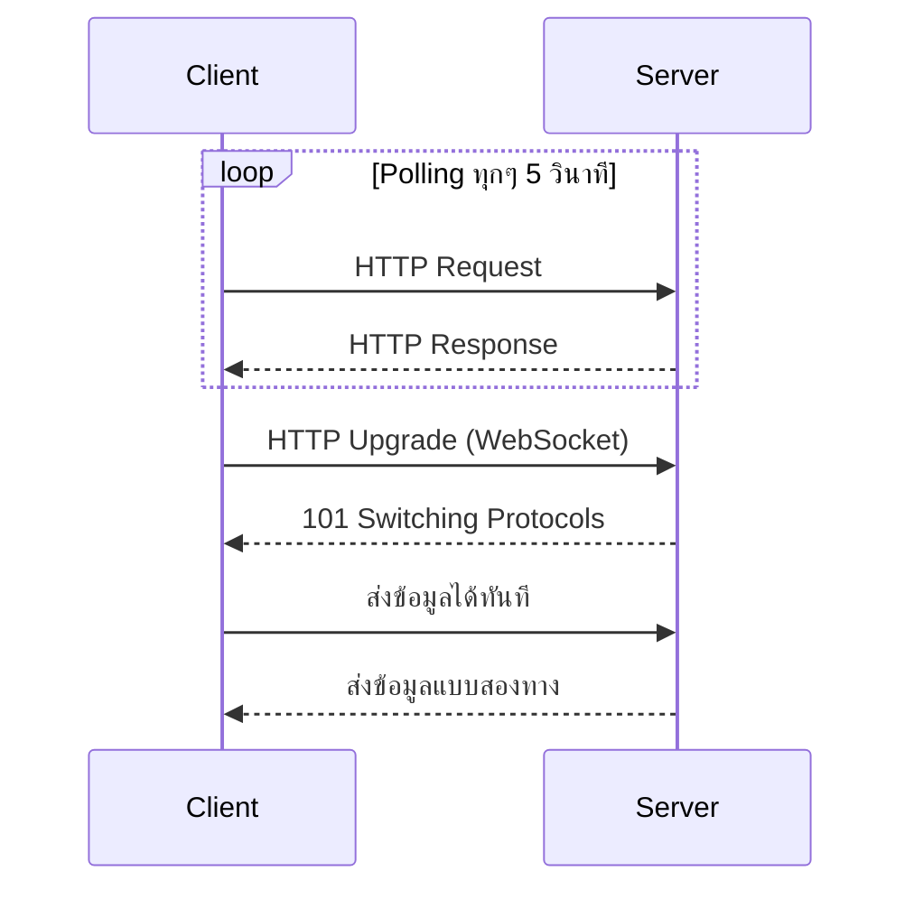
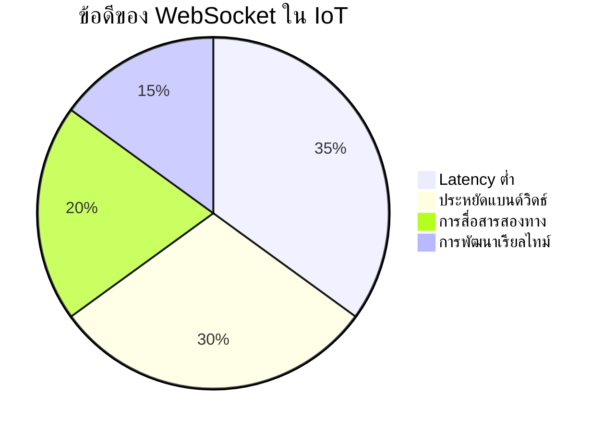
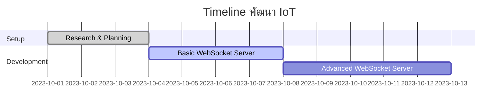
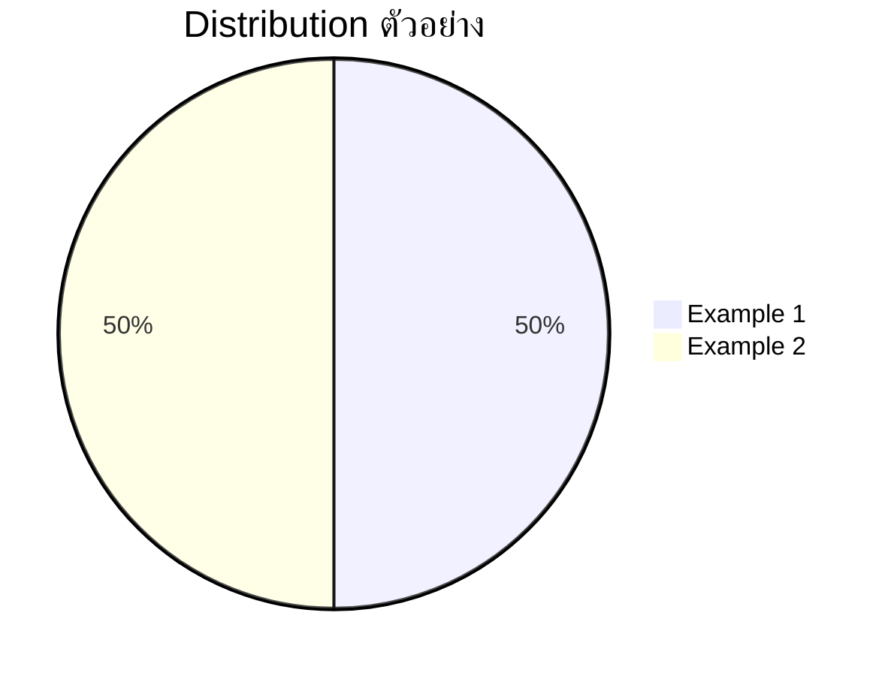

# บทที่ 3: WebSocket สำหรับ IoT - การสื่อสารแบบเรียลไทม์กับ Node-RED

| รายละเอียด         | คำอธิบาย                                                     |
|---------------------|----------------------------------------------------------------|
| **ชื่อเนื้อหา**     | WebSocket สำหรับ IoT - การสื่อสารแบบเรียลไทม์                  |
| **วัตถุประสงค์**    | เรียนรู้การใช้งาน WebSocket สำหรับการสื่อสารแบบเรียลไทม์ใน Node-RED |
| **ระดับความยาก**    | ปานกลาง [⭑⭑⭑]                                               |
| **เวลา**           | 60 นาที                                        |
| **สิ่งที่ต้องเตรียม** | Node-RED, Web browser, Node.js                               |
| **ความรู้พื้นฐาน**  | JavaScript, WebSocket API, Node.js พื้นฐาน                    |

## บทนำ
WebSocket เป็นโปรโตคอลสำหรับการสื่อสารแบบ full-duplex บน TCP ซึ่งช่วยให้สามารถส่งและรับข้อมูลในเวลาเดียวกันได้อย่างต่อเนื่อง  
ในระบบ IoT, WebSocket มีบทบาทสำคัญในการเชื่อมต่ออุปกรณ์กับแพลตฟอร์ม Node-RED เพื่อแสดงผลข้อมูลแบบเรียลไทม์และควบคุมอุปกรณ์

## ความสำคัญของ WebSocket ใน IoT
- **ลด Latency**: สื่อสารข้อมูลได้ทันที โดยไม่ต้องรอการร้องขอซ้ำเหมือน HTTP Polling  
- **ประหยัดแบนด์วิดธ์**: ใช้การเชื่อมต่อที่เปิดอยู่ตลอด ทำให้ลด overhead ของ HTTP header  
- **สนับสนุนการสื่อสารสองทาง**: ทั้งฝั่ง client และ server สามารถส่งข้อมูลไปมาได้พร้อมกัน

## สถาปัตยกรรมการเชื่อมต่อ WebSocket ใน Node-RED
การทำงานของ WebSocket ภายใน Node-RED สามารถมองเห็นภาพรวมได้ด้วย diagram ดังนี้


## เปรียบเทียบ WebSocket กับ HTTP Polling

- **HTTP Polling**: ต้องส่ง request ซ้ำๆ ส่งผลให้เกิด latency และ overhead สูง  
- **WebSocket**: เปิด connection เพียงครั้งเดียว แล้วส่งข้อมูลได้ทันที

## ประโยชน์และการประยุกต์ใช้ใน IoT

- **Latency ต่ำ**: ส่งข้อมูลทันที  
- **ประหยัดแบนด์วิดธ์**: Connection ค้างไว้ไม่ต้องส่ง header ซ้ำ  
- **การสื่อสารสองทาง**: เหมาะสำหรับแดชบอร์ดและระบบควบคุม  
- **การพัฒนาเรียลไทม์**: รองรับแอปพลิเคชันที่ต้องแสดงผลแบบทันที

## การนำไปใช้ใน Node-RED
- ใช้โหนด `websocket in` และ `websocket out` เพื่อตั้งค่าเชื่อมต่อ WebSocket  
- สามารถผสานกับโหนด MQTT เพื่อรับส่งข้อมูลจากอุปกรณ์ IoT  
- ปรับแต่ง flow ใน Node-RED เพื่อสร้าง Dashboard ที่มีการแสดงข้อมูลแบบเรียลไทม์จาก WebSocket

## ตัวอย่างการใช้งาน WebSocket ด้วย Node.js

มีตัวอย่างการใช้งาน WebSocket ด้วย Node.js ดังนี้:

1. ตัวอย่างพื้นฐาน  
   แสดงวิธีการตั้งค่าเซิร์ฟเวอร์และรับส่งข้อมูลระหว่าง client กับ server
   ```javascript
   // Example 1: Basic WebSocket Server using ws
   const WebSocket = require('ws');
   const wss = new WebSocket.Server({ port: 8080 });

   wss.on('connection', function(ws) {
     console.log('Client connected');
     ws.on('message', function(message) {
       console.log('Received: ' + message);
     });
     ws.send('Hello from Node.js server');
   });
   ```

2. ตัวอย่างขั้นสูง: Broadcast & Heartbeat  
   แสดงวิธีกระจายข้อความให้กับ client ทั้งหมดและใช้ heartbeat เพื่อตรวจสอบการเชื่อมต่อ
   ```javascript
   // Example 2: Broadcast and Heartbeat WebSocket Server
   const WebSocket = require('ws');
   const wss = new WebSocket.Server({ port: 8081 });

   // Broadcast function: ส่งข้อความไปยัง client ทุกตัว
   function broadcast(data) {
     wss.clients.forEach(function(client) {
       if (client.readyState === WebSocket.OPEN) {
         client.send(data);
       }
     });
   }

   // Heartbeat: ping ทุก 30 วินาทีเพื่อเช็คการเชื่อมต่อ
   function heartbeat() {
     wss.clients.forEach(function(client) {
       if (client.readyState === WebSocket.OPEN) {
         client.ping();
       }
     });
   }
   setInterval(heartbeat, 30000);

   wss.on('connection', function(ws) {
     console.log('Client connected on advanced server');
     ws.on('message', function(message) {
       console.log('Received: ' + message);
       // ส่งข้อความให้ทุก client
       broadcast('Broadcast: ' + message);
     });
     ws.send('Welcome to advanced WebSocket server');
   });
   ```

## ไดอะแกรมเพิ่มเติม





## สรุป
WebSocket เป็นเครื่องมือสำคัญที่ทำให้การพัฒนาระบบ IoT ด้วย Node-RED เป็นไปอย่างราบรื่น โดยการสื่อสารแบบเรียลไทม์และประหยัดทรัพยากร  
เนื้อหานี้ได้แสดงตัวอย่างการใช้งาน WebSocket เบื้องต้นและขั้นสูง พร้อมทั้งแผนภาพทางการพัฒนาและสัดส่วนของตัวอย่างเพื่อให้เข้าใจภาพรวมได้ดียิ่งขึ้น

## แหล่งอ้างอิง WebSocket

- [MDN Web Docs: WebSocket](https://developer.mozilla.org/en-US/docs/Web/API/WebSockets_API) - เอกสารอ้างอิงพื้นฐานเกี่ยวกับ WebSocket API
- [RFC 6455: The WebSocket Protocol](https://datatracker.ietf.org/doc/html/rfc6455) - มาตรฐาน WebSocket Protocol จาก IETF
- [Node.js ws: WebSocket library](https://github.com/websockets/ws) - ไลบรารี WebSocket ที่นิยมใช้ใน Node.js
- [Socket.IO Documentation](https://socket.io/docs/v4/) - ไลบรารีที่สร้างบน WebSocket เพิ่มความสามารถและความเสถียร
- [Node-RED Socket.io Server](https://flows.nodered.org/node/node-red-contrib-socketio) - โหนด Node-RED สำหรับการใช้งาน Socket.IO
- [WebSocket Security Best Practices](https://devcenter.heroku.com/articles/websocket-security) - แนวทางการรักษาความปลอดภัยสำหรับ WebSocket
- [WebSocket Performance Considerations](https://buildkite.com/blog/websocket-performance) - การพิจารณาประสิทธิภาพของ WebSocket


## แหล่งข้อมูลที่น่าสนใจ


- [IoT for Beginners Curriculum](https://github.com/microsoft/IoT-For-Beginners) - หลักสูตร IoT สำหรับผู้เริ่มต้นจาก Microsoft
- [Real-Time Web Applications with WebSockets](https://www.oreilly.com/library/view/real-time-web-applications/9781788629690/) - หนังสือเกี่ยวกับการพัฒนาเว็บแอปพลิเคชันแบบเรียลไทม์ด้วย WebSocket

---
## RACKSYNC CO., LTD.

[RACKSYNC](https://github.com/racksync) เป็นบริษัทที่มีความเชี่ยวชาญในการพัฒนาโซลูชั่นด้าน IoT และระบบอัตโนมัติ เรามุ่งมั่นในการสร้างเทคโนโลยีที่เชื่อมต่อโลกเข้าด้วยกันผ่านระบบ IoT ที่มีประสิทธิภาพและเสถียร

### บริการของเรา
- การออกแบบและพัฒนาระบบ IoT แบบครบวงจร
- โซลูชั่นเชื่อมต่อสำหรับอุตสาหกรรม 4.0
- ระบบอัตโนมัติสำหรับบ้านและอาคารอัจฉริยะ
- การฝึกอบรมและเวิร์คช็อปด้าน IoT

ติดตามโปรเจกต์และอัปเดตได้ที่ [GitHub](https://github.com/racksync)

© 2007-2025 RACKSYNC CO., LTD. All rights reserved.
