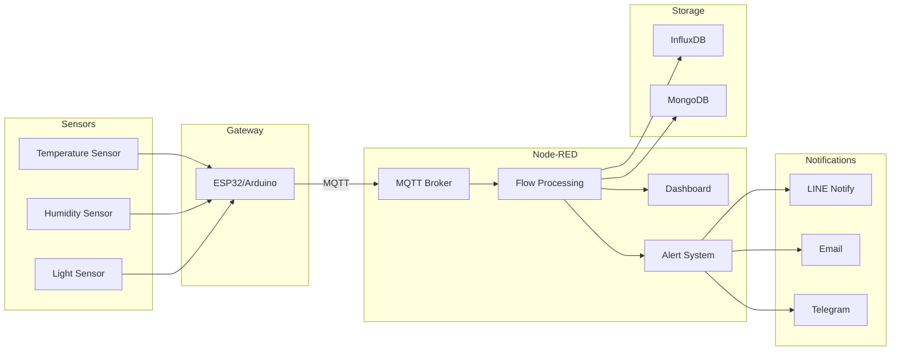
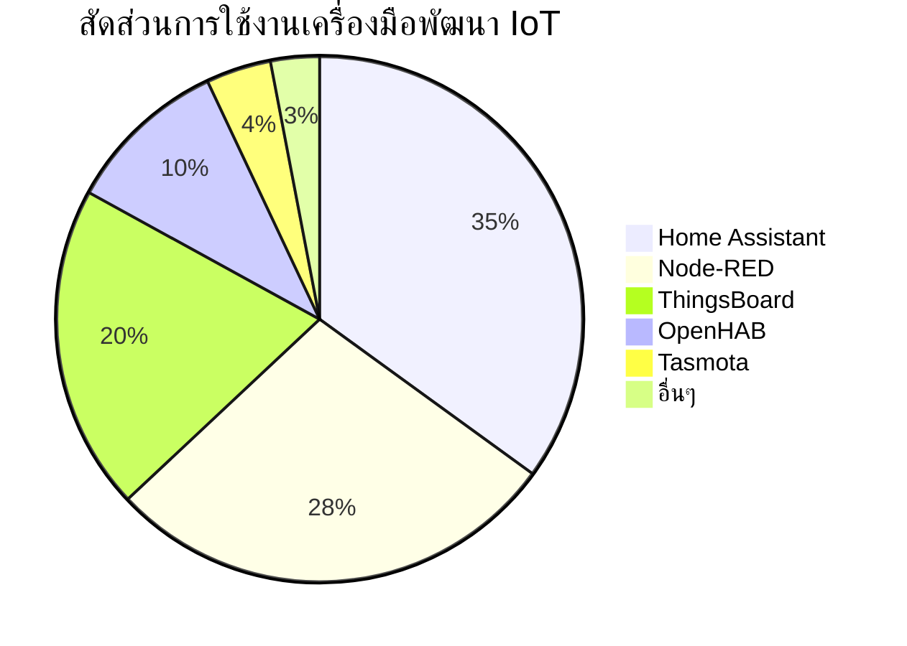
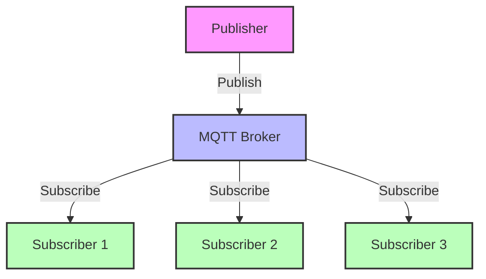
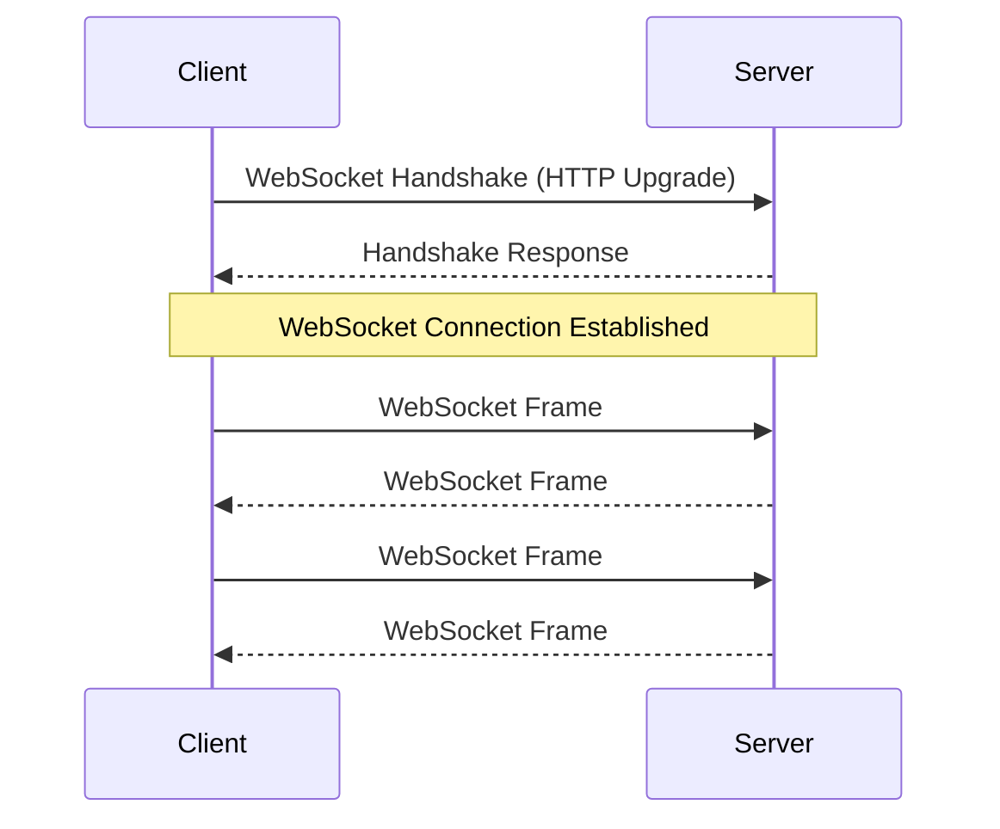
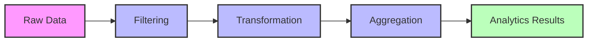
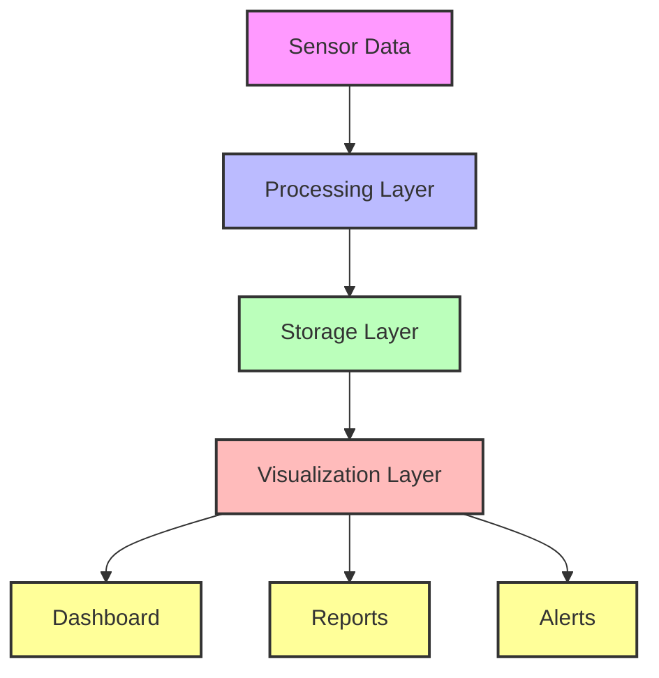

# บทที่ 3: การจัดการและวิเคราะห์ด้วย Node-RED

| รายละเอียด | คำอธิบาย |
|----------|---------|
| **ชื่อเนื้อหา** | การจัดการและวิเคราะห์ด้วย Node-RED |
| **วัตถุประสงค์** | เรียนรู้การใช้ Node-RED ในการจัดการข้อมูล IoT |
| **ระดับความยาก** | ปานกลาง [⭑⭑] |
| **เวลา** | 60 นาที - 90 นาที |
| **สิ่งที่ต้องเตรียม** | Node-RED, MQTT Broker, เซ็นเซอร์พื้นฐาน |
| **ความรู้พื้นฐาน** | พื้นฐาน MQTT, JavaScript เบื้องต้น |

## วัตถุประสงค์การเรียนรู้

- ติดตั้งและกำหนดค่า Node-RED
- เพิ่มและกำหนดค่าโหนด MQTT และ WebSocket
- ดึงข้อมูลจาก MQTT Broker และ WebSocket
- สร้างแดชบอร์ดแบบเรียลไทม์ด้วย Node-RED
- ออกแบบแดชบอร์ดขั้นสูงด้วยวิดเจ็ตต่างๆ
- แปลงข้อมูล MQTT สำหรับการส่งผ่าน WebSocket
- ตั้งค่าระบบแจ้งเตือนสำหรับการเตือนเมื่อค่าเซ็นเซอร์เกินเกณฑ์
- ผสานรวมกับบริการแจ้งเตือนภายนอก
- จัดเก็บข้อมูลเซ็นเซอร์ในฐานข้อมูล
- สร้างระบบอัตโนมัติสำหรับ IoT โดยใช้ MQTT และ WebSocket
- ทำการวิเคราะห์ข้อมูลเบื้องต้น

## หัวข้อที่ครอบคลุม

1. การติดตั้งและกำหนดค่า Node-RED
2. การเพิ่มโหนด MQTT และ WebSocket
3. การดึงข้อมูลจาก MQTT Broker และ WebSocket
4. การสร้างแดชบอร์ดแบบเรียลไทม์ด้วย Node-RED Dashboard
5. เวิร์คช็อป: การออกแบบแดชบอร์ดขั้นสูง (กราฟ, เกจวัด, โหนดเทมเพลต UI)
6. การแปลงข้อมูล MQTT สำหรับการส่งผ่าน WebSocket
7. การตั้งค่าระบบแจ้งเตือนเมื่อเซ็นเซอร์เกินค่าที่กำหนด
8. การส่งการแจ้งเตือนผ่าน LINE Notify, อีเมล หรือ Telegram
9. การจัดเก็บข้อมูลเซ็นเซอร์ในฐานข้อมูล (InfluxDB, MongoDB) หรือระบบคลาวด์
10. การกำหนดค่าระบบอัตโนมัติสำหรับระบบ IoT โดยใช้ MQTT และ WebSocket
11. เวิร์คช็อป: การวิเคราะห์ข้อมูลเบื้องต้น (การสืบค้นและการส่งออกข้อมูล)

## ทรัพยากร

- การติดตั้ง Node-RED
- โหนดแดชบอร์ด
- ตัวเชื่อมต่อฐานข้อมูล (InfluxDB, MongoDB)
- โหนดบริการแจ้งเตือน

## ทฤษฎีและแนวคิด

### Node-RED คืออะไร?
Node-RED เป็นเครื่องมือโปรแกรมมิ่งแบบ Flow-based ที่พัฒนาโดย IBM ช่วยให้นักพัฒนาสามารถเชื่อมต่ออุปกรณ์ฮาร์ดแวร์, API และบริการออนไลน์ได้อย่างง่ายดายผ่านอินเทอร์เฟซแบบกราฟิก การทำงานใน Node-RED จะอยู่ในรูปแบบของ "flows" ที่เชื่อมต่อโหนดต่างๆ เข้าด้วยกัน

### แผนผังการเชื่อมต่อระบบ


### เปรียบเทียบเครื่องมือพัฒนา IoT

| คุณสมบัติ | Node-RED | ThingsBoard | Home Assistant |
|----------|----------|-------------|----------------|
| **ประเภทซอฟต์แวร์** | Flow-based Programming | IoT Platform | Home Automation Platform |
| **การติดตั้ง** | ง่าย (Node.js based) | ปานกลาง (Java based) | ง่าย (Python based) |
| **UI Builder** | ✅ Dashboard nodes | ✅ Widget System | ✅ Lovelace UI |
| **MQTT Support** | ✅ Native | ✅ Native | ✅ Add-on |
| **Scripting** | JavaScript | JavaScript, Java | Python, YAML |
| **Data Storage** | Flexible (Various DBs) | Built-in Cassandra/PostgreSQL | SQLite, MariaDB |
| **Rule Engine** | Flow-based | Advanced Rule Chain | Automation YAML |
| **Custom Extensions** | Node packages | Plugin System | Custom Components |
| **Community Support** | ใหญ่มาก | ใหญ่ | ใหญ่มาก |
| **Learning Curve** | ต่ำ | ปานกลาง | ปานกลาง |
| **Enterprise Features** | Limited | ✅ Professional Edition | Limited |
| **Cloud Option** | Manual Setup | ✅ Cloud Edition | Nabu Casa |
| **Real-time Analytics** | ✅ Basic | ✅ Advanced | ✅ Basic |
| **เหมาะสำหรับ** | Rapid Prototyping, Education | Enterprise IoT | Smart Home |

### ส่วนแบ่งตลาดเครื่องมือพัฒนา IoT (2023)

การเลือกใช้เครื่องมือพัฒนา IoT ขึ้นอยู่กับความต้องการและขนาดของโครงการ โดยมีสัดส่วนการใช้งานดังนี้:



- **Home Assistant (35%)**: เป็นที่นิยมในกลุ่มผู้ใช้งานบ้านอัจฉริยะและนักพัฒนามือสมัครเล่น
- **Node-RED (28%)**: ได้รับความนิยมในการพัฒนาต้นแบบและการศึกษา
- **ThingsBoard (20%)**: เหมาะสำหรับการใช้งานระดับองค์กรและอุตสาหกรรม
- **OpenHAB (10%)**: ทางเลือกที่ดีสำหรับระบบบ้านอัจฉริยะแบบ Open Source
- **Tasmota (4%)**: นิยมใช้กับอุปกรณ์ ESP8266/ESP32
- **อื่นๆ (3%)**: รวมถึง Domoticz, ioBroker และอื่นๆ

### MQTT และ WebSocket
- **MQTT (Message Queuing Telemetry Transport)**
  - โปรโตคอลการสื่อสารแบบ publish-subscribe
  - เหมาะสำหรับอุปกรณ์ IoT ที่มีข้อจำกัดด้านแบนด์วิดธ์และพลังงาน
  - รองรับการสื่อสารแบบ QoS (Quality of Service) หลายระดับ
    - QoS 0: ส่งครั้งเดียว ไม่รับประกันการส่ง
    - QoS 1: ส่งอย่างน้อยหนึ่งครั้ง รับประกันการส่ง
    - QoS 2: ส่งหนึ่งครั้ง รับประกันการส่งและลำดับข้อความ



- **WebSocket**
  - โปรโตคอลการสื่อสารแบบ full-duplex บน TCP
  - เหมาะสำหรับการสื่อสารแบบ real-time ระหว่างเบราว์เซอร์และเซิร์ฟเวอร์
  - ลดภาระการเชื่อมต่อเมื่อเทียบกับ HTTP polling
  - ข้อดีของ WebSocket:
    - ลดการใช้แบนด์วิดธ์
    - ลด latency
    - รองรับการส่งข้อมูลแบบ bi-directional
    - เหมาะสำหรับแอปพลิเคชันแบบ real-time



### การวิเคราะห์ข้อมูล IoT
1. **การประมวลผลข้อมูลแบบ Real-time**
   - การกรองข้อมูล (Filtering)
     - กรองค่าผิดปกติ (Outliers)
     - กรองสัญญาณรบกวน (Noise)
   - การแปลงข้อมูล (Transformation)
     - แปลงหน่วยวัด
     - ปรับค่าให้อยู่ในช่วงที่ต้องการ
   - การรวมข้อมูล (Aggregation)
     - คำนวณค่าเฉลี่ย
     - หาค่าสูงสุด/ต่ำสุด
     - นับจำนวนเหตุการณ์



2. **การจัดเก็บข้อมูล**
   - Time-series Database
     - InfluxDB
     - TimescaleDB
   - Document Database
     - MongoDB
     - CouchDB
   - Cloud Storage
     - AWS IoT Analytics
     - Azure IoT Hub

3. **การแสดงผลข้อมูล**
   - การสร้างกราฟแบบ real-time
     - Line charts
     - Bar charts
     - Gauge charts
   - การแสดงผลผ่าน dashboard
     - แผงควบคุม
     - การแสดงสถานะ
   - การส่งออกรายงาน
     - รายงานประจำวัน/เดือน
     - การวิเคราะห์แนวโน้ม



## ตัวอย่าง Node-RED Flows และการประยุกต์ใช้งาน

### 1. การอ่านข้อมูลเซนเซอร์ผ่าน MQTT
```json
[
    {
        "id": "sensor_flow1",
        "type": "mqtt in",
        "topic": "sensor/temperature",
        "broker": "localhost",
        "x": 150,
        "y": 100
    },
    {
        "id": "process1",
        "type": "function",
        "func": "msg.payload = JSON.parse(msg.payload);\nreturn msg;",
        "x": 300,
        "y": 100
    },
    {
        "id": "display1",
        "type": "debug",
        "x": 450,
        "y": 100
    }
]
```
**หลักการ**: รับข้อมูลอุณหภูมิจาก MQTT broker และแปลงเป็น JSON
**การใช้งาน**: เหมาะสำหรับการเริ่มต้นทำความเข้าใจการรับข้อมูล MQTT
**ผลลัพธ์**: แสดงค่าอุณหภูมิใน debug panel

### 2. การสร้างแดชบอร์ดแสดงอุณหภูมิและความชื้น
```json
[
    {
        "id": "dashboard_temp",
        "type": "ui_gauge",
        "group": "Home",
        "name": "Temperature",
        "format": "{{value}}°C",
        "min": 0,
        "max": 50
    },
    {
        "id": "dashboard_humid",
        "type": "ui_chart",
        "group": "Home",
        "name": "Humidity",
        "tab": "home",
        "charts": ["line"]
    }
]
```
**หลักการ**: แสดงข้อมูลแบบ real-time ด้วย gauge และกราฟ
**การใช้งาน**: สร้างหน้าควบคุมสำหรับมอนิเตอร์สภาพแวดล้อม
**ผลลัพธ์**: แดชบอร์ดที่แสดงอุณหภูมิและความชื้นแบบ real-time

### 3. ระบบแจ้งเตือนผ่าน LINE Notify
```json
[
    {
        "id": "temp_monitor",
        "type": "mqtt in",
        "topic": "sensor/temperature",
        "broker": "localhost"
    },
    {
        "id": "threshold_check",
        "type": "switch",
        "rules": [{"t": "gt", "v": "30"}],
        "property": "payload"
    },
    {
        "id": "line_notify",
        "type": "line-notify",
        "token": "YOUR_LINE_TOKEN",
        "message": "อุณหภูมิเกินกำหนด: {{payload}}°C"
    }
]
```
**หลักการ**: ตรวจสอบอุณหภูมิและส่งแจ้งเตือนผ่าน LINE เมื่อเกิน 30°C
**การใช้งาน**: ระบบเตือนภัยสำหรับห้องเซิร์ฟเวอร์
**ผลลัพธ์**: ข้อความแจ้งเตือนใน LINE เมื่ออุณหภูมิสูงเกิน

### 4. การบันทึกข้อมูลลง InfluxDB
```json
[
    {
        "id": "sensor_data",
        "type": "mqtt in",
        "topic": "sensors/#"
    },
    {
        "id": "format_data",
        "type": "function",
        "func": "return {\n    payload: [{\n        measurement: 'sensors',\n        fields: { value: msg.payload },\n        tags: { sensor: msg.topic.split('/')[1] }\n    }]\n}"
    },
    {
        "id": "influxdb_out",
        "type": "influxdb out",
        "database": "sensors_db",
        "name": "InfluxDB Storage"
    }
]
```
**หลักการ**: เก็บข้อมูลเซนเซอร์ในฐานข้อมูล time-series
**การใช้งาน**: ระบบจัดเก็บข้อมูลระยะยาวสำหรับวิเคราะห์
**ผลลัพธ์**: ข้อมูลถูกบันทึกใน InfluxDB พร้อมสำหรับการวิเคราะห์

### 5. การควบคุมอุปกรณ์ผ่าน WebSocket
```json
[
    {
        "id": "ws_in",
        "type": "websocket in",
        "path": "/control"
    },
    {
        "id": "command_parser",
        "type": "function",
        "func": "return { topic: 'device/control', payload: msg.payload }"
    },
    {
        "id": "mqtt_out",
        "type": "mqtt out",
        "topic": "device/control"
    }
]
```
**หลักการ**: รับคำสั่งผ่าน WebSocket และส่งต่อไปยัง MQTT
**การใช้งาน**: ระบบควบคุมอุปกรณ์ผ่านเว็บแอพ
**ผลลัพธ์**: สามารถควบคุมอุปกรณ์ผ่านเว็บบราวเซอร์

### 6. การประมวลผลข้อมูลแบบ Batch
```json
[
    {
        "id": "collect_data",
        "type": "batch",
        "mode": "count",
        "count": "10",
        "overlap": "0"
    },
    {
        "id": "calculate_avg",
        "type": "function",
        "func": "var sum = msg.payload.reduce((a,b) => a + b.value, 0);\nreturn {payload: sum/msg.payload.length}"
    },
    {
        "id": "store_result",
        "type": "file",
        "filename": "averages.csv"
    }
]
```
**หลักการ**: รวบรวมข้อมูล 10 ค่าแล้วหาค่าเฉลี่ย
**การใช้งาน**: การวิเคราะห์แนวโน้มข้อมูล
**ผลลัพธ์**: บันทึกค่าเฉลี่ยลงไฟล์ CSV

### 7. ระบบตรวจจับความผิดปกติ
```json
[
    {
        "id": "anomaly_check",
        "type": "function",
        "func": "var stdDev = 2.5;\nvar mean = 25;\nvar value = msg.payload;\nif (Math.abs(value - mean) > stdDev) {\n    return {payload: true};\n}\nreturn null;"
    },
    {
        "id": "alert_trigger",
        "type": "trigger",
        "duration": "5",
        "units": "minute"
    },
    {
        "id": "notify_admin",
        "type": "email"
    }
]
```
**หลักการ**: ใช้ statistical analysis ตรวจจับค่าผิดปกติ
**การใช้งาน**: ระบบเฝ้าระวังความผิดปกติของเครื่องจักร
**ผลลัพธ์**: ส่งอีเมลแจ้งเตือนเมื่อพบความผิดปกติ

### 8. การสร้างรายงานอัตโนมัติ
```json
[
    {
        "id": "daily_trigger",
        "type": "cron",
        "cron": "0 0 * * *"
    },
    {
        "id": "generate_report",
        "type": "template",
        "template": "Daily Report\n{{payload}}"
    },
    {
        "id": "pdf_creator",
        "type": "pdf",
        "filename": "report.pdf"
    }
]
```
**หลักการ**: สร้างรายงาน PDF อัตโนมัติทุกวัน
**การใช้งาน**: รายงานประจำวันสำหรับผู้บริหาร
**ผลลัพธ์**: ไฟล์ PDF รายงานประจำวัน

### 9. การควบคุมไฟอัตโนมัติตามแสง
```json
[
    {
        "id": "light_sensor",
        "type": "mqtt in",
        "topic": "sensor/light"
    },
    {
        "id": "light_control",
        "type": "switch",
        "rules": [
            {"t": "lt", "v": "100"},
            {"t": "gte", "v": "100"}
        ]
    },
    {
        "id": "light_command",
        "type": "mqtt out",
        "topic": "light/control"
    }
]
```
**หลักการ**: ควบคุมไฟอัตโนมัติตามความสว่าง
**การใช้งาน**: ระบบไฟอัตโนมัติในอาคาร
**ผลลัพธ์**: ไฟเปิด-ปิดอัตโนมัติตามแสงธรรมชาติ

### 10. การจัดการพลังงานอัจฉริยะ
```json
[
    {
        "id": "power_monitor",
        "type": "mqtt in",
        "topic": "power/#"
    },
    {
        "id": "power_optimize",
        "type": "function",
        "func": "var threshold = 5000;\nif (msg.payload > threshold) {\n    return {payload: 'reduce_power'};\n}"
    },
    {
        "id": "device_control",
        "type": "mqtt out",
        "topic": "device/power"
    }
]
```
**หลักการ**: ควบคุมการใช้พลังงานให้ไม่เกินขีดจำกัด
**การใช้งาน**: ระบบจัดการพลังงานในอาคาร
**ผลลัพธ์**: ลดการใช้พลังงานอัตโนมัติ

### 11. ระบบนับจำนวนคนผ่าน IoT
```json
[
    {
        "id": "ir_sensor",
        "type": "mqtt in",
        "topic": "sensor/ir"
    },
    {
        "id": "counter",
        "type": "function",
        "func": "global.count = (global.count || 0) + 1;\nreturn {payload: global.count}"
    },
    {
        "id": "display",
        "type": "ui_text",
        "group": "Statistics"
    }
]
```
**หลักการ**: นับจำนวนคนผ่านเซนเซอร์ IR
**การใช้งาน**: ระบบนับจำนวนผู้เข้าชมนิทรรศการ
**ผลลัพธ์**: แสดงจำนวนคนบนแดชบอร์ด

### 12. การเชื่อมต่อกับ Google Sheets
```json
[
    {
        "id": "collect_data",
        "type": "mqtt in",
        "topic": "sensors/all"
    },
    {
        "id": "format_sheet",
        "type": "function",
        "func": "return { payload: { spreadsheetId: 'YOUR_SHEET_ID', range: 'A:C', values: [[new Date(), msg.topic, msg.payload]] }}"
    },
    {
        "id": "google_sheets",
        "type": "google-sheets",
        "operation": "append"
    }
]
```
**หลักการ**: บันทึกข้อมูลเซนเซอร์ลง Google Sheets
**การใช้งาน**: การเก็บข้อมูลสำหรับวิเคราะห์ภายหลัง
**ผลลัพธ์**: ข้อมูลถูกเพิ่มใน Google Sheets อัตโนมัติ

## RACKSYNC CO., LTD.

[RACKSYNC](https://github.com/racksync) เป็นบริษัทที่มีความเชี่ยวชาญในการพัฒนาโซลูชั่นด้าน IoT และระบบอัตโนมัติ เรามุ่งมั่นในการสร้างเทคโนโลยีที่เชื่อมต่อโลกเข้าด้วยกันผ่านระบบ IoT ที่มีประสิทธิภาพและเสถียร

### บริการของเรา
- การออกแบบและพัฒนาระบบ IoT แบบครบวงจร
- โซลูชั่นเชื่อมต่อสำหรับอุตสาหกรรม 4.0
- ระบบอัตโนมัติสำหรับบ้านและอาคารอัจฉริยะ
- การฝึกอบรมและเวิร์คช็อปด้าน IoT

ติดตามโปรเจกต์และอัปเดตได้ที่ [GitHub](https://github.com/racksync)

© 2007-2025 RACKSYNC CO., LTD. All rights reserved.

