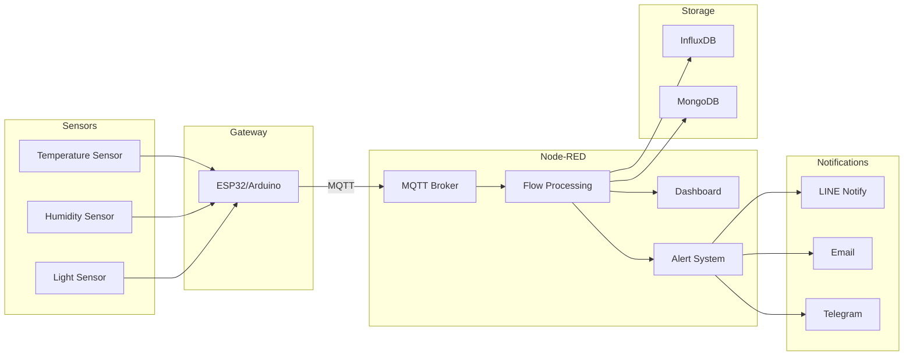
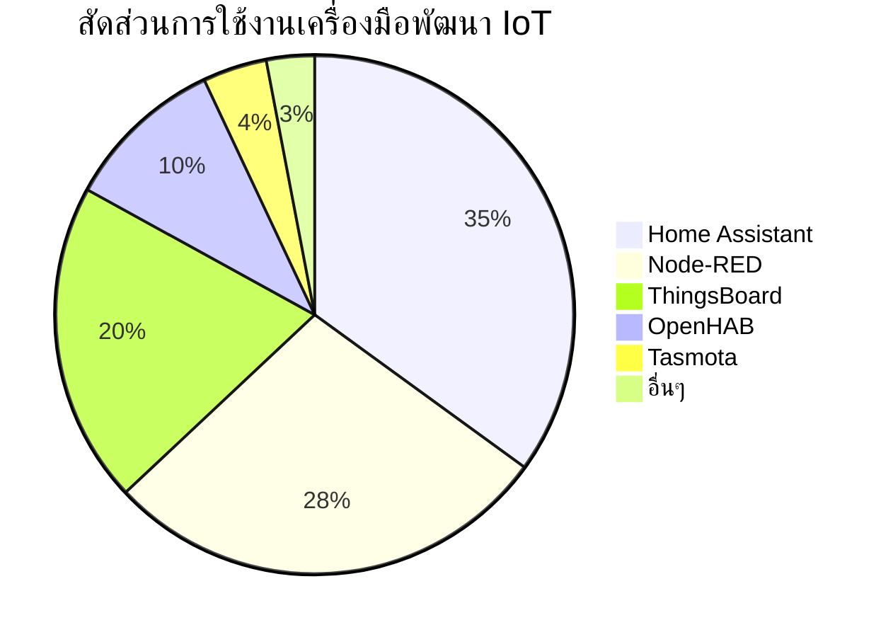
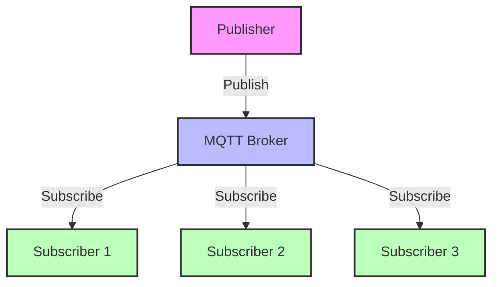
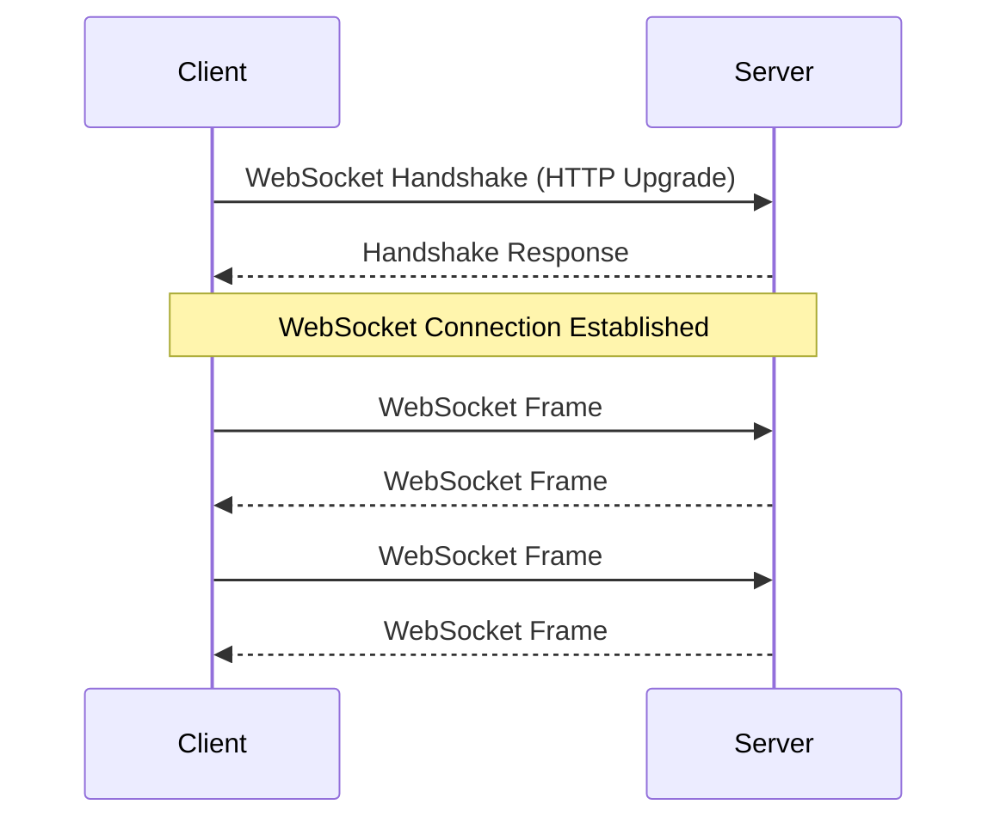
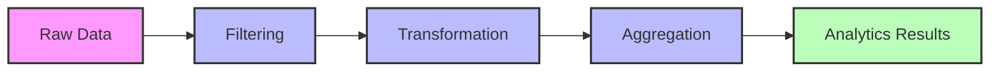
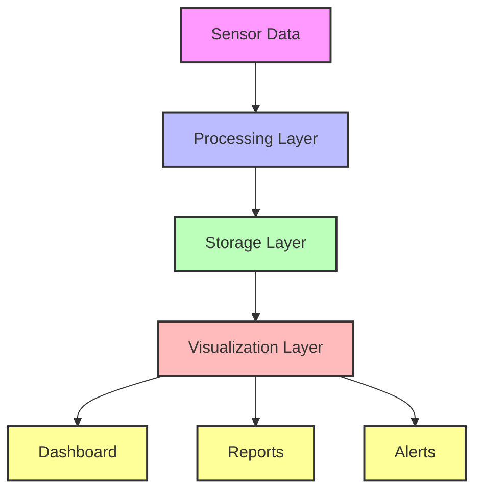

# บทที่ 3: การจัดการและวิเคราะห์ด้วย Node-RED

บทนี้สำรวจวิธีการใช้ Node-RED ในการรวบรวม ประมวลผล แสดงผล และทำงานกับข้อมูล IoT

## วัตถุประสงค์การเรียนรู้

- ติดตั้งและกำหนดค่า Node-RED
- เพิ่มและกำหนดค่าโหนด MQTT และ WebSocket
- ดึงข้อมูลจาก MQTT Broker และ WebSocket
- สร้างแดชบอร์ดแบบเรียลไทม์ด้วย Node-RED
- ออกแบบแดชบอร์ดขั้นสูงด้วยวิดเจ็ตต่างๆ
- แปลงข้อมูล MQTT สำหรับการส่งผ่าน WebSocket
- ตั้งค่าระบบแจ้งเตือนสำหรับการเตือนเมื่อค่าเซ็นเซอร์เกินเกณฑ์
- ผสานรวมกับบริการแจ้งเตือนภายนอก
- จัดเก็บข้อมูลเซ็นเซอร์ในฐานข้อมูล
- สร้างระบบอัตโนมัติสำหรับ IoT โดยใช้ MQTT และ WebSocket
- ทำการวิเคราะห์ข้อมูลเบื้องต้น

## หัวข้อที่ครอบคลุม

1. การติดตั้งและกำหนดค่า Node-RED
2. การเพิ่มโหนด MQTT และ WebSocket
3. การดึงข้อมูลจาก MQTT Broker และ WebSocket
4. การสร้างแดชบอร์ดแบบเรียลไทม์ด้วย Node-RED Dashboard
5. เวิร์คช็อป: การออกแบบแดชบอร์ดขั้นสูง (กราฟ, เกจวัด, โหนดเทมเพลต UI)
6. การแปลงข้อมูล MQTT สำหรับการส่งผ่าน WebSocket
7. การตั้งค่าระบบแจ้งเตือนเมื่อเซ็นเซอร์เกินค่าที่กำหนด
8. การส่งการแจ้งเตือนผ่าน LINE Notify, อีเมล หรือ Telegram
9. การจัดเก็บข้อมูลเซ็นเซอร์ในฐานข้อมูล (InfluxDB, MongoDB) หรือระบบคลาวด์
10. การกำหนดค่าระบบอัตโนมัติสำหรับระบบ IoT โดยใช้ MQTT และ WebSocket
11. เวิร์คช็อป: การวิเคราะห์ข้อมูลเบื้องต้น (การสืบค้นและการส่งออกข้อมูล)

## ทรัพยากร

- การติดตั้ง Node-RED
- โหนดแดชบอร์ด
- ตัวเชื่อมต่อฐานข้อมูล (InfluxDB, MongoDB)
- โหนดบริการแจ้งเตือน

## ทฤษฎีและแนวคิด

### Node-RED คืออะไร?
Node-RED เป็นเครื่องมือโปรแกรมมิ่งแบบ Flow-based ที่พัฒนาโดย IBM ช่วยให้นักพัฒนาสามารถเชื่อมต่ออุปกรณ์ฮาร์ดแวร์, API และบริการออนไลน์ได้อย่างง่ายดายผ่านอินเทอร์เฟซแบบกราฟิก การทำงานใน Node-RED จะอยู่ในรูปแบบของ "flows" ที่เชื่อมต่อโหนดต่างๆ เข้าด้วยกัน

### แผนผังการเชื่อมต่อระบบ

### เปรียบเทียบเครื่องมือพัฒนา IoT

| คุณสมบัติ | Node-RED | ThingsBoard | Home Assistant |
|----------|----------|-------------|----------------|
| **ประเภทซอฟต์แวร์** | Flow-based Programming | IoT Platform | Home Automation Platform |
| **การติดตั้ง** | ง่าย (Node.js based) | ปานกลาง (Java based) | ง่าย (Python based) |
| **UI Builder** | ✅ Dashboard nodes | ✅ Widget System | ✅ Lovelace UI |
| **MQTT Support** | ✅ Native | ✅ Native | ✅ Add-on |
| **Scripting** | JavaScript | JavaScript, Java | Python, YAML |
| **Data Storage** | Flexible (Various DBs) | Built-in Cassandra/PostgreSQL | SQLite, MariaDB |
| **Rule Engine** | Flow-based | Advanced Rule Chain | Automation YAML |
| **Custom Extensions** | Node packages | Plugin System | Custom Components |
| **Community Support** | ใหญ่มาก | ใหญ่ | ใหญ่มาก |
| **Learning Curve** | ต่ำ | ปานกลาง | ปานกลาง |
| **Enterprise Features** | Limited | ✅ Professional Edition | Limited |
| **Cloud Option** | Manual Setup | ✅ Cloud Edition | Nabu Casa |
| **Real-time Analytics** | ✅ Basic | ✅ Advanced | ✅ Basic |
| **เหมาะสำหรับ** | Rapid Prototyping, Education | Enterprise IoT | Smart Home |

### ส่วนแบ่งตลาดเครื่องมือพัฒนา IoT (2023)

การเลือกใช้เครื่องมือพัฒนา IoT ขึ้นอยู่กับความต้องการและขนาดของโครงการ โดยมีสัดส่วนการใช้งานดังนี้:

- **Home Assistant (35%)**: เป็นที่นิยมในกลุ่มผู้ใช้งานบ้านอัจฉริยะและนักพัฒนามือสมัครเล่น
- **Node-RED (28%)**: ได้รับความนิยมในการพัฒนาต้นแบบและการศึกษา
- **ThingsBoard (20%)**: เหมาะสำหรับการใช้งานระดับองค์กรและอุตสาหกรรม
- **OpenHAB (10%)**: ทางเลือกที่ดีสำหรับระบบบ้านอัจฉริยะแบบ Open Source
- **Tasmota (4%)**: นิยมใช้กับอุปกรณ์ ESP8266/ESP32
- **อื่นๆ (3%)**: รวมถึง Domoticz, ioBroker และอื่นๆ

### MQTT และ WebSocket
- **MQTT (Message Queuing Telemetry Transport)**
  - โปรโตคอลการสื่อสารแบบ publish-subscribe
  - เหมาะสำหรับอุปกรณ์ IoT ที่มีข้อจำกัดด้านแบนด์วิดธ์และพลังงาน
  - รองรับการสื่อสารแบบ QoS (Quality of Service) หลายระดับ
    - QoS 0: ส่งครั้งเดียว ไม่รับประกันการส่ง
    - QoS 1: ส่งอย่างน้อยหนึ่งครั้ง รับประกันการส่ง
    - QoS 2: ส่งหนึ่งครั้ง รับประกันการส่งและลำดับข้อความ

- **WebSocket**
  - โปรโตคอลการสื่อสารแบบ full-duplex บน TCP
  - เหมาะสำหรับการสื่อสารแบบ real-time ระหว่างเบราว์เซอร์และเซิร์ฟเวอร์
  - ลดภาระการเชื่อมต่อเมื่อเทียบกับ HTTP polling
  - ข้อดีของ WebSocket:
    - ลดการใช้แบนด์วิดธ์
    - ลด latency
    - รองรับการส่งข้อมูลแบบ bi-directional
    - เหมาะสำหรับแอปพลิเคชันแบบ real-time

### การวิเคราะห์ข้อมูล IoT
1. **การประมวลผลข้อมูลแบบ Real-time**
   - การกรองข้อมูล (Filtering)
     - กรองค่าผิดปกติ (Outliers)
     - กรองสัญญาณรบกวน (Noise)
   - การแปลงข้อมูล (Transformation)
     - แปลงหน่วยวัด
     - ปรับค่าให้อยู่ในช่วงที่ต้องการ
   - การรวมข้อมูล (Aggregation)
     - คำนวณค่าเฉลี่ย
     - หาค่าสูงสุด/ต่ำสุด
     - นับจำนวนเหตุการณ์

2. **การจัดเก็บข้อมูล**
   - Time-series Database
     - InfluxDB
     - TimescaleDB
   - Document Database
     - MongoDB
     - CouchDB
   - Cloud Storage
     - AWS IoT Analytics
     - Azure IoT Hub

3. **การแสดงผลข้อมูล**
   - การสร้างกราฟแบบ real-time
     - Line charts
     - Bar charts
     - Gauge charts
   - การแสดงผลผ่าน dashboard
     - แผงควบคุม
     - การแสดงสถานะ
   - การส่งออกรายงาน
     - รายงานประจำวัน/เดือน
     - การวิเคราะห์แนวโน้ม

## RACKSYNC CO., LTD.

[RACKSYNC](https://github.com/racksync) เป็นบริษัทที่มีความเชี่ยวชาญในการพัฒนาโซลูชั่นด้าน IoT และระบบอัตโนมัติ เรามุ่งมั่นในการสร้างเทคโนโลยีที่เชื่อมต่อโลกเข้าด้วยกันผ่านระบบ IoT ที่มีประสิทธิภาพและเสถียร

### บริการของเรา
- การออกแบบและพัฒนาระบบ IoT แบบครบวงจร
- โซลูชั่นเชื่อมต่อสำหรับอุตสาหกรรม 4.0
- ระบบอัตโนมัติสำหรับบ้านและอาคารอัจฉริยะ
- การฝึกอบรมและเวิร์คช็อปด้าน IoT

ติดตามโปรเจกต์และอัปเดตได้ที่ [GitHub](https://github.com/racksync)

© 2007-2025 RACKSYNC CO., LTD. All rights reserved.

