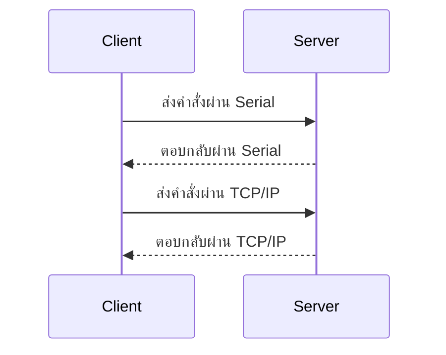
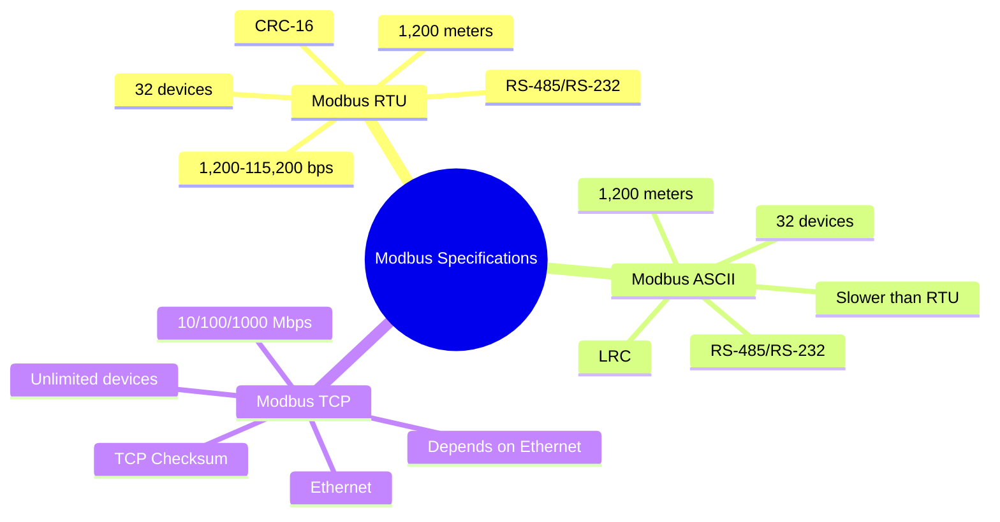
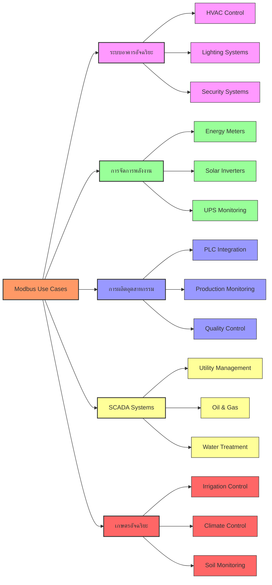
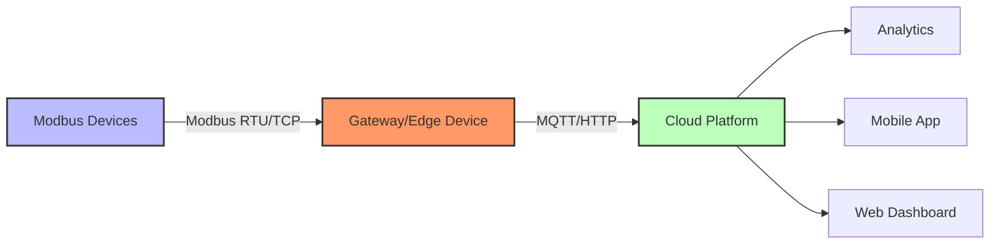
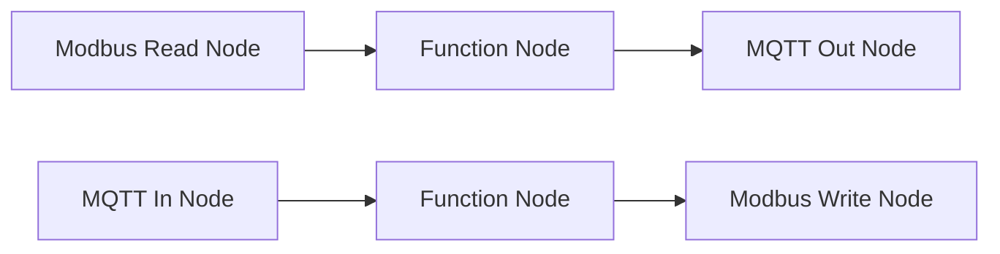
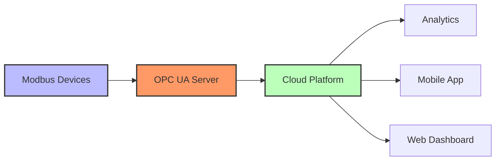

# บทที่ 4: Modbus สำหรับ IoT - การสื่อสารในระบบอุตสาหกรรม

| รายละเอียด         | คำอธิบาย                                                     |
|---------------------|----------------------------------------------------------------|
| **ชื่อเนื้อหา**     | การใช้งาน Modbus ในระบบ IoT                                   |
| **วัตถุประสงค์**    | เรียนรู้การใช้งาน Modbus สำหรับการสื่อสารในระบบอุตสาหกรรม   |
| **ระดับความยาก**    | ปานกลาง [⭑⭑⭑]                                               |
| **เวลา**           | 30 นาที                                            |
| **สิ่งที่ต้องเตรียม** | PLC, Modbus RTU/TCP, Node-RED, Modbus Simulator               |
| **ความรู้พื้นฐาน**  | พื้นฐานการสื่อสารแบบ Serial, TCP/IP, การเขียนโปรแกรมเบื้องต้น |

## บทนำ
Modbus เป็นโปรโตคอลการสื่อสารที่ใช้กันอย่างแพร่หลายในระบบอุตสาหกรรมสำหรับการเชื่อมต่ออุปกรณ์ต่างๆ เช่น PLC, เซ็นเซอร์, และอุปกรณ์ควบคุมอื่นๆ

## ความสำคัญของ Modbus ใน IoT
- **ความเสถียร**: ใช้ในระบบอุตสาหกรรมมานาน มีความน่าเชื่อถือสูง
- **ความเข้ากันได้**: รองรับอุปกรณ์หลากหลายจากผู้ผลิตต่างๆ
- **การใช้งานง่าย**: โครงสร้างโปรโตคอลเรียบง่าย เข้าใจง่าย

## สถาปัตยกรรมการเชื่อมต่อ Modbus ใน Node-RED
การทำงานของ Modbus ภายใน Node-RED สามารถมองเห็นภาพรวมได้ด้วย diagram ดังนี้

```mermaid
flowchart LR
    A[PLC/อุปกรณ์ Modbus] -->|ส่งข้อมูล| B[Node-RED Flow]
    B --> C[Node Modbus Out]
    C --> D[แดชบอร์ด/ระบบควบคุม]
    D -- รับข้อมูลแบบเรียลไทม์ --> C
    note right of D: การแสดงผลข้อมูลแบบทันที
```

## เปรียบเทียบ Modbus RTU กับ Modbus TCP

- **Modbus RTU**: ใช้การสื่อสารผ่าน Serial (RS-485) เหมาะสำหรับการเชื่อมต่อระยะใกล้
- **Modbus TCP**: ใช้การสื่อสารผ่าน TCP/IP เหมาะสำหรับการเชื่อมต่อผ่านเครือข่าย

## สเปคและระยะทางของ Modbus

### Modbus RTU
- **สื่อกลาง**: RS-485, RS-232
- **ความเร็ว**: 1,200 - 115,200 bps (ทั่วไปใช้ 9,600 bps)
- **ระยะทาง**: สูงสุด 1,200 เมตร (RS-485)
- **จำนวนอุปกรณ์**: สูงสุด 32 อุปกรณ์ต่อสาย (RS-485)
- **การตรวจสอบข้อผิดพลาด**: CRC-16

### Modbus ASCII
- **สื่อกลาง**: RS-485, RS-232
- **ความเร็ว**: ช้ากว่า Modbus RTU
- **ระยะทาง**: สูงสุด 1,200 เมตร (RS-485)
- **จำนวนอุปกรณ์**: สูงสุด 32 อุปกรณ์ต่อสาย (RS-485)
- **การตรวจสอบข้อผิดพลาด**: LRC

### Modbus TCP
- **สื่อกลาง**: Ethernet
- **ความเร็ว**: 10/100/1000 Mbps (ตาม Ethernet)
- **ระยะทาง**: ขึ้นอยู่กับเครือข่าย Ethernet
- **จำนวนอุปกรณ์**: ไม่จำกัด (ขึ้นอยู่กับเครือข่าย)
- **การตรวจสอบข้อผิดพลาด**: TCP Checksum



## กรณีการใช้งาน Modbus ในระบบต่างๆ



### 1. ระบบอาคารอัจฉริยะ (Building Automation)

ในอาคารอัฉริยะ Modbus ถูกใช้เพื่อควบคุมและตรวจสอบ:

- **HVAC Systems**: การควบคุมอุณหภูมิ ความชื้น และการระบายอากาศ
- **Lighting Control**: การควบคุมระบบแสงสว่างอัตโนมัติ
- **Access Control**: การควบคุมประตูและระบบความปลอดภัย
- **Energy Management**: การตรวจสอบและจัดการการใช้พลังงาน

ตัวอย่าง: อาคารสำนักงานใช้ Modbus เพื่อเชื่อมต่อระบบทำความเย็นกับระบบจัดการอาคารส่วนกลาง โดยสามารถปรับอุณหภูมิตามจำนวนคนในแต่ละพื้นที่ได้โดยอัตโนมัติ

### 2. การจัดการพลังงาน (Energy Management)

Modbus ถูกใช้อย่างแพร่หลายในการจัดการพลังงาน:

- **Energy Meters**: การอ่านค่าการใช้ไฟฟ้าแบบเรียลไทม์
- **UPS Systems**: การตรวจสอบสถานะแบตเตอรี่และการทำงาน
- **Solar Inverters**: การตรวจสอบการผลิตไฟฟ้าจากแผงโซลาร์เซลล์
- **Grid Management**: การจัดการระบบจ่ายไฟฟ้า

ตัวอย่าง: โรงงานที่ติดตั้งระบบโซลาร์เซลล์ ใช้ Modbus เชื่อมต่อ inverters เพื่อติดตามการผลิตไฟฟ้าและปรับการใช้พลังงานให้เหมาะสม

### 3. การผลิตอุตสาหกรรม (Industrial Manufacturing)

ในโรงงานอุตสาหกรรม Modbus ใช้ในการควบคุมเครื่องจักรและกระบวนการผลิต:

- **Assembly Lines**: การควบคุมสายการผลิตอัตโนมัติ
- **Quality Control**: การตรวจสอบคุณภาพผลิตภัณฑ์
- **Material Handling**: การจัดการวัตถุดิบและสินค้า
- **Process Control**: การควบคุมกระบวนการผลิต

ตัวอย่าง: โรงงานผลิตอาหารใช้ Modbus เชื่อมต่อเซ็นเซอร์อุณหภูมิและความชื้น เพื่อควบคุมสภาพแวดล้อมให้เหมาะสมกับการผลิต

### 4. SCADA Systems

SCADA (Supervisory Control and Data Acquisition) ใช้ Modbus เป็นหลักในการเชื่อมต่ออุปกรณ์ภาคสนาม:

- **Water Management**: การจัดการระบบน้ำประปา
- **Oil & Gas**: การตรวจสอบและควบคุมท่อส่งน้ำมันและแก๊ส
- **Power Distribution**: การจัดการระบบจ่ายไฟฟ้า
- **Railway Systems**: การควบคุมระบบรถไฟ

ตัวอย่าง: ระบบบำบัดน้ำเสียใช้ Modbus เชื่อมต่อปั๊ม, วาล์ว และเซ็นเซอร์ต่างๆ เข้ากับระบบควบคุมส่วนกลาง เพื่อตรวจสอบและควบคุมกระบวนการบำบัด

### 5. เกษตรอัจฉริยะ (Smart Agriculture)

ระบบเกษตรอัจฉริยะใช้ Modbus เพื่อจัดการและควบคุม:

- **Irrigation Systems**: การควบคุมระบบให้น้ำอัตโนมัติ
- **Climate Control**: การควบคุมอุณหภูมิและความชื้นในโรงเรือน
- **Soil Monitoring**: การตรวจสอบความชื้นและสารอาหารในดิน
- **Livestock Monitoring**: การติดตามสุขภาพและพฤติกรรมของสัตว์เลี้ยง

ตัวอย่าง: ฟาร์มผักไฮโดรโพนิกส์ใช้ Modbus เชื่อมต่อเซ็นเซอร์ EC, pH และอุณหภูมิน้ำ เพื่อควบคุมสภาพแวดล้อมให้เหมาะสมกับการเจริญเติบโตของพืช

## ประโยชน์และการประยุกต์ใช้ใน IoT

| ข้อดีของ Modbus ใน IoT | ระดับ   |
| ----------------------- | ------- |
| ความเสถียร             | ✭✭✭✭✭ |
| ความเข้ากันได้          | ✭✭✭ |
| ช้งานง่าย           | ✭✭   |
| พัฒนาแบบเรียลไทม์       | ✭✭   |

## การนำไปใช้ใน Node-RED
- ใช้โหนด `modbus read` และ `modbus write` เพื่อตั้งค่าเชื่อมต่อ Modbus
- สามารถผสานกับโหนด MQTT เพื่อรับส่งข้อมูลจากอุปกรณ์ IoT
- ปรับแต่ง flow ใน Node-RED เพื่อสร้าง Dashboard ที่มีการแสดงข้อมูลแบบเรียลไทม์จาก Modbus

## ตัวอย่างการใช้งาน Modbus ด้วย Node.js

มีตัวอย่างการใช้งาน Modbus ด้วย Node.js ดังนี้:

1. ตัวอย่างพื้นฐาน  
   แสดงวิธีการตั้งค่าเซิร์ฟเวอร์และรับส่งข้อมูลระหว่าง client กับ server
   ```javascript
   // Example 1: Basic Modbus Server using modbus-serial
   const ModbusRTU = require("modbus-serial");
   const server = new ModbusRTU.ServerTCP({
     holding: Buffer.alloc(10000),
   }, {
     host: "127.0.0.1",
     port: 502,
   });

   server.on("socketError", function(err) {
     console.error(err);
   });
   ```

2. ตัวอย่างขั้นสูง: อ่าน/เขียนข้อมูล  
   แสดงวิธีการอ่านและเขียนข้อมูลจาก Modbus
   ```javascript
   // Example 2: Read and Write Modbus Data
   const ModbusRTU = require("modbus-serial");
   const client = new ModbusRTU();

   client.connectTCP("127.0.0.1", { port: 502 })
     .then(() => {
       return client.setID(1);
     })
     .then(() => {
       return client.readHoldingRegisters(0, 10);
     })
     .then((data) => {
       console.log("Data:", data.data);
     })
     .catch((err) => {
       console.error(err);
     });
   ```


### ข้อดีของ Modbus

1. **ความเรียบง่าย**: โปรโตคอลมีโครงสร้างไม่ซับซ้อน ทำให้เข้าใจและนำไปใช้ได้ง่าย
2. **ค่าใช้จ่ายต่ำ**: เป็นโปรโตคอลเปิดที่ไม่มีค่าลิขสิทธิ์ ทำให้ลดต้นทุนในการพัฒนา
3. **ความเข้ากันได้**: รองรับอุปกรณ์จากผู้ผลิตหลากหลาย ทำให้สามารถผสมผสานอุปกรณ์ต่างยี่ห้อเข้าด้วยกันได้
4. **ความน่าเชื่อถือ**: ผ่านการใช้งานมายาวนาน จึงมีความเสถียรสูง
5. **ความยืดหยุ่น**: สามารถใช้ได้กับสื่อสารหลายประเภท (Serial, Ethernet) และปรับให้เข้ากับการใช้งานที่หลากหลาย
6. **ทรัพยากรต่ำ**: ใช้ทรัพยากรน้อยเหมาะกับอุปกรณ์ที่มีข้อจำกัด

### ข้อเสียของ Modbus

1. **การรักษาความปลอดภัย**: ไม่มีการเข้ารหัสหรือการพิสูจน์ตัวตนในตัวโปรโตคอลดั้งเดิม
2. **ข้อจำกัดด้านขนาดข้อมูล**: สามารถอ่าน/เขียนได้สูงสุด 125 registers (250 bytes) ต่อการสื่อสาร
3. **ไม่มีการยืนยันตัว Data Type**: ไม่ระบุประเภทข้อมูลโดยชัดเจน เช่น float, integer
4. **การแบ่งส่วนข้อมูล**: ต้องแบ่งข้อมูลขนาดใหญ่เป็นส่วนย่อยๆ แล้วส่งหลายครั้ง
5. **ข้อจำกัดของ Slave Address**: รองรับได้สูงสุด 247 อุปกรณ์ต่อเครือข่าย (สำหรับ Modbus RTU/ASCII)
6. **ความสามารถด้าน IoT**: ขาดคุณสมบัติบางประการที่เหมาะสมกับแอปพลิเคชัน IoT สมัยใหม่

## เปรียบเทียบ Modbus กับโปรโตคอลอุตสาหกรรมอื่น

| คุณสมบัติ | Modbus | Profibus | EtherNet/IP | OPC UA | MQTT |
|----------|--------|----------|------------|-------|------|
| **ความซับซ้อน** | ต่ำ | สูง | ปานกลาง | สูง | ต่ำ |
| **ค่าใช้จ่าย** | ต่ำ | สูง | ปานกลาง | ปานกลาง-สูง | ต่ำ |
| **การรักษาความปลอดภัย** | ต่ำ | ปานกลาง | สูง | สูงมาก | สูง |
| **ความสามารถ** | พื้นฐาน | สูง | สูง | สูงมาก | ปานกลาง |
| **การใช้แบนด์วิธ** | ต่ำ | ปานกลาง | สูง | สูง | ต่ำ |
| **IoT Integration** | ปานกลาง | ต่ำ | สูง | สูงมาก | สูงมาก |
| **การแพร่หลาย** | สูงมาก | สูง | สูง | กำลังเติบโต | สูง (IoT) |

## การบูรณาการ Modbus เข้ากับระบบ IoT สมัยใหม่

การนำ Modbus ซึ่งเป็นเทคโนโลยีดั้งเดิมมาใช้ร่วมกับระบบ IoT สมัยใหม่สามารถทำได้หลายวิธี:



### 1. การใช้ Modbus-to-MQTT Gateway

อุปกรณ์ Gateway ทำหน้าที่แปลงข้อมูลจาก Modbus เป็น MQTT เพื่อส่งไปยังแพลตฟอร์ม IoT:

```javascript
// Node.js Example: Modbus-to-MQTT Gateway
const ModbusRTU = require("modbus-serial");
const mqtt = require("mqtt");
const client = new ModbusRTU();
const mqttClient = mqtt.connect("mqtt://broker.example.com");

// เชื่อมต่อกับอุปกรณ์ Modbus
client.connectRTUBuffered("/dev/ttyUSB0", { baudRate: 9600 });
client.setID(1);

// อ่านข้อมูลจาก Modbus และส่งไปยัง MQTT
function readAndPublish() {
  client.readHoldingRegisters(0, 10)
    .then((data) => {
      mqttClient.publish("factory/machine1/data", JSON.stringify(data.data));
    })
    .catch((err) => {
      console.error(err);
    });
}

// อ่านข้อมูลทุก 5 วินาที
setInterval(readAndPublish, 5000);
```

### 2. การใช้ Node-RED เพื่อเชื่อมต่อ Modbus กับ MQTT

Node-RED มีโหนดสำเร็จรูปสำหรับ Modbus และ MQTT ทำให้ง่ายต่อการสร้างการเชื่อมต่อระหว่างสองโปรโตคอล:



### 3. การใช้ OPC UA เป็นตัวกลาง

OPC UA เป็นโปรโตคอลที่ออกแบบมาเพื่อเป็นสะพานเชื่อมระหว่างเทคโนโลยีอุตสาหกรรมดั้งเดิมกับเทคโนโลยีใหม่:



## สรุป
Modbus เป็นโปรโตคอลสำคัญที่ใช้ในระบบอุตสาหกรรมสำหรับการสื่อสารระหว่างอุปกรณ์ต่างๆ  
เนื้อหานี้ได้แสดงตัวอย่างการใช้งาน Modbus เบื้องต้นและขั้นสูง พร้อมทั้งแผนภาพทางการพัฒนาและสัดส่วนของตัวอย่างเพื่อให้เข้าใจภาพรวมได้ดียิ่งขึ้น

## แหล่งอ้างอิงและข้อมูลเพิ่มเติม

### แหล่งอ้างอิง Modbus

- [Modbus Organization - เว็บไซต์ทางการของ Modbus](https://www.modbus.org/)
- [Simply Modbus - แหล่งเรียนรู้และเครื่องมือทดสอบ Modbus](http://www.simplymodbus.ca/)
- [Modbus Technical Resources - เอกสารอ้างอิงและข้อกำหนดทางเทคนิค](https://modbus.org/tech.php)
- [Modbus Poll - เครื่องมือทดสอบสำหรับ Modbus Master](https://www.modbustools.com/modbus_poll.html)
- [Node.js Modbus-Serial - ไลบรารี Modbus สำหรับ Node.js](https://github.com/yaacov/node-modbus-serial)
- [Pymodbus - ไลบรารี Modbus สำหรับ Python](https://github.com/pymodbus-dev/pymodbus)


---
## RACKSYNC CO., LTD.

[RACKSYNC](https://github.com/racksync) เป็นบริษัทที่มีความเชี่ยวชาญในการพัฒนาโซลูชั่นด้าน IoT และระบบอัตโนมัติ เรามุ่งมั่นในการสร้างเทคโนโลยีที่เชื่อมต่อโลกเข้าด้วยกันผ่านระบบ IoT ที่มีประสิทธิภาพและเสถียร

### บริการของเรา
- การออกแบบและพัฒนาระบบ IoT แบบครบวงจร
- โซลูชั่นเชื่อมต่อสำหรับอุตสาหกรรม 4.0
- ระบบอัตโนมัติสำหรับบ้านและอาคารอัจฉริยะ
- การฝึกอบรมและเวิร์คช็อปด้าน IoT

ติดตามโปรเจกต์และอัปเดตได้ที่ [GitHub](https://github.com/racksync)

© 2007-2025 RACKSYNC CO., LTD. All rights reserved.
