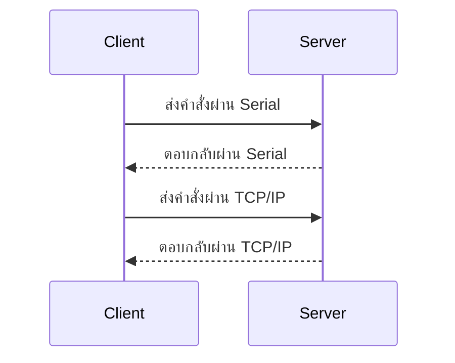
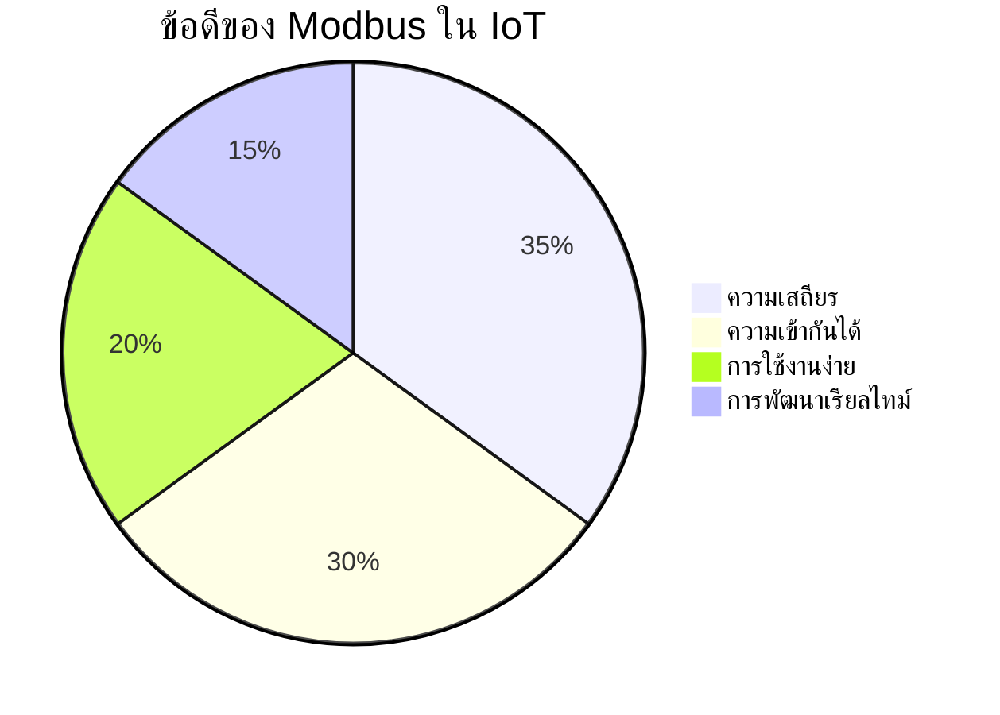
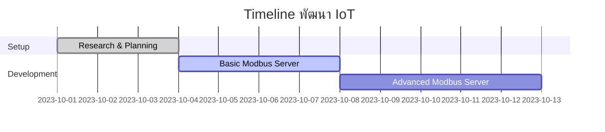
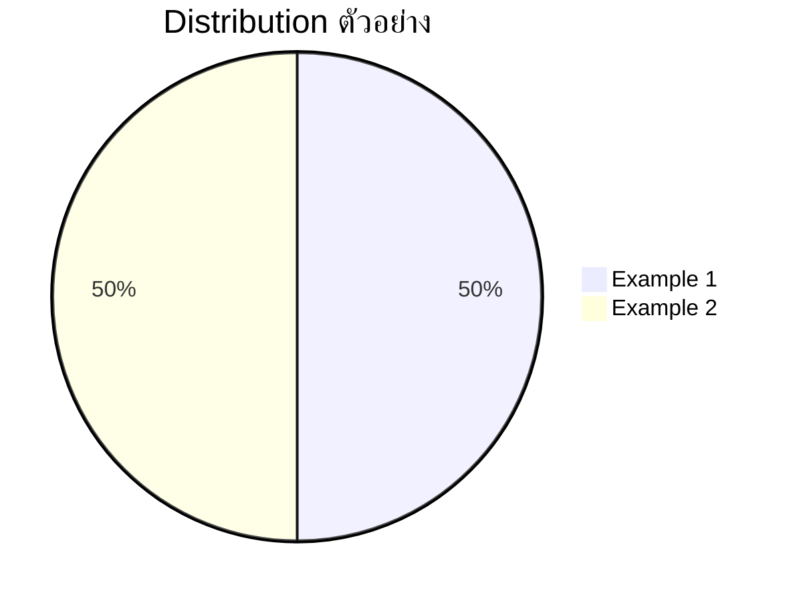

# บทที่ 4: Modbus สำหรับ IoT - การสื่อสารในระบบอุตสาหกรรม

| รายละเอียด         | คำอธิบาย                                                     |
|---------------------|----------------------------------------------------------------|
| **ชื่อเนื้อหา**     | การใช้งาน Modbus ในระบบ IoT                                   |
| **วัตถุประสงค์**    | เรียนรู้การใช้งาน Modbus สำหรับการสื่อสารในระบบอุตสาหกรรม   |
| **ระดับความยาก**    | ปานกลาง [⭑⭑⭑]                                               |
| **เวลา**           | 90 นาที - 120 นาที                                            |
| **สิ่งที่ต้องเตรียม** | PLC, Modbus RTU/TCP, Node-RED, Modbus Simulator               |
| **ความรู้พื้นฐาน**  | พื้นฐานการสื่อสารแบบ Serial, TCP/IP, การเขียนโปรแกรมเบื้องต้น |

## บทนำ
Modbus เป็นโปรโตคอลการสื่อสารที่ใช้กันอย่างแพร่หลายในระบบอุตสาหกรรมสำหรับการเชื่อมต่ออุปกรณ์ต่างๆ เช่น PLC, เซ็นเซอร์, และอุปกรณ์ควบคุมอื่นๆ

## ความสำคัญของ Modbus ใน IoT
- **ความเสถียร**: ใช้ในระบบอุตสาหกรรมมานาน มีความน่าเชื่อถือสูง
- **ความเข้ากันได้**: รองรับอุปกรณ์หลากหลายจากผู้ผลิตต่างๆ
- **การใช้งานง่าย**: โครงสร้างโปรโตคอลเรียบง่าย เข้าใจง่าย

## สถาปัตยกรรมการเชื่อมต่อ Modbus ใน Node-RED
การทำงานของ Modbus ภายใน Node-RED สามารถมองเห็นภาพรวมได้ด้วย diagram ดังนี้

```mermaid
flowchart LR
    A[PLC/อุปกรณ์ Modbus] -->|ส่งข้อมูล| B[Node-RED Flow]
    B --> C[Node Modbus Out]
    C --> D[แดชบอร์ด/ระบบควบคุม]
    D -- รับข้อมูลแบบเรียลไทม์ --> C
    note right of D: การแสดงผลข้อมูลแบบทันที
```

## เปรียบเทียบ Modbus RTU กับ Modbus TCP

- **Modbus RTU**: ใช้การสื่อสารผ่าน Serial (RS-485) เหมาะสำหรับการเชื่อมต่อระยะใกล้
- **Modbus TCP**: ใช้การสื่อสารผ่าน TCP/IP เหมาะสำหรับการเชื่อมต่อผ่านเครือข่าย

## ประโยชน์และการประยุกต์ใช้ใน IoT

- **ความเสถียร**: ใช้ในระบบอุตสาหกรรมมานาน
- **ความเข้ากันได้**: รองรับอุปกรณ์หลากหลาย
- **การใช้งานง่าย**: โครงสร้างโปรโตคอลเรียบง่าย
- **การพัฒนาเรียลไทม์**: รองรับการแสดงผลแบบทันที

## การนำไปใช้ใน Node-RED
- ใช้โหนด `modbus read` และ `modbus write` เพื่อตั้งค่าเชื่อมต่อ Modbus
- สามารถผสานกับโหนด MQTT เพื่อรับส่งข้อมูลจากอุปกรณ์ IoT
- ปรับแต่ง flow ใน Node-RED เพื่อสร้าง Dashboard ที่มีการแสดงข้อมูลแบบเรียลไทม์จาก Modbus

## ตัวอย่างการใช้งาน Modbus ด้วย Node.js

มีตัวอย่างการใช้งาน Modbus ด้วย Node.js ดังนี้:

1. ตัวอย่างพื้นฐาน  
   แสดงวิธีการตั้งค่าเซิร์ฟเวอร์และรับส่งข้อมูลระหว่าง client กับ server
   ```javascript
   // Example 1: Basic Modbus Server using modbus-serial
   const ModbusRTU = require("modbus-serial");
   const server = new ModbusRTU.ServerTCP({
     holding: Buffer.alloc(10000),
   }, {
     host: "127.0.0.1",
     port: 502,
   });

   server.on("socketError", function(err) {
     console.error(err);
   });
   ```

2. ตัวอย่างขั้นสูง: อ่าน/เขียนข้อมูล  
   แสดงวิธีการอ่านและเขียนข้อมูลจาก Modbus
   ```javascript
   // Example 2: Read and Write Modbus Data
   const ModbusRTU = require("modbus-serial");
   const client = new ModbusRTU();

   client.connectTCP("127.0.0.1", { port: 502 })
     .then(() => {
       return client.setID(1);
     })
     .then(() => {
       return client.readHoldingRegisters(0, 10);
     })
     .then((data) => {
       console.log("Data:", data.data);
     })
     .catch((err) => {
       console.error(err);
     });
   ```

## ไดอะแกรมเพิ่มเติม





## สรุป
Modbus เป็นโปรโตคอลสำคัญที่ใช้ในระบบอุตสาหกรรมสำหรับการสื่อสารระหว่างอุปกรณ์ต่างๆ  
เนื้อหานี้ได้แสดงตัวอย่างการใช้งาน Modbus เบื้องต้นและขั้นสูง พร้อมทั้งแผนภาพทางการพัฒนาและสัดส่วนของตัวอย่างเพื่อให้เข้าใจภาพรวมได้ดียิ่งขึ้น
