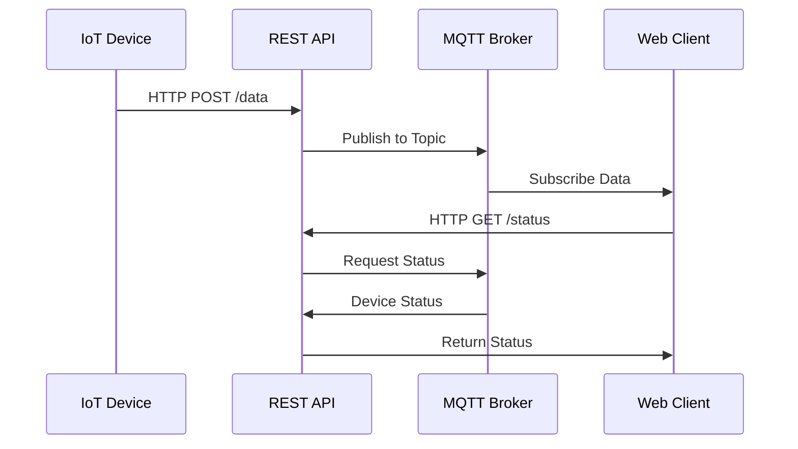
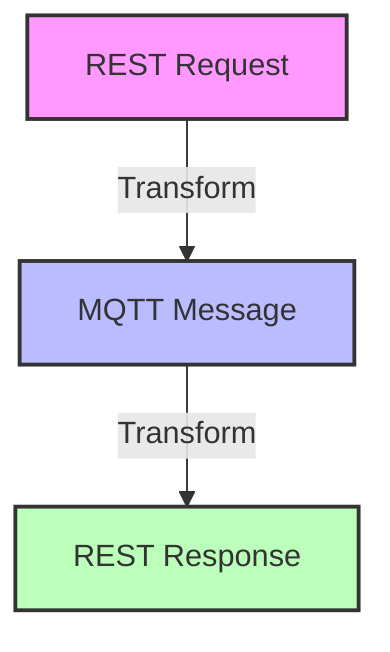

# บทที่ 4: การผสานรวม REST API

| รายละเอียด | คำอธิบาย |
|----------|---------|
| **ชื่อเนื้อหา** | การผสานรวม REST API กับระบบ IoT |
| **วัตถุประสงค์** | เรียนรู้การใช้งาน REST API ร่วมกับ MQTT |
| **ระดับความยาก** | ปานกลาง [⭑⭑⭑] |
| **เวลา** | 90 นาที - 120 นาที |
| **สิ่งที่ต้องเตรียม** | Node-RED, Postman, MQTT Broker |
| **ความรู้พื้นฐาน** | RESTful API, MQTT, HTTP |

บทนี้ครอบคลุมการผสานรวม REST API กับระบบและโปรโตคอล IoT

## วัตถุประสงค์การเรียนรู้

- เข้าใจ REST API และความแตกต่างจาก MQTT/WebSocket
- สร้าง API สำหรับการส่งและรับข้อมูลในระบบ IoT
- ใช้งานจุดสิ้นสุด HTTP สำหรับการแลกเปลี่ยนข้อมูล
- แปลงข้อมูลระหว่างรูปแบบ MQTT/WebSocket และ REST API
- เชื่อมต่อ REST API กับอุปกรณ์ IoT และโหนด
- ดึงข้อมูลจากบริการคลาวด์ผ่าน REST API
- ทำเวิร์คช็อปการผสานรวม REST API กับแพลตฟอร์ม IoT

## หัวข้อที่ครอบคลุม

1. แนะนำ REST API และเปรียบเทียบกับ MQTT/WebSocket
2. การสร้าง API สำหรับการส่งและรับข้อมูล IoT
3. การใช้งานจุดสิ้นสุด HTTP สำหรับการแลกเปลี่ยนข้อมูล
4. การแปลงข้อมูลระหว่างรูปแบบ MQTT/WebSocket และ REST API
5. การเชื่อมต่อ REST API กับอุปกรณ์และโหนด
6. การดึงข้อมูลจากบริการคลาวด์ผ่าน REST API
7. เวิร์คช็อป: การผสานรวม REST API สำหรับแพลตฟอร์ม IoT

## การทำงานของ REST API ในระบบ IoT



## ตัวอย่างการใช้งาน REST API ในระบบ IoT

### 1. การอ่านค่าอุณหภูมิจากเซนเซอร์

```javascript
// Example GET endpoint for temperature sensor
app.get('/api/v1/sensors/temperature', async (req, res) => {
    try {
        const response = await axios.get('http://temperature-sensor/data');
        const temp = response.data.temperature;
        
        // Publish to MQTT for real-time updates
        mqtt.publish('sensors/temperature', JSON.stringify({ value: temp }));
        
        res.json({
            status: 'success',
            timestamp: new Date().toISOString(),
            temperature: temp,
            unit: 'Celsius'
        });
    } catch (error) {
        res.status(500).json({
            status: 'error',
            message: 'Failed to read temperature sensor'
        });
    }
});
```

### 2. การควบคุมอุปกรณ์ผ่าน REST API

```javascript
// Example POST endpoint for device control
app.post('/api/v1/devices/:deviceId/control', async (req, res) => {
    const { deviceId } = req.params;
    const { command, parameters } = req.body;
    
    try {
        // Validate command
        if (!['on', 'off', 'restart'].includes(command)) {
            throw new Error('Invalid command');
        }
        
        // Publish command to device-specific MQTT topic
        await mqtt.publish(`devices/${deviceId}/commands`, JSON.stringify({
            command,
            parameters,
            timestamp: new Date().toISOString()
        }));
        
        res.json({
            status: 'success',
            message: `Command ${command} sent to device ${deviceId}`,
            requestId: uuidv4()
        });
    } catch (error) {
        res.status(400).json({
            status: 'error',
            message: error.message
        });
    }
});
```

## ตัวอย่างการแปลงข้อมูล

### 1. แปลงข้อมูล MQTT เป็น REST Response

```javascript
// MQTT to REST transformation example
mqtt.subscribe('sensors/+/data', (topic, message) => {
    const sensorId = topic.split('/')[1];
    const data = JSON.parse(message);
    
    // Store in cache for REST API
    cache.set(`sensor:${sensorId}`, {
        id: sensorId,
        value: data.value,
        unit: data.unit,
        timestamp: data.timestamp
    });
});

app.get('/api/v1/sensors/:id/latest', (req, res) => {
    const { id } = req.params;
    const data = cache.get(`sensor:${id}`);
    
    if (!data) {
        return res.status(404).json({
            status: 'error',
            message: 'Sensor data not found'
        });
    }
    
    res.json({
        status: 'success',
        data
    });
});
```

## Workshop: การสร้าง REST API Gateway

### 1. การตั้งค่า API Gateway ใน Node-RED

```javascript
// Example HTTP Endpoint
app.post('/api/v1/data', (req, res) => {
    const sensorData = req.body;
    
    // Publish to MQTT
    mqtt.publish('sensors/data', JSON.stringify(sensorData));
    
    res.status(200).json({
        status: 'success',
        message: 'Data published to MQTT'
    });
});
```

### 2. การทำ Authentication

```javascript
const jwt = require('jsonwebtoken');

// Middleware for JWT verification
const verifyToken = (req, res, next) => {
    const token = req.headers['authorization'];
    if (!token) return res.status(403).send('Token required');
    
    try {
        const decoded = jwt.verify(token, process.env.JWT_SECRET);
        req.user = decoded;
        next();
    } catch(err) {
        res.status(401).send('Invalid Token');
    }
};
```

### 3. การแปลงข้อมูลระหว่าง MQTT และ REST



## การทดสอบและ Debugging

### 1. ใช้ Postman Collection

```json
{
  "info": {
    "name": "IoT API Tests",
    "schema": "https://schema.getpostman.com/json/collection/v2.1.0/collection.json"
  },
  "item": [
    {
      "name": "Send Sensor Data",
      "request": {
        "method": "POST",
        "url": "http://localhost:1880/api/v1/data",
        "body": {
          "temperature": 25.5,
          "humidity": 60
        }
      }
    }
  ]
}
```

### 2. การ Monitor MQTT Messages

```bash
# Subscribe to all messages
mosquitto_sub -v -t '#'

# Monitor specific topic
mosquitto_sub -v -t 'sensors/data'
```

## Best Practices และ Security

1. **การ Rate Limiting**
```javascript
const rateLimit = require('express-rate-limit');

const apiLimiter = rateLimit({
    windowMs: 15 * 60 * 1000, // 15 minutes
    max: 100 // limit each IP to 100 requests per windowMs
});

app.use('/api/', apiLimiter);
```

2. **การ Validate ข้อมูล**
```javascript
const Joi = require('joi');

const schema = Joi.object({
    temperature: Joi.number().required(),
    humidity: Joi.number().min(0).max(100)
});

// Validation middleware
const validateData = (req, res, next) => {
    const { error } = schema.validate(req.body);
    if (error) return res.status(400).send(error.details[0].message);
    next();
};
```

3. **การจัดการ Error**
```javascript
app.use((err, req, res, next) => {
    console.error(err.stack);
    res.status(500).send('Something broke!');
});
```

## การจัดการข้อมูลขนาดใหญ่

### 1. การ Batch Processing

```javascript
app.post('/api/v1/sensors/batch', async (req, res) => {
    const { readings } = req.body;
    
    try {
        // Validate batch size
        if (readings.length > 1000) {
            throw new Error('Batch size too large');
        }
        
        // Process each reading
        const results = await Promise.all(readings.map(async reading => {
            await mqtt.publish(
                `sensors/${reading.sensorId}/data`,
                JSON.stringify(reading)
            );
            return {
                sensorId: reading.sensorId,
                status: 'processed'
            };
        }));
        
        res.json({
            status: 'success',
            processed: results.length,
            results
        });
    } catch (error) {
        res.status(400).json({
            status: 'error',
            message: error.message
        });
    }
});
```

### 2. การจัดการ Rate Limiting ขั้นสูง

```javascript
const rateLimit = require('express-rate-limit');

// Different rate limits for different endpoints
const deviceRateLimit = rateLimit({
    windowMs: 15 * 60 * 1000,
    max: 100,
    message: 'Too many requests from this device'
});

const sensorRateLimit = rateLimit({
    windowMs: 60 * 1000,
    max: 30,
    message: 'Too many sensor readings'
});

app.use('/api/v1/devices', deviceRateLimit);
app.use('/api/v1/sensors', sensorRateLimit);
```

## Workshop Exercises

1. สร้าง REST API endpoints สำหรับ:
   - รับข้อมูลเซ็นเซอร์
   - ควบคุมอุปกรณ์
   - ดูประวัติข้อมูล
   
2. เชื่อมต่อกับ MQTT broker และทดสอบการส่งข้อมูล

3. สร้างระบบ Authentication และ Authorization

4. ทดสอบ API ด้วย Postman และ curl

5. Monitor การทำงานและ Debug ปัญหา

## สรุป
REST API เป็นส่วนสำคัญในการพัฒนาระบบ IoT โดยช่วยให้:
- เชื่อมต่อกับแอพพลิเคชันภายนอก
- สร้างมาตรฐานในการเข้าถึงข้อมูล
- รองรับการทำงานร่วมกับระบบอื่นๆ
- เพิ่มความยืดหยุ่นในการพัฒนา

## ทรัพยากร

- เครื่องมือพัฒนา API
- ไลบรารีไคลเอนต์ HTTP
- เครื่องมือทดสอบ API (Postman, Insomnia)
- ตัวอย่าง API แพลตฟอร์ม IoT


## RACKSYNC CO., LTD.

[RACKSYNC](https://github.com/racksync) เป็นบริษัทที่มีความเชี่ยวชาญในการพัฒนาโซลูชั่นด้าน IoT และระบบอัตโนมัติ เรามุ่งมั่นในการสร้างเทคโนโลยีที่เชื่อมต่อโลกเข้าด้วยกันผ่านระบบ IoT ที่มีประสิทธิภาพและเสถียร

### บริการของเรา
- การออกแบบและพัฒนาระบบ IoT แบบครบวงจร
- โซลูชั่นเชื่อมต่อสำหรับอุตสาหกรรม 4.0
- ระบบอัตโนมัติสำหรับบ้านและอาคารอัจฉริยะ
- การฝึกอบรมและเวิร์คช็อปด้าน IoT

ติดตามโปรเจกต์และอัปเดตได้ที่ [GitHub](https://github.com/racksync)

© 2007-2025 RACKSYNC CO., LTD. All rights reserved.

