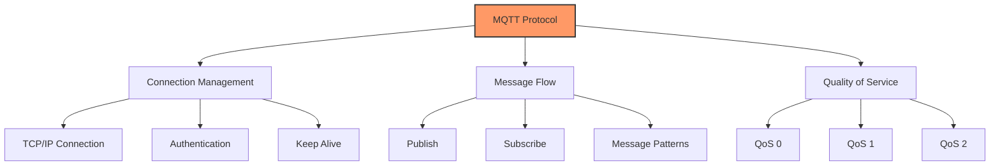
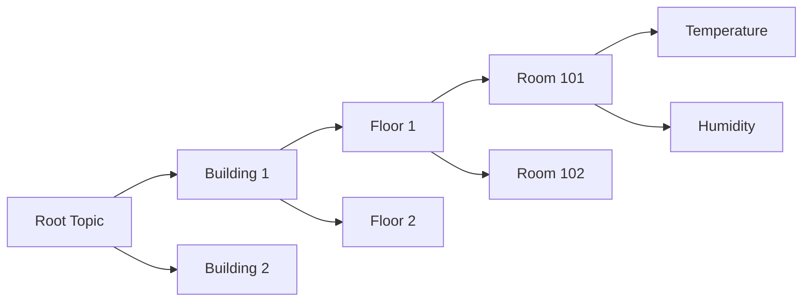
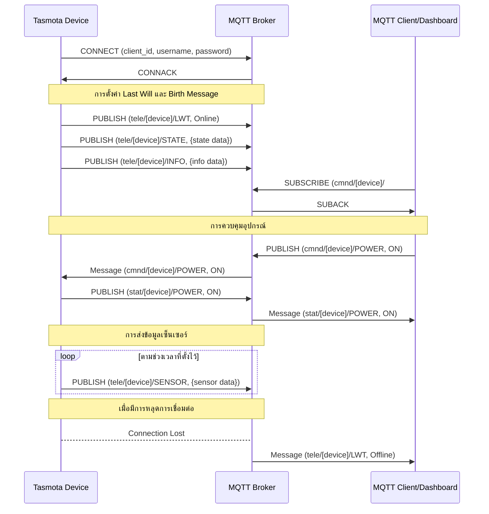
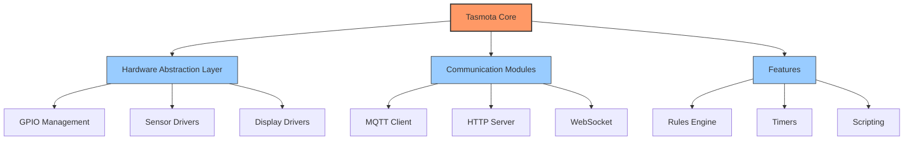

# บทที่ 6: การเชื่อมต่ออุปกรณ์

บทนี้ครอบคลุมทฤษฎีและแนวคิดเกี่ยวกับการเชื่อมต่ออุปกรณ์ IoT กับ MQTT broker และการจัดการการส่งข้อมูล

| รายละเอียด | คำอธิบาย |
|----------|---------|
| **ชื่อเนื้อหา** | การเชื่อมต่ออุปกรณ์ IoT |
| **วัตถุประสงค์** | เรียนรู้การเชื่อมต่อและจัดการอุปกรณ์ IoT กับ MQTT |
| **ระดับความยาก** | ปานกลาง [⭑⭑⭑] |
| **เวลา** | 90 นาที - 2 ชั่วโมง |
| **สิ่งที่ต้องเตรียม** | ESP8266/ESP32, เซ็นเซอร์พื้นฐาน, MQTT Broker |
| **ความรู้พื้นฐาน** | พื้นฐาน MQTT, การเขียนโปรแกรมเบื้องต้น |

## วัตถุประสงค์การเรียนรู้

- กำหนดค่าอุปกรณ์ IoT เพื่อเชื่อมต่อกับ MQTT Broker
- ใช้งานการส่งข้อมูลเซ็นเซอร์ผ่าน MQTT
- ทดสอบการเชื่อมต่อ WebSocket กับ MQTT Broker
- ส่งและรับข้อมูลผ่านไคลเอนต์ WebSocket
- จัดการลำดับชั้นของ Topic สำหรับอุปกรณ์ IoT หลายตัว
- กำหนดค่า Retained Message และ Will Message
- ตรวจสอบการเชื่อมต่อและดีบักการสื่อสาร
- แก้ไขปัญหาการเชื่อมต่อที่พบบ่อย
- เข้าใจและใช้งาน Tasmota firmware สำหรับอุปกรณ์ IoT


## ทฤษฎีการเชื่อมต่อ MQTT และ WebSocket



[เพิ่มคำอธิบายละเอียดเกี่ยวกับแต่ละองค์ประกอบของ MQTT...]

## การจัดการ Topic Hierarchy



[เพิ่มคำอธิบายละเอียดเกี่ยวกับการจัดการ Topic...]

## Tasmota: กรณีศึกษาเฟิร์มแวร์ที่เหมาะสำหรับการเรียนรู้

### ที่มาและความเป็นมา

Tasmota (เดิมชื่อ Sonoff-Tasmota) เป็นเฟิร์มแวร์โอเพนซอร์สที่พัฒนาโดย Theo Arends และชุมชนนักพัฒนา ซึ่งเริ่มต้นในปี 2016 เพื่อเป็นทางเลือกในการใช้กับอุปกรณ์ Sonoff จากบริษัท ITEAD โดยมีจุดประสงค์เพื่อทดแทนเฟิร์มแวร์ดั้งเดิมที่มีข้อจำกัดและความกังวลด้านความปลอดภัย

ปัจจุบัน Tasmota ได้รับการพัฒนาให้สามารถใช้งานได้กับอุปกรณ์ IoT ที่ใช้ชิป ESP8266/ESP8285 หลากหลายรุ่นและผู้ผลิต ไม่ใช่เพียงแค่อุปกรณ์ Sonoff เท่านั้น ทำให้กลายเป็นหนึ่งในเฟิร์มแวร์ยอดนิยมสำหรับอุปกรณ์ IoT ในชุมชนสมาร์ทโฮมและโอเพนซอร์ส

### จุดเด่นของ Tasmota

```mermaid
graph TD
    A[Tasmota Features] --> B[การเชื่อมต่อเครือข่าย]
    A --> C[โปรโตคอลที่รองรับ]
    A --> D[ฮาร์ดแวร์ที่รองรับ]
    A --> E[ความปลอดภัย]
    A --> F[การปรับแต่ง]
    A --> G[การอัปเดต]
    
    B --> B1[WiFi Manager]
    B --> B2[Captive Portal]
    B --> B3[Fallback AP]
    
    C --> C1[MQTT]
    C --> C2[HTTP RESTful API]
    C --> C3[Web UI]
    C --> C4[KNX]
    
    D --> D1[รีเลย์/สวิตช์]
    D --> D2[เซ็นเซอร์หลากหลาย]
    D --> D3[แสงสว่าง LED/RGB]
    D --> D4[จอแสดงผล]
    
    E --> E1[การเข้ารหัส SSL/TLS]
    E --> E2[การยืนยันตัวตน]
    E --> E3[การอัปเดต OTA]
    
    F --> F1[Rules Engine]
    F --> F2[Templates]
    F --> F3[Berry Scripting]
    
    G --> G1[Web UI OTA]
    G --> G2[Serial OTA]
    G --> G3[Over-The-Air OTA]
    
    classDef highlight fill:#f9f,stroke:#333,stroke-width:2px
    class A highlight
```



1. **รองรับอุปกรณ์หลากหลาย**: สามารถใช้ได้กับอุปกรณ์ ESP8266/ESP8285 มากกว่า 300 รุ่น
2. **Web Interface ในตัว**: มีหน้าเว็บสำหรับควบคุมและตั้งค่าโดยไม่ต้องใช้แอปหรือซอฟต์แวร์เพิ่มเติม
3. **รองรับ MQTT**: เชื่อมต่อกับระบบ MQTT ได้อย่างง่ายดาย ทำให้เข้ากับระบบบ้านอัจฉริยะต่างๆ
4. **Over-The-Air Updates**: อัปเดตเฟิร์มแวร์แบบไร้สายได้
5. **Rules Engine**: ตั้งค่าเงื่อนไขการทำงานของอุปกรณ์ได้โดยไม่ต้องเขียนโค้ด
6. **ความปลอดภัยสูงขึ้น**: มีการออกแบบด้านความปลอดภัยที่ดีกว่าเฟิร์มแวร์ดั้งเดิม
7. **ชุมชนที่แข็งแกร่ง**: มีการพัฒนาอย่างต่อเนื่องและมีชุมชนคอยช่วยเหลือ
8. **Template System**: ช่วยให้รองรับอุปกรณ์ใหม่ๆ ได้ง่าย
9. **ทำงานแบบ Offline ได้**: ทำงานได้แม้เมื่อไม่มีอินเทอร์เน็ต
10. **ประหยัดพลังงาน**: มีฟีเจอร์ประหยัดพลังงานสำหรับอุปกรณ์ที่ทำงานบนแบตเตอรี่

### การทำงานของ Tasmota กับ MQTT

Tasmota ใช้ MQTT เป็นโปรโตคอลหลักในการสื่อสาร โดยมีรูปแบบการทำงานดังนี้:



#### โครงสร้าง MQTT Topic ของ Tasmota

Tasmota ใช้โครงสร้าง Topic ที่แบ่งเป็น 3 กลุ่มหลัก:

1. **cmnd**: สำหรับส่งคำสั่งไปยังอุปกรณ์ Tasmota
   - `cmnd/%prefix%/%topic%/POWER` - ควบคุมสถานะเปิด/ปิด
   - `cmnd/%prefix%/%topic%/STATUS` - ขอข้อมูลสถานะ

2. **stat**: สำหรับข้อมูลสถานะที่เปลี่ยนแปลงเมื่อได้รับคำสั่ง
   - `stat/%prefix%/%topic%/POWER` - รายงานสถานะเปิด/ปิด
   - `stat/%prefix%/%topic%/RESULT` - ผลลัพธ์ของคำสั่ง

3. **tele**: สำหรับข้อมูลที่ส่งตามช่วงเวลา
   - `tele/%prefix%/%topic%/STATE` - สถานะทั่วไปของอุปกรณ์
   - `tele/%prefix%/%topic%/SENSOR` - ข้อมูลจากเซ็นเซอร์
   - `tele/%prefix%/%topic%/INFO` - ข้อมูลระบบ
   - `tele/%prefix%/%topic%/LWT` - Last Will and Testament

โดย `%prefix%` คือค่าที่กำหนดในการตั้งค่า และ `%topic%` คือชื่อของอุปกรณ์

### เปรียบเทียบ Tasmota กับการเขียนโค้ดเอง

| คุณลักษณะ | Tasmota | การเขียนโค้ด ESP/Arduino เอง |
|----------|---------|--------------------------|
| **การติดตั้ง** | แฟลชไฟล์เฟิร์มแวร์เพียงครั้งเดียว | ต้องเขียนและอัปโหลดโค้ดใหม่ทุกครั้งที่มีการเปลี่ยนแปลง |
| **การตั้งค่า** | ผ่าน Web UI, MQTT, หรือ API | ต้องเขียนโค้ดใหม่และอัปโหลด |
| **ความยืดหยุ่น** | ปรับแต่งได้ระดับหนึ่งผ่าน Rules และ Templates | ปรับแต่งได้ไม่จำกัดตามต้องการ |
| **ความเสถียร** | ได้รับการทดสอบอย่างกว้างขวาง | ขึ้นอยู่กับคุณภาพโค้ดที่เขียน |
| **การอัปเดตเฟิร์มแวร์** | OTA ผ่าน Web UI | ต้องพัฒนาระบบ OTA เอง |
| **ฟีเจอร์พื้นฐาน** | มีพร้อมใช้งานทันที (MQTT, API, web server) | ต้องเขียนทุกฟีเจอร์ที่ต้องการ |
| **เหมาะสำหรับ** | ใช้งานทั่วไป, โปรเจคที่ต้องการความรวดเร็ว | โครงการที่ต้องการฟีเจอร์เฉพาะทางหรือมีความต้องการพิเศษ |
| **การแก้ไขปัญหา** | มีชุมชนให้ความช่วยเหลือ | ต้องแก้ไขปัญหาด้วยตนเอง |
| **การประหยัดพลังงาน** | มีฟีเจอร์พื้นฐาน | สามารถปรับแต่งละเอียดได้มากกว่า |
| **ขนาดโค้ด** | ใหญ่ แต่มีทุกฟีเจอร์ | เล็กกว่า เพราะรวมเฉพาะสิ่งที่จำเป็น |

### การติดตั้ง Tasmota

การติดตั้ง Tasmota มีหลายวิธี ซึ่งทั้งหมดมีเอกสารอธิบายอย่างละเอียดบนเว็บไซต์ทางการ:

- [Tasmota Installation Guide](https://tasmota.github.io/docs/Getting-Started/) - คู่มือทางการสำหรับการติดตั้ง Tasmota
- [Tasmota Web Installer](https://tasmota.github.io/install/) - เครื่องมือติดตั้งผ่านเว็บที่ง่ายที่สุด
- [Tasmotizer](https://github.com/tasmota/tasmotizer) - แอปพลิเคชันกราฟิกสำหรับติดตั้ง Tasmota

สำหรับรายละเอียดเพิ่มเติมเกี่ยวกับตัวเลือกการติดตั้งและวิธีแก้ไขปัญหา กรุณาดูที่ [เอกสารทางการ](https://tasmota.github.io/docs/)

### สถาปัตยกรรมของ Tasmota และความสำคัญในการศึกษา

Tasmota มีสถาปัตยกรรมที่น่าสนใจและเป็นกรณีศึกษาที่ดีสำหรับการพัฒนาเฟิร์มแวร์ IoT ด้วยเหตุผลหลายประการ:

#### โครงสร้างแบบโมดูลาร์ (Modular Architecture)



1. **การแยกส่วนอย่างชัดเจน**: Tasmota แบ่งโค้ดออกเป็นส่วนๆ ตามหน้าที่ ทำให้ง่ายต่อการบำรุงรักษาและพัฒนา
2. **Hardware Abstraction Layer**: มีการแยกชั้นฮาร์ดแวร์ออกจากโลจิกหลัก ทำให้รองรับฮาร์ดแวร์ได้หลากหลาย
3. **Plugin System**: ใช้ระบบปลั๊กอินสำหรับเซ็นเซอร์และฟีเจอร์ต่างๆ ทำให้เพิ่มความสามารถได้โดยไม่ต้องเปลี่ยนแปลงโค้ดหลัก

#### การจัดการทรัพยากรที่มีประสิทธิภาพ

Tasmota เป็นตัวอย่างที่ดีของการพัฒนาซอฟต์แวร์บนอุปกรณ์ที่มีทรัพยากรจำกัด:

1. **การจัดการหน่วยความจำ**: ใช้เทคนิคต่างๆ เพื่อลดการใช้ RAM เช่น PROGMEM สำหรับข้อความคงที่
2. **Event-Driven Architecture**: ใช้สถาปัตยกรรมแบบ event-driven เพื่อประสิทธิภาพและการตอบสนองที่ดี
3. **การประหยัดพลังงาน**: มีกลไกจัดการพลังงานสำหรับอุปกรณ์ที่ทำงานด้วยแบตเตอรี่

#### บทเรียนจากการศึกษา Tasmota

การศึกษา Tasmota มีประโยชน์อย่างมากสำหรับนักพัฒนา IoT เนื่องจาก:

1. **แนวทางปฏิบัติที่ดี**: เรียนรู้วิธีการจัดการปัญหาทั่วไปในการพัฒนา IoT
2. **การจัดการกับข้อจำกัด**: เห็นวิธีการทำงานภายใต้ข้อจำกัดของฮาร์ดแวร์และเครือข่าย
3. **Community-Driven Development**: เป็นตัวอย่างที่ดีของการพัฒนาโดยชุมชน การจัดการคำขอฟีเจอร์ และการแก้ไขบั๊ก
4. **การสร้างระบบที่ยืดหยุ่น**: การออกแบบที่รองรับอุปกรณ์หลากหลายโดยไม่ต้องเขียนโค้ดใหม่ทั้งหมด
5. **การปรับสมดุลระหว่างความยืดหยุ่นและความง่าย**: การสร้างระบบที่ผู้ใช้ทั่วไปสามารถปรับแต่งได้ แต่ยังคงใช้งานง่าย

## ทางเลือกเฟิร์มแวร์สำหรับการศึกษาและพัฒนา IoT

นอกจาก Tasmota แล้ว ยังมีเฟิร์มแวร์อื่นๆ ที่น่าสนใจสำหรับการศึกษาและพัฒนา IoT:

### ESPHome

ESPHome เป็นระบบที่ช่วยให้สามารถสร้างเฟิร์มแวร์สำหรับ ESP8266/ESP32 ได้โดยใช้ไฟล์คอนฟิกแบบ YAML

**จุดเด่น:**
- ใช้ YAML configuration แทนการเขียนโค้ด
- รวมเข้ากับ Home Assistant ได้อย่างลงตัว
- มี OTA updates และ native API
- รองรับเซนเซอร์และอุปกรณ์หลากหลาย

**ตัวอย่าง Configuration:**
```yaml
esphome:
  name: my_device
  platform: ESP8266

wifi:
  ssid: "MyWiFi"
  password: "password123"

sensor:
  - platform: dht
    pin: D2
    temperature:
      name: "Room Temperature"
    humidity:
      name: "Room Humidity"
    update_interval: 60s
```

[ESPHome Documentation](https://esphome.io/)

### Arduino Framework

Arduino เป็น framework ยอดนิยมที่ใช้สำหรับการเริ่มต้นเรียนรู้การพัฒนา IoT

**จุดเด่น:**
- เหมาะสำหรับผู้เริ่มต้น
- มีไลบรารีมากมาย
- ชุมชนขนาดใหญ่
- สามารถพัฒนาได้หลากหลายแพลตฟอร์ม

**ตัวอย่างโค้ด:**
```cpp
#include <ESP8266WiFi.h>
#include <PubSubClient.h>

const char* ssid = "WiFi_SSID";
const char* password = "WiFi_PASSWORD";
const char* mqtt_server = "broker.example.com";

void setup() {
  Serial.begin(115200);
  WiFi.begin(ssid, password);
  // ... setup code
}

void loop() {
  // ... main loop code
}
```

[Arduino Documentation](https://www.arduino.cc/reference/en/)

## แหล่งเรียนรู้เพิ่มเติม

### หลักสูตรและบทความ
- [ESP8266/ESP32 Programming Course](https://www.udemy.com/course/esp8266-esp32-wifi-iot/)
- [IoT Security Foundation](https://www.iotsecurityfoundation.org/)
- [MQTT Essentials](https://www.hivemq.com/mqtt-essentials/)

### เครื่องมือและซอฟต์แวร์
1. **Development Tools**
   - [PlatformIO](https://platformio.org/) - IDE สำหรับพัฒนา IoT
   - [Arduino IDE](https://www.arduino.cc/en/software)
   - [Visual Studio Code with ESP extensions](https://marketplace.visualstudio.com/items?itemName=platformio.platformio-ide)

2. **Debugging & Testing**
   - [MQTT Explorer](http://mqtt-explorer.com/)
   - [Wireshark](https://www.wireshark.org/)
   - [ESP Exception Decoder](https://github.com/me-no-dev/EspExceptionDecoder)

3. **Cloud Platforms**
   - [AWS IoT Core](https://aws.amazon.com/iot-core/)
   - [Google Cloud IoT](https://cloud.google.com/iot-core)
   - [Azure IoT Hub](https://azure.microsoft.com/services/iot-hub/)

### ชุมชนและฟอรัม
- [ESP8266 Community Forum](https://www.esp8266.com/)
- [Reddit r/esp8266](https://www.reddit.com/r/esp8266/)
- [Arduino Forum](https://forum.arduino.cc/)
- [Home Assistant Community](https://community.home-assistant.io/)

### GitHub Repositories ที่น่าสนใจ
- [ESP8266 Core](https://github.com/esp8266/Arduino)
- [ESP32 Core](https://github.com/espressif/arduino-esp32)
- [Awesome ESP](https://github.com/agucova/awesome-esp)
- [MQTT Library](https://github.com/knolleary/pubsubclient)

---
## RACKSYNC CO., LTD.

[RACKSYNC](https://github.com/racksync) เป็นบริษัทที่มีความเชี่ยวชาญในการพัฒนาโซลูชั่นด้าน IoT และระบบอัตโนมัติ เรามุ่งมั่นในการสร้างเทคโนโลยีที่เชื่อมต่อโลกเข้าด้วยกันผ่านระบบ IoT ที่มีประสิทธิภาพและเสถียร

### บริการของเรา
- การออกแบบและพัฒนาระบบ IoT แบบครบวงจร
- โซลูชั่นเชื่อมต่อสำหรับอุตสาหกรรม 4.0
- ระบบอัตโนมัติสำหรับบ้านและอาคารอัจฉริยะ
- การฝึกอบรมและเวิร์คช็อปด้าน IoT

ติดตามโปรเจกต์และอัปเดตได้ที่ [GitHub](https://github.com/racksync)

© 2007-2025 RACKSYNC CO., LTD. All rights reserved.
