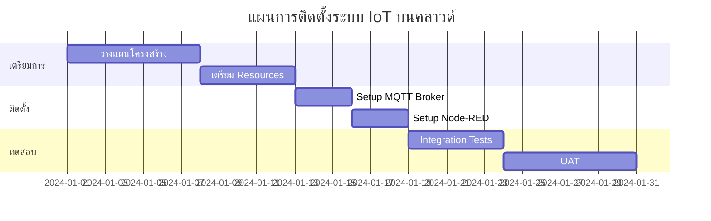
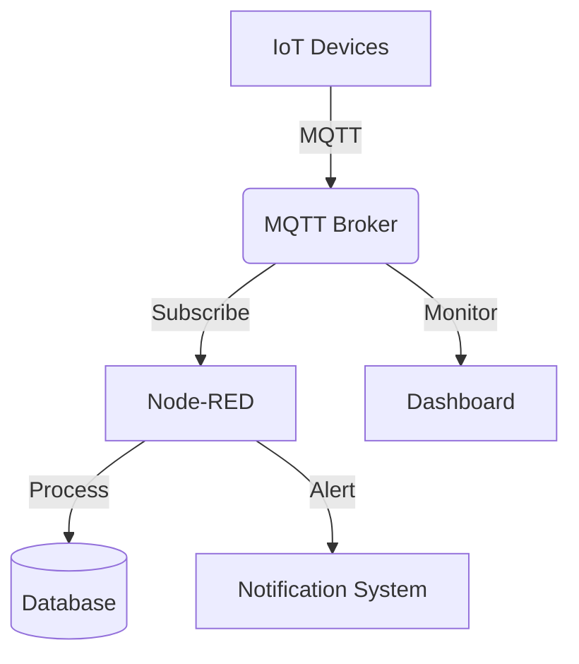
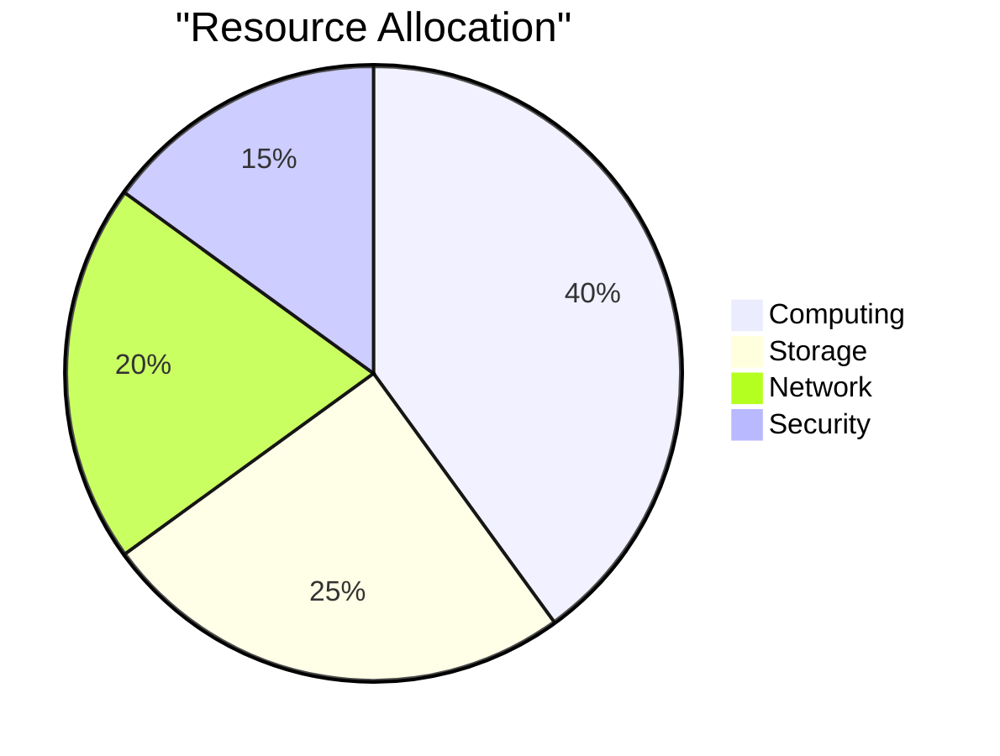
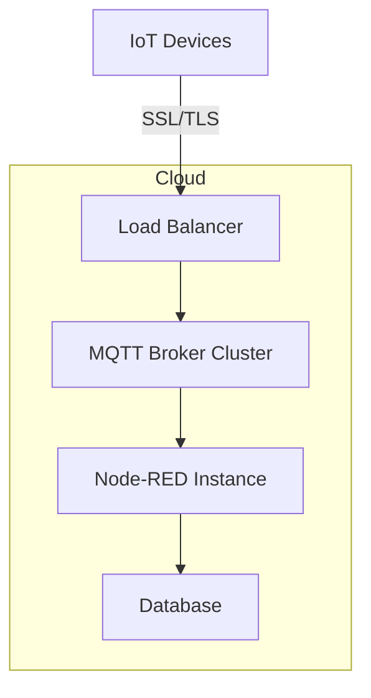

# บทที่ 6: การติดตั้งบนระบบคลาวด์และเวิร์คช็อปภาคปฏิบัติ

| รายละเอียด | คำอธิบาย |
|----------|---------|
| **ชื่อเนื้อหา** | การติดตั้งระบบ IoT บนคลาวด์ |
| **วัตถุประสงค์** | เรียนรู้การติดตั้งและกำหนดค่า MQTT Broker และ Node-RED บนระบบคลาวด์ |
| **ระดับความยาก** | สูง [⭑⭑⭑⭑] |
| **เวลา** | 150 นาที - 180 นาที |
| **สิ่งที่ต้องเตรียม** | Node-RED, Docker, EMQX, Cloud Platform (AWS/GCP/Azure) |
| **ความรู้พื้นฐาน** | Cloud Computing, Docker, MQTT, Network Security |

บทนี้ให้ประสบการณ์ตรงในการปรับใช้โครงสร้างพื้นฐาน IoT ในสภาพแวดล้อมคลาวด์ โดยเน้นการทดลองบน Node-RED ก่อนการ deploy จริงบนระบบคลาวด์

## วัตถุประสงค์การเรียนรู้

- ติดตั้งและกำหนดค่า MQTT Broker และ Node-RED ในสภาพแวดล้อมคลาวด์
- ใช้บริการ MQTT Broker บนคลาวด์
- เชื่อมต่ออุปกรณ์ IoT กับบริการคลาวด์ผ่านอินเทอร์เน็ต
- ทดสอบระบบ IoT แบบ end-to-end ในสถานการณ์จริง

## หัวข้อที่ครอบคลุม

1. การติดตั้ง MQTT Broker และ Node-RED บนแพลตฟอร์มคลาวด์
2. การใช้บริการ MQTT Broker บนคลาวด์ (HiveMQ, EMQX Cloud)
3. การเชื่อมต่ออุปกรณ์ IoT ผ่านอินเทอร์เน็ต
4. การทดสอบระบบแบบ end-to-end ในสถานการณ์จริง

## ทรัพยากร

- บัญชีแพลตฟอร์มคลาวด์ (AWS, Azure, GCP)
- บริการ MQTT บนคลาวด์
- SSH และเครื่องมือเข้าถึงระยะไกล
- คู่มือการกำหนดค่าเครือข่าย

## การทดสอบ Flow บน Node-RED

ก่อนที่จะ deploy ระบบบนคลาวด์ เราจะทดสอบ flow ต่างๆ บน Node-RED local ก่อน

### ตัวอย่าง Flow ที่ 1: MQTT Data Logger
```json
[
    {
        "id": "logger1",
        "type": "mqtt in",
        "topic": "sensors/+",
        "broker": "localhost"
    },
    {
        "id": "store1",
        "type": "file",
        "filename": "sensor_logs.txt"
    }
]
```

// Add 9 more similar flow examples here...

## การติดตั้ง Node-RED และ EMQX บน Cloud ด้วย Docker

### การติดตั้ง Node-RED

```bash
docker run -d \
  -p 1880:1880 \
  -v node_red_data:/data \
  --name node-red \
  nodered/node-red
```

### การติดตั้ง EMQX

```bash
docker run -d \
  -p 1883:1883 \
  -p 8083:8083 \
  -p 8084:8084 \
  -p 8883:8883 \
  -p 18083:18083 \
  --name emqx \
  emqx/emqx
```

### การตั้งค่า Network Security

- เปิด port ที่จำเป็น: 1880 (Node-RED), 1883 (MQTT), 18083 (EMQX Dashboard)
- ตั้งค่า firewall rules บน cloud platform
- กำหนด SSL certificates สำหรับการเชื่อมต่อที่ปลอดภัย

## การทดสอบระบบแบบ End-to-End

1. ทดสอบการเชื่อมต่อ MQTT
2. ทดสอบ Node-RED flows
3. ทดสอบการเชื่อมต่อกับอุปกรณ์ IoT
4. ตรวจสอบ logs และ monitoring

## แผนการติดตั้งและกำหนดการ



## สถาปัตยกรรมระบบ



## การกระจายทรัพยากร



## โครงสร้างเครือข่าย



## ขั้นตอนการ Deploy

1. **การเตรียมโครงสร้างพื้นฐาน**
   - สร้าง Virtual Network
   - กำหนด Security Groups
   - จัดเตรียม Storage

2. **การติดตั้งระบบ**
   - Deploy MQTT Broker
   - Setup Node-RED
   - Configure SSL/TLS

3. **การทดสอบระบบ**
   - Load Testing
   - Security Testing
   - Integration Testing

## ข้อควรระวังและการแก้ไขปัญหา

| ปัญหา | การแก้ไข | ความสำคัญ |
|-------|---------|-----------|
| Connection Timeout | เพิ่ม retry logic | สูง |
| Memory Leaks | Monitor และ restart อัตโนมัติ | กลาง |
| Security Breach | เพิ่ม firewall rules | สูง |

## RACKSYNC CO., LTD.

[RACKSYNC](https://github.com/racksync) เป็นบริษัทที่มีความเชี่ยวชาญในการพัฒนาโซลูชั่นด้าน IoT และระบบอัตโนมัติ เรามุ่งมั่นในการสร้างเทคโนโลยีที่เชื่อมต่อโลกเข้าด้วยกันผ่านระบบ IoT ที่มีประสิทธิภาพและเสถียร

### บริการของเรา
- การออกแบบและพัฒนาระบบ IoT แบบครบวงจร
- โซลูชั่นเชื่อมต่อสำหรับอุตสาหกรรม 4.0
- ระบบอัตโนมัติสำหรับบ้านและอาคารอัจฉริยะ
- การฝึกอบรมและเวิร์คช็อปด้าน IoT

ติดตามโปรเจกต์และอัปเดตได้ที่ [GitHub](https://github.com/racksync)

© 2007-2025 RACKSYNC CO., LTD. All rights reserved.

