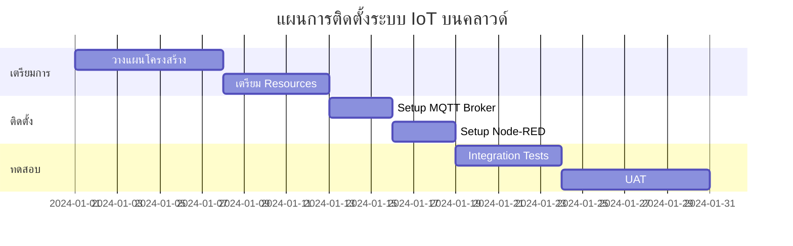
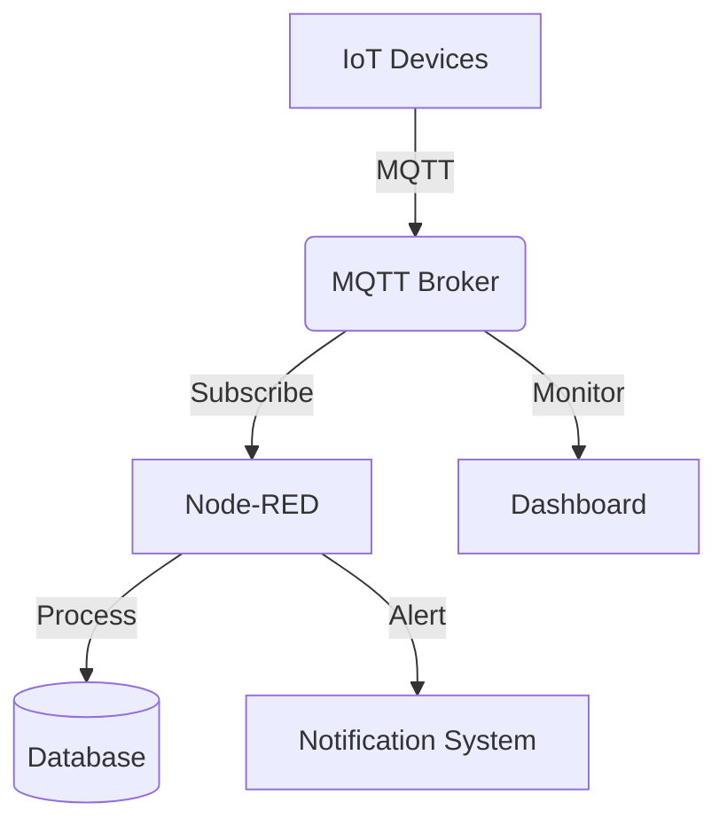
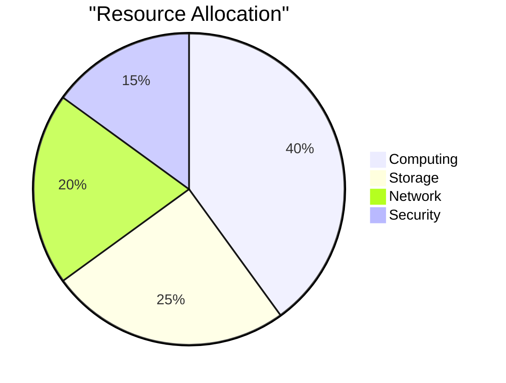
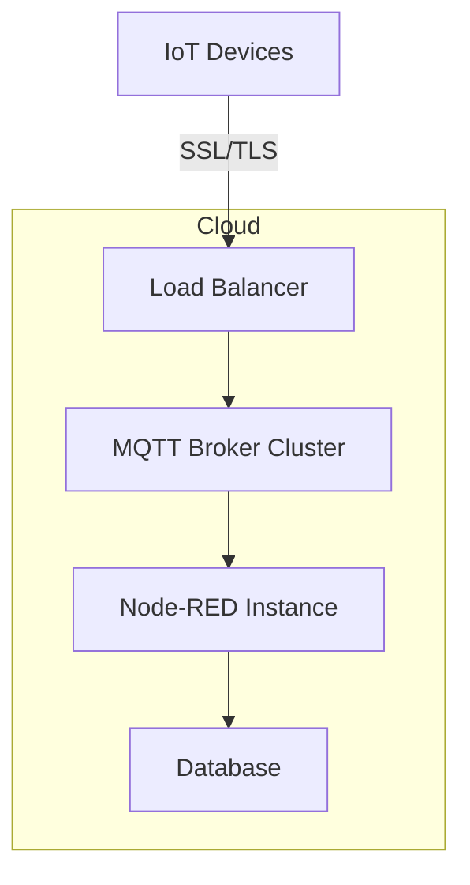
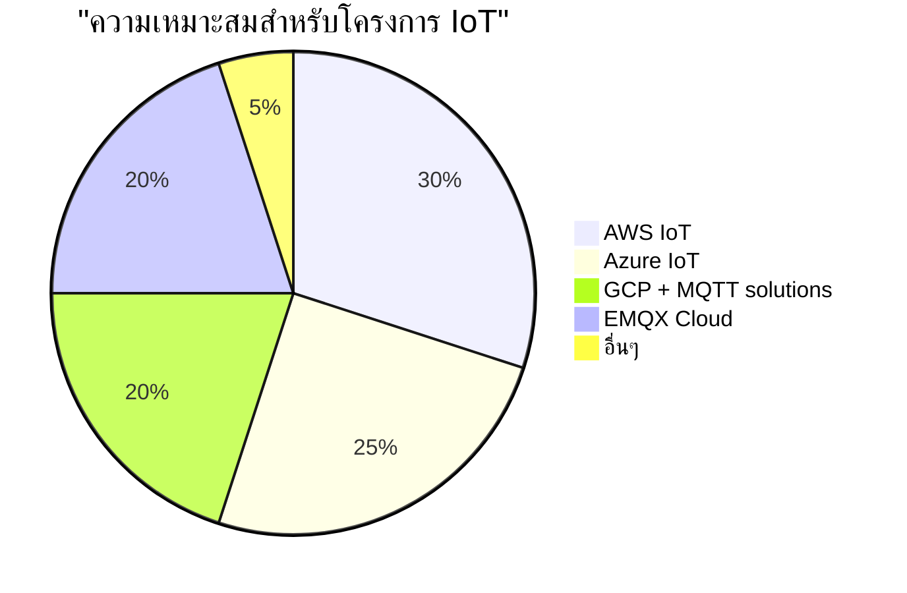

# บทที่ 7: การติดตั้งบนระบบคลาวด์และเวิร์คช็อปภาคปฏิบัติ

| รายละเอียด | คำอธิบาย |
|----------|---------|
| **ชื่อเนื้อหา** | การติดตั้งระบบ IoT บนคลาวด์ |
| **วัตถุประสงค์** | เรียนรู้การติดตั้งและกำหนดค่า MQTT Broker และ Node-RED บนระบบคลาวด์ |
| **ระดับความยาก** | สูง [⭑⭑⭑⭑] |
| **เวลา** | 45 นาที |
| **สิ่งที่ต้องเตรียม** | Node-RED, Docker, EMQX, Cloud Platform (AWS/GCP/Azure) |
| **ความรู้พื้นฐาน** | Cloud Computing, Docker, MQTT, Network Security |

บทนี้ให้ประสบการณ์ตรงในการปรับใช้โครงสร้างพื้นฐาน IoT ในสภาพแวดล้อมคลาวด์ โดยเน้นการทดลองบน Node-RED ก่อนการ deploy จริงบนระบบคลาวด์

## วัตถุประสงค์การเรียนรู้

- ติดตั้งและกำหนดค่า MQTT Broker และ Node-RED ในสภาพแวดล้อมคลาวด์
- ใช้บริการ MQTT Broker บนคลาวด์
- เชื่อมต่ออุปกรณ์ IoT กับบริการคลาวด์ผ่านอินเทอร์เน็ต
- ทดสอบระบบ IoT แบบ end-to-end ในสถานการณ์จริง

## หัวข้อที่ครอบคลุม

1. การติดตั้ง MQTT Broker และ Node-RED บนแพลตฟอร์มคลาวด์
2. การใช้บริการ MQTT Broker บนคลาวด์ (HiveMQ, EMQX Cloud)
3. การเชื่อมต่ออุปกรณ์ IoT ผ่านอินเทอร์เน็ต
4. การทดสอบระบบแบบ end-to-end ในสถานการณ์จริง

## ทรัพยากร

- บัญชีแพลตฟอร์มคลาวด์ (AWS, Azure, GCP)
- บริการ MQTT บนคลาวด์
- SSH และเครื่องมือเข้าถึงระยะไกล
- คู่มือการกำหนดค่าเครือข่าย

## การทดสอบ Flow บน Node-RED

ก่อนที่จะ deploy ระบบบนคลาวด์ เราจะทดสอบ flow ต่างๆ บน Node-RED local ก่อน

### ตัวอย่าง Flow ที่ 1: MQTT Data Logger
```json
[
    {
        "id": "logger1",
        "type": "mqtt in",
        "topic": "sensors/+",
        "broker": "localhost"
    },
    {
        "id": "store1",
        "type": "file",
        "filename": "sensor_logs.txt"
    }
]
```

// Add 9 more similar flow examples here...

## การติดตั้ง Node-RED และ EMQX บน Cloud ด้วย Docker

### การติดตั้ง Node-RED

```bash
docker run -d \
  -p 1880:1880 \
  -v node_red_data:/data \
  --name node-red \
  nodered/node-red
```

### การติดตั้ง EMQX

```bash
docker run -d \
  -p 1883:1883 \
  -p 8083:8083 \
  -p 8084:8084 \
  -p 8883:8883 \
  -p 18083:18083 \
  --name emqx \
  emqx/emqx
```

### การตั้งค่า Network Security

- เปิด port ที่จำเป็น: 1880 (Node-RED), 1883 (MQTT), 18083 (EMQX Dashboard)
- ตั้งค่า firewall rules บน cloud platform
- กำหนด SSL certificates สำหรับการเชื่อมต่อที่ปลอดภัย

## การทดสอบระบบแบบ End-to-End

1. ทดสอบการเชื่อมต่อ MQTT
2. ทดสอบ Node-RED flows
3. ทดสอบการเชื่อมต่อกับอุปกรณ์ IoT
4. ตรวจสอบ logs และ monitoring

## แผนการติดตั้งและกำหนดการ



## สถาปัตยกรรมระบบ



## การกระจายทรัพยากร



## โครงสร้างเครือข่าย



## ขั้นตอนการ Deploy

1. **การเตรียมโครงสร้างพื้นฐาน**
   - สร้าง Virtual Network
   - กำหนด Security Groups
   - จัดเตรียม Storage

2. **การติดตั้งระบบ**
   - Deploy MQTT Broker
   - Setup Node-RED
   - Configure SSL/TLS

3. **การทดสอบระบบ**
   - Load Testing
   - Security Testing
   - Integration Testing

## ข้อควรระวังและการแก้ไขปัญหา

| ปัญหา | การแก้ไข | ความสำคัญ |
|-------|---------|-----------|
| Connection Timeout | เพิ่ม retry logic | สูง |
| Memory Leaks | Monitor และ restart อัตโนมัติ | กลาง |
| Security Breach | เพิ่ม firewall rules | สูง |

## การ implement MQTT/WebSocket บนบริการ Cloud ชั้นนำ

การนำ MQTT และ WebSocket ไปใช้งานบนระบบคลาวด์สามารถทำได้หลากหลายวิธี ขึ้นอยู่กับผู้ให้บริการคลาวด์ที่เลือกใช้ แต่ละรายมีบริการและคุณสมบัติที่แตกต่างกัน ดังนี้

### 1. Amazon Web Services (AWS)

AWS นำเสนอบริการหลายตัวที่รองรับ MQTT และ WebSocket สำหรับระบบ IoT

**บริการหลัก**:
- **AWS IoT Core**: บริการจัดการอุปกรณ์ IoT พร้อม MQTT broker ในตัว
- **Amazon API Gateway**: รองรับ WebSocket API แบบเต็มรูปแบบ

**การตั้งค่า AWS IoT Core สำหรับ MQTT**:

```bash
# ติดตั้ง AWS CLI
pip install awscli

# กำหนดค่า credentials
aws configure

# สร้าง IoT Thing
aws iot create-thing --thing-name "MyIoTDevice"

# สร้าง Certificate
aws iot create-keys-and-certificate --set-as-active \
  --certificate-pem-outfile "certificate.pem" \
  --private-key-outfile "private.key"
```

**Code ตัวอย่างการเชื่อมต่อกับ AWS IoT Core**:

```javascript
const awsIot = require('aws-iot-device-sdk');

const device = awsIot.device({
  keyPath: 'private.key',
  certPath: 'certificate.pem',
  caPath: 'rootCA.pem',
  clientId: 'myIoTDevice',
  host: 'xxxxx-ats.iot.ap-southeast-1.amazonaws.com'
});

device.on('connect', () => {
  console.log('เชื่อมต่อกับ AWS IoT Core สำเร็จ');
  device.publish('sensors/data', JSON.stringify({ temp: 25, humidity: 60 }));
});
```

**ข้อดี**:
- ความปลอดภัยระดับสูงด้วย X.509 certificates
- รองรับอุปกรณ์ได้หลายล้านเครื่อง
- ผสานรวมกับบริการอื่นๆ ของ AWS ได้ง่าย (Lambda, S3, DynamoDB)

**ข้อควรพิจารณา**:
- ราคาคิดตามจำนวน connections และข้อความ
- มีความซับซ้อนในการตั้งค่าเริ่มต้น

### 2. Microsoft Azure

Azure มีบริการเฉพาะสำหรับ IoT ที่รองรับทั้ง MQTT และ WebSocket

**บริการหลัก**:
- **Azure IoT Hub**: บริการจัดการอุปกรณ์ IoT ที่รองรับ MQTT
- **Azure Web PubSub**: บริการ real-time messaging แบบ serverless ด้วย WebSockets

**การตั้งค่า Azure IoT Hub**:

```bash
# ติดตั้ง Azure CLI
curl -sL https://aka.ms/InstallAzureCLIDeb | sudo bash

# Login เข้าระบบ Azure
az login

# สร้าง Resource Group
az group create --name IoTResourceGroup --location southeastasia

# สร้าง IoT Hub
az iot hub create --name MyIoTHub --resource-group IoTResourceGroup --sku S1

# ลงทะเบียนอุปกรณ์
az iot hub device-identity create --hub-name MyIoTHub --device-id mydevice
```

**Code ตัวอย่างการเชื่อมต่อกับ Azure IoT Hub**:

```javascript
const { Mqtt } = require('azure-iot-device-mqtt');
const { DeviceClient } = require('azure-iot-device');

const connectionString = 'HostName=MyIoTHub.azure-devices.net;DeviceId=mydevice;SharedAccessKey=xxxxx';
const client = DeviceClient.fromConnectionString(connectionString, Mqtt);

client.open().then(() => {
  console.log('เชื่อมต่อกับ Azure IoT Hub สำเร็จ');
  
  const message = new Message(JSON.stringify({ 
    temp: 25, 
    humidity: 60 
  }));
  
  client.sendEvent(message, (err) => {
    if (err) console.error('ส่งข้อมูลล้มเหลว');
    else console.log('ส่งข้อมูลสำเร็จ');
  });
});
```

**ข้อดี**:
- ออกแบบมาสำหรับองค์กรขนาดใหญ่
- การรักษาความปลอดภัยที่ครอบคลุม
- มี SDK พร้อมใช้งานหลายภาษา

**ข้อควรพิจารณา**:
- โครงสร้างราคาที่ซับซ้อน
- อาจมีค่าใช้จ่ายสูงสำหรับการใช้งานขนาดใหญ่

### 3. Google Cloud Platform (GCP)

GCP นำเสนอบริการสำหรับ IoT ที่ครอบคลุมและเชื่อมโยงกับ big data

**บริการหลัก**:
- **Cloud IoT Core**: บริการจัดการอุปกรณ์ IoT (ประกาศยุติบริการ - ควรใช้ทางเลือกอื่นแทน)
- **Pub/Sub**: บริการ messaging ที่รองรับ WebSocket
- **Firebase Realtime Database**: ฐานข้อมูลแบบ real-time ที่รองรับ WebSocket

**ทางเลือกหลังจาก Cloud IoT Core ถูกยกเลิก**:
- ใช้ MQTT broker อย่าง EMQX หรือ HiveMQ บน GCP Compute Engine
- ใช้ Firebase Realtime Database สำหรับการสื่อสารแบบ real-time

**การติดตั้ง EMQX บน Google Cloud VM**:

```bash
# สร้าง VM instance
gcloud compute instances create mqtt-broker \
  --machine-type=e2-medium \
  --image-family=debian-11 \
  --image-project=debian-cloud

# SSH เข้า VM
gcloud compute ssh mqtt-broker

# ติดตั้ง Docker
sudo apt-get update && sudo apt-get install -y docker.io

# Run EMQX container
sudo docker run -d --name emqx \
  -p 1883:1883 -p 8083:8083 -p 8084:8084 \
  -p 8883:8883 -p 18083:18083 \
  emqx/emqx:latest
```

**Code ตัวอย่างการเชื่อมต่อกับ Firebase Realtime Database**:

```javascript
// สำหรับ web client
import { initializeApp } from 'firebase/app';
import { getDatabase, ref, set, onValue } from 'firebase/database';

const firebaseConfig = {
  apiKey: "xxx",
  authDomain: "xxx.firebaseapp.com",
  databaseURL: "https://xxx.firebaseio.com",
  projectId: "xxx",
  storageBucket: "xxx.appspot.com",
  messagingSenderId: "xxx",
  appId: "xxx"
};

const app = initializeApp(firebaseConfig);
const db = getDatabase(app);

// เขียนข้อมูล
function writeData(deviceId, data) {
  set(ref(db, 'devices/' + deviceId), {
    temperature: data.temp,
    humidity: data.humidity,
    timestamp: Date.now()
  });
}

// อ่านข้อมูลแบบ real-time
const dataRef = ref(db, 'devices/mydevice');
onValue(dataRef, (snapshot) => {
  const data = snapshot.val();
  console.log('ข้อมูลล่าสุด:', data);
});
```

**ข้อดี**:
- ผสานรวมกับบริการ big data และ analytics ได้ดี
- Firebase เป็นทางเลือกที่ใช้งานง่ายสำหรับ real-time applications
- ความสามารถในการปรับขนาดสูง

**ข้อควรพิจารณา**:
- การยุติบริการ Cloud IoT Core ทำให้ต้องหาทางเลือกอื่น
- ต้องพิจารณาค่าใช้จ่ายการถ่ายโอนข้อมูล

### 4. EMQX Cloud

EMQX Cloud เป็นบริการ MQTT Broker แบบ fully managed จาก EMQ ที่ออกแบบเฉพาะสำหรับการใช้งาน IoT โดยเฉพาะ

**บริการหลัก**:
- **EMQX Cloud**: บริการ MQTT Broker แบบ managed รองรับ multi-cloud (AWS, Azure, GCP)
- **EMQX Enterprise**: เวอร์ชันองค์กรที่รองรับการขยายตัวได้สูง มีฟีเจอร์ความปลอดภัยและการจัดการขั้นสูง

**การตั้งค่า EMQX Cloud**:

1. สมัครและสร้างบัญชีที่ [EMQX Cloud](https://www.emqx.com/en/cloud)
2. เลือกแพลตฟอร์มคลาวด์ (AWS, Azure, GCP) และภูมิภาคที่ต้องการ
3. เลือกแผนการใช้งาน (Serverless, Dedicated, BYOC)
4. สร้าง Deployment และรอการติดตั้ง (ประมาณ 5-10 นาที)

```bash
# การเชื่อมต่อกับ EMQX Cloud จากอุปกรณ์ด้วย CLI
mosquitto_pub -h broker.emqx.io -p 1883 -u "your_username" -P "your_password" -t "sensors/data" -m '{"temp": 25, "humidity": 60}'

# การรับข้อมูลจาก EMQX Cloud
mosquitto_sub -h broker.emqx.io -p 1883 -u "your_username" -P "your_password" -t "sensors/data"
```

**การใช้งาน EMQX Cloud กับ Node-RED**:

```javascript
// ตัวอย่างการตั้งค่า MQTT Node ใน Node-RED เพื่อเชื่อมต่อกับ EMQX Cloud
{
  "broker": "broker.emqx.io",
  "port": 1883,
  "clientid": "node-red-client",
  "username": "your_username",
  "password": "your_password",
  "ssl": false,
  "topic": "sensors/#"
}
```

**ฟีเจอร์เด่นของ EMQX Cloud**:
- แดชบอร์ดจัดการขั้นสูงที่ติดตั้งมาให้พร้อมใช้งาน
- การวิเคราะห์ข้อมูลแบบเรียลไทม์ด้วย EMQX Edge Analytics
- Rule Engine สำหรับประมวลผลข้อมูล MQTT โดยไม่ต้องเขียนโค้ด
- รองรับโปรโตคอล IoT หลากหลาย (MQTT, CoAP, WebSocket, MQTT-SN)
- Serverless option สำหรับการเริ่มต้นที่มีต้นทุนต่ำ

**Code ตัวอย่างการเชื่อมต่อด้วย JavaScript**:

```javascript
import * as mqtt from 'mqtt';

// เชื่อมต่อกับ EMQX Cloud
const client = mqtt.connect('mqtt://broker.emqx.io:1883', {
  clientId: 'mqtt_client_' + Math.random().toString(16).substring(2, 10),
  username: 'your_username',
  password: 'your_password'
});

client.on('connect', () => {
  console.log('เชื่อมต่อกับ EMQX Cloud สำเร็จ');
  
  // ส่งข้อมูล
  client.publish('sensors/data', JSON.stringify({
    temperature: 25,
    humidity: 60,
    deviceId: 'device001',
    timestamp: Date.now()
  }));
  
  // รับข้อมูล
  client.subscribe('control/device001');
});

client.on('message', (topic, message) => {
  console.log('ได้รับข้อมูลจากหัวข้อ:', topic);
  console.log('ข้อมูล:', message.toString());
  
  // ประมวลผลคำสั่งควบคุม
  if (topic === 'control/device001') {
    const command = JSON.parse(message.toString());
    // ดำเนินการตามคำสั่ง
  }
});
```

**ข้อดี**:
- มุ่งเน้นเฉพาะด้าน MQTT ทำให้มีประสิทธิภาพและเสถียรภาพสูง
- รองรับการเชื่อมต่อได้หลายล้านอุปกรณ์พร้อมกัน
- มี serverless option ที่ปรับขนาดอัตโนมัติตามปริมาณการใช้งาน
- Rule Engine ช่วยให้ประมวลผลข้อมูลได้โดยไม่ต้องเขียนโค้ดเพิ่มเติม
- ติดตั้งบน 3 คลาวด์หลัก (AWS, Azure, GCP) ทำให้เลือกภูมิภาคได้หลากหลาย

**ข้อควรพิจารณา**:
- มุ่งเน้นเฉพาะ MQTT จึงอาจต้องใช้บริการอื่นเสริมสำหรับงานอื่นๆ
- แพคเกจฟรีมีข้อจำกัดด้านการเชื่อมต่อและปริมาณข้อมูล
- อาจมีราคาสูงกว่าการติดตั้ง MQTT broker เองในบางกรณี

### การเปรียบเทียบผู้ให้บริการ Cloud



| คุณสมบัติ | AWS | Azure | GCP | EMQX Cloud |
|---------|-----|-------|-----|------------|
| MQTT Native | ✅ | ✅ | ❌ (ต้องติดตั้งเอง) | ✅ |
| WebSocket | ✅ | ✅ | ✅ | ✅ |
| Free Tier | จำกัด | จำกัด | Firebase มี free tier | ✅ (จำกัดการเชื่อมต่อ) |
| การเชื่อมต่อสูงสุด | ไม่จำกัด* | ไม่จำกัด* | ขึ้นกับการติดตั้ง | หลายล้านการเชื่อมต่อ* |
| ความง่ายในการตั้งค่า | ปานกลาง | ปานกลาง | ง่าย (Firebase) | ง่าย |
| Rule Engine | ✅ | ✅ | ❌ | ✅ |
| เน้นเฉพาะ MQTT | ไม่ | ไม่ | ไม่ | ✅ |

*ขึ้นอยู่กับแพ็กเกจและงบประมาณ

### ข้อแนะนำในการเลือกบริการ

1. **สำหรับองค์กรขนาดใหญ่**: Azure IoT Hub หรือ AWS IoT Core เหมาะสำหรับการรองรับอุปกรณ์จำนวนมากและความต้องการด้านความปลอดภัยระดับสูง

2. **สำหรับ Startup และโครงการขนาดกลาง**: Firebase Realtime Database บน GCP เหมาะสำหรับการพัฒนาอย่างรวดเร็ว โดยเฉพาะอย่างยิ่งหากมีแอปพลิเคชันมือถือร่วมด้วย

3. **สำหรับโครงการที่เน้น MQTT โดยเฉพาะ**: EMQX Cloud เป็นตัวเลือกที่ดีที่สุดเนื่องจากมีฟีเจอร์เฉพาะทางสำหรับ MQTT และมีประสิทธิภาพสูง

4. **สำหรับโครงการที่มีความยืดหยุ่นสูง**: การติดตั้ง EMQX หรือ Mosquitto บนเซิร์ฟเวอร์คลาวด์ให้การควบคุมที่มากขึ้นและสามารถย้ายระหว่างผู้ให้บริการได้ง่าย

---
## RACKSYNC CO., LTD.

[RACKSYNC](https://github.com/racksync) เป็นบริษัทที่มีความเชี่ยวชาญในการพัฒนาโซลูชั่นด้าน IoT และระบบอัตโนมัติ เรามุ่งมั่นในการสร้างเทคโนโลยีที่เชื่อมต่อโลกเข้าด้วยกันผ่านระบบ IoT ที่มีประสิทธิภาพและเสถียร

### บริการของเรา
- การออกแบบและพัฒนาระบบ IoT แบบครบวงจร
- โซลูชั่นเชื่อมต่อสำหรับอุตสาหกรรม 4.0
- ระบบอัตโนมัติสำหรับบ้านและอาคารอัจฉริยะ
- การฝึกอบรมและเวิร์คช็อปด้าน IoT

ติดตามโปรเจกต์และอัปเดตได้ที่ [GitHub](https://github.com/racksync)

© 2007-2025 RACKSYNC CO., LTD. All rights reserved.
