# IoT Workshop Presentation Slides

## Slide 1: Course Overview

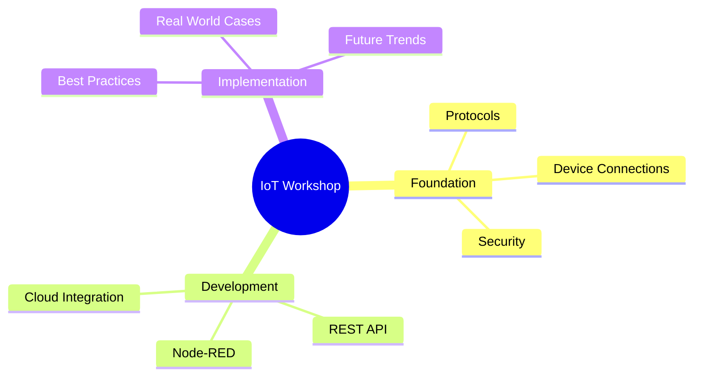

### Key Areas
- Foundation of IoT Technologies
- Practical Development with Node-RED
- Real-world Implementation Strategies

> 📝 **Key Takeaway**: การเรียนรู้ IoT ต้องเข้าใจทั้งด้านฮาร์ดแวร์และซอฟต์แวร์ เพื่อสร้างระบบที่มีประสิทธิภาพและนำไปใช้งานได้จริง
> 💡 **Note**: เน้นภาพรวมในการเริ่มต้น ให้ผู้เรียนเข้าใจว่าเนื้อหาที่จะได้เรียนสามารถนำไปต่อยอดในการทำงานจริงได้อย่างไร

## Slide 2: What is IoT?


### Core Components
- Sensors & Actuators: Collect physical data
- Connectivity: Transfer data to cloud/servers
- Data Processing: Transform raw data to insights
- User Interface: Control and monitor systems

> 📝 **Key Takeaway**: IoT เชื่อมโลกกายภาพเข้ากับโลกดิจิทัล ผ่านระบบเซ็นเซอร์ การเชื่อมต่อ และการประมวลผลข้อมูล
> 💡 **Note**: อธิบายความสำคัญของ IoT ผ่านตัวอย่างที่เห็นได้ในชีวิตประจำวัน เช่น บ้านอัจฉริยะ หรือการติดตามสุขภาพ

## Slide 3: IoT Architecture

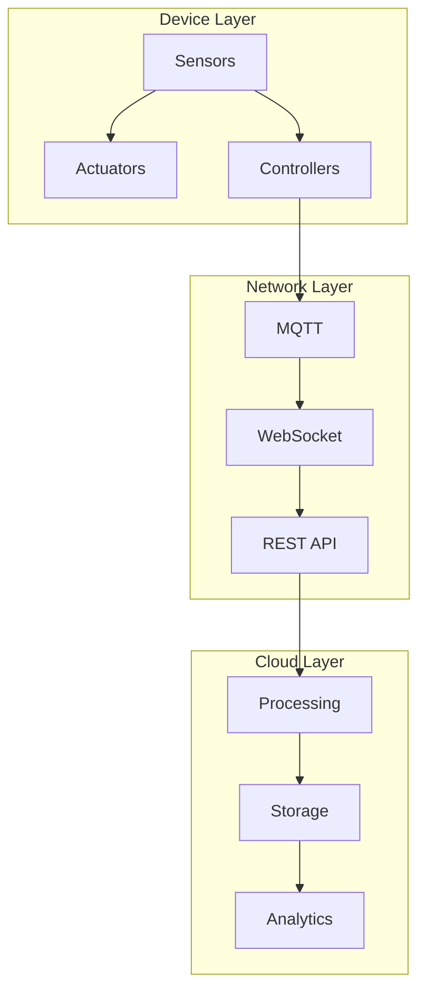

### Four-Tier Architecture
- Device Layer: Hardware interfaces with physical world
- Network Layer: Protocols for data transmission
- Processing Layer: Data transformation and analysis
- Application Layer: User interfaces and controls

> 📝 **Key Takeaway**: สถาปัตยกรรม IoT แบ่งเป็นชั้นที่ทำงานร่วมกัน เริ่มจากอุปกรณ์ที่เก็บข้อมูล ไปจนถึงแอปพลิเคชันที่แสดงผล
> 💡 **Note**: ใช้สีแยกแต่ละชั้นให้ชัดเจน และอธิบายการไหลของข้อมูลจากเซ็นเซอร์จนถึงแอปพลิเคชัน

## Slide 4: IoT Evolution Timeline

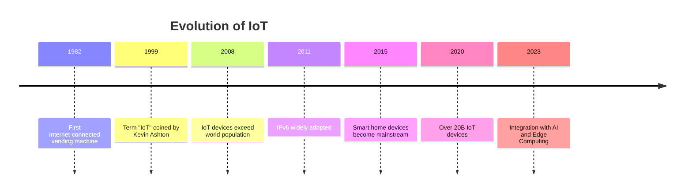

### Key Milestones
- From concept to billions of devices
- Growing ecosystem of technologies
- Evolving from simple to intelligent systems
- Increasing integration with AI and edge computing

> 📝 **Key Takeaway**: IoT มีวิวัฒนาการมายาวนาน จากแนวคิดสู่ความเป็นจริงที่มีอุปกรณ์เชื่อมต่อมากกว่า 20 พันล้านเครื่องทั่วโลก
> 💡 **Note**: เน้นให้เห็นถึงการเติบโตอย่างรวดเร็วของ IoT และทิศทางในอนาคตที่จะผสานรวมกับเทคโนโลยี AI และ Edge Computing

## Slide 5: Core IoT Components

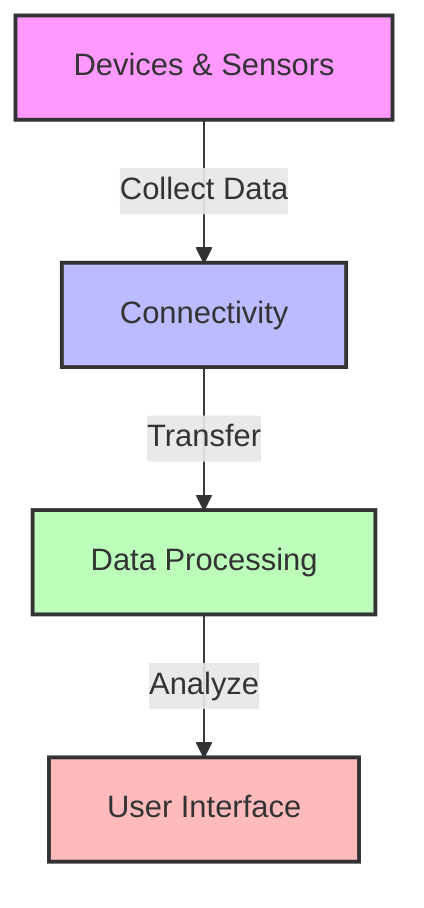

### Essential Elements
- **Hardware**: Sensors, actuators, microcontrollers
- **Connectivity**: WiFi, Bluetooth, Zigbee, MQTT
- **Processing**: Cloud services, edge computing, analytics
- **Interface**: Dashboards, mobile apps, notifications

> 📝 **Key Takeaway**: ระบบ IoT มีองค์ประกอบหลัก 4 ส่วนที่ทำงานร่วมกัน: อุปกรณ์ การเชื่อมต่อ การประมวลผล และส่วนติดต่อผู้ใช้
> 💡 **Note**: แสดงตัวอย่างของแต่ละองค์ประกอบที่ใช้ในเวิร์คช็อป เพื่อให้ผู้เรียนเห็นภาพที่ชัดเจน

## Slide 6: IoT Applications by Industry

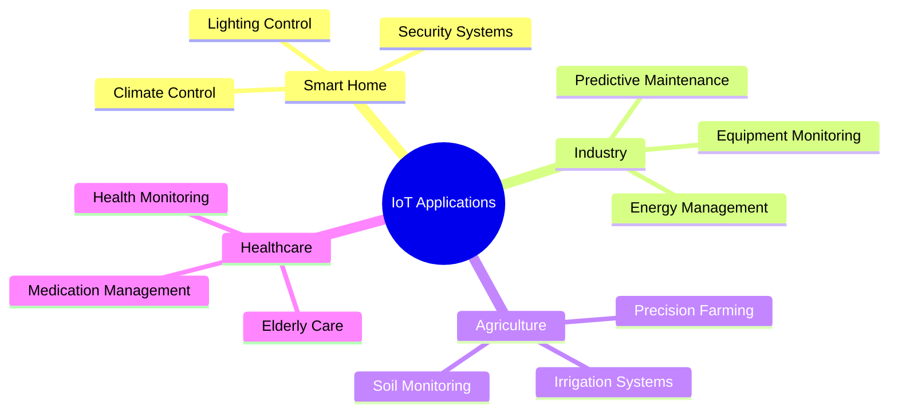

### Industry Impacts
- Revolutionizing multiple sectors
- Creating new business models
- Improving efficiency and productivity
- Enabling data-driven decision making

> 📝 **Key Takeaway**: IoT สร้างผลกระทบในวงกว้างต่อหลากหลายอุตสาหกรรม เปลี่ยนแปลงวิธีการทำงานและสร้างโอกาสทางธุรกิจใหม่ๆ
> 💡 **Note**: ให้ผู้เรียนระบุอุตสาหกรรมที่พวกเขาสนใจ และช่วยกันคิดว่า IoT จะสามารถแก้ปัญหาหรือพัฒนาอุตสาหกรรมนั้นได้อย่างไร

## Slide 7: MQTT Protocol Introduction

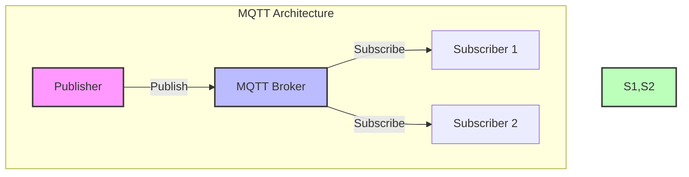

### Key Features
- Lightweight publish/subscribe messaging protocol
- Designed for constrained devices and networks
- Low bandwidth, high latency, unreliable networks
- Perfect for IoT communication requirements

> 📝 **Key Takeaway**: MQTT เป็นโปรโตคอลหลักของ IoT ด้วยรูปแบบ publish/subscribe ที่เหมาะกับอุปกรณ์ที่มีข้อจำกัดด้านทรัพยากร
> 💡 **Note**: เตรียมการสาธิตการทำงานของ MQTT ด้วย MQTT.fx หรือ MQTTX เพื่อให้เข้าใจแนวคิดการ publish/subscribe

## Slide 8: MQTT Quality of Service

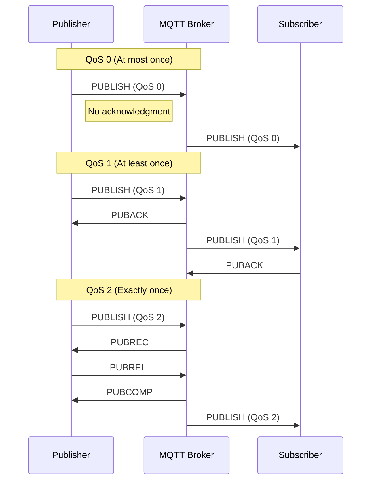

### Quality of Service Levels
- **QoS 0**: Fire and forget - no guarantee
- **QoS 1**: At least once delivery - possible duplicates
- **QoS 2**: Exactly once delivery - guaranteed, no duplicates
- Trade-off between reliability and resource usage

> 📝 **Key Takeaway**: MQTT มีระดับ QoS ให้เลือกใช้ตามความต้องการ ช่วยให้สามารถปรับความสมดุลระหว่างความน่าเชื่อถือและการใช้ทรัพยากร
> 💡 **Note**: อธิบายสถานการณ์ที่เหมาะกับการใช้งาน QoS แต่ละระดับ เช่น QoS 0 สำหรับข้อมูลเซ็นเซอร์ที่ส่งบ่อยๆ, QoS 2 สำหรับคำสั่งสำคัญ

## Slide 9: WebSocket for IoT

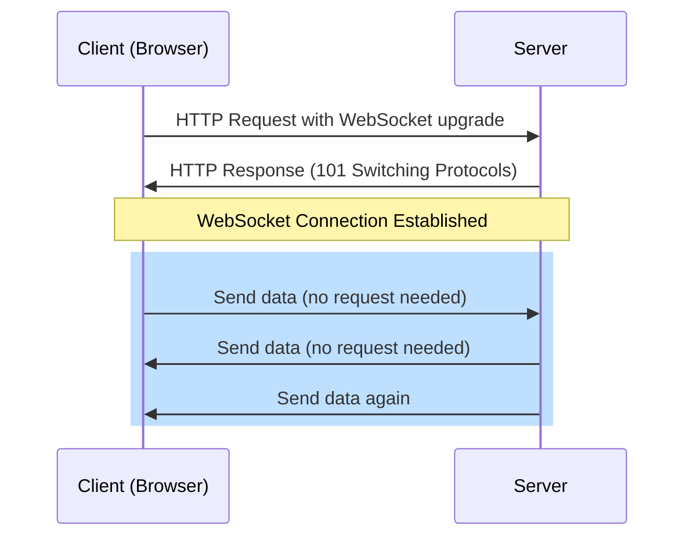

### WebSocket Benefits for IoT
- Full-duplex communication over single TCP connection
- Real-time data without polling
- Works through firewalls (standard ports)
- Reduced overhead compared to HTTP
- Essential for interactive IoT dashboards

> 📝 **Key Takeaway**: WebSocket ช่วยให้เว็บแอปพลิเคชันสามารถแสดงข้อมูล IoT แบบเรียลไทม์ได้อย่างมีประสิทธิภาพ
> 💡 **Note**: เปรียบเทียบ WebSocket กับ HTTP polling เพื่อให้เห็นข้อดีอย่างชัดเจน และแสดงตัวอย่างของแดชบอร์ด IoT ที่ใช้ WebSocket

## Slide 10: Device Connection Setup

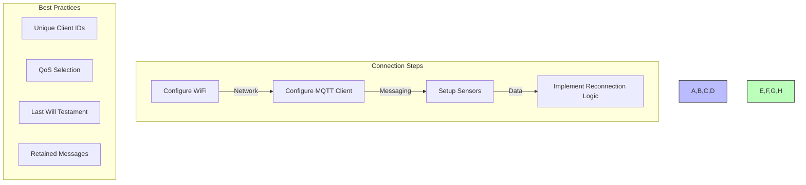

### Implementation Guide
- Configure network and broker connections
- Implement robust error handling
- Set appropriate message parameters
- Design for unreliable networks
- Consider power constraints

> 📝 **Key Takeaway**: การเชื่อมต่ออุปกรณ์ IoT ต้องออกแบบให้ทนทานต่อความไม่เสถียรของเครือข่าย และจัดการกับข้อจำกัดด้านพลังงาน
> 💡 **Note**: แสดงตัวอย่างโค้ดการเชื่อมต่อสำหรับ ESP8266/ESP32 ที่มีการจัดการข้อผิดพลาดอย่างเหมาะสม

## Slide 11: Tasmota Firmware

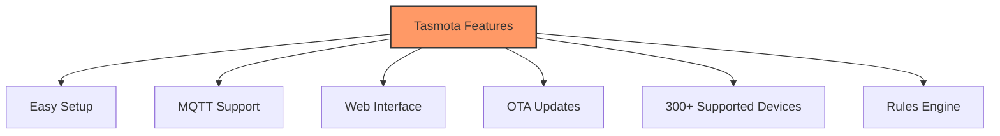

### Key Advantages
- Pre-built firmware for ESP8266/ESP32
- No coding required for basic functionality
- Extensive device support and community
- Secure and reliable operation
- Perfect learning platform for IoT concepts

> 📝 **Key Takeaway**: Tasmota เป็นเฟิร์มแวร์สำเร็จรูปที่ช่วยให้เริ่มต้นใช้งาน IoT ได้อย่างรวดเร็ว โดยไม่ต้องเขียนโค้ดเอง
> 💡 **Note**: เตรียมอุปกรณ์ที่ติดตั้ง Tasmota ไว้ล่วงหน้าสำหรับการสาธิต และแสดงวิธีการตั้งค่าผ่าน Web Interface

## Slide 12: Node-RED Introduction

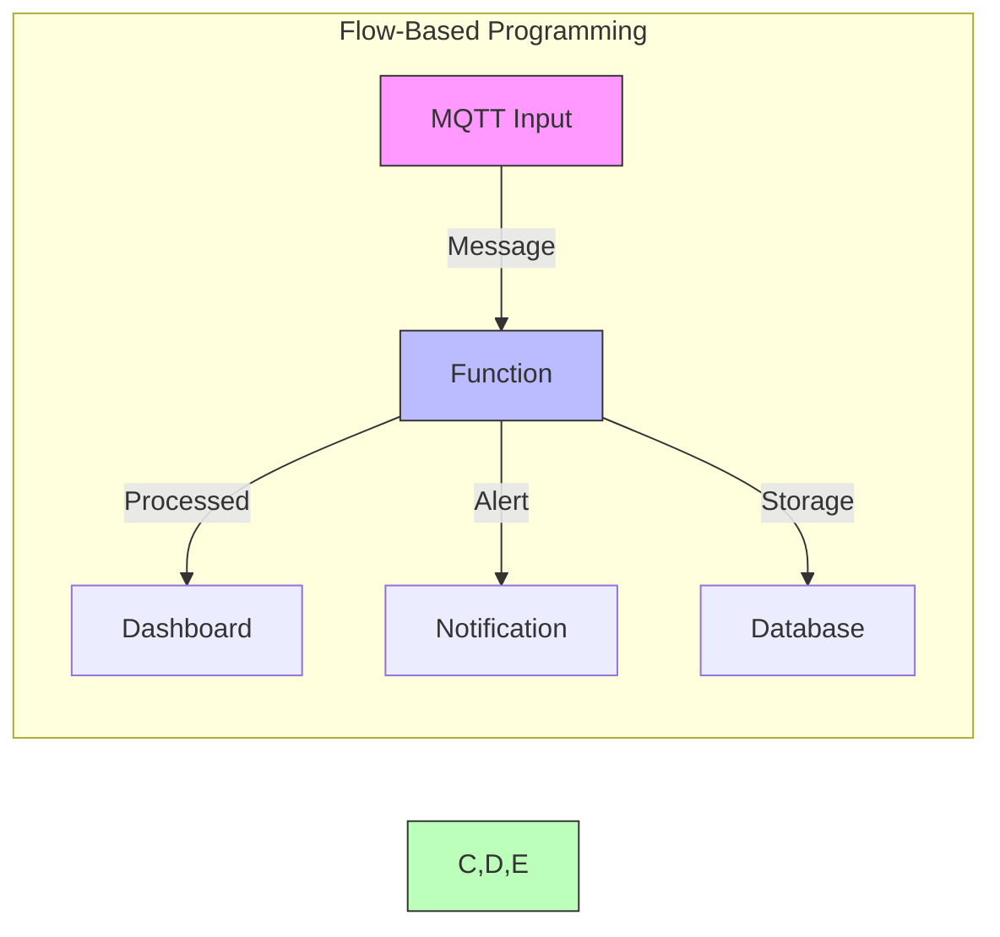

### Platform Features
- Visual programming for IoT workflows
- Low-code approach to application development
- Extensive library of pre-built nodes
- Quick prototyping and deployment
- Built on Node.js, fully extensible

> 📝 **Key Takeaway**: Node-RED เป็นเครื่องมือที่ช่วยให้สร้างระบบ IoT ได้อย่างรวดเร็วด้วยการเขียนโค้ดน้อยที่สุด ผ่านการเชื่อมต่อโหนดต่างๆ
> 💡 **Note**: เตรียม Node-RED ให้พร้อมสำหรับการสาธิตแบบ live และให้ผู้เรียนได้ลองสร้าง flow อย่างง่ายด้วยตนเอง

## Slide 13: Node-RED Dashboard

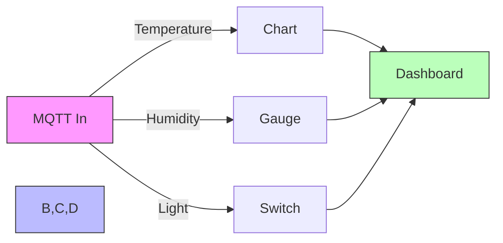

### UI Components
- **Charts**: Line, bar, pie for data visualization
- **Gauges**: Display numeric values visually
- **Controls**: Buttons, sliders, switches
- **Forms**: Input, dropdowns for user interaction
- **Notifications**: Display alerts and messages

> 📝 **Key Takeaway**: Node-RED Dashboard ช่วยให้สร้างส่วนติดต่อผู้ใช้แบบเว็บสำหรับระบบ IoT ได้อย่างรวดเร็ว โดยไม่ต้องเขียนโค้ด HTML/CSS/JavaScript
> 💡 **Note**: แสดงตัวอย่างแดชบอร์ดที่สร้างเสร็จแล้ว และอธิบายวิธีการสร้างส่วนประกอบต่างๆ เช่น กราฟ เกจ ปุ่มควบคุม

## Slide 14: IoT Security Challenges

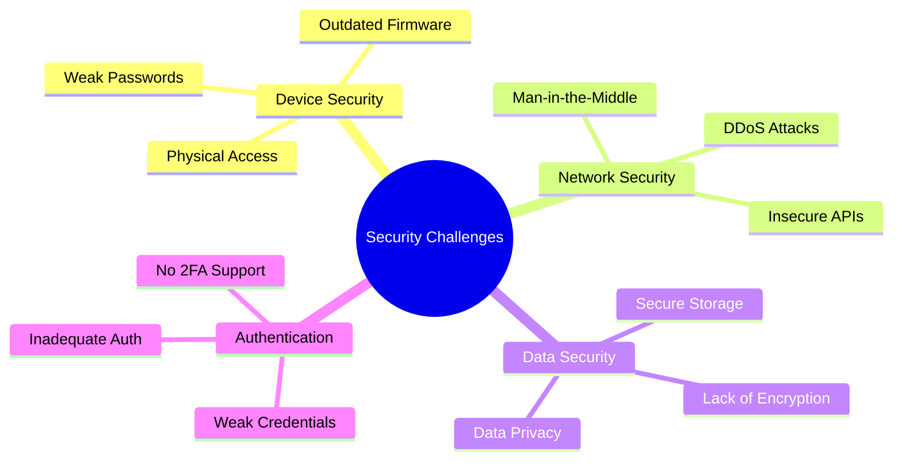

### Key Security Measures
- Implement TLS/SSL for all communications
- Use strong authentication mechanisms
- Keep firmware updated
- Encrypt sensitive data
- Follow security best practices (OWASP IoT)

> 📝 **Key Takeaway**: ความปลอดภัยเป็นความท้าทายสำคัญของระบบ IoT ต้องพิจารณาทั้งความปลอดภัยของอุปกรณ์ เครือข่าย และข้อมูล
> 💡 **Note**: ยกตัวอย่างกรณีศึกษาการโจมตีระบบ IoT ที่เกิดขึ้นจริงและวิธีการป้องกัน เน้นให้เห็นความสำคัญของการออกแบบโดยคำนึงถึงความปลอดภัยตั้งแต่เริ่มต้น

## Slide 15: Future of IoT

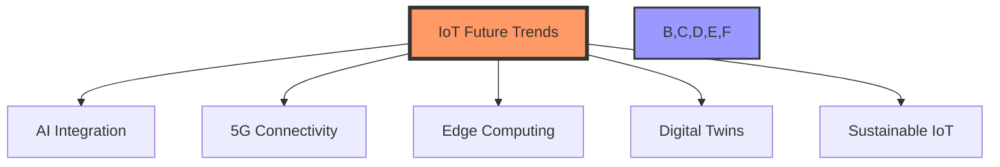

### Emerging Technologies
- **AIoT**: AI-powered IoT for intelligent decisions
- **5G**: Ultra-low latency for critical applications
- **Edge Computing**: Processing closer to data sources
- **Digital Twins**: Virtual representations of physical systems
- **Sustainable IoT**: Energy harvesting and eco-friendly designs

> 📝 **Key Takeaway**: อนาคตของ IoT จะมีการผสมผสานกับเทคโนโลยีอื่นๆ โดยเฉพาะ AI, 5G และ Edge Computing เพื่อสร้างระบบที่ฉลาดและตอบสนองได้ดียิ่งขึ้น
> 💡 **Note**: กระตุ้นให้ผู้เรียนคิดถึงโอกาสและความท้าทายในอนาคต และวิธีที่พวกเขาสามารถเตรียมพร้อมสำหรับการเปลี่ยนแปลงเหล่านี้

## Slide 16: MQTT Topic Structure

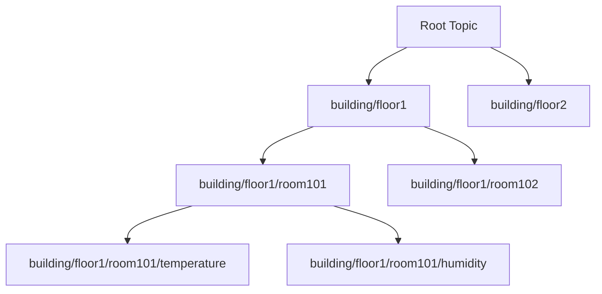

### Topic Hierarchy Best Practices
- Use hierarchical structure for logical organization
- Follow naming conventions: lowercase, no spaces
- Keep topics descriptive but concise
- Use wildcards wisely: + (single level), # (multi-level)
- Example: `home/livingroom/temperature`, `office/floor3/room42/humidity`

> 📝 **Key Takeaway**: การออกแบบโครงสร้าง Topic ที่ดีช่วยให้ระบบจัดการข้อมูลได้อย่างมีประสิทธิภาพ และขยายขนาดได้ง่าย
> 💡 **Note**: แสดงตัวอย่างโครงสร้าง Topic สำหรับกรณีใช้งานจริง เช่น ระบบสมาร์ทโฮม หรือเกษตรอัจฉริยะ

## Slide 17: MQTT Brokers Comparison

| Feature | Mosquitto | EMQX | HiveMQ |
|---------|-----------|------|--------|
| **License** | Open Source | Open/Commercial | Commercial/Community |
| **Performance** | Good | Excellent | Excellent |
| **Max Connections** | Thousands | Millions | Millions |
| **Clustering** | Basic | Advanced | Advanced |
| **UI Dashboard** | No | Yes | Yes |
| **Cloud Option** | Self-hosted | EMQX Cloud | HiveMQ Cloud |
| **Best For** | Small Projects | Enterprise IoT | Enterprise IoT |

### Selection Criteria
- Scale of deployment
- Required functionality
- Available resources
- Technical expertise
- Integration requirements

> 📝 **Key Takeaway**: การเลือก MQTT Broker ที่เหมาะสมขึ้นอยู่กับขนาดของโครงการ งบประมาณ และความต้องการใช้งาน
> 💡 **Note**: EMQX เป็นตัวเลือกที่ดีสำหรับการเริ่มต้น เพราะมีทั้งเวอร์ชันฟรีและระดับองค์กร รวมถึงมี Dashboard ที่ใช้งานง่าย

## Slide 18: ESP8266/ESP32 Programming

```arduino
#include <ESP8266WiFi.h>
#include <PubSubClient.h>

// WiFi & MQTT settings
const char* ssid = "YourWiFi";
const char* password = "WiFiPassword";
const char* mqtt_server = "broker.example.com";

WiFiClient espClient;
PubSubClient client(espClient);

void setup() {
  // Connect to WiFi
  WiFi.begin(ssid, password);
  
  // Setup MQTT connection
  client.setServer(mqtt_server, 1883);
  client.setCallback(callback);
}

void loop() {
  if (!client.connected()) {
    reconnect();
  }
  client.loop();
  
  // Read sensor data and publish
  float temp = readTemperature();
  client.publish("sensors/temperature", String(temp).c_str());
  delay(5000);
}
```

### Key Programming Concepts
- WiFi connection management
- MQTT client setup and callbacks
- Sensor data acquisition
- Timer-based publishing

> 📝 **Key Takeaway**: การเขียนโปรแกรมสำหรับ ESP8266/ESP32 ประกอบด้วยส่วนสำคัญ 3 ส่วน: การเชื่อมต่อเครือข่าย การอ่านข้อมูลเซนเซอร์ และการส่งข้อมูล
> 💡 **Note**: เน้นให้ผู้เรียนเข้าใจโครงสร้างพื้นฐานของโค้ด และสามารถปรับเปลี่ยนตามความต้องการของแต่ละโปรเจค

## Slide 19: Reconnection Logic for IoT Devices

```arduino
void reconnect() {
  // Loop until reconnected
  while (!client.connected()) {
    Serial.print("Attempting MQTT connection...");
    
    // Create a random client ID
    String clientId = "ESP8266-" + String(random(0xffff), HEX);
    
    // Attempt to connect
    if (client.connect(clientId.c_str(), mqtt_user, mqtt_password)) {
      Serial.println("connected");
      
      // Once connected, publish an announcement
      client.publish("device/status", "online");
      
      // Resubscribe to command topics
      client.subscribe("device/command");
    } else {
      Serial.print("failed, rc=");
      Serial.print(client.state());
      Serial.println(" try again in 5 seconds");
      
      // Implement exponential backoff
      delay(min(5000 * retryCount, MAX_RETRY_DELAY));
      retryCount++;
    }
  }
  retryCount = 0;
}
```

### Robust Reconnection Features
- Unique client identifiers
- Exponential backoff for retries
- Status publication on reconnect
- Automatic resubscription
- Error monitoring and logging

> 📝 **Key Takeaway**: ระบบจัดการการเชื่อมต่อใหม่ที่ดีจะช่วยให้อุปกรณ์ IoT ทำงานได้อย่างเสถียรแม้ในสภาพแวดล้อมที่เครือข่ายไม่เสถียร
> 💡 **Note**: เน้นความสำคัญของการหน่วงเวลาแบบ exponential backoff เพื่อป้องกันการโหลดเครือข่ายมากเกินไป และการส่งสถานะเมื่อเชื่อมต่อใหม่

## Slide 20: IoT Development Tools Comparison

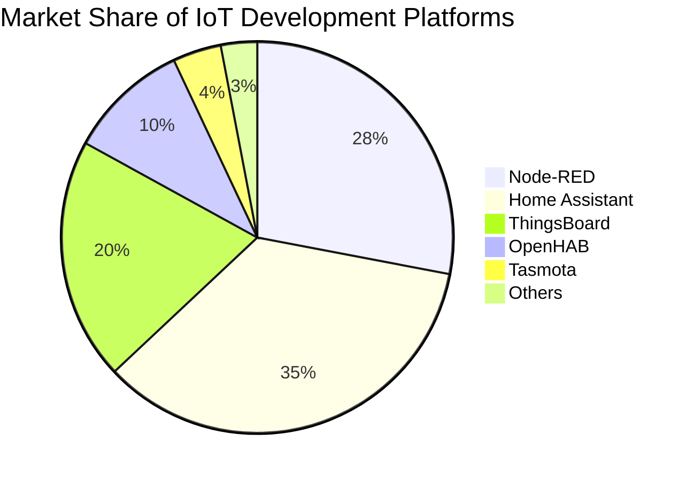

### Platform Comparison
| Platform | Learning Curve | Flexibility | UI Builder | Code Required | Community |
|----------|---------------|------------|------------|---------------|-----------|
| Node-RED | Low | High | Dashboard | Minimal | Large |
| Home Assistant | Medium | Medium | Lovelace UI | Config Files | Largest |
| ThingsBoard | Medium | High | Advanced | For Extensions | Large |
| ESPHome | Low | Medium | Via HA | YAML Config | Growing |
| Custom Code | High | Highest | DIY | Full Coding | Variable |

> 📝 **Key Takeaway**: การเลือกเครื่องมือพัฒนา IoT ควรคำนึงถึงความยากง่ายในการเรียนรู้ ความยืดหยุ่น ความสามารถในการสร้าง UI และขนาดของชุมชนผู้ใช้งาน
> 💡 **Note**: แนะนำให้เริ่มต้นด้วย Node-RED สำหรับผู้เริ่มต้น เพราะมีความยืดหยุ่นสูงและเรียนรู้ได้ง่าย หากต้องการระบบสำหรับบ้านโดยเฉพาะ Home Assistant จะเหมาะสมกว่า

## Slide 21: Node-RED Flow Examples

```json
[
  {
    "id": "temperature_flow",
    "type": "mqtt in",
    "topic": "sensors/temperature",
    "broker": "broker",
    "wires": [
      ["process_temp"]
    ]
  },
  {
    "id": "process_temp",
    "type": "function",
    "func": "msg.payload = JSON.parse(msg.payload);\nreturn msg;",
    "wires": [
      ["temperature_chart", "temperature_alert"]
    ]
  },
  {
    "id": "temperature_alert",
    "type": "switch",
    "rules": [{"t": "gt", "v": "30"}],
    "wires": [
      ["send_notification"]
    ]
  }
]
```

### Common IoT Flows
- Sensor data acquisition and parsing
- Data transformation and filtering
- Storage in time-series database
- Alert and notification systems
- Dashboard visualization
- Device control automation

> 📝 **Key Takeaway**: Node-RED Flow คือชุดการทำงานที่เชื่อมต่อกัน ตั้งแต่การรับข้อมูล การประมวลผล และการแสดงผลข้อมูล IoT
> 💡 **Note**: เตรียม Flow ตัวอย่างที่หลากหลายไว้ล่วงหน้า และแสดงวิธีการนำไปปรับใช้กับโครงการของผู้เรียน

## Slide 22: Data Transformation in Node-RED

```javascript
// Temperature unit conversion
function convertTemperature(msg) {
    if (msg.payload && typeof msg.payload.temperature === 'number') {
        // Convert Celsius to Fahrenheit
        const celsius = msg.payload.temperature;
        msg.payload.temperature_f = (celsius * 9/5) + 32;
        
        // Add temperature category
        if (celsius < 18) {
            msg.payload.category = "cold";
        } else if (celsius < 26) {
            msg.payload.category = "comfortable";
        } else {
            msg.payload.category = "hot";
        }
    }
    return msg;
}
```

### Common Data Transformations
- Unit conversion
- Data normalization
- Filtering outliers
- Statistical analysis (min/max/avg)
- Merging data from multiple sources
- Converting formats (JSON, CSV, XML)

> 📝 **Key Takeaway**: การแปลงข้อมูลใน Node-RED ช่วยให้เราสามารถจัดการข้อมูลดิบจากเซนเซอร์ให้อยู่ในรูปแบบที่นำไปใช้งานต่อได้ง่าย
> 💡 **Note**: แสดงตัวอย่างการใช้ฟังก์ชันแปลงข้อมูลในสถานการณ์จริง เช่น การคำนวณค่าเฉลี่ย การแปลงหน่วย หรือการวิเคราะห์ข้อมูลเบื้องต้น

## Slide 23: Storing IoT Data in Databases

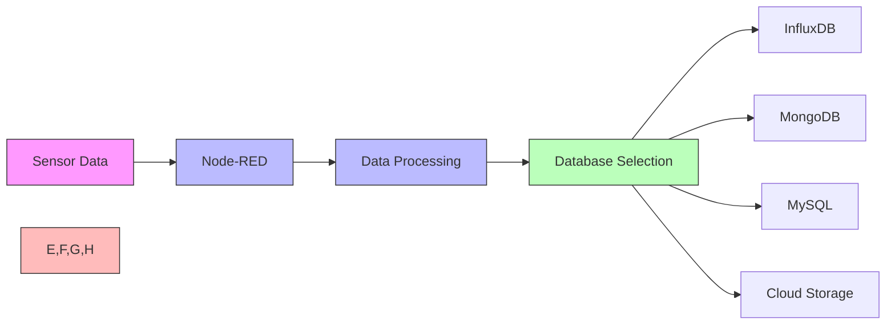

### Database Comparison for IoT
| Database | Type | Best For | Data Volume | Query Speed |
|----------|------|----------|------------|-------------|
| InfluxDB | Time-series | Sensor readings | High | Very Fast |
| MongoDB | Document | Mixed/complex data | Medium-High | Fast |
| MySQL | Relational | Structured data | Low-Medium | Medium |
| SQLite | Embedded | Local storage | Low | Fast (local) |

> 📝 **Key Takeaway**: การเลือกฐานข้อมูลที่เหมาะสมสำหรับระบบ IoT ช่วยให้เก็บข้อมูลได้อย่างมีประสิทธิภาพและเรียกใช้ข้อมูลได้รวดเร็ว
> 💡 **Note**: สำหรับข้อมูล time-series จากเซนเซอร์ แนะนำให้ใช้ InfluxDB เพราะออกแบบมาเพื่อข้อมูลประเภทนี้โดยเฉพาะ

## Slide 24: IoT Alert Systems

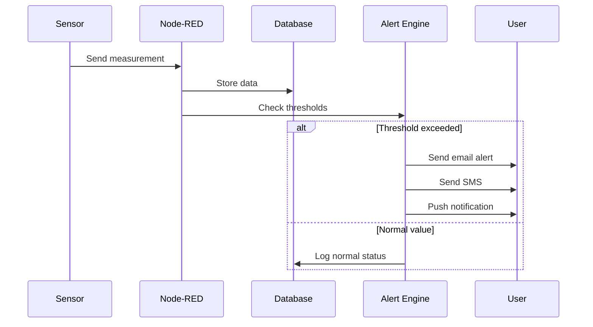

### Alert System Components
- Threshold definition and management
- Multiple notification channels
- Alert prioritization and escalation
- Alert suppression (prevent flooding)
- Alert history and acknowledgment
- Custom alert conditions (combinations, trends)

> 📝 **Key Takeaway**: ระบบแจ้งเตือน IoT ที่ดีต้องสามารถตรวจจับเหตุการณ์สำคัญ แจ้งเตือนผ่านช่องทางที่เหมาะสม และป้องกันการแจ้งเตือนมากเกินไป
> 💡 **Note**: แสดงตัวอย่างการใช้ Node-RED สร้างระบบแจ้งเตือนผ่าน LINE Notify, Email หรือ Telegram

## Slide 25: TLS/SSL for MQTT Security

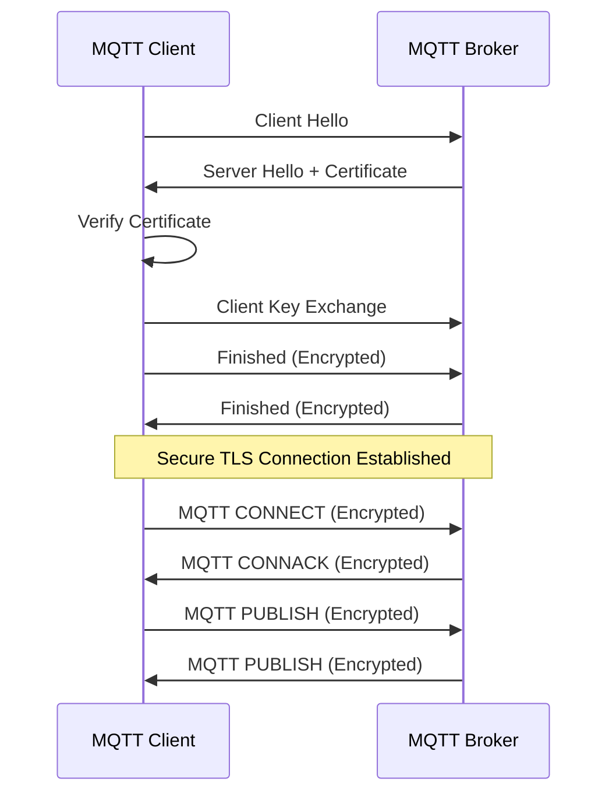

### Implementing TLS/SSL for MQTT
```bash
# Generate self-signed certificates
openssl req -new -x509 -days 365 -extensions v3_ca -keyout ca.key -out ca.crt
openssl genrsa -out server.key 2048
openssl req -out server.csr -key server.key -new
openssl x509 -req -in server.csr -CA ca.crt -CAkey ca.key -CAcreateserial -out server.crt -days 365
```

> 📝 **Key Takeaway**: การใช้ TLS/SSL ช่วยเข้ารหัสการสื่อสารระหว่างอุปกรณ์และ MQTT Broker ป้องกันการดักฟังข้อมูลและการโจมตีแบบ man-in-the-middle
> 💡 **Note**: แสดงการตั้งค่า TLS ใน MQTT Broker และการเชื่อมต่อด้วยไคลเอนต์ พร้อมตรวจสอบว่าการเชื่อมต่อเป็นแบบเข้ารหัส

## Slide 26: JWT Authentication for IoT

```javascript
// Node-RED function to generate JWT token
function generateToken(msg) {
    const jwt = global.get('jwt');
    const deviceId = msg.payload.deviceId;
    const secret = process.env.JWT_SECRET;
    
    const token = jwt.sign(
        { 
            deviceId: deviceId,
            type: 'device',
            permissions: ['read', 'write'] 
        },
        secret,
        { expiresIn: '24h' }
    );
    
    msg.payload = { token: token };
    return msg;
}
```

### JWT Authentication Flow
1. Device requests token with credentials
2. Server validates credentials and issues JWT
3. Device includes JWT in subsequent requests
4. Server validates token on each request
5. Token expires after set period (security)
6. Device requests new token when needed

> 📝 **Key Takeaway**: JWT เป็นวิธีการยืนยันตัวตนที่มีประสิทธิภาพสำหรับระบบ IoT เพราะไม่ต้องเก็บสถานะในเซิร์ฟเวอร์และลดการดึงข้อมูลจากฐานข้อมูล
> 💡 **Note**: แนะนำให้เก็บ Secret Key ไว้อย่างปลอดภัย ตั้งเวลาหมดอายุที่เหมาะสม และระวังขนาดของ Token ที่อาจมีขนาดใหญ่เกินไปสำหรับอุปกรณ์ IoT บางประเภท

## Slide 27: IoT Security Testing Tools

| Tool | Purpose | Features | Difficulty |
|------|---------|----------|------------|
| Nmap | Network scanning | Port discovery, OS detection | Medium |
| Wireshark | Packet analysis | Protocol inspection, Traffic capture | High |
| MQTT-PWN | MQTT vulnerabilities | Broker scanning, Authentication bypass | Medium |
| SecureScuttlebutt | IoT simulation | Device emulation, Attack simulation | High |
| IoTSeeker | Default credential check | Quick scan, Automated testing | Low |
| Burp Suite | Web API testing | Request interception, Vulnerability scanning | High |
| Firmware-Analysis-Toolkit | Firmware security | Emulation, Vulnerability detection | Very High |

### Security Testing Methodology
1. Reconnaissance - Discover devices and services
2. Vulnerability scanning - Find potential weaknesses
3. Authentication testing - Verify credential security
4. Communication testing - Check encryption and protocols
5. Update mechanisms - Test firmware update security
6. Physical security - Evaluate device tamper protection

> 📝 **Key Takeaway**: การทดสอบความปลอดภัย IoT จำเป็นต้องใช้เครื่องมือที่หลากหลายเพื่อครอบคลุมทั้งเครือข่าย โปรโตคอล และตัวอุปกรณ์
> 💡 **Note**: เน้นความสำคัญของการทดสอบอย่างมีจริยธรรมและได้รับอนุญาต และการทำความเข้าใจผลลัพธ์อย่างถูกต้อง

## Slide 28: OWASP IoT Security Principles

```mermaid
mindmap
  root((OWASP IoT<br>Security))
    Secure Ecosystem
      Secure Supply Chain
      Third-party Components
      Update Management
    Device Security
      Secure Boot
      Hardware Security
      Physical Protection
    Communication Security
      Encryption
      Authentication
      Access Control
    Data Protection
      Storage Security
      Privacy Controls
      Regulatory Compliance
```

### OWASP IoT Top 10 Vulnerabilities
1. Weak, guessable, or hardcoded passwords
2. Insecure network services
3. Insecure ecosystem interfaces
4. Lack of secure update mechanism
5. Use of insecure or outdated components
6. Insufficient privacy protection
7. Insecure data transfer and storage
8. Lack of device management
9. Insecure default settings
10. Lack of physical hardening

> 📝 **Key Takeaway**: OWASP IoT เป็นแนวทางความปลอดภัยที่ครอบคลุมด้านต่างๆ ของระบบ IoT ตั้งแต่อุปกรณ์ การสื่อสาร ไปจนถึงการจัดการข้อมูล
> 💡 **Note**: ให้ความสำคัญกับการออกแบบระบบ IoT โดยคำนึงถึงความปลอดภัยตั้งแต่เริ่มต้น (Security by Design) และมาตรการป้องกันที่หลากหลายชั้น (Defense in Depth)

## Slide 29: Secure Device Provisioning

```mermaid
sequenceDiagram
    participant D as Device
    participant M as Manufacturing
    participant P as Provisioning Server
    participant C as Cloud Platform
    
    M->>D: Install secure boot keys
    M->>M: Record device identity
    M->>P: Register device identities
    
    D->>P: Initial connection (with device ID)
    P->>P: Verify device identity
    P->>D: Issue unique credentials
    D->>P: Authenticate with credentials
    P->>C: Register device in platform
    P->>D: Provide cloud connection details
    D->>C: Connect to cloud services
    C->>C: Apply access controls
    
    Note over D,C: Secure Device Onboarding Complete
```

### Secure Provisioning Essentials
- Unique device identifiers
- Factory security initialization
- Certificate-based authentication
- Just-in-time provisioning
- Zero-touch configuration
- Secure storage of credentials
- Automatic rotation of keys/secrets

> 📝 **Key Takeaway**: การเตรียมอุปกรณ์ IoT อย่างปลอดภัย (Secure Provisioning) เป็นขั้นตอนสำคัญที่ต้องทำอย่างเหมาะสมเพื่อสร้างพื้นฐานความปลอดภัยตั้งแต่เริ่มต้น
> 💡 **Note**: เน้นการสร้างกระบวนการที่เป็นระบบและสามารถทำซ้ำได้สำหรับการเตรียมอุปกรณ์จำนวนมาก พร้อมการบันทึกข้อมูลสำหรับการตรวจสอบย้อนกลับ

## Slide 30: Real-world IoT Security Case Studies

### Case Study 1: Smart Home Device Vulnerabilities
- Unencrypted local communications
- Default credentials never changed
- No update mechanism
- Result: Remote access to home networks, privacy breach

### Case Study 2: Industrial IoT Attack Vector
- Legacy equipment with modern IoT gateways
- Insufficient network segregation
- Plaintext protocols used internally
- Result: Production disruption, data exfiltration

### Case Study 3: Medical Device Security
- Outdated operating systems
- Bluetooth pairing vulnerabilities
- Insecure storage of patient data
- Result: Patient safety risks, regulatory violations

### Security Incident Response Plan
1. Detection & Containment
2. Analysis & Evidence Collection
3. Remediation & Recovery
4. Lessons Learned & Adaptation

> 📝 **Key Takeaway**: กรณีศึกษาด้านความปลอดภัย IoT ช่วยให้เราเรียนรู้จากความผิดพลาดในอดีต และวางแผนป้องกันปัญหาที่อาจเกิดขึ้นในระบบของเรา
> 💡 **Note**: เน้นให้เห็นว่าการละเลยความปลอดภัยแม้เพียงขั้นตอนเดียวอาจนำไปสู่ผลกระทบรุนแรงได้ และการมีแผนรับมือเหตุการณ์ด้านความปลอดภัยเป็นสิ่งสำคัญ
