# IoT Overview Slides

---

## Slide 1: The IoT Revolution - Connecting Our World

### What Makes IoT Transformative?

- **Definition**: Network of physical devices embedded with sensors, software & connectivity
- **Scale**: By 2025, over 75 billion connected devices worldwide
- **Impact**: Fundamentally changing how we interact with our environment
- **Value**: Creating $11.1 trillion in economic value annually by 2025

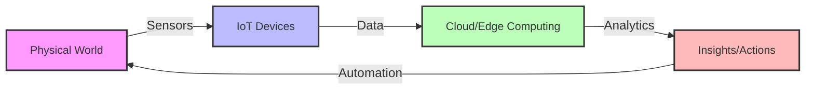

> **Key takeaway (สำหรับผู้สอน)**: IoT คือการเปลี่ยนแปลงพื้นฐานของเทคโนโลยีที่ไม่ได้เป็นเพียงเทรนด์ชั่วคราว แต่เป็นการปฏิวัติที่เชื่อมโยงโลกกายภาพเข้ากับโลกดิจิทัล ซึ่งสร้างการเปลี่ยนแปลงในทุกอุตสาหกรรม

**ธีมหลัก**: การเกริ่นนำเทคโนโลยี IoT เพื่อสร้างความเข้าใจพื้นฐาน

**ข้อแนะนำ**: ควรเริ่มด้วยการถามผู้เรียนว่ารู้จักอุปกรณ์ IoT ใดบ้างที่ใช้ในชีวิตประจำวัน เพื่อดึงความสนใจและทำให้เห็นภาพว่า IoT ไม่ใช่เรื่องไกลตัว และอาจให้ผู้เรียนยกตัวอย่างการใช้งาน IoT ที่พบเห็นในชีวิตประจำวัน เช่น สมาร์ทวอทช์ กล้องวงจรปิดที่ดูผ่านมือถือ หรือเครื่องปรับอากาศที่สั่งงานผ่านแอพ

---

## Slide 2: The Building Blocks of IoT Systems

### The Four Essential Components of IoT

1. **Devices & Sensors** - The physical layer collecting data
   - Sensors, actuators, microcontrollers, embedded systems
   - Constrained in power, memory, computing capabilities

2. **Connectivity** - The communication layer
   - Short-range: WiFi, Bluetooth, Zigbee, Z-Wave
   - Long-range: LoRaWAN, NB-IoT, LTE-M, 5G
   - Protocols: MQTT, CoAP, HTTP, WebSocket

3. **Data Processing** - The intelligence layer
   - Edge computing (local processing)
   - Cloud computing (scalable processing)
   - Analytics, AI/ML, data storage

4. **Applications** - The interface layer
   - Dashboards, mobile apps, alerts
   - Business intelligence
   - Automation systems

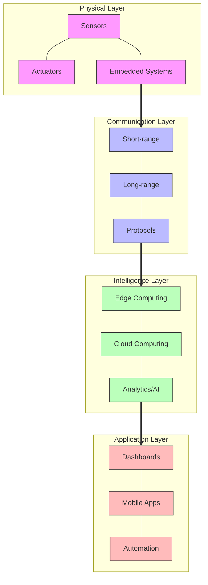

> **Key takeaway (สำหรับผู้สอน)**: ระบบ IoT ที่สมบูรณ์ต้องประกอบด้วย 4 ชั้นที่เชื่อมโยงกัน: อุปกรณ์ที่เก็บข้อมูล, การเชื่อมต่อเพื่อส่งข้อมูล, การประมวลผลข้อมูล และแอปพลิเคชันสำหรับแสดงผลและควบคุม ซึ่งแต่ละชั้นมีความสำคัญและต้องทำงานสอดประสานกัน

**ธีมหลัก**: องค์ประกอบพื้นฐานของระบบ IoT

**ข้อแนะนำ**: ให้ผู้เรียนวิเคราะห์อุปกรณ์ IoT ที่พวกเขาคุ้นเคย (เช่น สมาร์ทวอทช์) ว่ามีองค์ประกอบทั้ง 4 อย่างไรบ้าง เพื่อให้เห็นภาพชัดเจนขึ้น และอธิบายว่าในการพัฒนาโครงการ IoT เราจะต้องออกแบบและพัฒนาทั้ง 4 ส่วนนี้ให้ทำงานร่วมกันได้อย่างมีประสิทธิภาพ

---

## Slide 3: IoT Connectivity Technologies - Choosing the Right Network

### Comparing IoT Connectivity Options

| Technology | Range | Battery Life | Bandwidth | Cost | Use Cases |
|------------|-------|--------------|-----------|------|-----------|
| **WiFi** | 50-100m | Hours-Days | High | Low | Smart homes, video streaming |
| **Bluetooth LE** | 10-100m | Months-Years | Low-Medium | Very Low | Wearables, indoor positioning |
| **Zigbee/Z-Wave** | 10-100m | Years | Low | Medium | Home automation, smart lighting |
| **LoRaWAN** | 2-15km | Years | Very Low | Low | Agriculture, smart cities |
| **NB-IoT** | 1-10km | Years | Low | Medium | Metering, parking sensors |
| **5G** | 1-10km | Hours-Days | Very High | High | Autonomous vehicles, AR/VR |

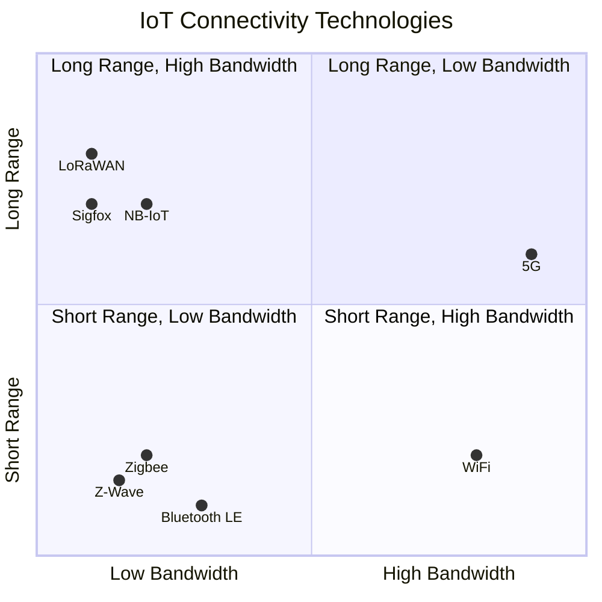

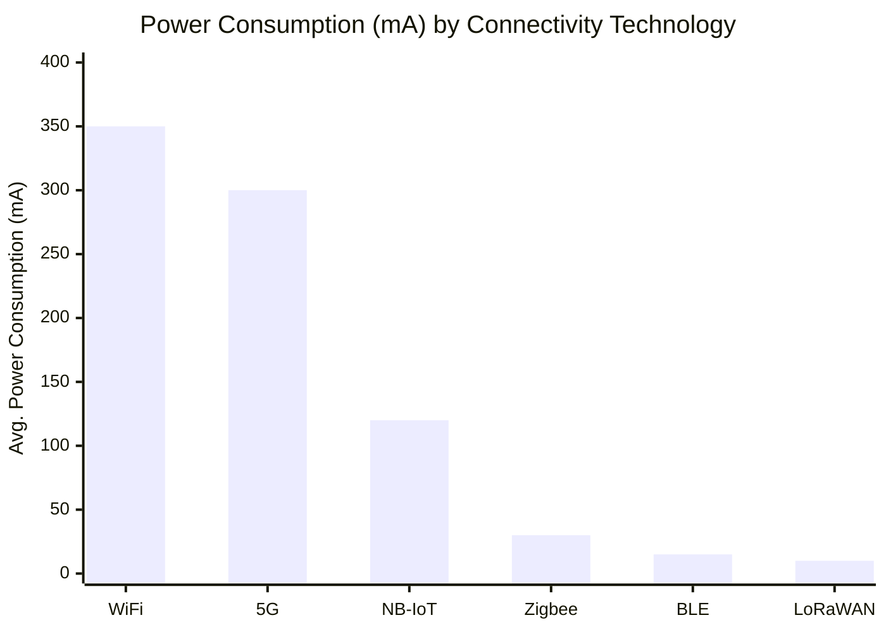

> **Key takeaway (สำหรับผู้สอน)**: การเลือกเทคโนโลยีการเชื่อมต่อเป็นหนึ่งในการตัดสินใจสำคัญที่สุดในการออกแบบระบบ IoT เพราะส่งผลต่อการใช้พลังงาน ระยะทาง แบนด์วิดธ์ และต้นทุน การเลือกเทคโนโลยีที่เหมาะสมขึ้นอยู่กับเงื่อนไขการใช้งานและข้อจำกัดของโครงการ

**ธีมหลัก**: เทคโนโลยีการเชื่อมต่อและโปรโตคอลสำหรับ IoT

**ข้อแนะนำ**: อธิบายว่าไม่มีเทคโนโลยีการเชื่อมต่อใดที่ดีที่สุดสำหรับทุกงาน แต่เป็นการเลือกให้เหมาะกับความต้องการเฉพาะ และยกตัวอย่างว่าโครงการประเภทใดควรใช้เทคโนโลยีใด เช่น ระบบติดตามวัวในทุ่งหญ้าควรใช้ LoRaWAN เพราะต้องการพลังงานต่ำและระยะไกล แต่กล้องวงจรปิดอัจฉริยะควรใช้ WiFi เพราะต้องการแบนด์วิดธ์สูง

---

## Slide 4: IoT Data Flow & Processing Models

### From Device to Insight: The IoT Data Journey

**1. Data Collection**
   - Sensor readings, user interactions, environmental monitoring
   - Data types: numerical, categorical, images, audio, video
   - Sampling frequency: continuous, periodic, event-based

**2. Data Transport & Communication**
   - Protocol selection (MQTT, CoAP, HTTP)
   - Data compression and security
   - Quality of Service considerations

**3. Data Processing Models**

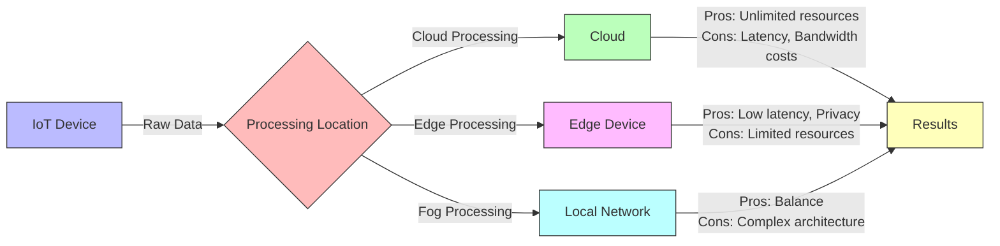

**4. Data Analytics & Insights**
   - Descriptive analytics (What happened?)
   - Diagnostic analytics (Why did it happen?)
   - Predictive analytics (What might happen?)
   - Prescriptive analytics (What should we do?)

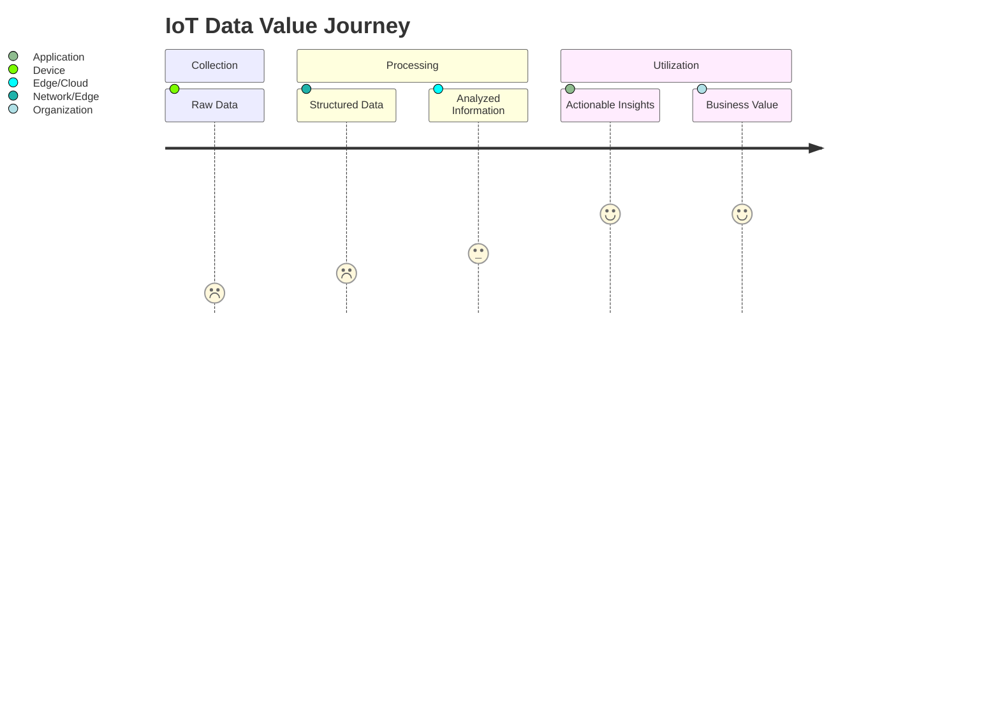

> **Key takeaway (สำหรับผู้สอน)**: การออกแบบการไหลของข้อมูลจากอุปกรณ์สู่การตัดสินใจเป็นขั้นตอนสำคัญในการพัฒนาระบบ IoT โดยต้องพิจารณาว่าควรประมวลผลข้อมูลที่จุดใด (Edge, Fog, Cloud) และแต่ละจุดมีข้อดีและข้อเสียต่างกันอย่างไร

**ธีมหลัก**: กระบวนการประมวลผลข้อมูล IoT และรูปแบบการประมวลผล

**ข้อแนะนำ**: ใช้ตัวอย่างที่เป็นรูปธรรม เช่น กล้องอัจฉริยะที่ตรวจจับใบหน้าควรประมวลผลที่ Edge เพื่อความเป็นส่วนตัวและลดความหน่วงเวลา แต่การวิเคราะห์แนวโน้มอุณหภูมิจากเซ็นเซอร์หลายร้อยตัวควรทำที่ Cloud เพื่อมีทรัพยากรเพียงพอ

---

## Slide 5: IoT Ecosystem & Market Dynamics

### The Growing IoT Ecosystem

**Key Stakeholders:**
- **Hardware Manufacturers**: Sensor makers, Chip designers (ARM, Intel)
- **Connectivity Providers**: Telecom companies, Network service providers
- **Platform Providers**: AWS IoT, Azure IoT, Google IoT Core
- **System Integrators**: Consulting firms, Solution providers
- **End Users**: Businesses, Consumers, Governments

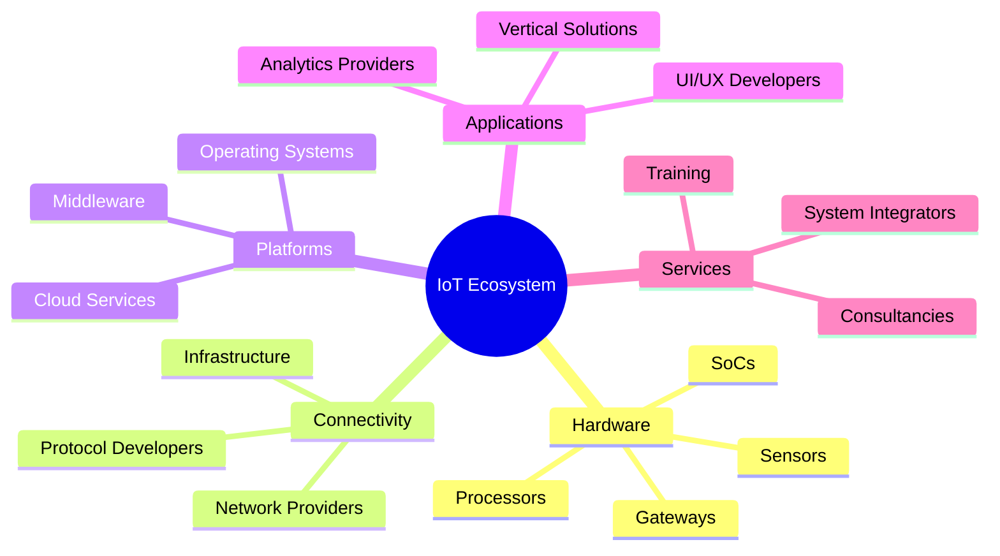

### IoT Market Growth by Segment (2023-2026)

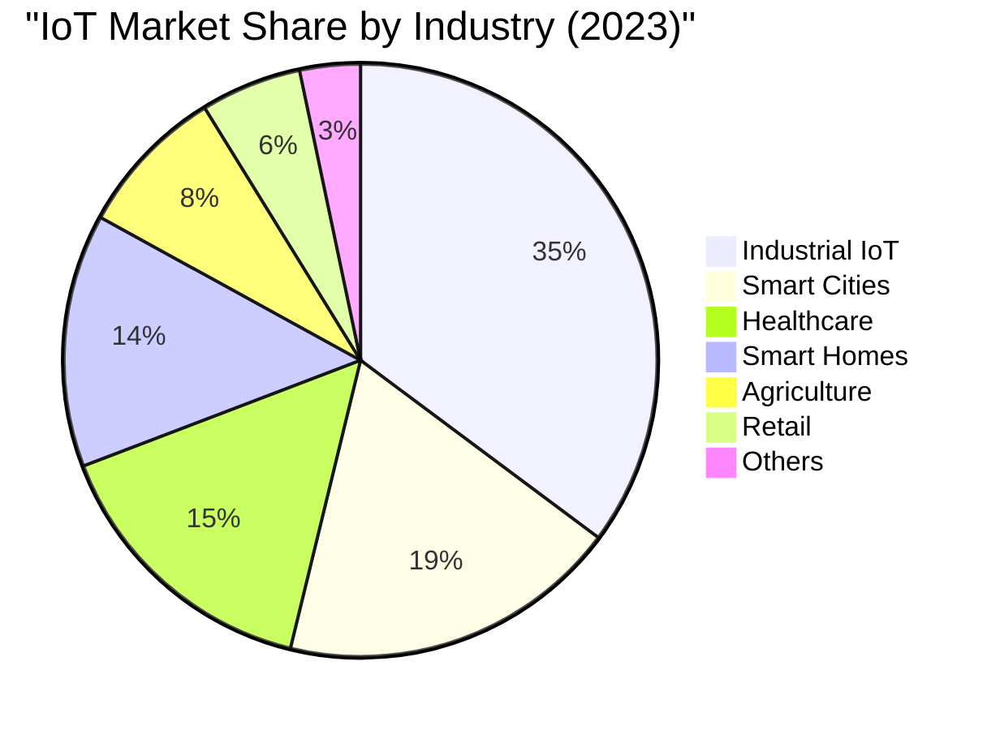

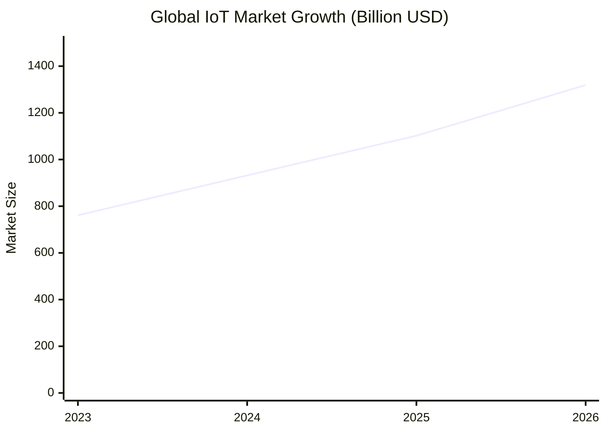

> **Key takeaway (สำหรับผู้สอน)**: IoT ไม่ใช่เทคโนโลยีเดี่ยว แต่เป็นระบบนิเวศที่ซับซ้อนที่ประกอบด้วยผู้เล่นหลายฝ่าย การพัฒนาโซลูชัน IoT ที่ประสบความสำเร็จต้องอาศัยความร่วมมือระหว่างผู้เชี่ยวชาญหลายด้าน และเข้าใจแนวโน้มตลาดและความต้องการของอุตสาหกรรม

**ธีมหลัก**: ระบบนิเวศและตลาดของ IoT

**ข้อแนะนำ**: เน้นย้ำว่าการเข้าใจระบบนิเวศ IoT จะช่วยให้ผู้เรียนมองเห็นโอกาสทางอาชีพที่หลากหลายในวงการ IoT และทิศทางการเติบโตของอุตสาหกรรม ให้ผู้เรียนอภิปรายว่าพวกเขาสนใจทำงานในส่วนใดของระบบนิเวศ IoT และเพราะเหตุใด

---

## Slide 6: MQTT - The Backbone of IoT Communication

### Understanding the Publish/Subscribe Model

**MQTT (Message Queuing Telemetry Transport)**
- Lightweight messaging protocol designed for constrained devices
- Created in 1999 for oil pipeline monitoring via satellite
- Standardized by OASIS in 2013 (v3.1.1) and 2019 (v5)
- Ideal for low bandwidth, high latency, or unreliable networks

**Core Components:**
- **Publisher**: Sends messages to specific topics
- **Subscriber**: Receives messages from subscribed topics 
- **Broker**: Central server that routes messages between publishers and subscribers

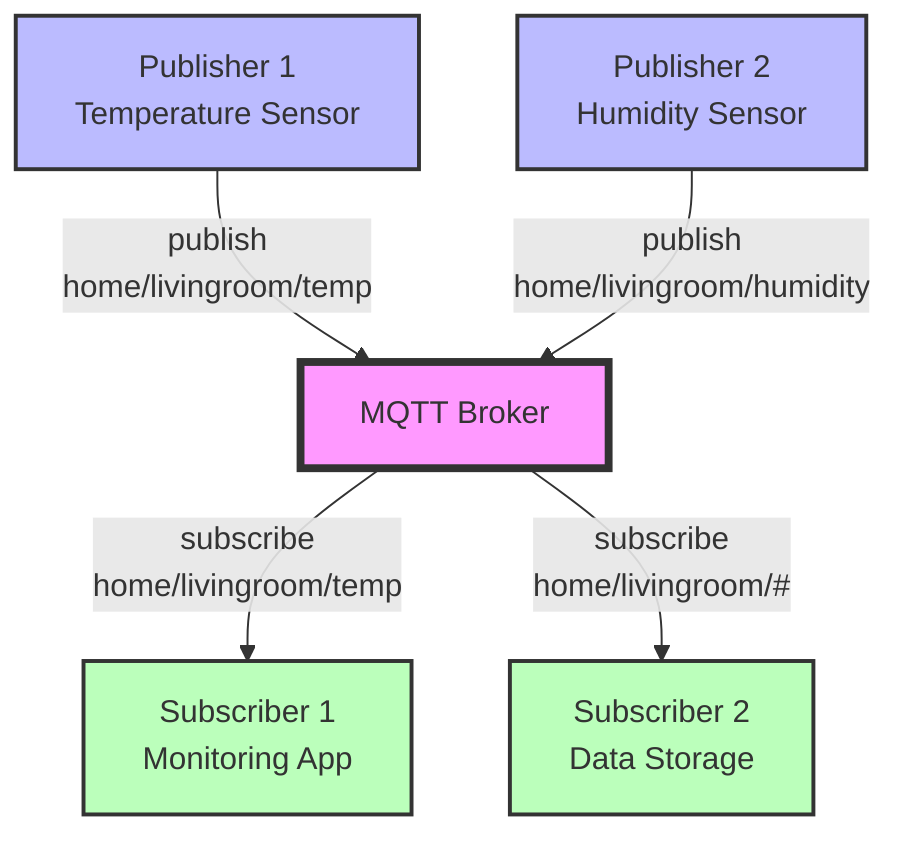

**Key Advantages for IoT:**
1. **Decoupling**: Publishers and subscribers don't need to know each other
2. **Low overhead**: Minimal header (as small as 2 bytes)
3. **Reliable delivery**: Three levels of Quality of Service (QoS)
4. **Last Will and Testament**: Notification when devices disconnect unexpectedly
5. **Retained messages**: New subscribers can receive the last known value

> **Key takeaway (สำหรับผู้สอน)**: MQTT เป็นโปรโตคอลที่เหมาะสมที่สุดสำหรับการสื่อสารในระบบ IoT เนื่องจากถูกออกแบบมาเฉพาะสำหรับอุปกรณ์ที่มีข้อจำกัดด้านพลังงานและการเชื่อมต่อ การทำงานแบบ Publish/Subscribe ทำให้ระบบมีความยืดหยุ่น ขยายขนาดได้ง่าย และมีประสิทธิภาพสูงกว่าการสื่อสารแบบ client-server ทั่วไป

**ธีมหลัก**: แนะนำโปรโตคอล MQTT ซึ่งเป็นพื้นฐานสำคัญของการสื่อสารใน IoT

**ข้อแนะนำ**: ควรเปรียบเทียบ MQTT กับระบบการสื่อสารแบบดั้งเดิมที่ผู้เรียนคุ้นเคย เช่น HTTP เพื่อให้เห็นข้อแตกต่างและข้อดีของ MQTT อย่างชัดเจน และยกตัวอย่างประกอบว่าทำไมการสื่อสารแบบ Publish/Subscribe จึงเหมาะสมกับ IoT มากกว่าแบบ Request/Response

---

## Slide 7: MQTT Topics & Quality of Service

### The Hierarchical Structure of MQTT Topics

**Topic Structure:**
- Organized in hierarchical levels separated by forward slashes (/)
- Examples: `home/livingroom/temperature`, `factory/zone3/machine7/status`
- Case-sensitive with no leading or trailing slashes

**Topic Wildcards:**
- Single-level (+): `home/+/temperature` matches `home/livingroom/temperature` and `home/kitchen/temperature`
- Multi-level (#): `home/#` matches all topics starting with `home/`

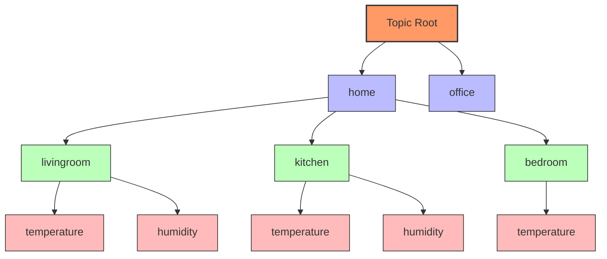

### Quality of Service (QoS) Levels

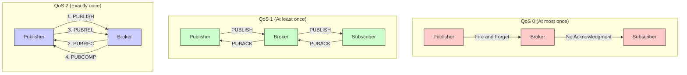

**QoS Use Cases:**
- **QoS 0**: Environmental sensors reporting frequent readings (temperature, light)
- **QoS 1**: Status updates where missing data is problematic but duplicates are acceptable
- **QoS 2**: Financial transactions, critical control commands, medical device instructions

```mermaid
xychart-beta
    title "Comparison of MQTT QoS Levels"
    x-axis ["QoS 0", "QoS 1", "QoS 2"]
    y-axis "Value (1-10 scale)" 0 --> 10
    bar [["Reliability", 3, 7, 10], ["Speed", 10, 7, 4], ["Overhead", 2, 5, 8]]
    
```

> **Key takeaway (สำหรับผู้สอน)**: การออกแบบโครงสร้าง Topic ที่ดีเป็นหัวใจสำคัญของระบบ MQTT ที่มีประสิทธิภาพ Topics ควรมีความเป็นระเบียบ มีโครงสร้างที่ชัดเจน และสามารถขยายได้ในอนาคต ส่วนการเลือก QoS ที่เหมาะสมเป็นการสร้างสมดุลระหว่างความน่าเชื่อถือและประสิทธิภาพ การเลือกใช้ QoS สูงเกินความจำเป็นอาจทำให้ระบบช้าลงและใช้ทรัพยากรมากเกินไป

**ธีมหลัก**: โครงสร้างของ MQTT Topics และระดับคุณภาพของการให้บริการ (QoS)

**ข้อแนะนำ**: ให้ผู้เรียนลองออกแบบโครงสร้าง Topic สำหรับระบบ IoT เช่น ระบบสมาร์ทโฮม หรือระบบเกษตรอัจฉริยะ เพื่อให้เห็นภาพการนำไปใช้งานจริง และอธิบายความแตกต่างของ QoS แต่ละระดับด้วยตัวอย่างที่เข้าใจง่าย เช่น QoS 0 เหมือนการโยนจดหมายใส่ตู้ไปรษณีย์โดยไม่ได้ลงทะเบียน QoS 1 เหมือนการส่งจดหมายลงทะเบียนที่มีการเซ็นรับ และ QoS 2 เหมือนการทำธุรกรรมทางการเงินที่มีการตรวจสอบซ้ำหลายขั้นตอน

---

## Slide 8: IoT Device Connection Architecture

### The Multi-layered Connection Infrastructure

**Connection Layers:**
- **Physical Layer**: Hardware components (sensors, microcontrollers)
- **Network Layer**: Communication technologies (WiFi, BLE, LoRa)
- **Transport Layer**: Communication protocols (TCP/IP, UDP)
- **Application Layer**: Messaging protocols (MQTT, WebSocket, HTTP)

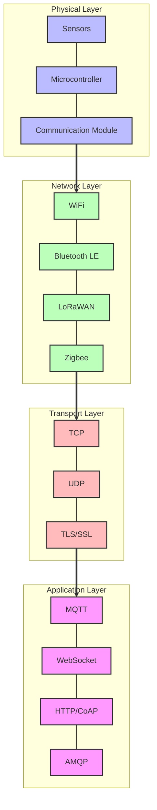

**Connection Challenges in IoT Environments:**
- **Reliability**: Handling intermittent connectivity in challenging environments
- **Scalability**: Managing thousands to millions of connected devices
- **Security**: Ensuring data integrity and authentication
- **Power Efficiency**: Optimizing connection patterns for battery life
- **Interoperability**: Supporting multiple standards and protocols

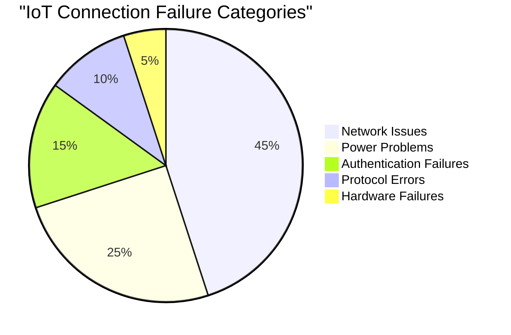

> **Key takeaway (สำหรับผู้สอน)**: การเชื่อมต่อในระบบ IoT ไม่ได้เป็นเพียงการเชื่อมต่อแบบง่ายๆ แต่ประกอบด้วยหลายชั้นที่ต้องทำงานประสานกันอย่างราบรื่น แต่ละชั้นมีความท้าทายและต้องมีการออกแบบอย่างรอบคอบ โดยเฉพาะการจัดการกับความไม่เสถียรของเครือข่าย การใช้พลังงานอย่างมีประสิทธิภาพ และการรองรับอุปกรณ์จำนวนมาก

**ธีมหลัก**: สถาปัตยกรรมการเชื่อมต่อแบบหลายชั้นของระบบ IoT

**ข้อแนะนำ**: ให้เปรียบเทียบการเชื่อมต่อในระบบ IoT กับการสื่อสารของมนุษย์ที่มีหลายระดับ เช่น ภาษากาย ภาษาพูด ความหมายของคำ และบริบทของการสนทนา เพื่อให้ผู้เรียนเข้าใจแนวคิดของการสื่อสารแบบหลายชั้น ย้ำว่าการที่ระบบ IoT ทำงานได้อย่างราบรื่นนั้น ทุกชั้นต้อง "พูดภาษาเดียวกัน" และทำงานประสานกันอย่างดี

---

## Slide 9: MQTT Connection Management & Reliability

### Maintaining Robust MQTT Connections

**Connection Lifecycle:**
1. **Establishing Connection**: Client initiates TCP connection to broker
2. **Authentication**: Client provides credentials (if required)
3. **Session Management**: Setting up clean or persistent sessions
4. **Connection Monitoring**: Keep-alive mechanism
5. **Graceful Disconnection**: Properly closing connections
6. **Connection Recovery**: Handling unexpected disconnections

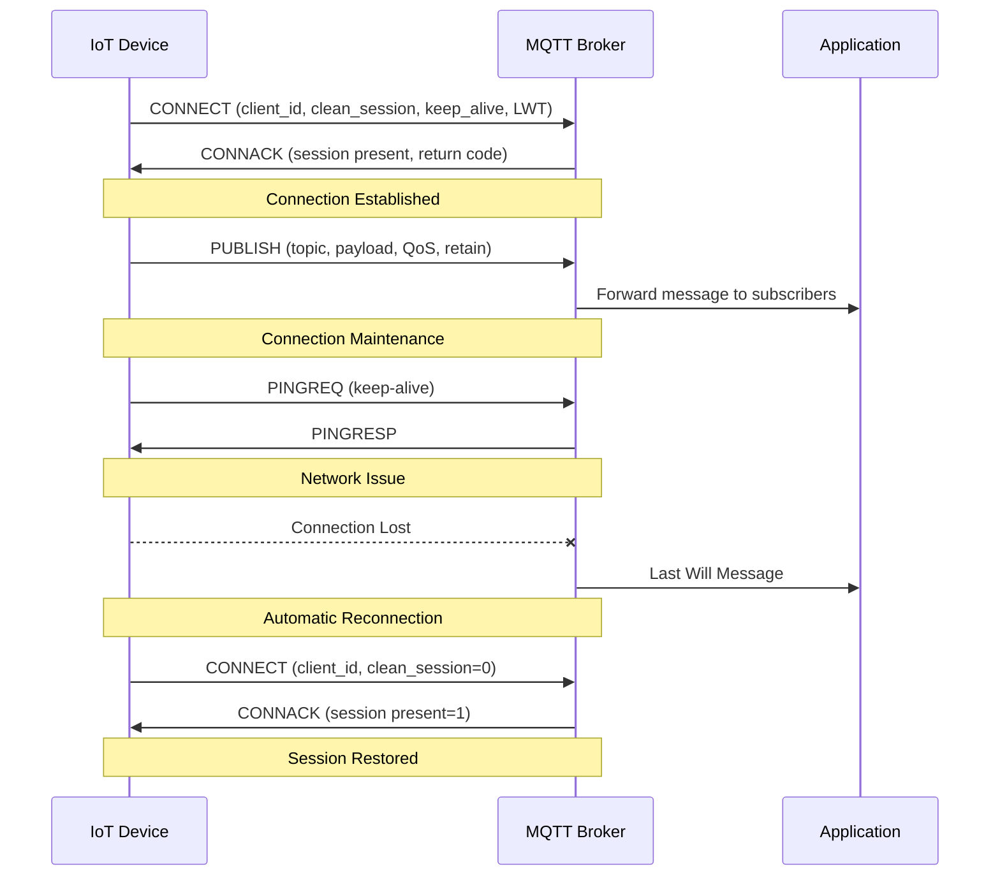

**Critical Connection Parameters:**
- **Client ID**: Unique identifier for each device
- **Clean Session**: Whether to persist session state
- **Keep Alive**: Maximum time between client communications (seconds)
- **Last Will and Testament**: Message sent if connection drops unexpectedly
- **Retained Messages**: Latest message stored for new subscribers

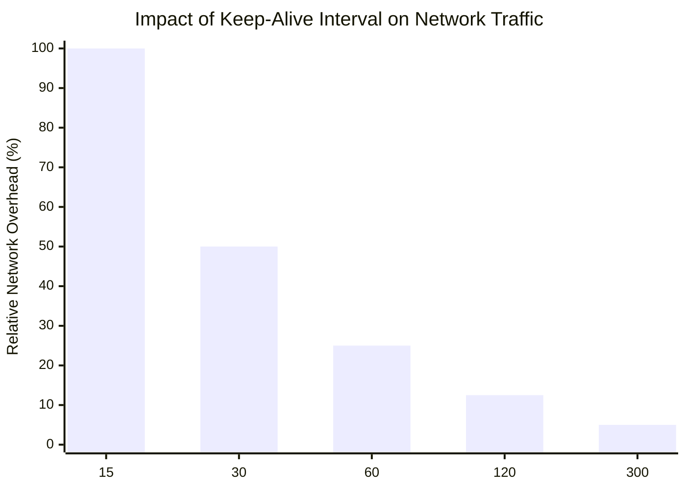

> **Key takeaway (สำหรับผู้สอน)**: การบริหารจัดการการเชื่อมต่อ MQTT ที่ดีเป็นหัวใจสำคัญของระบบ IoT ที่มีเสถียรภาพ การตั้งค่าพารามิเตอร์ที่เหมาะสม เช่น Keep Alive และ Clean Session จะส่งผลโดยตรงต่อความเสถียรและประสิทธิภาพของระบบ ฟีเจอร์ Last Will and Testament เป็นกลไกสำคัญที่ช่วยให้ระบบรับรู้เมื่ออุปกรณ์หลุดจากการเชื่อมต่ออย่างไม่คาดคิด

**ธีมหลัก**: การจัดการการเชื่อมต่อและการรักษาความเสถียรของการเชื่อมต่อ MQTT

**ข้อแนะนำ**: อธิบายความสำคัญของการตั้งค่า Keep Alive ที่เหมาะสม โดยเปรียบเทียบกับการสนทนาระหว่างคนสองคนที่ต้องมีการตอบรับเป็นระยะเพื่อให้มั่นใจว่าอีกฝ่ายยังอยู่ ยิ่ง Keep Alive สั้น ยิ่งตรวจพบการหลุดการเชื่อมต่อได้เร็ว แต่ก็ทำให้มีทราฟฟิคเพิ่มขึ้น ต้องหาจุดสมดุลให้เหมาะกับแต่ละการใช้งาน

---

## Slide 10: Hierarchical Topic Design for IoT Systems

### Creating Scalable Topic Structures

**Topic Design Principles:**
- **Consistency**: Use consistent naming conventions
- **Hierarchy**: Organize in logical levels using forward slashes (/)
- **Specificity**: Balance between too general and too specific
- **Scalability**: Design for future growth
- **Discoverability**: Make topics intuitive to find and understand

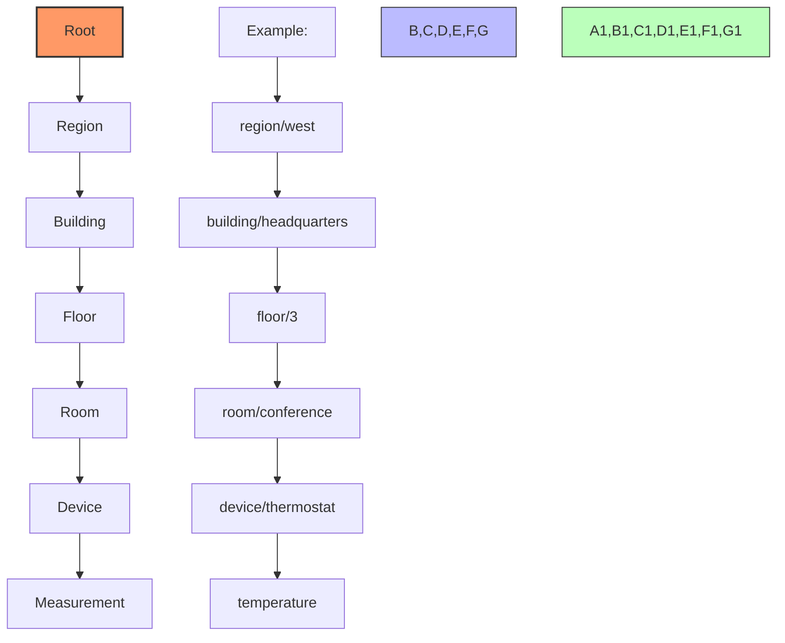

**Common Topic Design Patterns:**

| Pattern | Example | Use Case |
|---------|---------|----------|
| **Device-centric** | `devices/thermostat12/temperature` | Individual device management |
| **Location-centric** | `building/floor3/room7/temperature` | Spatial organization |
| **Function-centric** | `hvac/temperature/room7` | Service-oriented organization |
| **Data-centric** | `temperature/celsius/floor3/room7` | Data type organization |

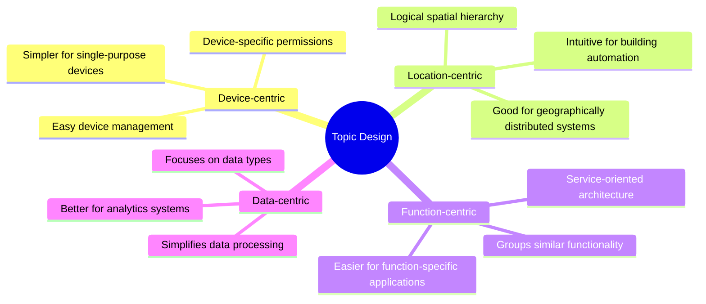

> **Key takeaway (สำหรับผู้สอน)**: การออกแบบโครงสร้าง Topic ที่ดีเป็นรากฐานสำคัญสำหรับระบบ IoT ที่ต้องรองรับอุปกรณ์จำนวนมาก เปรียบเสมือนการวางผังเมืองก่อนสร้างอาคาร หากวางแผนไม่ดีตั้งแต่แรก การขยายในอนาคตจะทำได้ยากและเกิดความวุ่นวาย การเลือกรูปแบบการจัดโครงสร้าง Topic ขึ้นอยู่กับลักษณะการใช้งานและเป้าหมายของระบบ

**ธีมหลัก**: การออกแบบโครงสร้าง Topic สำหรับระบบ IoT

**ข้อแนะนำ**: เปรียบเทียบโครงสร้าง Topic กับระบบไฟล์ที่ผู้เรียนคุ้นเคย โฟลเดอร์หลัก โฟลเดอร์ย่อย และไฟล์ เพื่อให้เข้าใจแนวคิดได้ง่ายขึ้น และยกตัวอย่างการใช้งานจริงของแต่ละรูปแบบเพื่อให้เห็นข้อดีข้อเสีย เช่น ระบบสมาร์ทโฮมขนาดเล็กอาจใช้แบบ device-centric ได้ดี แต่ระบบอาคารอัจฉริยะขนาดใหญ่อาจเหมาะกับแบบ location-centric มากกว่า

---

## Slide 11: Tasmota - A Case Study in IoT Firmware

### Learning from a Popular Open-Source Firmware

**What is Tasmota?**
- Open-source firmware for ESP8266/ESP32 devices
- Created in 2016 by Theo Arends
- Originally for Sonoff devices, now supports 300+ device types
- Focuses on local control, security, and MQTT integration
- Thriving community with continuous development

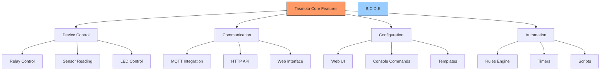

**Tasmota MQTT Topic Structure:**

```mermaid
graph LR
    A[MQTT Topics] --> B[cmnd/]
    A --> C[stat/]
    A --> D[tele/]
    
    B --> B1[Send Commands<br>cmnd/%prefix%/%topic%/POWER]
    C --> C1[Status Reports<br>stat/%prefix%/%topic%/RESULT]
    D --> D1[Telemetry Data<br>tele/%prefix%/%topic%/SENSOR]
    
    style A fill:#f9f,stroke:#333,stroke-width:2px
    style B fill:#bbf,stroke:#333,stroke-width:1px
    style C fill:#bfb,stroke:#333,stroke-width:1px
    style D fill:#fbb,stroke:#333,stroke-width:1px
```

**Comparing Approaches: Tasmota vs. Custom Code**

```mermaid
quadrantChart
    title IoT Firmware Development Approaches
    x-axis Less Customization --> More Customization
    y-axis Slower Development --> Faster Development
    quadrant-1 Fast but Limited
    quadrant-2 Ideal Solution
    quadrant-3 Avoid
    quadrant-4 Powerful but Complex
    "Tasmota": [0.3, 0.8]
    "ESPHome": [0.4, 0.9]
    "Arduino Custom Code": [0.9, 0.4]
    "ESP-IDF Custom Code": [0.95, 0.2]
    "Modified Tasmota": [0.6, 0.7]
    "Commercial Firmware": [0.15, 0.5]
```

> **Key takeaway (สำหรับผู้สอน)**: Tasmota เป็นตัวอย่างที่ดีของการออกแบบระบบ IoT ที่มีประสิทธิภาพ มีลักษณะโมดูลาร์ชัดเจน การศึกษาโครงสร้างและแนวคิดของ Tasmota ช่วยให้เข้าใจหลักการออกแบบเฟิร์มแวร์ IoT ที่ดี แม้จะไม่ได้ใช้ Tasmota โดยตรง การใช้เฟิร์มแวร์สำเร็จรูปอย่าง Tasmota เหมาะกับการพัฒนาโปรเจคที่ต้องการความรวดเร็วและมีฟังก์ชันพื้นฐานครบถ้วน ขณะที่การเขียนโค้ดเองจะเหมาะกับงานที่ต้องการการปรับแต่งสูงหรือมีความต้องการพิเศษ

**ธีมหลัก**: กรณีศึกษาเฟิร์มแวร์ Tasmota และการเลือกวิธีพัฒนาเฟิร์มแวร์ที่เหมาะสม

**ข้อแนะนำ**: อธิบายให้เห็นว่า Tasmota ไม่ใช่แค่เครื่องมือสำหรับใช้งาน แต่เป็นตัวอย่างการออกแบบที่ดีที่ผู้พัฒนาสามารถเรียนรู้ได้ เปรียบเทียบการเลือกใช้เฟิร์มแวร์สำเร็จรูปกับการเขียนเองว่าเหมือนการเลือกระหว่างการซื้อบ้านสำเร็จรูปที่พร้อมเข้าอยู่กับการออกแบบและสร้างบ้านเอง แต่ละทางเลือกมีข้อดีข้อเสียต่างกัน

---

## Slide 12: MQTT Communication Flow in IoT Systems

### Understanding the Complete Message Journey

**End-to-End MQTT Communication:**

```mermaid
sequenceDiagram
    participant S as Sensor Device
    participant B as MQTT Broker
    participant A as Actuator Device
    participant D as Dashboard App
    
    Note over S,D: Initial Connections
    S->>B: CONNECT (client_id=sensor1, LWT)
    B->>S: CONNACK (success)
    A->>B: CONNECT (client_id=actuator1, LWT)
    B->>A: CONNACK (success)
    D->>B: CONNECT (client_id=dashboard1)
    B->>D: CONNACK (success)
    
    Note over S,D: Topic Subscriptions
    A->>B: SUBSCRIBE ("cmnd/actuator1/power")
    B->>A: SUBACK
    D->>B: SUBSCRIBE ("tele/+/SENSOR", "stat/+/RESULT")
    B->>D: SUBACK
    
    Note over S,D: Regular Data Flow
    S->>B: PUBLISH ("tele/sensor1/SENSOR", {"temperature": 23.5})
    B->>D: Forward message to subscribers
    D->>B: PUBLISH ("cmnd/actuator1/power", "ON")
    B->>A: Forward command to actuator
    A->>B: PUBLISH ("stat/actuator1/RESULT", {"POWER":"ON"})
    B->>D: Forward result to subscribers
    
    Note over S,D: Connection Monitoring
    S->>B: PINGREQ
    B->>S: PINGRESP
    
    Note over S,D: Disconnection
    S--xB: Connection Lost (network issue)
    B->>D: Last Will Message ("tele/sensor1/LWT", "Offline")
```

**Data Flow Patterns in IoT Systems:**

```mermaid
graph TD
    A[Sensor Data Collection] -->|MQTT Publish| B[MQTT Broker]
    B -->|MQTT Subscribe| C[Data Storage]
    B -->|MQTT Subscribe| D[Real-time Monitoring]
    B -->|MQTT Subscribe| E[Analytics Engine]
    
    F[User Interface] -->|MQTT Publish| B
    B -->|MQTT Subscribe| G[Actuator Devices]
    G -->|MQTT Publish| B
    B -->|MQTT Subscribe| F
    
    style A fill:#bbf,stroke:#333,stroke-width:2px
    style B fill:#f96,stroke:#333,stroke-width:3px
    style C fill:#bfb,stroke:#333,stroke-width:2px
    style D fill:#fbb,stroke:#333,stroke-width:2px
    style E fill:#dbf,stroke:#333,stroke-width:2px
    style F fill:#fbf,stroke:#333,stroke-width:2px
    style G fill:#bff,stroke:#333,stroke-width:2px
```

**Optimizing Message Patterns:**
- **State Reporting**: Devices publish their current state after changes
- **Heartbeat Messages**: Periodic status updates at configurable intervals
- **Command-Response**: Clear request/acknowledgment patterns
- **Event Notifications**: Alert when significant events occur
- **Bulk Updates**: Combining multiple data points in a single message

> **Key takeaway (สำหรับผู้สอน)**: การเข้าใจรูปแบบการไหลของข้อมูลใน MQTT ช่วยให้ออกแบบระบบ IoT ที่มีประสิทธิภาพ การสื่อสารใน MQTT ไม่ใช่แค่การส่งข้อมูลจากต้นทางไปปลายทาง แต่เป็นการออกแบบรูปแบบการสื่อสารทั้งระบบให้ทำงานประสานกันอย่างมีประสิทธิภาพ รูปแบบการส่งข้อมูลที่ดีจะช่วยลดการใช้แบนด์วิดธ์ เพิ่มความเสถียร และทำให้ระบบทำงานได้อย่างราบรื่นแม้ในสภาพแวดล้อมที่มีข้อจำกัด

**ธีมหลัก**: รูปแบบการไหลของข้อมูลในระบบ IoT ที่ใช้ MQTT

**ข้อแนะนำ**: เปรียบเทียบการสื่อสารใน MQTT กับระบบส่งจดหมายที่มีศูนย์กลางคัดแยกและกระจายจดหมายไปยังผู้รับที่ลงทะเบียนไว้ ซึ่งต่างจากการส่งโดยตรงถึงผู้รับ และอธิบายว่าทำไมรูปแบบนี้จึงเหมาะกับระบบ IoT ที่มีอุปกรณ์จำนวนมากและการเชื่อมต่อที่ไม่เสถียร

---

## Slide 13: IoT Connection Troubleshooting

### Systematic Approach to Solving Connection Issues

**Common Connection Challenges:**
1. **Network Connectivity Issues**: WiFi signal, interference, router problems
2. **Authentication Failures**: Incorrect credentials, expired certificates
3. **Protocol Misconfiguration**: Wrong broker address, port, topic structure
4. **Resource Limitations**: Memory leaks, CPU overload, bandwidth constraints
5. **Power Management Issues**: Battery depletion, power cycling

```mermaid
flowchart TD
    A[Connection Issue] --> B{Device Powers Up?}
    B -->|No| C[Power Issue]
    B -->|Yes| D{Network Connectivity?}
    
    C --> C1[Check Power Source]
    C --> C2[Verify Voltage Levels]
    C --> C3[Inspect Hardware]
    
    D -->|No| E[Network Issue]
    D -->|Yes| F{Can Reach Broker?}
    
    E --> E1[Check WiFi Credentials]
    E --> E2[Verify Signal Strength]
    E --> E3[Test Network Config]
    
    F -->|No| G[Transport Issue]
    F -->|Yes| H{Authentication OK?}
    
    G --> G1[Verify Broker Address/Port]
    G --> G2[Check Firewall Rules]
    G --> G3[Test with Different Client]
    
    H -->|No| I[Auth Issue]
    H -->|Yes| J{Application Working?}
    
    I --> I1[Check Credentials]
    I --> I2[Verify Certificates]
    I --> I3[Review Permissions]
    
    style A fill:#f96,stroke:#333,stroke-width:2px
    style B,D,F,H,J fill:#bbf,stroke:#333,stroke-width:1px
    style C,E,G,I fill:#fbb,stroke:#333,stroke-width:1px
```

**Diagnostic Tools for IoT Connections:**

```mermaid
mindmap
  root((IoT Diagnostic Tools))
    Network Tools
      ::icon(fa fa-wifi)
      Ping/Traceroute
      WiFi Analyzers
      Packet Sniffers (Wireshark)
      Network Scanners
    Protocol Tools
      ::icon(fa fa-exchange)
      MQTT Explorer
      Mosquitto Client Tools
      WebSocket Testers
    Device Tools
      ::icon(fa fa-microchip)
      Serial Monitor
      Device Logs
      Firmware Diagnostics
      Status LEDs
    Monitoring Tools
      ::icon(fa fa-chart-line)
      Connection Metrics
      Bandwidth Usage
      Error Rate Tracking
```

**Structured Troubleshooting Process:**
1. **Identify Symptoms**: Collect specific error messages and behavior
2. **Layer Isolation**: Determine which layer has the issue (network, transport, etc.)
3. **Verify Configuration**: Check all settings against documentation
4. **Test Incrementally**: Start with simplest configuration and add complexity
5. **Monitor & Log**: Enable verbose logging during troubleshooting
6. **Implement Fix**: Make one change at a time and verify results
7. **Document Solution**: Record the issue and resolution for future reference

> **Key takeaway (สำหรับผู้สอน)**: การแก้ไขปัญหาการเชื่อมต่อใน IoT ต้องใช้วิธีการเป็นระบบ ด้วยการแยกปัญหาตามชั้นของการเชื่อมต่อ (ฮาร์ดแวร์, เครือข่าย, โปรโตคอล, แอปพลิเคชัน) ที่เราเรียกว่า "การแก้ปัญหาแบบลำดับชั้น" การมีเครื่องมือที่เหมาะสมและเข้าใจกระบวนการทำงานของแต่ละชั้นจะช่วยให้แก้ปัญหาได้อย่างมีประสิทธิภาพ

**ธีมหลัก**: แนวทางการแก้ไขปัญหาการเชื่อมต่อ IoT อย่างเป็นระบบ

**ข้อแนะนำ**: เล่าประสบการณ์จริงเกี่ยวกับปัญหาการเชื่อมต่อที่ซับซ้อนและวิธีการแก้ไข เพื่อให้ผู้เรียนเห็นภาพว่าแม้แต่ผู้เชี่ยวชาญก็ต้องใช้วิธีการเป็นขั้นตอนในการแก้ปัญหา ไม่ใช่การเดาสุ่ม และย้ำว่าการบันทึกปัญหาและวิธีแก้ไขเป็นสิ่งสำคัญมากสำหรับการพัฒนา IoT เพราะปัญหาเดียวกันมักเกิดซ้ำในอนาคต

---

## Slide 14: Node-RED - The Visual Wiring Tool for IoT

### Simplifying IoT Device Connections

**What is Node-RED?**
- Flow-based, visual programming tool for IoT
- Originally developed by IBM, now part of JS Foundation
- Designed to connect hardware devices, APIs, and online services
- Runs on Node.js - can be deployed on devices from Raspberry Pi to cloud servers

```mermaid
graph LR
    A[IoT Devices] --> B[Node-RED]
    C[APIs & Services] --> B
    B --> D[Dashboards]
    B --> E[Storage Systems]
    B --> F[Notifications]
    B --> G[Actuators]

    style A fill:#bbf,stroke:#333,stroke-width:2px
    style B fill:#f96,stroke:#333,stroke-width:3px
    style C fill:#bfb,stroke:#333,stroke-width:2px
    style D,E,F,G fill:#fbb,stroke:#333,stroke-width:1px
```

**Key Advantages for IoT Development:**
- **No-Code/Low-Code**: Visual approach reduces development time
- **Extensive Library**: 3000+ pre-built nodes for various protocols and services
- **Real-Time Processing**: Direct wiring of events to actions
- **Shallow Learning Curve**: Accessible to developers of all skill levels
- **Active Community**: Continuously growing ecosystem of extensions

```mermaid
pie title "Node-RED Use Cases in IoT Projects"
    "Data Collection & Processing": 35
    "Device Control & Automation": 28
    "Dashboard & Visualization": 20
    "System Integration": 12
    "Prototyping": 5
```

> **Key takeaway (สำหรับผู้สอน)**: Node-RED ลดความซับซ้อนในการพัฒนาระบบ IoT โดยใช้แนวคิดการเชื่อมต่อแบบ "flow" ที่มองเห็นภาพได้ ทำให้สามารถสร้างระบบที่ซับซ้อนได้โดยไม่จำเป็นต้องเขียนโค้ดจำนวนมาก เป็นเครื่องมือที่ช่วยลดช่องว่างระหว่างฮาร์ดแวร์และซอฟต์แวร์ และเหมาะสำหรับทั้งการสร้างต้นแบบอย่างรวดเร็วและการพัฒนาระบบเพื่อใช้งานจริง

**ธีมหลัก**: แนะนำ Node-RED เป็นเครื่องมือสำหรับการพัฒนาระบบ IoT แบบ visual programming

**ข้อแนะนำ**: เปรียบเทียบการพัฒนาโดย Node-RED กับการเขียนโค้ดแบบดั้งเดิม โดยให้เห็นว่างานที่อาจใช้เวลาหลายชั่วโมงในการเขียนโค้ด สามารถทำได้ในไม่กี่นาทีด้วย Node-RED แสดงตัวอย่างหน้าจอ Node-RED จริงประกอบการบรรยาย และอาจให้ผู้เรียนระบุว่าในโปรเจคที่พวกเขาทำอยู่หรือสนใจ จะสามารถประยุกต์ใช้ Node-RED ได้อย่างไรบ้าง

---

## Slide 15: Node-RED Architecture for IoT Systems

### Understanding the Building Blocks

**Core Node-RED Components:**

```mermaid
flowchart TB
    subgraph "Node-RED Platform"
        A[Flow Editor] --- B[Runtime Engine]
        B --- C[Node Libraries]
        C --- D[Extension Modules]
    end
    
    subgraph "Connection Layer"
        E[IoT Protocol Nodes] --- F[MQTT]
        E --- G[WebSocket]
        E --- H[HTTP]
        E --- I[Serial]
    end
    
    subgraph "Processing Layer"
        J[Function Nodes] --- K[JavaScript Functions]
        J --- L[Data Transformation]
        J --- M[Flow Control]
        J --- N[Event Handling]
    end
    
    subgraph "Presentation Layer"
        O[Output Nodes] --- P[Dashboard]
        O --- Q[Storage]
        O --- R[Notifications]
        O --- S[Control Signals]
    end
    
    B ==> E
    E ==> J
    J ==> O
    
    classDef platform fill:#f96,stroke:#333,stroke-width:2px
    classDef connection fill:#bbf,stroke:#333,stroke-width:2px
    classDef processing fill:#bfb,stroke:#333,stroke-width:2px
    classDef presentation fill:#fbb,stroke:#333,stroke-width:2px
    
    class A,B,C,D platform
    class E,F,G,H,I connection
    class J,K,L,M,N processing
    class O,P,Q,R,S presentation
```

**Flow-based Programming Model:**
- **Nodes**: Individual processing blocks with specific functions
- **Wires**: Connections that pass messages between nodes
- **Flows**: Collections of nodes wired together
- **Messages**: JSON objects passed between nodes
- **Context**: Data store for maintaining state between messages

**Message Structure:**
```json
{
  "topic": "sensor/temperature",
  "payload": 23.5,
  "timestamp": 1677721500,
  "deviceId": "thermostat01",
  "_msgid": "12345abc"
}
```

```mermaid
sequenceDiagram
    participant I as Input Node
    participant P as Processing Node
    participant O as Output Node
    
    I->>P: msg = {payload: rawData}
    P->>P: Process data
    P->>O: msg = {payload: processedData}
    
    Note over I,O: Messages flow through nodes
    
    I->>P: New message
    P->>P: Access context data
    Note right of P: Store state between messages
    P->>O: Output with context-aware data
```

> **Key takeaway (สำหรับผู้สอน)**: Node-RED ใช้แนวคิดการโปรแกรมแบบ flow-based ที่ข้อมูลจะถูกส่งผ่าน "message" ระหว่าง node ต่างๆ โดยโครงสร้างหลักประกอบด้วย node ที่ทำหน้าที่เฉพาะ เชื่อมต่อกันด้วย wire และจัดกลุ่มเป็น flow ซึ่งแต่ละ node สามารถรับข้อมูล ประมวลผล และส่งต่อไปยัง node ถัดไป การทำความเข้าใจโครงสร้างสถาปัตยกรรมนี้เป็นพื้นฐานสำคัญในการใช้ Node-RED พัฒนาระบบ IoT

**ธีมหลัก**: สถาปัตยกรรมและองค์ประกอบพื้นฐานของ Node-RED

**ข้อแนะนำ**: อธิบายด้วยการเปรียบเทียบสถาปัตยกรรมของ Node-RED กับระบบที่คุ้นเคย เช่น โรงงานผลิตที่มีสายพานลำเลียง โดย node เปรียบเหมือนสถานีทำงาน message คือชิ้นงานที่ส่งต่อระหว่างสถานี และ wire คือสายพานที่ขนส่งชิ้นงาน แนะนำให้ผู้เรียนเข้าใจการไหลของข้อมูลและวิธีการที่ Node-RED จัดการกับข้อมูลในแต่ละขั้นตอน

---

## Slide 16: Connecting IoT Devices to Node-RED

### Building the Bridge Between Hardware and Software

**MQTT Connection in Node-RED:**

```mermaid
graph LR
    A[ESP32/ESP8266 Device] -->|Publish to Topic| B[MQTT Broker]
    C[Node-RED MQTT In Node] -->|Subscribe to Topic| B
    B -->|Forward Messages| C
    C -->|Pass Message| D[Function Node]
    D -->|Process Data| E[Dashboard Node]
    D -->|Create Command| F[Node-RED MQTT Out Node]
    F -->|Publish Command| B
    B -->|Forward Command| A
    
    style A fill:#bbf,stroke:#333,stroke-width:2px
    style B fill:#f96,stroke:#333,stroke-width:2px
    style C,F fill:#bfb,stroke:#333,stroke-width:2px
    style D fill:#fbb,stroke:#333,stroke-width:2px
    style E fill:#fbf,stroke:#333,stroke-width:2px
```

**MQTT Node Configuration Options:**
- **Server**: Broker address, port, and credentials
- **Topics**: Subscribe or publish patterns
- **QoS**: Quality of Service level (0, 1, or 2)
- **Retain Flag**: Whether messages should be retained
- **Client ID**: Unique identifier for the connection

**Other IoT Connection Methods in Node-RED:**

```mermaid
mindmap
  root((IoT Connection Methods))
    Serial
      ::icon(fa fa-usb)
      Direct connection
      Arduino/ESP communication
      Local debug interface
    HTTP/REST
      ::icon(fa fa-globe)
      API requests
      Webhooks
      HTTP callbacks
    WebSocket
      ::icon(fa fa-exchange)
      Bi-directional
      Real-time updates
      Browser integration
    TCP/UDP
      ::icon(fa fa-random)
      Raw socket connections
      Custom protocols
      High-performance needs
    Bluetooth
      ::icon(fa fa-bluetooth)
      BLE devices
      Health monitors
      Proximity sensors
```

**Example Flow for Device Connection:**
```json
[
  {
    "id": "mqtt-in",
    "type": "mqtt in",
    "topic": "sensors/+/temperature",
    "broker": "broker.example.com"
  },
  {
    "id": "function",
    "type": "function",
    "func": "msg.payload = (msg.payload * 9/5) + 32; return msg;",
    "wires": [["mqtt-out"]]
  },
  {
    "id": "mqtt-out",
    "type": "mqtt out",
    "topic": "processed/temperature",
    "broker": "broker.example.com"
  }
]
```

> **Key takeaway (สำหรับผู้สอน)**: การเชื่อมต่ออุปกรณ์ IoT กับ Node-RED ส่วนใหญ่ทำผ่าน MQTT ซึ่งเป็นโปรโตคอลที่เหมาะสมกับ IoT มากที่สุด Node-RED มี node สำเร็จรูปสำหรับโปรโตคอลการเชื่อมต่อที่หลากหลาย ทำให้สามารถรับข้อมูลจากและส่งคำสั่งไปยังอุปกรณ์ได้อย่างยืดหยุ่น การตั้งค่าพารามิเตอร์การเชื่อมต่อที่เหมาะสม เช่น QoS, Client ID และ Topic pattern มีความสำคัญต่อประสิทธิภาพและความเสถียรของระบบ

**ธีมหลัก**: การเชื่อมต่ออุปกรณ์ IoT กับ Node-RED ด้วยโปรโตคอลต่างๆ

**ข้อแนะนำ**: สาธิตการตั้งค่า MQTT node ใน Node-RED จริงๆ ระหว่างการสอน แสดงวิธีการกำหนดค่าสำคัญต่างๆ เช่น broker address, topic pattern และ QoS อธิบายความแตกต่างระหว่างวิธีการเชื่อมต่อแต่ละแบบ และเน้นย้ำว่าเหตุใด MQTT จึงเป็นตัวเลือกที่นิยมสำหรับ IoT โดยชี้ให้เห็นข้อดีในด้านประสิทธิภาพ ความน่าเชื่อถือ และการใช้ทรัพยากรน้อย

---

## Slide 17: Processing IoT Data in Node-RED

### Transforming Raw Data into Useful Information

**Data Processing Chain:**

```mermaid
flowchart LR
    A[Data Acquisition] --> B[Data Cleaning]
    B --> C[Data Transformation]
    C --> D[Data Analysis]
    D --> E[Decision Making]
    E --> F[Action Execution]
    
    style A fill:#bbf,stroke:#333,stroke-width:2px
    style B,C fill:#bfb,stroke:#333,stroke-width:2px
    style D,E fill:#fbb,stroke:#333,stroke-width:2px
    style F fill:#fbf,stroke:#333,stroke-width:2px
```

**Essential Function Nodes:**
- **Function Node**: Custom JavaScript code
- **Switch Node**: Routing based on conditions
- **Change Node**: Modify message properties
- **Split/Join Nodes**: Break apart or combine messages
- **Template Node**: Format output using Mustache templates

```mermaid
graph TD
    A[MQTT In<br>Raw Temperature] --> B[JSON Parse]
    B --> C[Function<br>Convert C to F]
    C --> D[Switch<br>Check Thresholds]
    
    D -->|Normal| E[Change<br>Set Status="Normal"]
    D -->|High| F[Change<br>Set Status="Warning"]
    D -->|Critical| G[Change<br>Set Status="Alert"]
    
    E --> H[Join<br>Combine with History]
    F --> H
    G --> H
    
    H --> I[Dashboard<br>Temperature Chart]
    G --> J[Email<br>Alert Notification]
    
    style A fill:#bbf,stroke:#333,stroke-width:2px
    style B,C,D fill:#bfb,stroke:#333,stroke-width:2px
    style E,F,G,H fill:#fbb,stroke:#333,stroke-width:2px
    style I,J fill:#fbf,stroke:#333,stroke-width:2px
```

**Common Processing Patterns for IoT Data:**
1. **Filtering**: Remove noise or irrelevant readings
2. **Unit Conversion**: Transform between measurement units
3. **Statistical Analysis**: Calculate averages, min/max, trends
4. **Anomaly Detection**: Identify outliers and unusual patterns
5. **Aggregation**: Combine readings over time or from multiple sources
6. **Enrichment**: Add context, metadata, or lookup information

```mermaid
xychart-beta
    title "Common Data Processing Tasks in IoT Flows"
    x-axis ["Filtering", "Conversion", "Statistics", "Anomaly Detection", "Aggregation", "Enrichment"]
    y-axis "Usage Frequency (%)" 0 --> 100
    bar [85, 70, 65, 45, 60, 40]
```

> **Key takeaway (สำหรับผู้สอน)**: การประมวลผลข้อมูล IoT ใน Node-RED เป็นหัวใจสำคัญที่เปลี่ยนข้อมูลดิบให้กลายเป็นสารสนเทศที่มีคุณค่า โดยใช้ node ต่างๆ จัดการกับข้อมูลตามขั้นตอน เช่น การกรอง การแปลงหน่วย การวิเคราะห์ และการตรวจจับความผิดปกติ Function node เป็น node ที่ทรงพลังที่สุดเพราะสามารถเขียนโค้ด JavaScript เพื่อทำการประมวลผลที่ซับซ้อนได้ การออกแบบการประมวลผลที่ดีจะทำให้ระบบ IoT สามารถตอบสนองต่อสถานการณ์ได้อย่างชาญฉลาด

**ธีมหลัก**: การประมวลผลและแปลงข้อมูล IoT ใน Node-RED

**ข้อแนะนำ**: แสดงตัวอย่างการใช้ function node เพื่อทำการประมวลผลข้อมูลที่พบบ่อยในระบบ IoT เช่น การแปลงหน่วยอุณหภูมิ, การคำนวณค่าเฉลี่ย, หรือการตรวจสอบค่าที่ผิดปกติ และให้ผู้เรียนลองเขียน function node อย่างง่ายด้วยตนเอง นอกจากนี้ยังควรเน้นย้ำว่าการออกแบบการประมวลผลควรคำนึงถึงประสิทธิภาพและความสามารถในการบำรุงรักษาในระยะยาว

---

## Slide 18: Node-RED Dashboard for IoT Visualization

### Creating Interactive User Interfaces

**Dashboard Components:**

```mermaid
mindmap
  root((Dashboard Elements))
    Display Widgets
      ::icon(fa fa-chart-bar)
      Charts & Graphs
      Gauges
      Text & Values
      Notifications
    Control Widgets
      ::icon(fa fa-sliders-h)
      Buttons
      Sliders
      Dropdowns
      Text Inputs
    Layout Elements
      ::icon(fa fa-th-large)
      Groups
      Tabs
      Spacers
      Templates
    Advanced Elements
      ::icon(fa fa-code)
      Custom Templates
      SVG Graphics
      Maps
      Data Tables
```

**Dashboard Architecture:**

```mermaid
flowchart LR
    A[IoT Devices] -->|MQTT| B[Node-RED]
    B -->|Process Data| C[Dashboard Nodes]
    C -->|WebSocket| D[Web Browser Interface]
    D -->|User Actions| C
    C -->|Control Commands| B
    B -->|MQTT Commands| A
    
    style A fill:#bbf,stroke:#333,stroke-width:2px
    style B fill:#f96,stroke:#333,stroke-width:3px
    style C fill:#bfb,stroke:#333,stroke-width:2px
    style D fill:#fbb,stroke:#333,stroke-width:2px
```

**UI Design for IoT Applications:**

```mermaid
graph TD
    A[Dashboard Design Principles] --> B[Information Hierarchy]
    A --> C[Responsive Layout]
    A --> D[Visual Feedback]
    A --> E[Performance Considerations]
    
    B --> B1[Critical data most visible]
    B --> B2[Logical grouping of widgets]
    B --> B3[Progressive disclosure]
    
    C --> C1[Mobile-friendly design]
    C --> C2[Adaptable to screen sizes]
    C --> C3[Touch-friendly controls]
    
    D --> D1[Clear status indicators]
    D --> D2[Color-coding for states]
    D --> D3[Alerts for critical events]
    
    E --> E1[Optimize update frequency]
    E --> E2[Limit data points in charts]
    E --> E3[Efficient data handling]
    
    style A fill:#f96,stroke:#333,stroke-width:2px
    style B,C,D,E fill:#bbf,stroke:#333,stroke-width:1px
```

**Example Dashboard Metrics:**

```mermaid
pie title "Most Used Dashboard Widgets in IoT Projects"
    "Charts": 30
    "Gauges & Indicators": 25
    "Control Buttons": 20
    "Numeric Displays": 15
    "Status Widgets": 10
```

> **Key takeaway (สำหรับผู้สอน)**: Node-RED Dashboard เป็นเครื่องมือที่ทรงพลังสำหรับการสร้างส่วนติดต่อผู้ใช้แบบกราฟิกสำหรับระบบ IoT โดยไม่ต้องเขียนโค้ด HTML, CSS, หรือ JavaScript จำนวนมาก ผู้พัฒนาสามารถสร้างแดชบอร์ดที่มีองค์ประกอบแสดงผลและควบคุมอุปกรณ์แบบเรียลไทม์ได้อย่างรวดเร็ว การออกแบบส่วนติดต่อผู้ใช้ที่ดีควรคำนึงถึงการจัดลำดับความสำคัญของข้อมูล การรองรับอุปกรณ์หลายขนาด และประสบการณ์การใช้งานที่ดีของผู้ใช้

**ธีมหลัก**: การสร้างแดชบอร์ดสำหรับแสดงผลและควบคุมอุปกรณ์ IoT

**ข้อแนะนำ**: สาธิตการสร้างแดชบอร์ดอย่างง่ายที่มีทั้งส่วนแสดงผลข้อมูลจากเซ็นเซอร์และส่วนควบคุมอุปกรณ์ แสดงวิธีการจัดกลุ่ม widget และการจัดวาง layout ที่เหมาะสม ให้คำแนะนำในการออกแบบ UI ที่มีประสิทธิภาพและใช้งานง่าย เช่น การใช้สีที่มีความหมาย การจัดวางองค์ประกอบอย่างเป็นระเบียบ และการเลือกใช้ widget ที่เหมาะสมกับประเภทข้อมูล

---

## Slide 19: REST API in IoT - Bridging Different Protocols

### Connecting Web Technologies with IoT Devices

**What is REST API in IoT Context:**
- **REpresentational State Transfer** - Architectural style for distributed systems
- **HTTP-based** - Uses standard web methods (GET, POST, PUT, DELETE)
- **Resource-oriented** - Treats devices and data as addressable resources
- **Stateless** - Each request contains all information needed
- **Standardized** - Well-understood across the web industry

```mermaid
graph LR
    A[IoT Devices] -->|MQTT| B[MQTT Broker]
    B -->|Internal Protocol| C[IoT Platform]
    C -->|REST API| D[Web Client]
    C -->|REST API| E[Mobile App]
    C -->|REST API| F[Third-Party Services]
    C -->|REST API| G[Enterprise Systems]
    
    style A fill:#bbf,stroke:#333,stroke-width:2px
    style B fill:#bfb,stroke:#333,stroke-width:2px
    style C fill:#f96,stroke:#333,stroke-width:3px
    style D,E,F,G fill:#fbb,stroke:#333,stroke-width:2px
```

**REST API vs MQTT & WebSocket:**

| Feature | REST API | MQTT | WebSocket |
|---------|----------|------|-----------|
| **Interaction Pattern** | Request/Response | Publish/Subscribe | Bi-directional |
| **Connection** | Temporary | Persistent | Persistent |
| **Overhead** | High | Low | Medium |
| **Real-time Capability** | Polling required | Real-time | Real-time |
| **Best For** | Device management, configuration | Event-driven data, telemetry | Interactive applications |
| **Complexity** | Low | Medium | High |
| **Client Support** | Universal | IoT-focused | Modern browsers |

```mermaid
xychart-beta
    title "Comparison of IoT Communication Protocols"
    x-axis ["Latency", "Overhead", "Development Ease", "Client Compatibility"]
    y-axis "Score (Lower is Better)" 0 --> 10
    bar [["REST API", 7, 6, 3, 2], ["MQTT", 3, 2, 5, 6], ["WebSocket", 2, 4, 7, 4]]
```

> **Key takeaway (สำหรับผู้สอน)**: REST API เป็นช่องทางสำคัญในการเชื่อมโยงระบบ IoT กับแอปพลิเคชันเว็บและบริการอื่นๆ แม้จะไม่เหมาะกับการสื่อสารระหว่างอุปกรณ์ IoT กับ backend โดยตรงเท่ากับ MQTT แต่ REST API มีข้อดีคือเข้ากันได้ดีกับระบบเว็บที่มีอยู่เดิม ทำให้การพัฒนาง่าย และมาตรฐานที่เป็นที่เข้าใจกันดี ระบบ IoT ที่สมบูรณ์มักผสมผสานทั้ง REST API และโปรโตคอลเฉพาะทาง IoT เช่น MQTT เข้าด้วยกัน

**ธีมหลัก**: แนะนำ REST API และการเปรียบเทียบกับโปรโตคอลอื่นๆ ในบริบท IoT

**ข้อแนะนำ**: อธิบายด้วยตัวอย่างว่าในระบบ IoT จริง หลายครั้งจำเป็นต้องใช้ทั้ง REST API และ MQTT ร่วมกัน โดย MQTT มักใช้สำหรับการสื่อสารระหว่างอุปกรณ์กับระบบ backend ในขณะที่ REST API ใช้สำหรับการเข้าถึงข้อมูลและควบคุมอุปกรณ์จากแอปพลิเคชันภายนอก เช่น แอปมือถือหรือแดชบอร์ดเว็บ ย้ำว่าการเลือกใช้โปรโตคอลให้เหมาะสมกับงานเป็นเรื่องสำคัญ

---

## Slide 20: IoT API Gateway Architecture

### Creating a Bridge Between Different IoT Protocols

**API Gateway Core Functions:**
- **Protocol Translation**: Convert between MQTT, WebSocket and HTTP/REST
- **Data Transformation**: Format data between different representations
- **Authentication & Authorization**: Secure access to IoT resources
- **Traffic Management**: Rate limiting and request prioritization
- **Logging & Monitoring**: Track API usage and system performance

```mermaid
flowchart TB
    subgraph "IoT Environment"
        A1[ESP8266 Device] -->|MQTT| B[MQTT Broker]
        A2[ESP32 Device] -->|MQTT| B
        A3[Industrial Sensor] -->|MQTT| B
    end
    
    subgraph "API Gateway Layer"
        C[API Gateway] -->|Subscribe| B
        B -->|Publish| C
        C -->|Transform| D[REST Endpoints]
        C -->|Transform| E[WebSocket Server]
        C -->|Authentication| F[Auth Service]
    end
    
    subgraph "Application Layer"
        D -->|HTTP| G[Web Apps]
        D -->|HTTP| H[Mobile Apps]
        D -->|HTTP| I[Third-Party Services]
        E -->|WebSocket| J[Real-time Dashboards]
    end
    
    classDef iot fill:#bbf,stroke:#333,stroke-width:2px
    classDef gateway fill:#f96,stroke:#333,stroke-width:2px
    classDef app fill:#bfb,stroke:#333,stroke-width:2px
    
    class A1,A2,A3,B iot
    class C,D,E,F gateway
    class G,H,I,J app
```

**Request Flow in an IoT API Gateway:**

```mermaid
sequenceDiagram
    participant Client as Mobile App
    participant Gateway as API Gateway
    participant Auth as Auth Service
    participant Broker as MQTT Broker
    participant Device as IoT Device
    
    Client->>Gateway: HTTP GET /api/devices/thermostat1
    Gateway->>Auth: Validate Token
    Auth->>Gateway: Token Valid
    
    Gateway->>Broker: MQTT Request (cmnd/thermostat1/STATUS)
    
    Note over Broker,Device: Device may be offline
    
    alt Device Online
        Broker->>Device: Forward Command
        Device->>Broker: MQTT Response (stat/thermostat1/STATUS)
        Broker->>Gateway: Forward Response
        Gateway->>Gateway: Transform to JSON
        Gateway->>Client: HTTP Response (200 OK, JSON data)
    else Device Offline
        Gateway->>Client: HTTP Response (503 Service Unavailable)
    end
```

**Design Patterns for IoT API Gateways:**
1. **Command Pattern**: Convert REST requests to device commands
2. **Observer Pattern**: Subscribe to device events and forward to clients
3. **Adapter Pattern**: Transform between different data formats
4. **Cache Pattern**: Store recent device states for fast responses
5. **Circuit Breaker**: Handle device unavailability gracefully

> **Key takeaway (สำหรับผู้สอน)**: API Gateway เป็นองค์ประกอบสำคัญที่ช่วยให้ระบบ IoT สามารถเชื่อมต่อกับระบบอื่นๆ ได้อย่างราบรื่น โดยทำหน้าที่เป็นตัวกลางในการแปลงโปรโตคอลและรูปแบบข้อมูล รวมถึงจัดการด้านความปลอดภัย ในระบบ IoT ที่มีขนาดใหญ่ API Gateway ช่วยลดความซับซ้อนในการพัฒนาแอปพลิเคชันที่ต้องสื่อสารกับอุปกรณ์ IoT โดยซ่อนรายละเอียดการสื่อสารระดับต่ำไว้และนำเสนอ API ที่ใช้งานง่าย

**ธีมหลัก**: สถาปัตยกรรมและบทบาทของ API Gateway ในระบบ IoT

**ข้อแนะนำ**: อธิบายเปรียบเทียบ API Gateway กับคนล่ามภาษาที่ช่วยให้คนที่พูดคนละภาษาสื่อสารกันได้ เน้นให้เห็นว่า API Gateway ไม่ใช่แค่ bridge แต่มีความสามารถในการแปลงรูปแบบข้อมูล จัดการความปลอดภัย และปรับปรุงประสิทธิภาพการสื่อสาร ในตอนท้าย อาจแสดงตัวอย่างระบบจริงที่ใช้ API Gateway เช่น ระบบบ้านอัจฉริยะที่ต้องเชื่อมต่อกับแอปมือถือหรือบริการคลาวด์

---

## Slide 21: Building RESTful APIs for IoT Device Integration

### Designing Effective HTTP Endpoints for IoT Systems

**RESTful API Design Best Practices for IoT:**
- **Resource Naming**: Use nouns representing IoT entities
- **Hierarchy**: Design nested resources to reflect relationships
- **Versioning**: Include API version in URL or header
- **Status Codes**: Use HTTP status codes meaningfully
- **HATEOAS**: Include links to related resources and actions
- **Pagination**: Support pagination for large device collections
- **Filtering**: Allow searching and filtering device data

**Common IoT API Resource Patterns:**

```mermaid
mindmap
  root((IoT API Resources))
    Devices
      ::icon(fa fa-microchip)
      /devices - Collection
      /devices/{id} - Individual
      /devices/{id}/status
      /devices/{id}/telemetry
    Sensors
      ::icon(fa fa-thermometer-half)
      /sensors - Collection
      /sensors/{id} - Individual
      /sensors/{id}/readings
      /sensors/{id}/calibration
    Actuators
      ::icon(fa fa-toggle-on)
      /actuators - Collection
      /actuators/{id} - Individual
      /actuators/{id}/commands
      /actuators/{id}/state
    Groups
      ::icon(fa fa-object-group)
      /groups - Collection
      /groups/{id} - Individual
      /groups/{id}/devices
      /groups/{id}/actions
```

**Example Device Control API Endpoints:**

| Method | Endpoint | Purpose | Status Codes |
|--------|----------|---------|-------------|
| GET | `/api/v1/devices` | List all devices | 200, 401 |
| GET | `/api/v1/devices/{id}` | Get device details | 200, 404 |
| POST | `/api/v1/devices` | Register new device | 201, 400 |
| PUT | `/api/v1/devices/{id}` | Update device | 200, 404 |
| GET | `/api/v1/devices/{id}/status` | Get current state | 200, 404 |
| POST | `/api/v1/devices/{id}/commands` | Send device command | 202, 404, 503 |
| GET | `/api/v1/devices/{id}/telemetry` | Get sensor readings | 200, 404 |

```mermaid
graph TD
    A[IoT API Structure] --> B[Resource Collections]
    A --> C[Individual Resources]
    A --> D[Nested Resources]
    A --> E[Actions]
    
    B --> B1[/devices]
    B --> B2[/users]
    B --> B3[/locations]
    
    C --> C1[/devices/{id}]
    C --> C2[/users/{id}]
    
    D --> D1[/devices/{id}/sensors]
    D --> D2[/locations/{id}/devices]
    
    E --> E1[/devices/{id}/commands]
    E --> E2[/devices/{id}/reboot]
    
    style A fill:#f96,stroke:#333,stroke-width:2px
    style B,C,D,E fill:#bbf,stroke:#333,stroke-width:1px
    style B1,B2,B3,C1,C2,D1,D2,E1,E2 fill:#bfb,stroke:#333,stroke-width:1px
```

> **Key takeaway (สำหรับผู้สอน)**: การออกแบบ RESTful API ที่ดีสำหรับระบบ IoT ต้องคำนึงถึงลักษณะเฉพาะของระบบ IoT เช่น ความล่าช้าในการตอบสนองของอุปกรณ์ การสื่อสารแบบไม่ประสานเวลา (asynchronous) และสถานะการเชื่อมต่อ API ที่ดีควรสะท้อนโครงสร้างทางกายภาพและความสัมพันธ์ของอุปกรณ์ และใช้รูปแบบที่สอดคล้องกับหลักการ RESTful เพื่อให้นักพัฒนาสามารถใช้งานได้อย่างเป็นธรรมชาติ

**ธีมหลัก**: หลักการออกแบบ RESTful API สำหรับระบบ IoT

**ข้อแนะนำ**: ยกตัวอย่างระบบ IoT จริง เช่น ระบบบ้านอัจฉริยะ แล้วแสดงวิธีการออกแบบ API ที่เหมาะสมสำหรับระบบนั้น พร้อมอธิบายเหตุผลในการออกแบบแต่ละส่วน เน้นย้ำความสำคัญของการออกแบบที่สอดคล้องกับความคาดหวังของผู้ใช้ API และมีความสม่ำเสมอตลอดทั้งระบบ สาธิตการทดสอบ API ด้วยเครื่องมือเช่น Postman หรือ curl

---

## Slide 22: Protocol Translation Between REST and MQTT

### Bridging Different IoT Communication Methods

**Key Translation Challenges:**
- **Interaction Models**: Request/Response vs Publish/Subscribe
- **Connection Types**: Stateless vs Persistent connections
- **Data Formats**: Often JSON in both but structure differs
- **Error Handling**: HTTP status codes vs MQTT QoS
- **Asynchronous Nature**: REST expects immediate response

```mermaid
graph TB
    A[HTTP Request] -->|Translation Layer| B{API Gateway}
    B -->|MQTT Publish| C[MQTT Broker]
    C -->|MQTT Subscribe| D[IoT Device]
    D -->|MQTT Publish| C
    C -->|MQTT Subscribe| B
    B -->|HTTP Response| A

    E[MQTT Client] -->|MQTT Publish| C
    C -->|MQTT Subscribe| B
    B -->|Store in DB| F[Database]
    
    G[Web Client] -->|HTTP GET| B
    B -->|Query| F
    B -->|HTTP Response| G
    
    style A fill:#bbf,stroke:#333,stroke-width:2px
    style B fill:#f96,stroke:#333,stroke-width:3px
    style C fill:#bfb,stroke:#333,stroke-width:2px
    style D fill:#fbf,stroke:#333,stroke-width:2px
    style E fill:#fbf,stroke:#333,stroke-width:2px
    style F fill:#fbb,stroke:#333,stroke-width:2px
    style G fill:#bbf,stroke:#333,stroke-width:2px
```

**Common Translation Patterns:**

1. **Request-Response with Temporary Topics**

```mermaid
sequenceDiagram
    participant Client as HTTP Client
    participant Gateway as API Gateway
    participant Broker as MQTT Broker
    participant Device as IoT Device
    
    Client->>Gateway: HTTP GET /api/devices/123/temperature
    Gateway->>Gateway: Generate request_id = "abc123"
    Gateway->>Broker: MQTT Subscribe to "responses/abc123"
    Gateway->>Broker: MQTT Publish to "devices/123/commands"<br>payload: {"request_id":"abc123", "action":"get_temp"}
    Broker->>Device: Forward MQTT message
    Device->>Broker: MQTT Publish to "responses/abc123"<br>payload: {"temperature":23.5}
    Broker->>Gateway: Forward MQTT message
    Gateway->>Client: HTTP Response: {"temperature":23.5}
    Gateway->>Broker: MQTT Unsubscribe from "responses/abc123"
```

2. **State-based with Caching**

```mermaid
sequenceDiagram
    participant Device as IoT Device
    participant Broker as MQTT Broker
    participant Gateway as API Gateway
    participant Cache as State Cache
    participant Client as HTTP Client
    
    Note over Device,Cache: Continuous state updates
    Device->>Broker: MQTT Publish "devices/123/state"<br>payload: {"temp":22.5}
    Broker->>Gateway: Forward to subscribers
    Gateway->>Cache: Update stored state
    
    Note over Client,Cache: REST API request
    Client->>Gateway: HTTP GET /api/devices/123
    Gateway->>Cache: Get latest state
    Cache->>Gateway: {"id":"123", "temp":22.5, "updated":"2023-..."}
    Gateway->>Client: HTTP Response 200
```

**Translation Code Example:**

```javascript
// REST to MQTT translation
app.get('/api/devices/:deviceId/temperature', async (req, res) => {
    const { deviceId } = req.params;
    const requestId = uuid.v4();
    
    // Set up temporary response topic
    const responseTopic = `responses/${requestId}`;
    
    try {
        // Promise to handle the asynchronous MQTT response
        const responsePromise = new Promise((resolve, reject) => {
            // Set timeout to handle device not responding
            const timeout = setTimeout(() => {
                mqttClient.unsubscribe(responseTopic);
                reject(new Error('Device response timeout'));
            }, 5000);
            
            // Subscribe to response topic
            mqttClient.subscribe(responseTopic);
            mqttClient.on('message', (topic, message) => {
                if (topic === responseTopic) {
                    clearTimeout(timeout);
                    mqttClient.unsubscribe(responseTopic);
                    resolve(JSON.parse(message.toString()));
                }
            });
        });
        
        // Send command through MQTT
        mqttClient.publish(`devices/${deviceId}/commands`, JSON.stringify({
            request_id: requestId,
            action: 'get_temperature'
        }));
        
        // Wait for the response
        const result = await responsePromise;
        res.json({ temperature: result.temperature });
    } catch (error) {
        res.status(503).json({ error: error.message });
    }
});
```

> **Key takeaway (สำหรับผู้สอน)**: การแปลงระหว่าง REST และ MQTT เป็นความท้าทายสำคัญเนื่องจากรูปแบบการสื่อสารที่แตกต่างกันอย่างมาก (request/response vs publish/subscribe) การออกแบบระบบแปลงที่มีประสิทธิภาพต้องแก้ปัญหาความแตกต่างนี้ด้วยเทคนิคต่างๆ เช่น การใช้ temporary topics หรือการเก็บข้อมูลล่าสุดไว้ใน cache ความสมดุลระหว่างการตอบสนองแบบทันทีที่ REST ต้องการกับธรรมชาติแบบ asynchronous ของ MQTT เป็นสิ่งที่ต้องคำนึงถึงในการออกแบบระบบ

**ธีมหลัก**: เทคนิคการแปลงระหว่างโปรโตคอล REST และ MQTT

**ข้อแนะนำ**: อธิบายด้วยตัวอย่างที่เป็นรูปธรรม เช่น การควบคุมหลอดไฟผ่าน REST API ว่ามีขั้นตอนอย่างไรในการแปลงคำสั่ง HTTP เป็นข้อความ MQTT และส่งไปยังอุปกรณ์ แสดงให้เห็นความท้าทายในกรณีที่อุปกรณ์ไม่ตอบสนองหรือออฟไลน์ และวิธีการจัดการกับสถานการณ์เหล่านั้น ควรชี้ให้เห็นว่าการออกแบบระบบแปลงที่ดีควรซ่อนความซับซ้อนเหล่านี้จากผู้ใช้ API ให้มากที่สุด

---

## Slide 23: Security Considerations for IoT APIs

### Protecting IoT Device Connections

**Key Security Challenges in IoT APIs:**
- **Device Authentication**: Ensuring only legitimate devices connect
- **API Authentication**: Controlling access to device data and commands
- **Data Integrity**: Preventing tampering of device data or commands
- **Authorization**: Granular control of who can access what devices
- **Transport Security**: Encrypting data in transit
- **Rate Limiting**: Preventing DoS attacks and API abuse

```mermaid
graph TD
    A[IoT API Security] --> B[Authentication]
    A --> C[Authorization]
    A --> D[Data Protection]
    A --> E[Rate Limiting]
    A --> F[Monitoring]
    
    B --> B1[API Keys]
    B --> B2[JWT Tokens]
    B --> B3[OAuth 2.0]
    B --> B4[Device Certificates]
    
    C --> C1[Role-based Access]
    C --> C2[Attribute-based Access]
    C --> C3[Scope Limitations]
    
    D --> D1[TLS/SSL]
    D --> D2[Payload Encryption]
    D --> D3[Data Validation]
    
    E --> E1[Request Quotas]
    E --> E2[Throttling]
    E --> E3[Burst Handling]
    
    F --> F1[Access Logging]
    F --> F2[Anomaly Detection]
    F --> F3[Security Alerts]
    
    style A fill:#f96,stroke:#333,stroke-width:2px
    style B,C,D,E,F fill:#bbf,stroke:#333,stroke-width:1px
```

**API Authentication Implementation:**

```mermaid
sequenceDiagram
    participant Client as Mobile App
    participant Auth as Auth Service
    participant API as API Gateway
    participant Broker as MQTT Broker
    participant Device as IoT Device
    
    Client->>Auth: Request access token<br>(credentials)
    Auth->>Client: JWT token with scopes
    
    Client->>API: API request with JWT token
    API->>API: Validate token & check permissions
    
    alt Valid Token with Proper Permissions
        API->>Broker: MQTT message to device
        Broker->>Device: Forward command
        Device->>Broker: Response
        Broker->>API: Forward response
        API->>Client: Success response
    else Invalid Token or Insufficient Permissions
        API->>Client: 401 Unauthorized or 403 Forbidden
    end
```

**Security Best Practices for IoT APIs:**
1. **Use token-based authentication** (JWT, OAuth 2.0) with short expiration
2. **Implement HTTPS/TLS** for all API endpoints
3. **Apply principle of least privilege** for API permissions
4. **Validate all input data** for format and range
5. **Implement rate limiting** to prevent abuse
6. **Log all API access** for audit and security monitoring
7. **Use IP whitelisting** for sensitive operations
8. **Regularly rotate credentials** and revoke compromised tokens

```mermaid
pie title "Common IoT API Security Vulnerabilities (2023)"
    "Inadequate Authentication": 32
    "Insecure Direct Object References": 24
    "Injection Attacks": 18
    "Insufficient Rate Limiting": 14
    "Weak Transport Encryption": 8
    "Unpatched Dependencies": 4
```

> **Key takeaway (สำหรับผู้สอน)**: การรักษาความปลอดภัยของ API ในระบบ IoT มีความสำคัญและซับซ้อนมากกว่าระบบ API ทั่วไป เนื่องจากมีผลกระทบโดยตรงต่อโลกกายภาพ การรักษาความปลอดภัยที่ดีต้องครอบคลุมทั้งการยืนยันตัวตน การตรวจสอบสิทธิ์ การเข้ารหัสข้อมูล และการติดตามกิจกรรมที่ผิดปกติ นอกจากนี้การจำกัดอัตราการเรียกใช้ API ก็มีความสำคัญทั้งในแง่ของความปลอดภัยและการรักษาเสถียรภาพของระบบ

**ธีมหลัก**: การรักษาความปลอดภัยของ API ในระบบ IoT

**ข้อแนะนำ**: เน้นย้ำความแตกต่างระหว่างการรักษาความปลอดภัยของ API ทั่วไปกับ API สำหรับระบบ IoT โดยชี้ให้เห็นว่าระบบ IoT มีความเสี่ยงมากกว่าเพราะมีผลกระทบต่อโลกกายภาพ (เช่น การควบคุมประตู ระบบรักษาความปลอดภัย หรืออุปกรณ์ทางการแพทย์) ยกตัวอย่างกรณีศึกษาการโจมตีระบบ IoT ที่เกิดจากช่องโหว่ของ API และวิธีป้องกัน สรุปด้วยขั้นตอนพื้นฐานที่ควรทำเพื่อปรับปรุงความปลอดภัยของ API ในระบบ IoT

---

## Slide 24: REST API for IoT Device Connection

### Establishing Device Connectivity via REST APIs

```mermaid
flowchart TB
    A[IoT Devices] <-->|HTTP/REST| B[REST API Layer]
    B <-->|Internal Protocols| C[IoT Platform Core]
    C <-->|Data Processing| D[Data Storage]
    C <-->|MQTT/WebSocket| E[Real-time Systems]
    
    B <-.->|"Authentication<br>Rate Limiting"| F[Security Layer]
    B <-.->|"Requests<br>Responses"| G[External Applications]
    
    style A fill:#bbf,stroke:#333,stroke-width:2px
    style B fill:#f96,stroke:#333,stroke-width:3px
    style C fill:#bfb,stroke:#333,stroke-width:2px
    style D fill:#fbb,stroke:#333,stroke-width:2px
    style E fill:#fbf,stroke:#333,stroke-width:2px
```

**Key REST API Connection Methods:**
- Direct device-to-cloud API calls
- Gateway-mediated connections
- Hybrid communication patterns

```mermaid
pie title "IoT Connection Types via REST"
    "Direct Device-to-Cloud": 45
    "Gateway-mediated": 38
    "Hybrid Approaches": 17
```

> **Key takeaway (สำหรับผู้สอน)**: REST API เป็นช่องทางสำคัญในการเชื่อมต่อระหว่างอุปกรณ์ IoT กับระบบคลาวด์หรือแพลตฟอร์ม โดยเฉพาะในกรณีที่อุปกรณ์มีทรัพยากรเพียงพอ หรือสำหรับการลงทะเบียนอุปกรณ์ในระบบ การอัพเดตเฟิร์มแวร์ การตั้งค่าคอนฟิกกูเรชัน การออกแบบ API ที่ดีต้องคำนึงถึงข้อจำกัดของอุปกรณ์และรูปแบบการเชื่อมต่อที่เหมาะสม

**ธีมหลัก**: การเชื่อมต่อระหว่างอุปกรณ์ IoT กับระบบคลาวด์ผ่าน REST API

**ข้อแนะนำ**: อธิบายว่าแม้ MQTT จะเหมาะสมกับการสื่อสารระหว่างอุปกรณ์ที่มีทรัพยากรจำกัด แต่ REST API ก็มีบทบาทสำคัญในระบบ IoT โดยเฉพาะในส่วนของการจัดการอุปกรณ์ การตั้งค่า และการเชื่อมต่อกับระบบภายนอก เน้นให้เห็นความแตกต่างของการใช้งานทั้งสองโปรโตคอลในสถานการณ์ที่เหมาะสม

---

## Slide 25: Data Flow Between IoT Protocols

### Seamless Integration Between MQTT and REST

```mermaid
sequenceDiagram
    participant Device as IoT Device
    participant MQTT as MQTT Broker
    participant Gateway as Protocol Gateway
    participant REST as REST API
    participant Client as Web/Mobile Client
    
    Note over Device,Client: Device to Client Flow
    Device->>MQTT: Publish sensor data
    MQTT->>Gateway: Forward to subscribers
    Gateway->>Gateway: Transform to REST format
    Client->>REST: HTTP GET request
    REST->>Gateway: Request latest data
    Gateway->>REST: Return transformed data
    REST->>Client: HTTP response with data
    
    Note over Client,Device: Client to Device Flow
    Client->>REST: HTTP POST command
    REST->>Gateway: Forward command
    Gateway->>Gateway: Transform to MQTT format
    Gateway->>MQTT: Publish to command topic
    MQTT->>Device: Forward command
    Device->>MQTT: Publish confirmation
    MQTT->>Gateway: Forward confirmation
    Gateway->>REST: Transform to HTTP response
    REST->>Client: Confirm command execution
```

```mermaid
graph TD
    subgraph "Data Transformation Layer"
        A[Format Conversion]
        B[Protocol Mapping]
        C[State Caching]
        D[Error Handling]
    end
    
    style A fill:#bbf,stroke:#333,stroke-width:2px
    style B fill:#bfb,stroke:#333,stroke-width:2px
    style C fill:#fbb,stroke:#333,stroke-width:2px
    style D fill:#fbf,stroke:#333,stroke-width:2px
```

> **Key takeaway (สำหรับผู้สอน)**: การเชื่อมต่อระหว่างโปรโตคอล REST และ MQTT เป็นความท้าทายเนื่องจากรูปแบบการสื่อสารที่แตกต่างกัน (request-response vs publish-subscribe) จำเป็นต้องมีชั้นการแปลงข้อมูลที่มีประสิทธิภาพเพื่อรองรับทั้งการดึงข้อมูลจากอุปกรณ์และการส่งคำสั่งไปยังอุปกรณ์ โซลูชันที่นิยมคือการใช้ state cache เพื่อเก็บข้อมูลล่าสุดและการใช้ temporary topics สำหรับการรอคำตอบจากอุปกรณ์

**ธีมหลัก**: การไหลของข้อมูลและการแปลงระหว่างโปรโตคอล REST และ MQTT

**ข้อแนะนำ**: ใช้ตัวอย่างที่เป็นรูปธรรมในการอธิบายการไหลของข้อมูลระหว่างโปรโตคอล เช่น สถานการณ์ที่ผู้ใช้กดปุ่มในแอพมือถือเพื่อเปิดไฟในบ้าน ข้อมูลจะไหลผ่านระบบอย่างไร จากแอพไปยัง REST API แล้วแปลงเป็น MQTT เพื่อส่งไปยังอุปกรณ์ และกลับมายืนยันการทำงานอย่างไร

---

## Slide 26: Device Control Through REST API

### Managing IoT Devices via HTTP Endpoints

```mermaid
mindmap
  root((Device Control<br>API Endpoints))
    Status Management
      ::icon(fa fa-info-circle)
      GET /devices/{id}/status
      PUT /devices/{id}/status
      GET /devices/{id}/health
    Configuration
      ::icon(fa fa-cogs)
      GET /devices/{id}/config
      PUT /devices/{id}/config
      POST /devices/{id}/reset
    Commands
      ::icon(fa fa-terminal)
      POST /devices/{id}/commands
      GET /devices/{id}/commands/history
      DELETE /devices/{id}/commands/{cmd_id}
    Updates
      ::icon(fa fa-arrow-circle-up)
      GET /devices/{id}/firmware
      POST /devices/{id}/firmware
      GET /devices/{id}/updates/check
```

```mermaid
sequenceDiagram
    participant Client as User App
    participant API as REST API
    participant Gateway as Protocol Gateway
    participant Device as IoT Device
    
    Client->>API: POST /devices/123/commands<br>{command: "setPower", value: "ON"}
    API->>API: Authenticate & validate
    API->>Gateway: Forward command
    Gateway->>Device: Translate & send command
    Note over Device: Process command
    Device->>Gateway: Send acknowledgement
    Gateway->>API: Return result
    API->>Client: Response: 200 OK<br>{status: "success", deviceState: "ON"}
```

> **Key takeaway (สำหรับผู้สอน)**: API สำหรับควบคุมอุปกรณ์ IoT ต้องออกแบบให้รองรับหลากหลายฟังก์ชันตั้งแต่การตรวจสอบสถานะ การตั้งค่า การส่งคำสั่ง และการอัพเดตเฟิร์มแวร์ ความท้าทายคือการจัดการกับการตอบสนองที่อาจล่าช้าหรือล้มเหลว และการออกแบบ API ที่ใช้งานได้ง่าย เข้าใจได้ และสอดคล้องกับมาตรฐาน REST

**ธีมหลัก**: การออกแบบ REST API สำหรับควบคุมอุปกรณ์ IoT

**ข้อแนะนำ**: แสดงตัวอย่างการออกแบบ API ที่ดีและไม่ดีเปรียบเทียบกัน เน้นความสำคัญของการออกแบบให้เข้าใจง่าย สอดคล้องกับหลักการ REST และจัดการกับความล้มเหลวได้อย่างเหมาะสม อธิบายว่าทำไมจึงใช้ HTTP POST สำหรับคำสั่งแทนที่จะใช้ GET หรือ PUT รวมถึงอธิบายว่าจะตอบสนองต่อคำสั่งที่อุปกรณ์ไม่ตอบกลับหรือไม่สามารถดำเนินการได้อย่างไร

---

## Slide 27: Real-time Data Access with WebSocket & REST

### Complementary Protocols for IoT Communication

```mermaid
graph TD
    A[Data Access Methods] --> B[REST API]
    A --> C[WebSocket]
    A --> D[MQTT]
    
    B --> B1["HTTP GET<br>/api/devices/{id}/data<br>(Historical Data)"]
    B --> B2["HTTP POST<br>/api/devices/{id}/commands<br>(Control)"]
    
    C --> C1["ws://server/devices/{id}<br>(Real-time Updates)"]
    C --> C2["ws://server/groups/{id}<br>(Multiple Device Updates)"]
    
    D --> D1["devices/{id}/telemetry<br>(Efficient Device Publishing)"]
    D --> D2["devices/{id}/commands<br>(Lightweight Commands)"]
    
    style A fill:#f96,stroke:#333,stroke-width:2px
    style B,C,D fill:#bbf,stroke:#333,stroke-width:2px
    style B1,B2,C1,C2,D1,D2 fill:#bfb,stroke:#333,stroke-width:1px
```

```mermaid
quadrantChart
    title Choosing the Right Protocol for IoT Communication
    x-axis Low Resource Usage --> High Resource Usage
    y-axis Request/Response --> Continuous Updates
    quadrant-1 Best for Small Devices
    quadrant-2 Best for Real-time Dashboards
    quadrant-3 Best for Device Config
    quadrant-4 Best for Rich Applications
    "MQTT": [0.2, 0.8]
    "REST API": [0.7, 0.2]
    "WebSocket": [0.6, 0.8]
    "CoAP": [0.3, 0.3]
    "HTTP/2": [0.5, 0.4]
    "gRPC": [0.6, 0.6]
```

> **Key takeaway (สำหรับผู้สอน)**: ในระบบ IoT ที่สมบูรณ์ มักจำเป็นต้องใช้หลายโปรโตคอลร่วมกัน โดย REST API เหมาะสำหรับการเรียกดูข้อมูลแบบ On-demand และการจัดการอุปกรณ์ ในขณะที่ WebSocket เหมาะกับการสื่อสารแบบเรียลไทม์บนเว็บเบราว์เซอร์ และ MQTT เหมาะสำหรับการสื่อสารระหว่างอุปกรณ์กับเซิร์ฟเวอร์ การรู้จักเลือกใช้โปรโตคอลให้เหมาะกับสถานการณ์จะช่วยให้ระบบมีประสิทธิภาพสูงสุด

**ธีมหลัก**: การใช้งานหลายโปรโตคอลร่วมกันในระบบ IoT เพื่อตอบสนองความต้องการที่หลากหลาย

**ข้อแนะนำ**: อธิบายด้วยตัวอย่างระบบที่ใช้ทั้ง REST, WebSocket และ MQTT ร่วมกัน เช่น ระบบมอนิเตอร์พลังงานที่ใช้ MQTT สำหรับอุปกรณ์ตรวจวัด WebSocket สำหรับการแสดงผลแบบเรียลไทม์บนแดชบอร์ด และ REST API สำหรับการดึงข้อมูลย้อนหลังและการบริหารจัดการระบบ เน้นว่าแต่ละโปรโตคอลมีจุดแข็งที่แตกต่างกัน

---

## Slide 28: IoT System Integration Architecture

### Connecting the IoT Ecosystem

```mermaid
flowchart TB
    subgraph "Physical Layer"
        A1[Sensors]
        A2[Actuators]
        A3[Controllers]
    end
    
    subgraph "Communication Layer"
        B1[MQTT]
        B2[WebSocket]
        B3[REST API]
    end
    
    subgraph "Processing Layer"
        C1[Device Management]
        C2[Data Processing]
        C3[Event Handling]
    end
    
    subgraph "Integration Layer"
        D1[API Gateway]
        D2[Protocol Conversion]
        D3[Authentication]
    end
    
    subgraph "Application Layer"
        E1[Mobile Apps]
        E2[Web Dashboards]
        E3[Enterprise Systems]
    end
    
    A1 & A2 & A3 --> B1
    B1 --> C1 & C2 & C3
    C1 & C2 & C3 --> D1 & D2
    B2 & B3 --> D1
    D1 & D2 & D3 --> E1 & E2 & E3
    
    classDef physical fill:#bbf,stroke:#333,stroke-width:2px
    classDef comm fill:#bfb,stroke:#333,stroke-width:2px
    classDef process fill:#fbf,stroke:#333,stroke-width:2px
    classDef integration fill:#f96,stroke:#333,stroke-width:3px
    classDef app fill:#fbb,stroke:#333,stroke-width:2px
    
    class A1,A2,A3 physical
    class B1,B2,B3 comm
    class C1,C2,C3 process
    class D1,D2,D3 integration
    class E1,E2,E3 app
```

```mermaid
mindmap
  root((Integration<br>Patterns))
    Data Integration
      ::icon(fa fa-database)
      ETL Processing
      Event Streaming
      Time Series Handling
    Service Integration
      ::icon(fa fa-cogs)
      API-First Design
      Microservices
      Event-Driven Architecture
    Device Integration
      ::icon(fa fa-microchip)
      Protocol Translation
      Device Registration
      Firmware Management
    User Integration
      ::icon(fa fa-user)
      Single Sign-On
      Role-Based Access
      Multi-tenant Support
```

> **Key takeaway (สำหรับผู้สอน)**: การบูรณาการระบบ IoT ที่สมบูรณ์ต้องเชื่อมต่อหลายส่วนเข้าด้วยกัน ตั้งแต่อุปกรณ์ โปรโตคอลการสื่อสาร การประมวลผลข้อมูล ไปจนถึงแอปพลิเคชันปลายทาง ชั้นการบูรณาการ (Integration Layer) มีความสำคัญพิเศษเพราะเป็นตัวเชื่อมระหว่างโลกของอุปกรณ์ IoT กับระบบองค์กรและแอปพลิเคชันผู้ใช้ การออกแบบสถาปัตยกรรมที่ยืดหยุ่นและขยายได้จะช่วยรองรับการเติบโตและความซับซ้อนที่เพิ่มขึ้นในอนาคต

**ธีมหลัก**: ภาพรวมสถาปัตยกรรมการบูรณาการระบบ IoT

**ข้อแนะนำ**: อธิบายแต่ละชั้นในสถาปัตยกรรมการบูรณาการและความสำคัญต่อระบบโดยรวม เน้นว่าการออกแบบที่ดีควรแบ่งชั้นอย่างชัดเจนและมีจุดเชื่อมต่อที่กำหนดไว้อย่างดี เพื่อให้สามารถทดแทนหรืออัพเกรดชิ้นส่วนของระบบได้โดยไม่กระทบกับส่วนอื่น นอกจากนี้ควรยกตัวอย่างปัญหาที่พบบ่อยในการบูรณาการระบบ IoT และวิธีแก้ไข เช่น การจัดการกับอุปกรณ์ที่มีเฟิร์มแวร์หลายเวอร์ชัน หรือการรองรับโปรโตคอลที่หลากหลาย