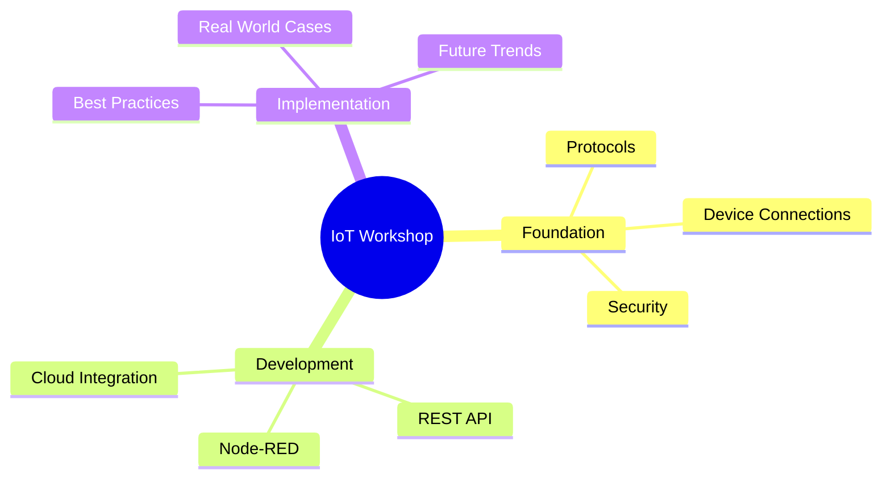
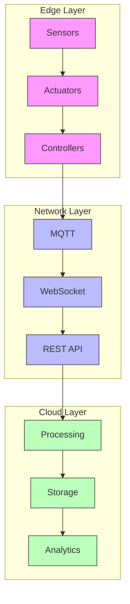
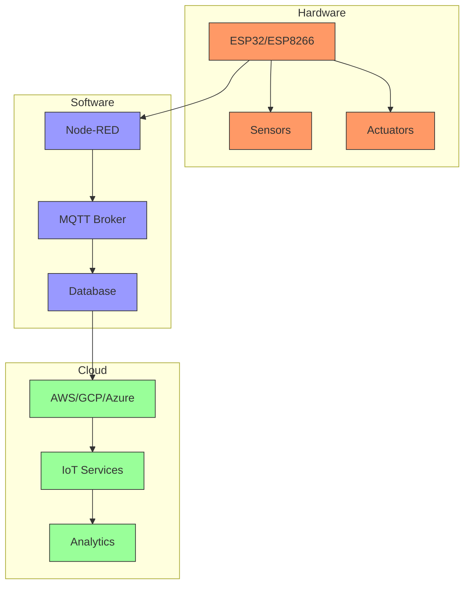
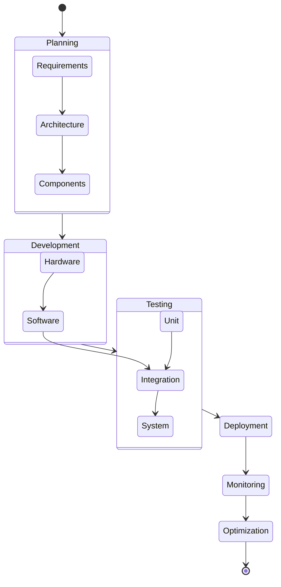

# IoT Workshop Presentation Slides

## Slide 1: Course Overview

## Slide 2: IoT Architecture

## Slide 3: Workshop Timeline

```mermaid
gantt
    title Workshop Schedule
    dateFormat  HH:mm
    axisFormat %H:%M

    section Morning
    Introduction     :09:00, 30m
    IoT Basics       :09:30, 45m
    Break           :10:15, 15m
    Hands-on Lab 1   :10:30, 90m

    section Afternoon
    Lunch           :12:00, 60m
    Advanced Topics  :13:00, 60m
    Hands-on Lab 2   :14:00, 90m
    Q&A Session      :15:30, 30m
```

## Slide 4: Technology Stack

## Slide 5: Project Implementation Flow

## Navigation Guide

- Each slide focuses on a key aspect of the IoT workshop
- Use diagrams to explain complex concepts
- Include practical examples and real-world applications
- End with Q&A session and resources for further learning

## Theme Colors

- Primary: #f96 (Hardware/Edge)
- Secondary: #99f (Software/Network)
- Tertiary: #9f9 (Cloud/Analytics)
- Background: White or Light Gray
- Text: Dark Gray or Black

## Recommended Tools

- Presentation Software: Canva
- Live Demo Tools: MQTT.fx, Node-RED
- Hardware Demo: ESP32/ESP8266 kit
