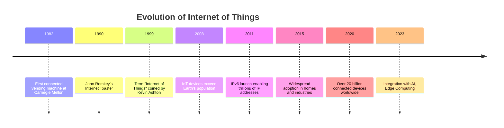

# Evolution of IoT

---

## Presenter Notes (ข้อมูลสำหรับผู้บรรยาย)

> Key Takeaway: IoT มีวิวัฒนาการมายาวนานกว่า 40 ปี เริ่มตั้งแต่เครื่องขายของอัตโนมัติที่ Carnegie Mellon ในปี 1982 จนถึงปัจจุบันที่มีอุปกรณ์กว่า 20 พันล้านเครื่องเชื่อมต่ออยู่ทั่วโลก จุดสำคัญในประวัติศาสตร์คือการกำเนิดคำว่า "Internet of Things" โดย Kevin Ashton ในปี 1999 และการเปิดตัว IPv6 ในปี 2011 ที่รองรับการเชื่อมต่ออุปกรณ์จำนวนมหาศาล ปัจจุบัน IoT ผสานรวมกับ AI และ Edge Computing เพื่อเพิ่มความสามารถในการประมวลผลที่ชาญฉลาดยิ่งขึ้น

**ศัพท์เทคนิค**:
- IPv6 (Internet Protocol version 6) - โปรโตคอลอินเทอร์เน็ตเวอร์ชัน 6
- Edge Computing - การประมวลผลที่ขอบของเครือข่าย
- Internet Toaster - เครื่องปิ้งขนมปังที่เชื่อมต่ออินเทอร์เน็ต
- Connectivity Evolution - วิวัฒนาการของการเชื่อมต่อ
- Connected Devices - อุปกรณ์ที่เชื่อมต่อ
