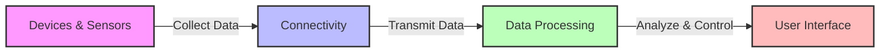

# Main Components of IoT Systems

- **Devices & Sensors**: Temperature, humidity, motion, light sensors
- **Connectivity**: WiFi, Bluetooth, Zigbee, LoRaWAN, 5G
- **Data Processing**: Cloud, Edge, Fog Computing
- **User Interface**: Mobile apps, dashboards, voice control

---

## Presenter Notes (ข้อมูลสำหรับผู้บรรยาย)

> Key Takeaway: ระบบ IoT ประกอบด้วย 4 องค์ประกอบหลัก ได้แก่ (1) อุปกรณ์และเซ็นเซอร์ที่ตรวจจับข้อมูลและควบคุมสภาพแวดล้อม (2) เทคโนโลยีการเชื่อมต่อที่ส่งข้อมูลระหว่างอุปกรณ์และระบบประมวลผล (3) ระบบประมวลผลข้อมูลที่อาจอยู่บนคลาวด์หรือที่ Edge และ (4) ส่วนติดต่อผู้ใช้ที่แสดงข้อมูลและควบคุมระบบ การทำงานร่วมกันของทั้ง 4 ส่วนนี้ช่วยให้เกิดระบบอัตโนมัติที่ตอบสนองต่อสภาพแวดล้อมได้อย่างชาญฉลาด

**ศัพท์เทคนิค**:
- Sensors - เซ็นเซอร์หรือตัวตรวจจับ
- Actuators - แอคชูเอเตอร์หรืออุปกรณ์กระตุ้น
- Microcontrollers - ไมโครคอนโทรลเลอร์
- Cloud Computing - การประมวลผลบนคลาวด์
- Edge Computing - การประมวลผลที่ขอบของเครือข่าย
- Fog Computing - การประมวลผลแบบหมอก
- IoT Gateway - เกตเวย์สำหรับ IoT
