# IoT Architecture

```mermaid
flowchart LR
    subgraph "Device Layer"
        A1[Sensors] --- A2[Actuators]
        A1 --- A3[Microcontrollers]
        A2 --- A3
    end
    
    subgraph "Network Layer"
        B1[Gateway] --- B2[Connectivity Technologies]
        B2 --- B3[Protocols]
    end
    
    subgraph "Processing Layer"
        C1[Cloud Services] --- C2[Edge Computing]
        C2 --- C3[Data Analytics]
        C3 --- C4[AI/ML]
    end
    
    subgraph "Application Layer"
        D1[Dashboards] --- D2[Mobile Apps]
        D2 --- D3[Automation Systems]
        D3 --- D4[Notifications]
    end
    
    A3 ==> B1
    B3 ==> C1
    C4 ==> D1
    
    classDef layer1 fill:#f9f,stroke:#333,stroke-width:1px;
    classDef layer2 fill:#bbf,stroke:#333,stroke-width:1px;
    classDef layer3 fill:#bfb,stroke:#333,stroke-width:1px;
    classDef layer4 fill:#fbb,stroke:#333,stroke-width:1px;
    
    class A1,A2,A3 layer1;
    class B1,B2,B3 layer2;
    class C1,C2,C3,C4 layer3;
    class D1,D2,D3,D4 layer4;
```

- **Four-layered architecture** commonly used in IoT systems
- **Modular approach** allows flexibility and scalability
- **Each layer** can be developed and optimized independently

---

## Presenter Notes (ข้อมูลสำหรับผู้บรรยาย)

> Key Takeaway: สถาปัตยกรรม IoT แบบ 4 ชั้นเป็นมาตรฐานที่นิยมใช้ในการออกแบบระบบ ประกอบด้วย (1) ชั้นอุปกรณ์ที่มีเซ็นเซอร์และแอคชูเอเตอร์ (2) ชั้นเครือข่ายที่จัดการการเชื่อมต่อและส่งข้อมูล (3) ชั้นประมวลผลที่วิเคราะห์ข้อมูลและตัดสินใจ และ (4) ชั้นแอปพลิเคชันที่ผู้ใช้มองเห็นและควบคุม การออกแบบแบบโมดูลาร์นี้ช่วยให้สามารถพัฒนา ปรับเปลี่ยน หรือขยายแต่ละชั้นได้อย่างอิสระ ทำให้ระบบมีความยืดหยุ่นและรองรับการขยายตัวได้ดี

**ศัพท์เทคนิค**:
- IoT Architecture - สถาปัตยกรรม IoT
- Device Layer - ชั้นอุปกรณ์
- Network Layer - ชั้นเครือข่าย
- Processing Layer - ชั้นการประมวลผล
- Application Layer - ชั้นแอปพลิเคชัน
- Modular Design - การออกแบบแบบโมดูลาร์
- Scalability - ความสามารถในการขยาย
