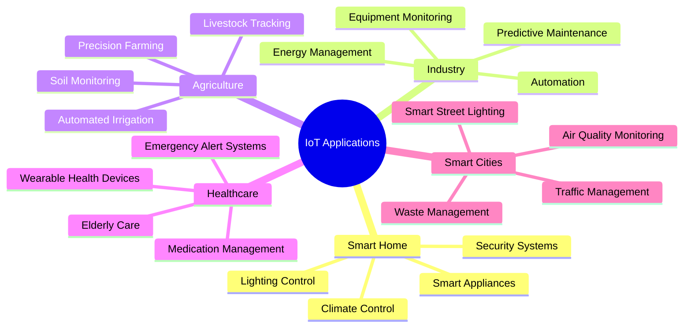
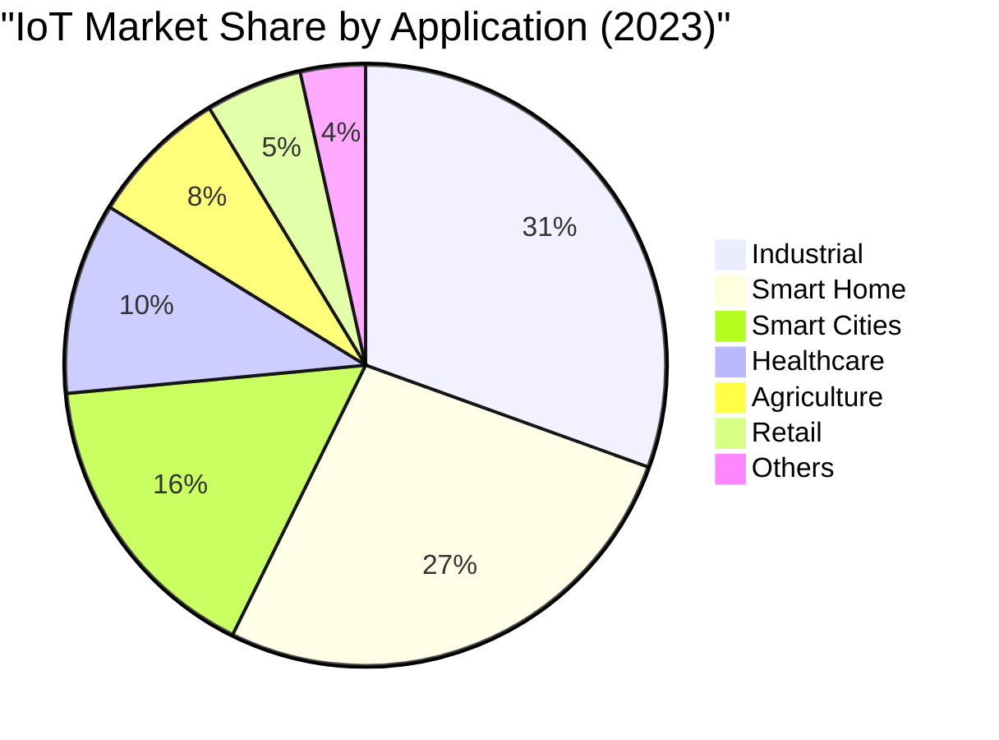

# IoT Applications Across Industries

---

## Presenter Notes (ข้อมูลสำหรับผู้บรรยาย)

> Key Takeaway: IoT มีการประยุกต์ใช้อย่างกว้างขวางในหลากหลายอุตสาหกรรม โดยภาคอุตสาหกรรมการผลิตครองส่วนแบ่งตลาดสูงสุด (30.5%) ตามด้วยบ้านอัจฉริยะ (26.8%) เทคโนโลยี IoT ช่วยเพิ่มประสิทธิภาพในทุกภาคส่วน เช่น ในบ้านช่วยเพิ่มความสะดวกสบายและประหยัดพลังงาน ในอุตสาหกรรมช่วยเพิ่มผลผลิตและลดต้นทุน ในการเกษตรช่วยเพิ่มผลผลิตและลดการใช้ทรัพยากร ในการดูแลสุขภาพช่วยในการเฝ้าระวังและป้องกัน และในเมืองอัจฉริยะช่วยยกระดับคุณภาพชีวิตและสิ่งแวดล้อม

**ศัพท์เทคนิค**:
- Smart Home - บ้านอัจฉริยะ
- Industrial IoT (IIoT) - อินเทอร์เน็ตของสรรพสิ่งในภาคอุตสาหกรรม
- Precision Agriculture - การเกษตรแม่นยำ
- Predictive Maintenance - การบำรุงรักษาเชิงพยากรณ์
- Smart Cities - เมืองอัจฉริยะ
- Wearable Devices - อุปกรณ์สวมใส่
- Asset Tracking - การติดตามสินทรัพย์
