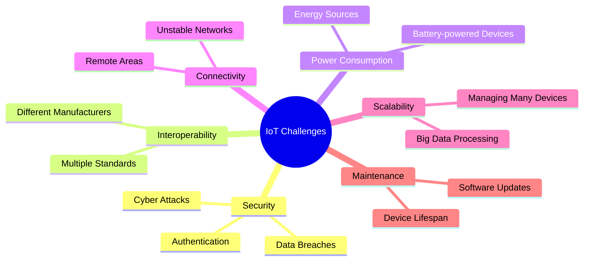

# Major Challenges in IoT

## Key IoT Security Threats (2023-2024)

1. **Botnet Attacks**: 3.5 million devices attacked (2023)
2. **Man-in-the-Middle**: 28% of IoT attacks
3. **DDoS via IoT**: Largest attack - 4.3 Tbps

---

## Presenter Notes (ข้อมูลสำหรับผู้บรรยาย)

> Key Takeaway: การพัฒนาระบบ IoT เผชิญกับความท้าทายหลายด้าน โดยความปลอดภัยเป็นความท้าทายสำคัญที่สุด เนื่องจากอุปกรณ์มักมีข้อจำกัดด้านทรัพยากร และเสี่ยงต่อการโจมตีแบบ Botnet ความท้าทายด้านความเข้ากันได้เกิดจากมาตรฐานที่หลากหลาย ขณะที่การจัดการพลังงานเป็นปัญหาสำหรับอุปกรณ์ที่ใช้แบตเตอรี่ การเชื่อมต่อในพื้นที่ห่างไกลเป็นอีกความท้าทายหนึ่ง รวมถึงการบริหารจัดการอุปกรณ์จำนวนมากและการบำรุงรักษาระบบที่กระจายอยู่ในพื้นที่กว้าง การเข้าใจและแก้ปัญหาเหล่านี้มีความสำคัญอย่างยิ่งต่อความสำเร็จของโครงการ IoT

**ศัพท์เทคนิค**:
- IoT Security - ความปลอดภัย IoT
- Botnet Attacks - การโจมตีแบบบอตเน็ต
- Man-in-the-Middle Attack - การโจมตีแบบคนกลาง
- DDoS (Distributed Denial of Service) - การโจมตีแบบปฏิเสธการให้บริการแบบกระจาย
- Firmware Update - การอัปเดตเฟิร์มแวร์
- Interoperability - ความสามารถในการทำงานร่วมกัน
- Power Optimization - การปรับปรุงประสิทธิภาพการใช้พลังงาน
