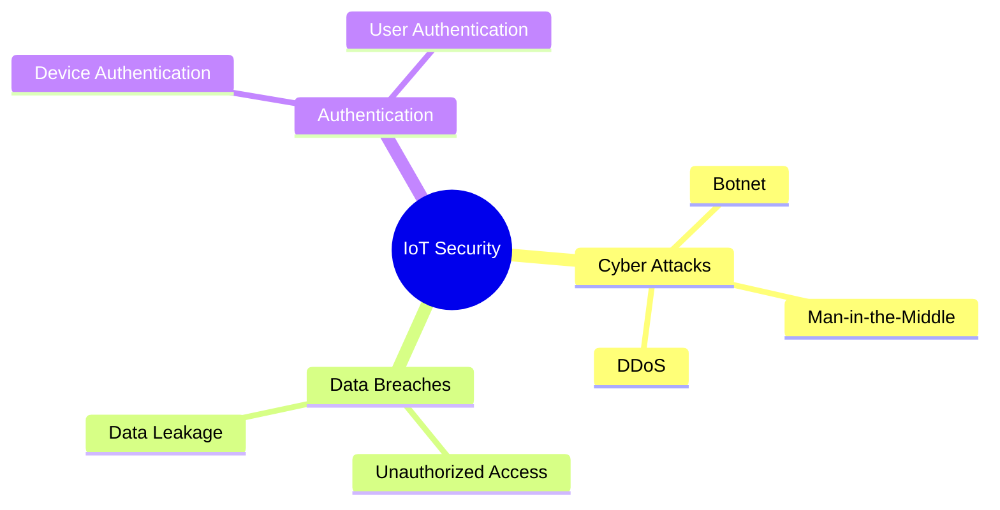

# IoT Security Challenges

## Key IoT Security Threats (2023-2024)

1. **Botnet Attacks**: 3.5 million devices attacked (2023)
2. **Man-in-the-Middle**: 28% of IoT attacks
3. **DDoS via IoT**: Largest attack - 4.3 Tbps

---

## Presenter Notes (ข้อมูลสำหรับผู้บรรยาย)

> Key Takeaway: ความปลอดภัยเป็นความท้าทายสำคัญที่สุดของระบบ IoT เนื่องจากอุปกรณ์มักมีข้อจำกัดด้านทรัพยากรและการประมวลผล ทำให้การรักษาความปลอดภัยทำได้ยาก การโจมตีแบบ Botnet เช่น Mirai Botnet ใช้อุปกรณ์ IoT ที่ไม่ปลอดภัยเป็นเครื่องมือโจมตี ขณะที่การรั่วไหลของข้อมูลส่วนตัวผ่านอุปกรณ์ IoT เป็นปัญหาที่ทวีความรุนแรง การปกป้องระบบต้องใช้การเข้ารหัสข้อมูล การยืนยันตัวตนที่แข็งแกร่ง และการอัปเดตความปลอดภัยอย่างสม่ำเสมอ รวมถึงการใช้มาตรฐานความปลอดภัยและแนวทางปฏิบัติที่ดี

**ศัพท์เทคนิค**:
- IoT Security - ความปลอดภัย IoT
- Botnet Attacks - การโจมตีแบบบอตเน็ต
- Man-in-the-Middle Attack - การโจมตีแบบคนกลาง
- DDoS (Distributed Denial of Service) - การโจมตีแบบปฏิเสธการให้บริการแบบกระจาย
- Data Breach - การรั่วไหลของข้อมูล
- Authentication - การยืนยันตัวตน
