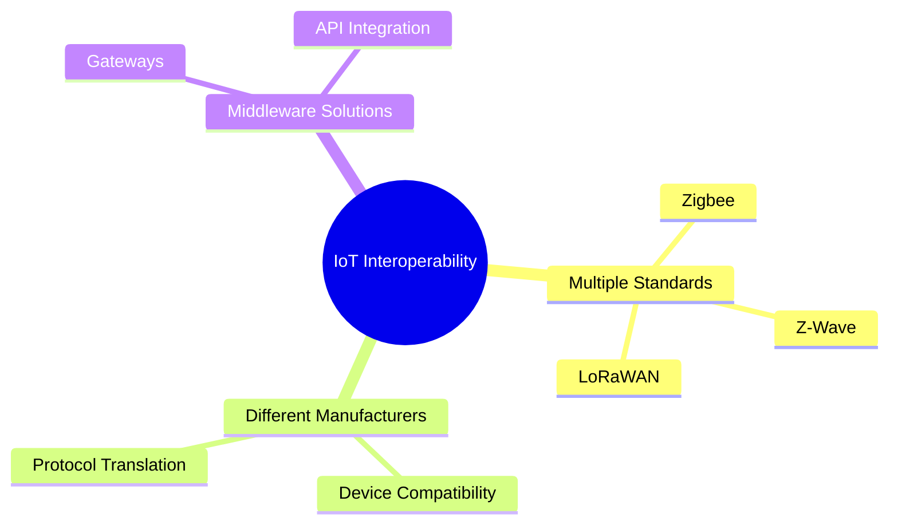

# IoT Interoperability Challenges

## Key Interoperability Issues

1. **Multiple Standards**: Different communication standards like Zigbee, Z-Wave, and LoRaWAN
2. **Device Compatibility**: Ensuring devices from different manufacturers work together
3. **Protocol Translation**: Middleware solutions to translate between different protocols

---

## Presenter Notes (ข้อมูลสำหรับผู้บรรยาย)

> Key Takeaway: ความท้าทายด้านความเข้ากันได้ (Interoperability) ในระบบ IoT เกิดจากการมีมาตรฐานการสื่อสารหลากหลาย เช่น Zigbee, Z-Wave และ LoRaWAN ซึ่งทำให้อุปกรณ์จากผู้ผลิตต่างกันสื่อสารกันได้ยาก การแก้ปัญหานี้ต้องอาศัยการใช้ middleware หรือ gateway เพื่อแปลงโปรโตคอลระหว่างอุปกรณ์ต่างๆ รวมถึงการทดสอบและปรับแต่งเพื่อให้แน่ใจว่าระบบทั้งหมดทำงานร่วมกันได้อย่างราบรื่น แนวคิดการใช้มาตรฐานกลางหรือแพลตฟอร์มเปิดกำลังได้รับความนิยมมากขึ้นเพื่อช่วยให้การพัฒนาระบบ IoT มีความยืดหยุ่นและขยายได้ง่ายขึ้น

**ศัพท์เทคนิค**:
- Interoperability - ความสามารถในการทำงานร่วมกัน
- Middleware - ซอฟต์แวร์กลางที่ช่วยในการเชื่อมต่อระบบต่างๆ
- Protocol Translation - การแปลโปรโตคอล
- Gateway - อุปกรณ์ที่เชื่อมต่อระหว่างเครือข่ายต่างๆ
