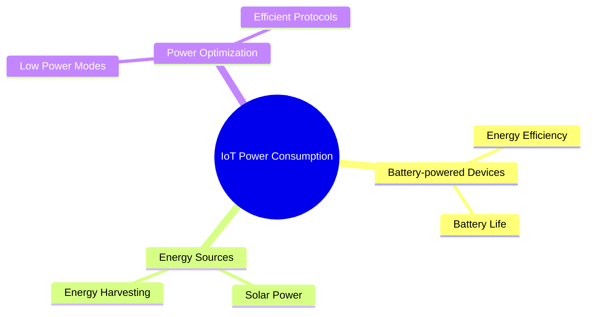

# IoT Power Consumption Challenges

## Key Power Consumption Issues

1. **Battery-powered Devices**: Ensuring long battery life and energy efficiency
2. **Energy Sources**: Exploring alternative energy sources like solar power and energy harvesting
3. **Power Optimization**: Implementing low power modes and efficient communication protocols

---

## Presenter Notes (ข้อมูลสำหรับผู้บรรยาย)

> Key Takeaway: การจัดการการใช้พลังงานเป็นความท้าทายสำคัญสำหรับอุปกรณ์ IoT โดยเฉพาะอุปกรณ์ที่ใช้แบตเตอรี่และติดตั้งในพื้นที่ห่างไกล การออกแบบให้ประหยัดพลังงานรวมถึงการใช้โหมดพลังงานต่ำและโปรโตคอลที่มีประสิทธิภาพช่วยยืดอายุการใช้งานแบตเตอรี่ได้อย่างมาก นอกจากนี้ การใช้แหล่งพลังงานทางเลือกเช่นพลังงานแสงอาทิตย์หรือการเก็บเกี่ยวพลังงานจากสิ่งแวดล้อม เป็นวิธีการที่มีประสิทธิภาพในการแก้ปัญหาการจำกัดด้านพลังงานของอุปกรณ์ IoT ในระยะยาว

**ศัพท์เทคนิค**:
- Power Consumption - การใช้พลังงาน
- Energy Efficiency - ประสิทธิภาพการใช้พลังงาน
- Battery Life - อายุการใช้งานของแบตเตอรี่
- Solar Power - พลังงานแสงอาทิตย์
- Energy Harvesting - การเก็บเกี่ยวพลังงาน
- Low Power Modes - โหมดพลังงานต่ำ
- Efficient Protocols - โปรโตคอลที่มีประสิทธิภาพ
