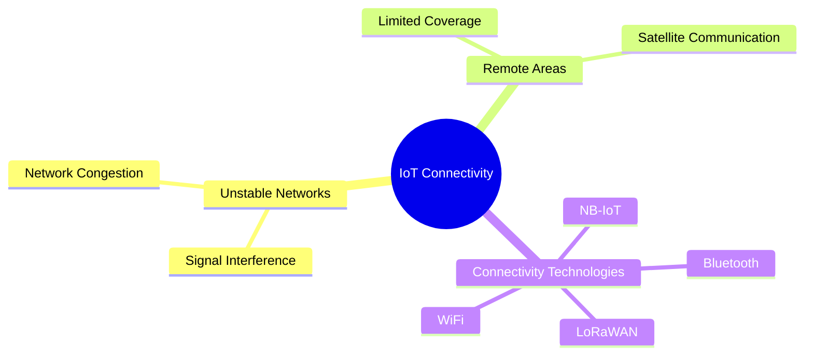

# IoT Connectivity Challenges

## Key Connectivity Issues

1. **Unstable Networks**: Handling signal interference and network congestion
2. **Remote Areas**: Ensuring connectivity in remote areas with limited coverage
3. **Connectivity Technologies**: Choosing the right technology for the specific use case

---

## Presenter Notes (ข้อมูลสำหรับผู้บรรยาย)

> Key Takeaway: การเชื่อมต่อ IoT มีความท้าทายหลายด้าน ได้แก่ การจัดการเครือข่ายที่ไม่เสถียร ซึ่งต้องมีการจัดการกับการรบกวนสัญญาณและความหนาแน่นของเครือข่าย การเชื่อมต่อในพื้นที่ห่างไกลที่มีความครอบคลุมจำกัดอาจต้องใช้การสื่อสารผ่านดาวเทียม และการเลือกเทคโนโลยีการเชื่อมต่อที่เหมาะสมกับกรณีการใช้งาน เช่น WiFi สำหรับการใช้งานในบ้าน หรือ LoRaWAN สำหรับพื้นที่กว้าง เป็นปัจจัยสำคัญต่อประสิทธิภาพของระบบ IoT

**ศัพท์เทคนิค**:
- Connectivity - การเชื่อมต่อ
- Signal Interference - การรบกวนสัญญาณ
- Network Congestion - ความหนาแน่นของเครือข่าย
- Remote Areas - พื้นที่ห่างไกล
- Satellite Communication - การสื่อสารผ่านดาวเทียม
- Connectivity Technologies - เทคโนโลยีการเชื่อมต่อ
