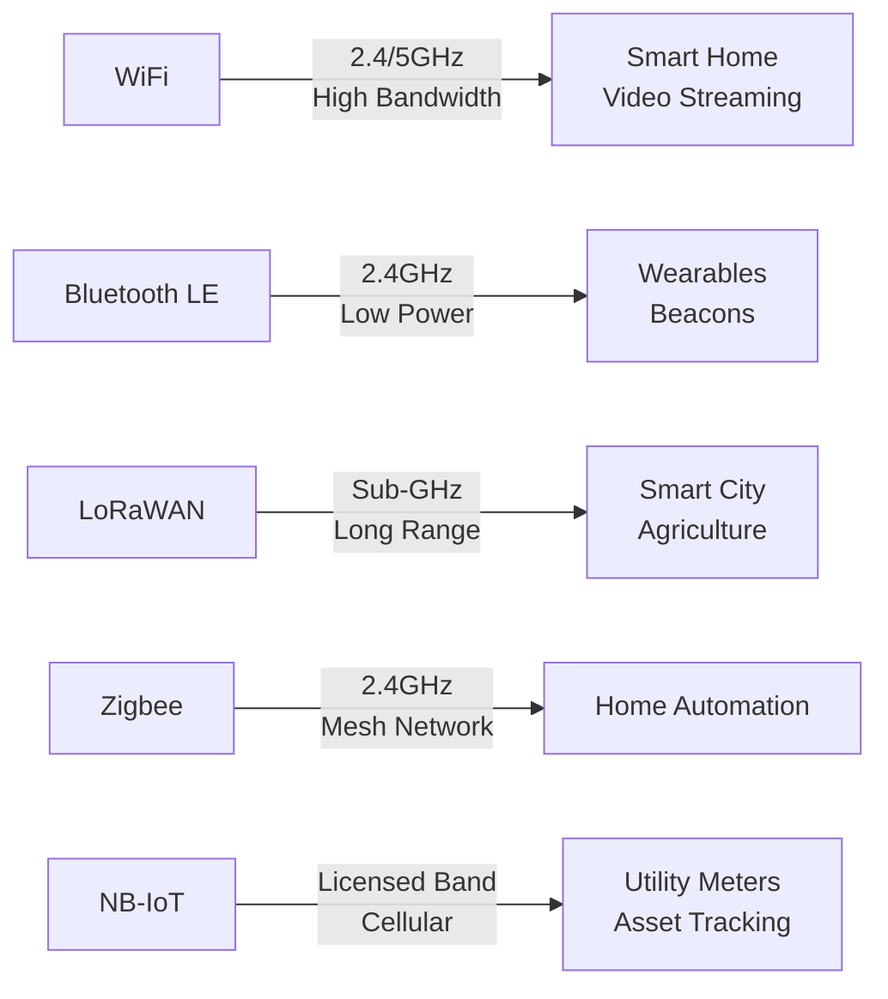

# Wireless Communication Technologies

> Key Takeaway: เทคโนโลยีการสื่อสารไร้สายสำหรับ IoT มีหลากหลายรูปแบบ แต่ละประเภทมีจุดเด่นและข้อจำกัดต่างกัน การเลือกใช้ขึ้นอยู่กับความต้องการด้านพลังงาน ระยะทาง และแบนด์วิดธ์ เช่น WiFi เหมาะกับอุปกรณ์ที่ต้องการส่งข้อมูลปริมาณมาก แต่ BLE เหมาะกับอุปกรณ์ที่ใช้พลังงานต่ำ ขณะที่ LoRaWAN เหมาะสำหรับการสื่อสารระยะไกลแต่ความเร็วต่ำ

Technical Terms:
- Bandwidth
- Power Consumption
- Range Coverage
- Mesh Network
- Signal Penetration
