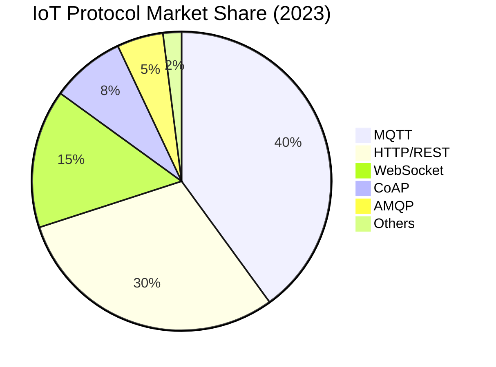

# IoT Protocol Market Share

## Why MQTT Leads?
- Lightweight design ideal for constrained devices
- Efficient publish/subscribe model
- Quality of Service levels
- Widespread industry adoption

> Key Takeaway: MQTT เป็นโปรโตคอลที่ครองตลาด IoT มากที่สุดด้วยสัดส่วนถึง 40% เนื่องจากถูกออกแบบมาเฉพาะสำหรับอุปกรณ์ที่มีข้อจำกัดด้านทรัพยากรและแบนด์วิดธ์ มีความยืดหยุ่นสูง และประหยัดพลังงาน ตามมาด้วย HTTP/REST ที่คุ้นเคยและใช้งานง่าย และ WebSocket ที่เหมาะกับแอปพลิเคชันแบบเรียลไทม์ สิ่งสำคัญคือการเลือกโปรโตคอลให้เหมาะกับความต้องการของระบบ

Technical Terms:
- Protocol Adoption Rate
- Market Penetration
- Industry Standard
- Enterprise Integration
- Legacy System Support
