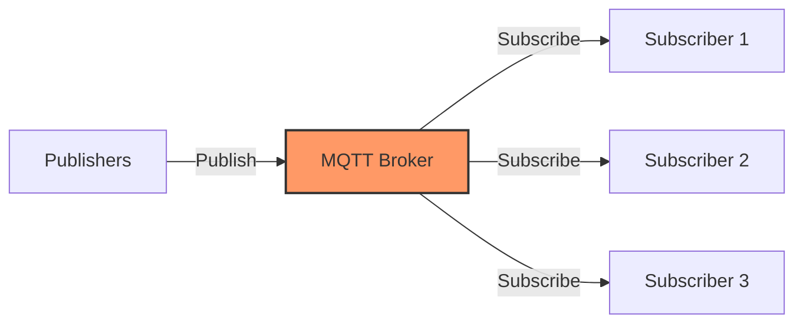

# MQTT Deep Dive

## Key MQTT Features
- **Quality of Service (QoS)**: 0 (at most once), 1 (at least once), 2 (exactly once)
- **Retained Messages**: Broker stores last message for new subscribers
- **Last Will & Testament**: Notification when client disconnects unexpectedly
- **Clean/Persistent Sessions**: Client state persistence options
- **Topic Hierarchies & Wildcards**: Flexible subscription patterns

> Key Takeaway: MQTT เป็นโปรโตคอลแบบ Publish/Subscribe ที่มีประสิทธิภาพสูงสำหรับ IoT โดยมีจุดเด่นคือ (1) คุณสมบัติ QoS ที่รองรับความต้องการที่แตกต่างกัน (2) Retained Messages ที่ช่วยให้ client ใหม่ได้รับข้อมูลล่าสุดทันที (3) Last Will ที่ช่วยในการตรวจสอบสถานะอุปกรณ์ และ (4) Topic Hierarchy ที่ยืดหยุ่น ทั้งหมดนี้ทำให้ MQTT เหมาะสมอย่างยิ่งกับการใช้งานในระบบ IoT

Technical Terms:
- Publish/Subscribe Model
- MQTT Broker
- Quality of Service (QoS)
- Retained Messages
- Last Will and Testament (LWT)
- Topic Wildcards
