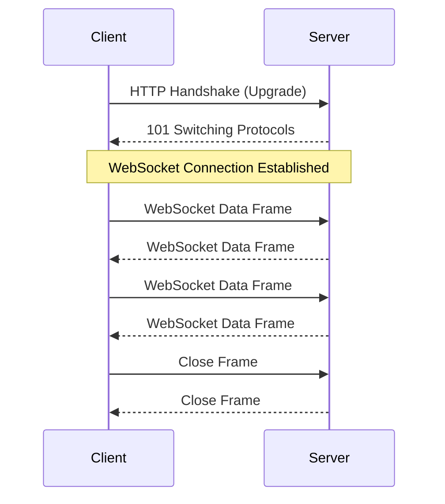

# WebSocket Fundamentals

## WebSocket Benefits for IoT
- Full-duplex communication over single TCP connection
- Real-time data exchange with minimal overhead
- Compatible with web browsers and IoT platforms
- Reduced latency compared to HTTP polling

> Key Takeaway: WebSocket เป็นโปรโตคอลที่เหมาะกับการสื่อสารแบบเรียลไทม์ใน IoT โดยเฉพาะในส่วนของ User Interface เนื่องจาก (1) รองรับการสื่อสารแบบ full-duplex ทำให้ส่งข้อมูลได้พร้อมกันทั้งสองทาง (2) มี overhead น้อยกว่า HTTP polling มาก (3) เข้ากันได้ดีกับเว็บบราวเซอร์ทำให้สร้าง dashboard แบบเรียลไทม์ได้ง่าย และ (4) ลด latency ในการอัพเดทข้อมูล เหมาะสำหรับการสร้าง dashboard เพื่อควบคุมและมอนิเตอร์อุปกรณ์ IoT แบบเรียลไทม์

Technical Terms:
- Full-duplex Communication
- HTTP Upgrade
- WebSocket Handshake
- WebSocket Frame
- Persistent Connection
- Event-driven Architecture
