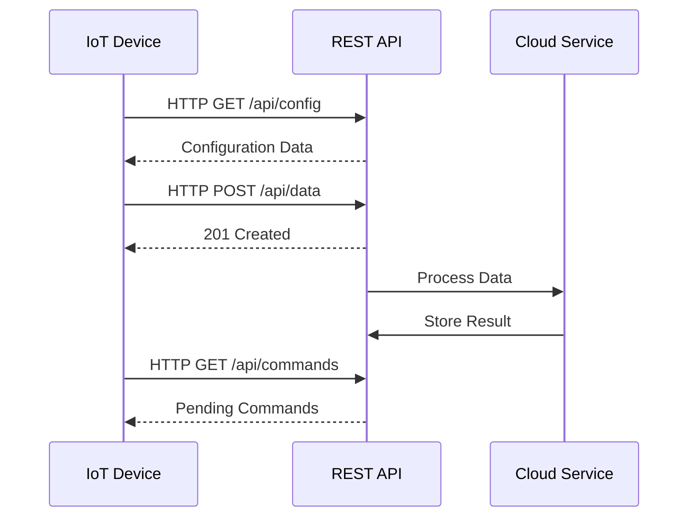

# HTTP/REST for IoT

## HTTP/REST Advantages in IoT
- Familiar and widespread
- Excellent compatibility with existing web infrastructure
- Stateless nature simplifies scaling
- Rich ecosystem of tools and libraries
- RESTful design patterns

> Key Takeaway: HTTP/REST ยังคงมีบทบาทสำคัญใน IoT โดยเฉพาะในการเชื่อมต่อระหว่างระบบและการทำ API แม้จะไม่เหมาะกับอุปกรณ์ที่มีข้อจำกัดสูงเท่า MQTT หรือ CoAP แต่ HTTP/REST มีข้อดีหลายประการ ได้แก่ (1) เป็นที่รู้จักและใช้งานอย่างแพร่หลาย (2) รองรับโครงสร้างพื้นฐานเว็บที่มีอยู่แล้ว (3) มีเครื่องมือและไลบรารีมากมาย และ (4) สามารถทำ caching เพื่อลดการใช้ทรัพยากรได้ เหมาะสำหรับการเชื่อมโยง IoT กับระบบภายนอกและการสร้าง API

Technical Terms:
- RESTful API
- HTTP Methods (GET, POST, PUT, DELETE)
- Status Codes
- Resource-oriented Architecture
- Stateless Protocol
- API Endpoints
