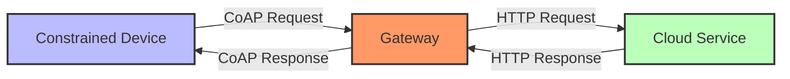

# CoAP for Constrained Devices

## CoAP (Constrained Application Protocol)
- Designed specifically for resource-constrained IoT devices
- UDP-based with optional reliability
- Minimal 4-byte header
- RESTful design similar to HTTP
- Built-in service discovery
- Support for multicast

> Key Takeaway: CoAP เป็นโปรโตคอลที่ออกแบบมาเฉพาะสำหรับอุปกรณ์ IoT ที่มีข้อจำกัดสูงมาก โดยมีจุดเด่น คือ (1) ใช้ UDP เป็นฐานทำให้ overhead ต่ำมาก (2) มีขนาด header เพียง 4 ไบต์ (3) มีการออกแบบคล้าย HTTP ทำให้ง่ายต่อการบูรณาการ (4) มีกลไก service discovery ในตัว และ (5) รองรับ multicast เหมาะสำหรับเซ็นเซอร์ขนาดเล็ก อุปกรณ์ที่ใช้แบตเตอรี่ หรือเครือข่ายที่มีแบนด์วิดธ์จำกัดมาก

Technical Terms:
- Constrained Application Protocol (CoAP)
- User Datagram Protocol (UDP)
- Confirmable Messages
- Non-confirmable Messages
- Service Discovery
- Resource Directory
- Block Transfer
