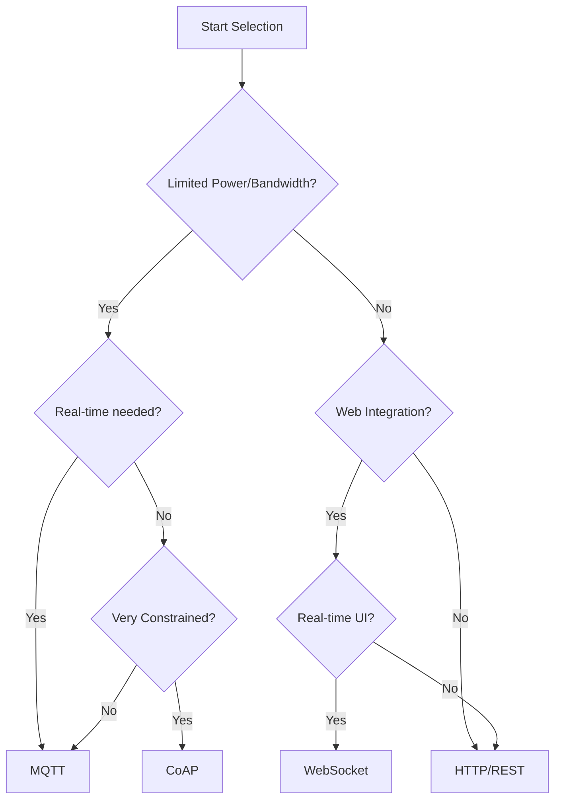

# Protocol Selection Guidelines

## Key Selection Factors
1. **Device Constraints**: Power, memory, processing capability
2. **Network Conditions**: Bandwidth, reliability, latency
3. **Communication Pattern**: One-to-many, many-to-one, request-response
4. **Data Requirements**: Size, frequency, importance
5. **Security Needs**: Authentication, encryption, access control

> Key Takeaway: การเลือกโปรโตคอลที่เหมาะสมเป็นปัจจัยสำคัญในความสำเร็จของระบบ IoT โดยต้องพิจารณาหลายปัจจัย ได้แก่ (1) ข้อจำกัดของอุปกรณ์ เช่น พลังงาน หน่วยความจำ (2) สภาพเครือข่าย เช่น แบนด์วิดธ์ ความเสถียร (3) รูปแบบการสื่อสาร เช่น การกระจายข้อมูลแบบ one-to-many หรือ request-response (4) ความต้องการด้านข้อมูล และ (5) ความต้องการด้านความปลอดภัย ในระบบจริงมักต้องใช้หลายโปรโตคอลร่วมกันเพื่อตอบสนองความต้องการที่หลากหลาย

Technical Terms:
- Protocol Overhead
- Message Payload
- Network Topology
- Data Throughput
- Latency Requirements
- Scalability Considerations
- Interoperability
