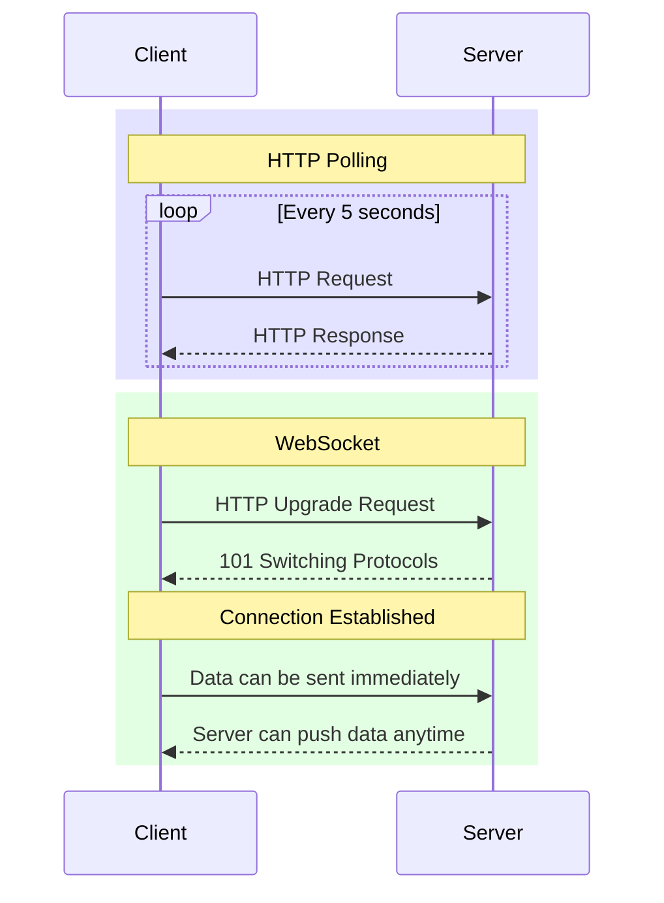

# WebSocket vs HTTP Polling

## HTTP Polling vs WebSocket Connection

- **HTTP Polling**: Multiple connections, high latency, header overhead
- **WebSocket**: Single persistent connection, immediate data transfer

[Search WebSocket vs HTTP comparison](https://www.google.com/search?q=WebSocket+vs+HTTP+polling+comparison&tbm=isch)

## Presenter Notes (ข้อมูลสำหรับผู้บรรยาย)

> Key Takeaway: HTTP Polling ต้องส่ง request ซ้ำๆ ในขณะที่ WebSocket เปิดการเชื่อมต่อครั้งเดียวแล้วแลกเปลี่ยนข้อมูลได้ตลอด ซึ่งมีประสิทธิภาพมากกว่าในระบบที่ต้องการข้อมูลแบบเรียลไทม์

> อธิบายถึงการทำงาน HTTP Polling ที่ client ต้องส่ง request ใหม่ทุกๆ 2-5 วินาที ทำให้เกิด overhead สูง ใช้แบนด์วิดธ์มาก และมี latency
> เปรียบเทียบกับ WebSocket ที่เปิดการเชื่อมต่อเพียงครั้งเดียว (เริ่มต้นด้วย HTTP Upgrade) แล้วสามารถส่งข้อมูลได้ตลอดแบบเรียลไทม์

> ศัพท์เทคนิค: HTTP Polling, Connection overhead, HTTP Upgrade, 101 Switching Protocols, Persistent connection
