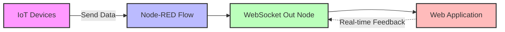

# WebSocket Architecture in Node-RED

Node-RED provides native **WebSocket nodes** for creating both server and client connections, easily integrating with other IoT protocols like MQTT.

[Search Node-RED WebSocket examples](https://www.google.com/search?q=Node-RED+WebSocket+examples&tbm=isch)

## Presenter Notes (ข้อมูลสำหรับผู้บรรยาย)

> Key Takeaway: Node-RED มีโหนดสำเร็จรูปสำหรับ WebSocket ทั้งแบบ in และ out ทำให้ง่ายต่อการเชื่อมต่อกับระบบ IoT และแอพพลิเคชั่น

> ใน Node-RED เราสามารถใช้โหนด WebSocket ได้ 2 แบบ:
> 1. WebSocket in - รับข้อมูลจาก client 
> 2. WebSocket out - ส่งข้อมูลไปยัง client

> ในไดอะแกรมจะเห็นว่า อุปกรณ์ IoT ส่งข้อมูลเข้ามาที่ Node-RED flow จากนั้น Node-RED จะส่งข้อมูลผ่าน WebSocket ไปยังแอพพลิเคชัน web โดยผู้ใช้สามารถโต้ตอบและส่งข้อมูลกลับมาได้ทันที

> Node-RED สามารถทำงานร่วมกับ MQTT ได้ดี โดย MQTT มักใช้รับข้อมูลจากอุปกรณ์ ในขณะที่ WebSocket ใช้ส่งข้อมูลไปแสดงผลที่หน้าเว็บ

> ศัพท์เทคนิค: WebSocket in/out nodes, WebSocket server, WebSocket client, Real-time data flow
