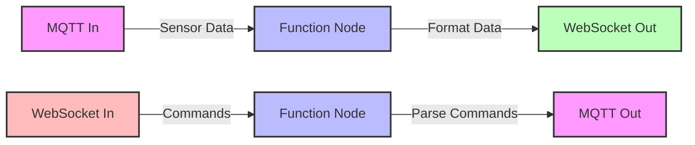

# Node-RED WebSocket Integration

Node-RED provides seamless integration between **MQTT** and **WebSocket**, creating a complete IoT communication pipeline from devices to user interfaces.

[Search Node-RED MQTT WebSocket integration](https://www.google.com/search?q=Node-RED+MQTT+WebSocket+integration&tbm=isch)

## Presenter Notes (ข้อมูลสำหรับผู้บรรยาย)

> Key Takeaway: Node-RED ช่วยให้การผสมผสาน MQTT (สำหรับอุปกรณ์) และ WebSocket (สำหรับ UI) เข้าด้วยกันได้อย่างลงตัว สร้างเป็น pipeline การสื่อสารแบบ end-to-end

> ไดอะแกรมแสดงสองเส้นทางการไหลของข้อมูล:
> 1. จากอุปกรณ์ไปยัง UI: MQTT In รับข้อมูลจากเซ็นเซอร์ → Function Node แปลงข้อมูล → WebSocket Out ส่งข้อมูลไปยังเว็บแอปพลิเคชัน
> 2. จาก UI ไปยังอุปกรณ์: WebSocket In รับคำสั่งจากเว็บแอปพลิเคชัน → Function Node แปลงข้อมูลเป็นรูปแบบที่เหมาะสม → MQTT Out ส่งคำสั่งไปยังอุปกรณ์

> การตั้งค่า WebSocket ใน Node-RED:
> - WebSocket in/out node สามารถตั้งค่าเป็นทั้ง client หรือ server
> - สามารถกำหนด path เช่น /ws/sensors หรือ /ws/commands
> - รองรับทั้งข้อมูลแบบ text และ binary

> ศัพท์เทคนิค: WebSocket nodes, MQTT broker, bidirectional communication, data transformation, end-to-end communication
