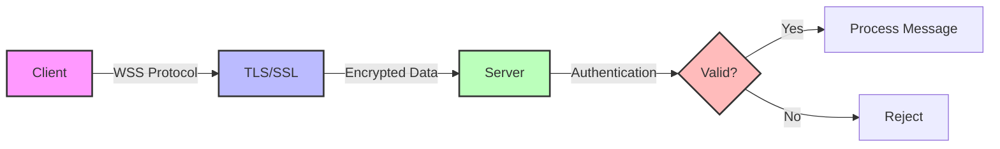

# WebSocket Security Considerations

## Key Security Practices:

- **Use WSS (WebSocket Secure)** - WebSocket over TLS/SSL
- **Implement authentication** - via tokens or cookies
- **Validate all messages** - prevent injection attacks
- **Rate limiting** - protect against DoS attacks
- **Origin checking** - verify connection sources

[Search WebSocket security best practices](https://www.google.com/search?q=WebSocket+security+best+practices&tbm=isch)

## Presenter Notes (ข้อมูลสำหรับผู้บรรยาย)

> Key Takeaway: ความปลอดภัยของ WebSocket เป็นสิ่งสำคัญมาก โดยเฉพาะในระบบ IoT ที่มีข้อมูลอ่อนไหว ควรใช้ WSS, การยืนยันตัวตน, การตรวจสอบข้อมูล, และการจำกัดอัตราการเชื่อมต่อ

> WSS (WebSocket Secure): ใช้ TLS/SSL เพื่อเข้ารหัสการสื่อสาร เช่นเดียวกับ HTTPS สำหรับ HTTP โดยใช้ protocol 'wss://' แทน 'ws://'
> 
> การยืนยันตัวตน: ควรทำเมื่อเริ่มเชื่อมต่อ WebSocket โดยอาจใช้:
> - Token-based authentication (เช่น JWT)
> - Cookie-based authentication (ใช้ session ร่วมกับ HTTP)
> - Custom handshake protocol
> 
> การตรวจสอบข้อมูล: ข้อมูลที่ได้รับจาก WebSocket ต้องได้รับการตรวจสอบเช่นเดียวกับข้อมูลจาก HTTP เพื่อป้องกัน injection attacks
> 
> การจำกัดอัตราการเชื่อมต่อ (Rate limiting): ป้องกัน DoS attacks โดยจำกัดจำนวนการเชื่อมต่อและข้อความต่อวินาที

> ศัพท์เทคนิค: WSS (WebSocket Secure), TLS/SSL, authentication, token-based authentication, message validation, rate limiting, origin checking
