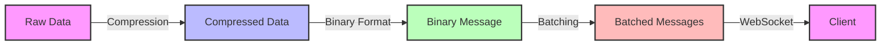

# WebSocket Performance Optimization

## Best Practices:

- **Message Compression** - reduce payload size
- **Binary Messaging** - more efficient than text for IoT data
- **Connection Pooling** - reuse connections
- **Message Batching** - combine small messages
- **Selective Updates** - send only changed data

[Search WebSocket performance optimization](https://www.google.com/search?q=WebSocket+performance+optimization&tbm=isch)

## Presenter Notes (ข้อมูลสำหรับผู้บรรยาย)

> Key Takeaway: การปรับแต่งประสิทธิภาพ WebSocket สำคัญมากในระบบ IoT ที่มีข้อมูลจำนวนมาก เทคนิคหลักได้แก่ การบีบอัดข้อมูล, การใช้ binary format, การรวมข้อความ และการส่งเฉพาะข้อมูลที่เปลี่ยนแปลง

> การบีบอัดข้อมูล (Message Compression): ใช้ algorithms เช่น gzip, deflate, Brotli เพื่อลดขนาดข้อมูล เหมาะกับข้อมูล JSON ที่มีรูปแบบซ้ำๆ
> 
> Binary Messaging: WebSocket รองรับทั้งข้อมูลแบบ text และ binary โดยข้อมูลแบบ binary มีประสิทธิภาพมากกว่าสำหรับข้อมูล IoT เช่น การอ่านค่าเซ็นเซอร์ สามารถใช้ formats เช่น Protocol Buffers, MessagePack, CBOR
> 
> Connection Pooling: เปิดใช้ WebSocket connection แบบ persistent และใช้ซ้ำ แทนที่จะเปิด-ปิดบ่อยๆ
> 
> Message Batching: รวมข้อความหลายๆ อันเข้าด้วยกันก่อนส่ง เพื่อลดการส่งหลายครั้ง เหมาะสำหรับข้อมูลจำนวนมากที่ไม่จำเป็นต้องส่งทันที
> 
> Selective Updates: ส่งเฉพาะข้อมูลที่เปลี่ยนแปลง ไม่ส่งข้อมูลทั้งหมดซ้ำๆ

> ศัพท์เทคนิค: Message compression, binary messaging, connection pooling, message batching, selective updates, Protocol Buffers, MessagePack, CBOR
