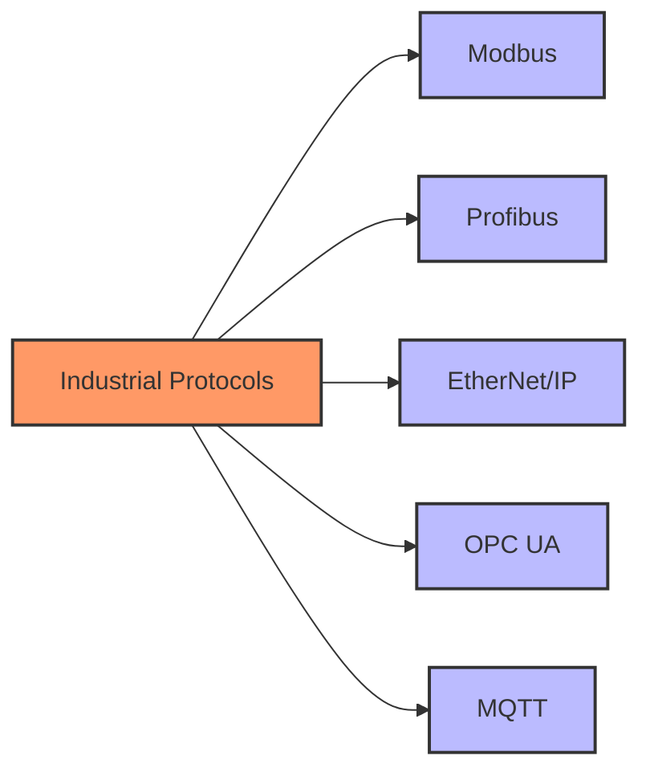

# Modbus vs Other Industrial Protocols

Comparing key industrial communication protocols:

| Feature | Modbus | Profibus | EtherNet/IP | OPC UA | MQTT |
|---------|--------|----------|------------|-------|------|
| Complexity | Low | High | Medium | High | Low |
| Cost | Low | High | Medium | Medium-High | Low |
| Security | Low | Medium | High | Very High | High |
| IoT Integration | Medium | Low | High | Very High | Very High |

[Image Search: Industrial communication protocols comparison](https://www.google.com/search?q=industrial+communication+protocols+comparison&tbm=isch)

## Presenter Notes (ข้อมูลสำหรับผู้บรรยาย)

> Key Takeaway: การเปรียบเทียบ Modbus กับโปรโตคอลอุตสาหกรรมอื่นๆ แสดงให้เห็นจุดเด่นและจุดด้อย โดย Modbus มีข้อดีที่ความเรียบง่าย ค่าใช้จ่ายต่ำ และการใช้ทรัพยากรน้อย แต่มีข้อด้อยเรื่องความปลอดภัยและความสามารถที่จำกัด
> 
> ศัพท์เทคนิค:
> - Profibus: Process Field Bus - มาตรฐานการสื่อสารที่ใช้ในระบบอัตโนมัติในอุตสาหกรรม
> - EtherNet/IP: Industrial Ethernet protocol ที่ใช้งานกันอย่างแพร่หลาย
> - OPC UA: Open Platform Communications Unified Architecture - มาตรฐานการสื่อสารอุตสาหกรรมสมัยใหม่
> 
> ควรอธิบายให้ผู้เรียนเข้าใจว่าการเลือกโปรโตคอลขึ้นอยู่กับความต้องการที่เฉพาะเจาะจงของระบบ เช่น หากต้องการระบบที่มีต้นทุนต่ำและไม่ซับซ้อน Modbus ก็ยังเป็นตัวเลือกที่ดี แต่หากต้องการระบบที่มีความปลอดภัยสูงและรองรับฟีเจอร์ซับซ้อน อาจต้องพิจารณาโปรโตคอลอื่น
