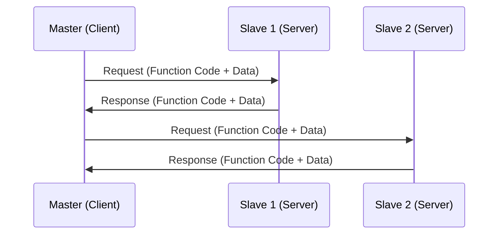

# Modbus Architecture and Communication

Modbus follows a master-slave (client-server) architecture:

**Function Codes:**
- 01: Read Coils
- 02: Read Discrete Inputs
- 03: Read Holding Registers
- 04: Read Input Registers
- 05: Write Single Coil
- 06: Write Single Register

[Image Search: Modbus master slave architecture](https://www.google.com/search?q=Modbus+master+slave+architecture&tbm=isch)

## Presenter Notes (ข้อมูลสำหรับผู้บรรยาย)

> Key Takeaway: Modbus ใช้สถาปัตยกรรมแบบ Master-Slave (หรือ Client-Server ในรูปแบบใหม่) โดย Master สามารถส่งคำสั่งไปยัง Slave ได้หลายตัว แต่ Slave จะตอบกลับเฉพาะเมื่อได้รับคำสั่งจาก Master เท่านั้น ไม่สามารถส่งข้อมูลเองโดยไม่มีการร้องขอ
> 
> ศัพท์เทคนิค:
> - Function Code: รหัสคำสั่งใน Modbus ที่บอกว่าต้องการทำอะไร
> - Coil: สถานะ discrete output แบบ on/off (1 bit)
> - Discrete Input: สถานะ input แบบ on/off (1 bit)
> - Holding Register: ค่า register ที่อ่านและเขียนได้ (16 bit)
> - Input Register: ค่า register ที่อ่านได้อย่างเดียว (16 bit)
> 
> ควรอธิบายให้ผู้เรียนเข้าใจว่า แม้ว่าโครงสร้างของ Modbus จะเรียบง่าย แต่เป็นข้อจำกัดในระบบ IoT ที่บางครั้งต้องการให้อุปกรณ์ส่งข้อมูลโดยไม่ต้องรอการร้องขอ (push data) ซึ่งทำให้ต้องมีการออกแบบระบบเพิ่มเติม เช่น การใช้ polling หรือ gateway ที่แปลงข้อมูลไปเป็นโปรโตคอลอื่น เช่น MQTT
