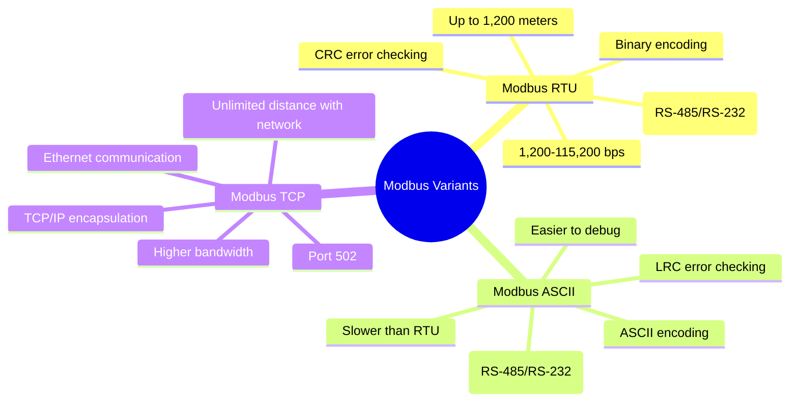

# Modbus Variants and Specifications

[Image Search: Modbus RTU vs TCP communication](https://www.google.com/search?q=Modbus+RTU+vs+TCP+communication&tbm=isch)

## Presenter Notes (ข้อมูลสำหรับผู้บรรยาย)

> Key Takeaway: Modbus มีหลายรูปแบบ แต่ที่นิยมใช้มี 3 แบบหลักคือ Modbus RTU, Modbus ASCII และ Modbus TCP โดยแต่ละแบบมีข้อดีและข้อเสียต่างกัน
> 
> ศัพท์เทคนิค:
> - RS-485/RS-232: มาตรฐานการสื่อสารแบบอนุกรม (serial) ในอุตสาหกรรม
> - CRC (Cyclic Redundancy Check): การตรวจสอบความถูกต้องของข้อมูลแบบไบนารี
> - LRC (Longitudinal Redundancy Check): การตรวจสอบความถูกต้องของข้อมูลแบบ ASCII
> - TCP (Transmission Control Protocol): โปรโตคอลควบคุมการส่งข้อมูลบนเครือข่าย IP
> 
> เน้นให้ผู้เรียนเข้าใจความแตกต่าง:
> - Modbus RTU: เหมาะกับการสื่อสารระยะใกล้ในพื้นที่จำกัด ใช้ข้อมูลน้อย ประหยัด bandwidth
> - Modbus ASCII: ง่ายต่อการตรวจสอบและแก้ไขปัญหา แต่ใช้ bandwidth มากกว่า RTU
> - Modbus TCP: เหมาะกับระบบเครือข่ายขนาดใหญ่ ระยะไกล ใช้โครงสร้างพื้นฐาน Ethernet ที่มีอยู่แล้ว
>
> ในงาน IoT สมัยใหม่ Modbus TCP เป็นที่นิยมเพราะสามารถเชื่อมต่อกับระบบเครือข่ายได้ง่ายและขยายได้ไกล
