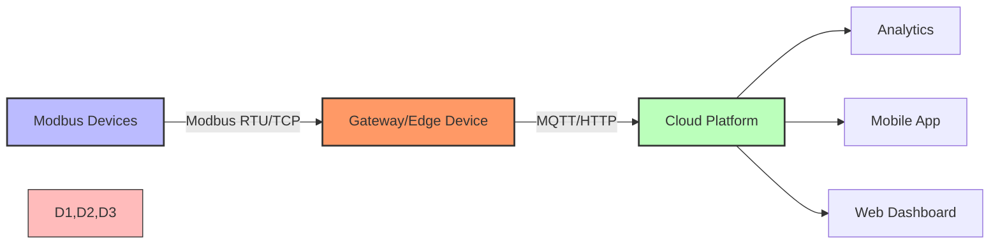

# Modbus in IoT Applications

Integrating Modbus with modern IoT systems:

**Common Integration Patterns:**
- Modbus-to-MQTT Gateway
- Node-RED Modbus connections
- OPC UA as middleware
- Edge computing with protocol translation

[Image Search: Modbus IoT gateway architecture](https://www.google.com/search?q=Modbus+IoT+gateway+architecture&tbm=isch)

## Presenter Notes (ข้อมูลสำหรับผู้บรรยาย)

> Key Takeaway: การผสานรวม Modbus เข้ากับระบบ IoT สมัยใหม่มักต้องใช้อุปกรณ์ Gateway หรือ Edge Device เพื่อแปลงโปรโตคอลจาก Modbus เป็นโปรโตคอล IoT สมัยใหม่เช่น MQTT หรือ HTTP
> 
> ศัพท์เทคนิค:
> - Gateway: อุปกรณ์ที่ทำหน้าที่แปลงโปรโตคอลระหว่างเครือข่ายต่างกัน
> - Edge Device: อุปกรณ์ประมวลผลที่อยู่ใกล้กับแหล่งข้อมูล
> - Protocol Translation: การแปลงข้อมูลระหว่างโปรโตคอลที่ต่างกัน
> - OPC UA (Open Platform Communications Unified Architecture): มาตรฐานการสื่อสารที่เป็นสะพานเชื่อมระหว่างเทคโนโลยีอุตสาหกรรมและเทคโนโลยี IT
> 
> อธิบายเพิ่มเติมว่า Modbus ถูกออกแบบมาก่อนยุค IoT และมีข้อจำกัดหลายอย่าง เช่น:
> 1. ไม่มีการรักษาความปลอดภัยในตัว
> 2. ไม่รองรับการส่งข้อมูลแบบ publish-subscribe
> 3. ข้อมูลมีขนาดจำกัด (125 registers ต่อคำสั่ง)
> 
> แต่ด้วยการใช้ gateway ที่เหมาะสม เราสามารถเชื่อมต่ออุปกรณ์ Modbus เข้ากับระบบ IoT สมัยใหม่ได้ ทำให้อุปกรณ์อุตสาหกรรมเก่าสามารถเข้าสู่ยุค IoT ได้โดยไม่ต้องเปลี่ยนอุปกรณ์ใหม่ทั้งหมด
