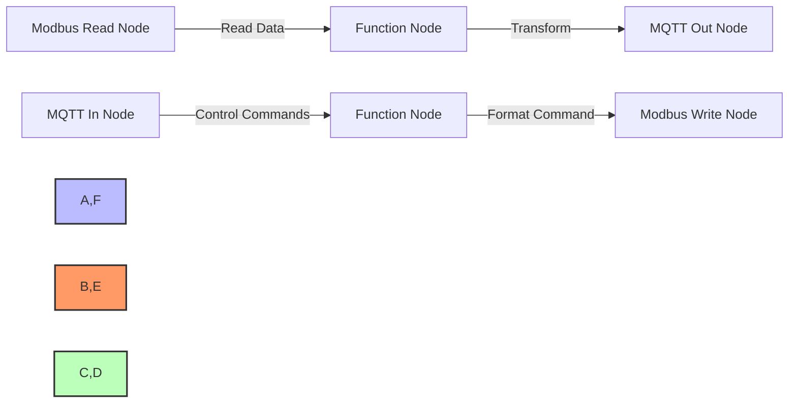

# Implementing Modbus with Node-RED

Node-RED provides powerful tools for integrating Modbus into IoT solutions:

**Key Node-RED Modbus Components:**
- `node-red-contrib-modbus` package
- Modbus Read/Write/Server nodes
- Modbus Flex Getter/Setter nodes
- Modbus Response Filter nodes

[Image Search: Node-RED Modbus flow example](https://www.google.com/search?q=Node-RED+Modbus+flow+example&tbm=isch)

## Presenter Notes (ข้อมูลสำหรับผู้บรรยาย)

> Key Takeaway: Node-RED เป็นเครื่องมือที่เหมาะสมอย่างยิ่งสำหรับการเชื่อมต่อ Modbus เข้ากับระบบ IoT เพราะมี nodes สำเร็จรูปสำหรับ Modbus และสามารถแปลงข้อมูลไปเป็นรูปแบบอื่นๆ ได้อย่างยืดหยุ่น
> 
> ศัพท์เทคนิค:
> - `node-red-contrib-modbus`: แพ็คเกจเสริมสำหรับ Node-RED ที่ให้ความสามารถในการเชื่อมต่อกับอุปกรณ์ Modbus
> - Modbus Read node: โหนดสำหรับอ่านข้อมูลจากอุปกรณ์ Modbus
> - Modbus Write node: โหนดสำหรับเขียนข้อมูลไปยังอุปกรณ์ Modbus
> - Modbus Server node: โหนดที่จำลองเป็น Modbus Slave/Server
> - Function node: โหนดสำหรับเขียนโค้ด JavaScript เพื่อประมวลผลข้อมูล
> 
> เตรียมสาธิตตัวอย่างพื้นฐาน:
> 1. การอ่านข้อมูลจาก Modbus device (เช่น เซนเซอร์อุณหภูมิ) และแสดงบน dashboard
> 2. การรับคำสั่งจาก dashboard และเขียนไปยัง Modbus device (เช่น เปิด/ปิด relay)
> 3. การตั้งค่าการอ่านข้อมูลเป็นประจำ (polling) ทุกๆ กี่วินาที
> 4. การแปลงข้อมูลจาก Modbus และส่งต่อไปยัง MQTT broker
> 
> ย้ำว่าจุดแข็งของ Node-RED คือ visual programming ที่ทำให้ผู้ที่ไม่มีความรู้ด้านการเขียนโปรแกรมมากนักสามารถสร้างระบบเชื่อมต่อ Modbus กับ IoT ได้ง่าย
