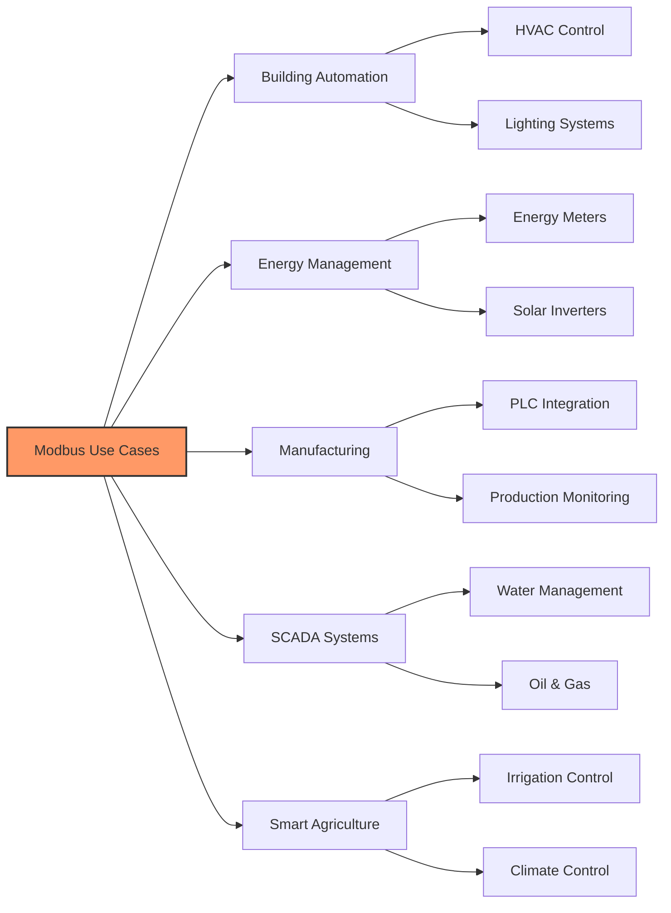

# Industry Use Cases for Modbus

Modbus is widely used in various industries:

**Success Stories:**
- Building monitoring with 35% energy savings
- Factory automation with 28% increased production
- Smart farm with 40% water usage reduction

[Image Search: Modbus industrial applications examples](https://www.google.com/search?q=Modbus+industrial+applications+examples&tbm=isch)

## Presenter Notes (ข้อมูลสำหรับผู้บรรยาย)

> Key Takeaway: Modbus มีการใช้งานจริงในหลากหลายอุตสาหกรรม โดยเฉพาะระบบที่ต้องการความเสถียรและใช้มานาน
> 
> ศัพท์เทคนิค:
> - HVAC (Heating, Ventilation, and Air Conditioning): ระบบทำความร้อน การระบายอากาศ และปรับอากาศ
> - SCADA (Supervisory Control and Data Acquisition): ระบบควบคุมและเก็บข้อมูลระดับสูง
> - PLC (Programmable Logic Controller): อุปกรณ์ควบคุมที่ใช้ในอุตสาหกรรม
> - Solar Inverter: อุปกรณ์แปลงไฟฟ้ากระแสตรงจากแผงโซลาร์เซลล์เป็นกระแสสลับ
> 
> กรณีศึกษาที่น่าสนใจ:
> 1. อาคารอัจฉริยะ: การควบคุมระบบปรับอากาศ แสงสว่าง และการเข้าถึงผ่าน Modbus เชื่อมต่อกับระบบควบคุมอาคารส่วนกลาง
> 2. โรงงานอัตโนมัติ: การรวบรวมข้อมูลจากเครื่องจักรที่ใช้ Modbus มาวิเคราะห์เพื่อป้องกันการหยุดชะงักของการผลิต
> 3. ฟาร์มอัจฉริยะ: การติดตั้งเซ็นเซอร์ความชื้นในดินที่ใช้ Modbus เพื่อควบคุมระบบให้น้ำอัตโนมัติ
> 
> ควรเน้นให้ผู้เรียนเห็นว่า Modbus เป็นโปรโตคอลที่มีการใช้งานจริงในอุตสาหกรรม และสามารถนำมาประยุกต์กับระบบ IoT สมัยใหม่ได้อย่างมีประสิทธิภาพ โดยเน้นประเด็นความทนทาน ความน่าเชื่อถือ และการลงทุนที่คุ้มค่าในระยะยาว
