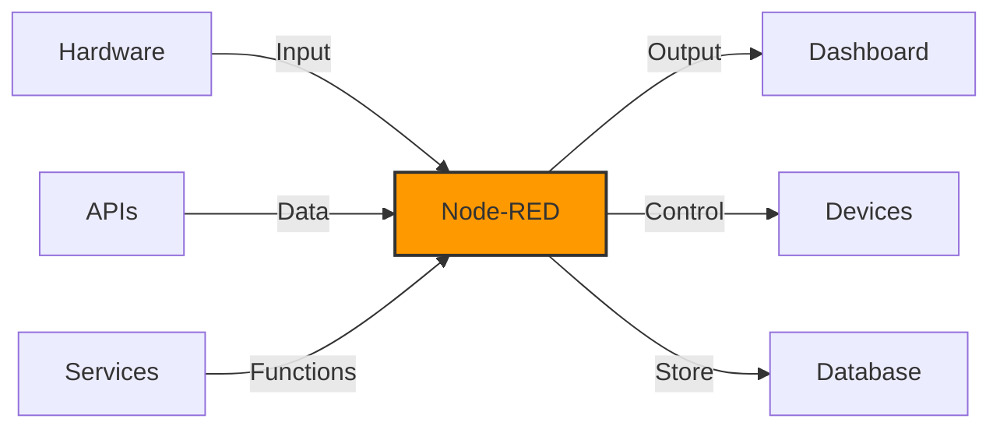

# Introduction to Node-RED

Node-RED is a flow-based programming tool originally developed by IBM for wiring together hardware devices, APIs, and online services as part of the Internet of Things.

Key features:
- Browser-based flow editor
- JavaScript functions
- Built-in dashboard
- Extensive node library

[Search Node-RED examples](https://www.google.com/search?q=node-red+flow+examples&tbm=isch)

## Presenter Notes (ข้อมูลสำหรับผู้บรรยาย)

> Key Takeaway: Node-RED เป็นเครื่องมือโปรแกรมมิ่งแบบ Flow-based ที่พัฒนาโดย IBM ช่วยให้เชื่อมต่ออุปกรณ์ฮาร์ดแวร์ API และบริการออนไลน์ได้อย่างง่ายดาย โดยไม่ต้องเขียนโค้ดมากนัก เหมาะสำหรับการพัฒนา IoT แบบรวดเร็ว

> Node-RED ทำงานผ่านการลากและวาง "โหนด" ต่างๆ มาเชื่อมต่อกันเป็น "flow" เพื่อสร้างแอปพลิเคชันได้ โดยแต่ละโหนดทำหน้าที่เฉพาะ เช่น รับข้อมูล, ประมวลผล, หรือส่งข้อมูลออก

> เราจะได้เรียนรู้วิธีติดตั้ง Node-RED การสร้าง flow พื้นฐาน การใช้โหนด MQTT การสร้างแดชบอร์ด และการจัดการข้อมูลเซนเซอร์ รวมถึงการตั้งค่าระบบแจ้งเตือนและการวิเคราะห์ข้อมูลเบื้องต้น

> ศัพท์เทคนิค: Flow-based programming, Node, Flow, Wire, Dashboard, Inject node, Debug node, Function node
