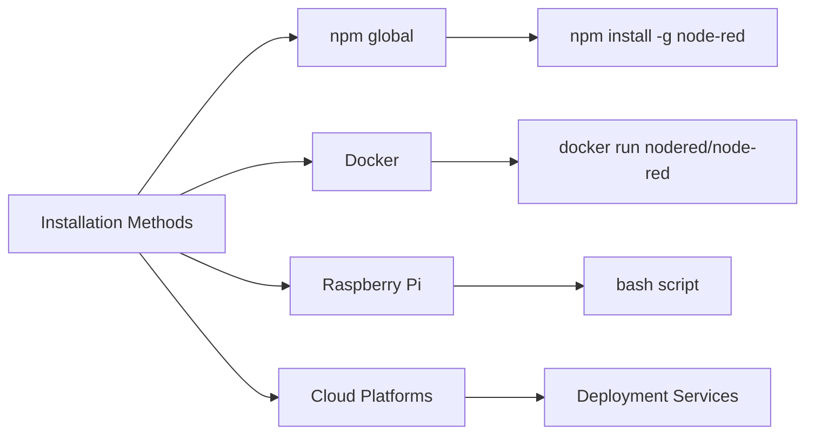

# Installing Node-RED

Node-RED can be installed on various platforms including Windows, macOS, Linux, and Raspberry Pi.

## Installation Methods:



## Basic Command:
```bash
# Install via npm
npm install -g --unsafe-perm node-red

# Start Node-RED
node-red

# Access via browser
# http://localhost:1880
```

[Search Node-RED installation guide](https://www.google.com/search?q=node-red+installation+tutorial&tbm=isch)

## Presenter Notes (ข้อมูลสำหรับผู้บรรยาย)

> Key Takeaway: Node-RED สามารถติดตั้งได้หลากหลายวิธี ทั้งการติดตั้งโดยตรงผ่าน npm, Docker, หรือบนอุปกรณ์ Raspberry Pi แต่สำหรับเวิร์คช็อปนี้ เราจะใช้ Docker ซึ่งได้เตรียมไว้ให้ในไฟล์ docker-compose.yml

> วิธีการติดตั้ง Node-RED มีหลายแบบ:
> 1. การติดตั้งผ่าน npm (ต้องติดตั้ง Node.js ก่อน)
> 2. การใช้ Docker (วิธีที่ง่ายที่สุดสำหรับการเริ่มต้นใช้งาน)
> 3. การติดตั้งบน Raspberry Pi (เหมาะสำหรับโปรเจค IoT)
> 4. การติดตั้งบนคลาวด์แพลตฟอร์ม (เช่น AWS, Azure, GCP)

> เมื่อติดตั้งเสร็จแล้ว สามารถเข้าถึง Node-RED ได้ผ่านเว็บเบราว์เซอร์ที่ URL http://localhost:1880 (สำหรับการติดตั้งแบบปกติ) หรือพอร์ตที่กำหนดในกรณีใช้ Docker

> ศัพท์เทคนิค: npm (Node Package Manager), Docker, Container, Port forwarding, localhost
