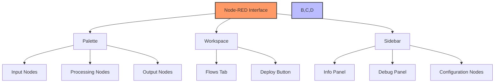

# Node-RED Interface

The Node-RED editor provides an intuitive interface for creating IoT applications through a visual programming approach.

## Main Interface Components:

## Workflow:
1. Drag nodes from the palette to the workspace
2. Connect nodes to create flows
3. Configure nodes with double-click
4. Deploy to activate changes

[Search Node-RED interface tutorial](https://www.google.com/search?q=node-red+interface+explained&tbm=isch)

## Presenter Notes (ข้อมูลสำหรับผู้บรรยาย)

> Key Takeaway: อินเทอร์เฟซของ Node-RED ถูกออกแบบให้ใช้งานง่ายและเป็นแบบ visual programming ประกอบด้วย 3 ส่วนหลัก คือ Palette, Workspace และ Sidebar

> อธิบายส่วนประกอบหลัก:
> 1. **Palette** (ด้านซ้าย) - แสดงโหนดทั้งหมดที่สามารถใช้งานได้ แบ่งเป็นหมวดหมู่:
>    - Input nodes (รับข้อมูลจากแหล่งต่างๆ)
>    - Processing nodes (ประมวลผลข้อมูล)
>    - Output nodes (ส่งข้อมูลออกไปยังปลายทาง)
> 2. **Workspace** (ตรงกลาง) - พื้นที่สำหรับวาง flow การทำงาน มี tabs สำหรับแยก flow ต่างๆ
> 3. **Sidebar** (ด้านขวา) - แสดงข้อมูลเพิ่มเติม เช่น:
>    - Info panel (รายละเอียดของโหนด)
>    - Debug panel (แสดงข้อมูลดีบัก)
>    - Configuration nodes (โหนดการตั้งค่า)

> การไหลของข้อมูลใน Node-RED จะเป็นจากซ้ายไปขวา โดยข้อมูลที่ส่งระหว่างโหนดเรียกว่า "msg" ซึ่งประกอบด้วย properties ต่างๆ โดย property หลักคือ msg.payload

> ศัพท์เทคนิค: Palette, Workspace, Flow, Sidebar, Deploy, Node configuration, Debug panel, Message object (msg), msg.payload
