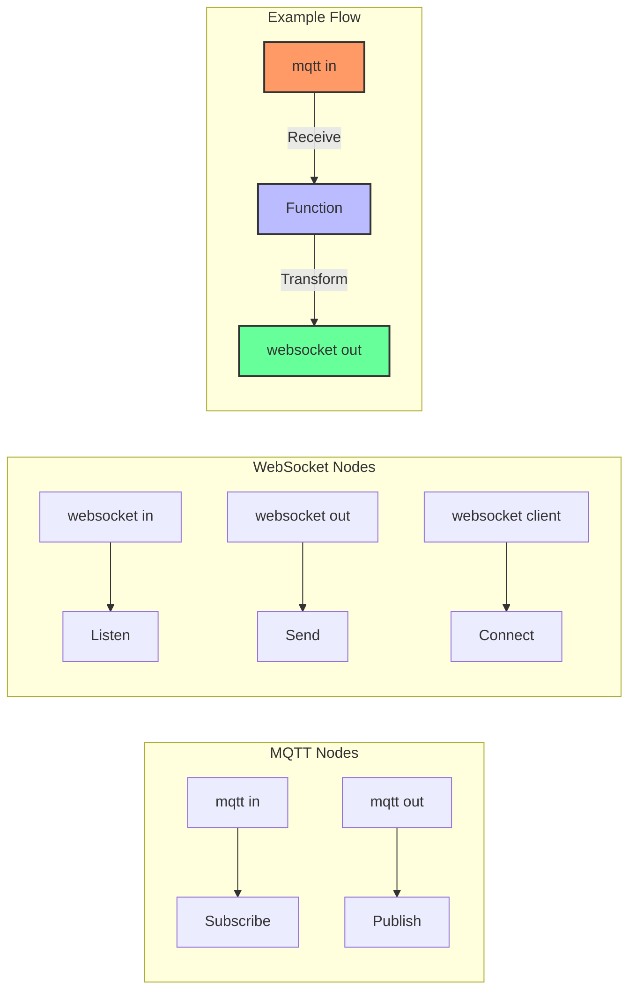

# MQTT and WebSocket Nodes

Node-RED provides built-in nodes for connecting to MQTT brokers and WebSocket servers, making it ideal for IoT applications.

## MQTT Configuration:
- Broker URL/IP
- Port (default: 1883)
- Username/password
- Topic to subscribe/publish

## WebSocket Configuration:
- Path or URL
- Type (Listen or Connect)

[Search Node-RED MQTT examples](https://www.google.com/search?q=node-red+mqtt+websocket+examples&tbm=isch)

## Presenter Notes (ข้อมูลสำหรับผู้บรรยาย)

> Key Takeaway: Node-RED มีโหนดสำเร็จรูปสำหรับ MQTT และ WebSocket ทำให้สามารถเชื่อมต่อกับอุปกรณ์ IoT และสร้างแอปพลิเคชันแบบเรียลไทม์ได้ง่าย

> การใช้งานโหนด MQTT:
> 1. **mqtt in** - ใช้รับข้อมูลจาก MQTT broker โดยระบุ topic ที่ต้องการ subscribe
>    - สามารถใช้ topic แบบ wildcard ได้ เช่น "sensors/#" เพื่อรับทุก topic ที่ขึ้นต้นด้วย sensors/
>    - สามารถกำหนด QoS (0, 1, 2) ได้ตามความเหมาะสม
> 2. **mqtt out** - ใช้ส่งข้อมูลไปยัง MQTT broker โดยระบุ topic ที่ต้องการ publish

> การใช้งานโหนด WebSocket:
> 1. **websocket in/out** - ใช้สำหรับรับ/ส่งข้อมูลผ่าน WebSocket server ที่รันบน Node-RED เอง
> 2. **websocket client** - ใช้สำหรับเชื่อมต่อกับ WebSocket server ภายนอก

> การผสมผสาน MQTT กับ WebSocket ช่วยให้สามารถรับข้อมูลจากอุปกรณ์ IoT ผ่าน MQTT และส่งต่อไปยังเว็บแอปพลิเคชันผ่าน WebSocket เพื่อแสดงผลแบบเรียลไทม์ได้

> ศัพท์เทคนิค: MQTT broker, Topic, Subscribe, Publish, QoS, WebSocket server, WebSocket client, Real-time communication
